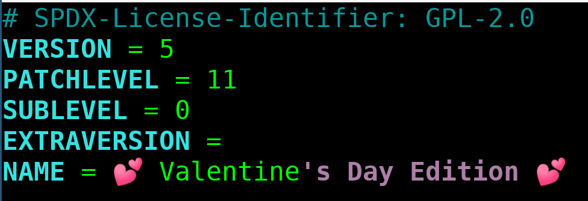

.. Kenneth Lee 版权所有 2021

:Authors: Kenneth Lee
:Version: 1.0

5.11
******

2021年2月14日发布。情人节。14,340个PatchSet，1912个开发者。[1]_ 

大特性
======

Syscall Redirect
-----------------
这是为Wine做的特性，基于seccomp做的。我对Wine只有使用上的兴趣（拿来玩英雄无敌）
，所以更有兴趣的是这个seccomp，这个东西2.6.12就合进去了。它的原理是通过这个系统
调用，在进程的系统调用入口上挂一个钩子，只允许特定的系统调用才能访问，这样可以
限制部分进程的权限。它还支持BPF，通过程序细致地控制具体什么请求才被允许。

这是个安全功能，但想象它的本质：其实它就是个钩子。所以，虽然它叫seccomp，但最终
它还是被当做钩子来使用了。Wine加的这个功能是在seccomp上增加了一个钩子，把系统调
用重定向，变成一个SIGSYS信号，发回到用户态，让用户态自己决定怎么处理这个请求。

.. note::

   一些感想：
   我们给一个对象命名，有时是这个对象特征的总结，有时是这个对象目标的总结。在架
   构上，我们按什么方式命名，决定了我们的意图。但我们常常发现，特征总结比目标总
   结更可靠，因为目标是一时的，而特征是长期的。除非目标能在短时间内改变特征。

   实际中，为了避免名字上的误导，作者这次已经把seccomp的对应功能移到
   prctl(PR_SET_SYSCALL_USER_DISPATCH)中了。

Overlayfs可以用普通用户权限mount
---------------------------------
这个特性没啥可说的，但我真喜欢这个功能，应该解决这个问题后，docker慢慢不再需要
root权限运行了吧？所以，无论如何它都应该独占一节。

.. note::

   一些感想：
   说起来，这种特性看上去没啥工作量的，其实工作量全都在校验没有产生安全漏洞上。
   这也许可以作为一个例子，想某些人说明：为什么没有代码量的工作也是很有工作量的。

AUX Bus
--------
看到这个名字我第一反应是：为什么不是平台设备？看完文档，我的答案是：平台设备是
系统总线的设备，而aux bus设备就是虚拟设备。比如过去HNS（Hisilicon Network
Subsystem）做了一个同时支持NIC和RoCE设备的公共框架HNAE，这样自己加很多额外的管
理要素，现在有了Aux Bus，我们只要把NIC和RoCE做成Aux总线设备，让HNAE提供这个总线
就可以了。

这是Intel加入的特性。

ARM平台支持KASan
----------------
Kernel Address Sanitizer是一个内存错误检测特性。这种工作都是代码不多但研究和测
试的工作特别多的。所以我们认为是一个大特性。

这是Linaro的工作成果。

Intel SGX上线
-------------
这是一个很大的特性。但因为我不怎么做Intel的方案，不是很关心细节，所以这里只总结
一下它的特征。SGX是Software Guard eXtension的缩写，它主要在系统中建立一些安全的
“飞地（Enclave）”，飞地是一片独立的内存空间，外部的程序不能访问这片空间，只有飞
地自己才能访问这片空间，飞地外的程序可以调用飞地中的程序，但只能调用固定的几个
入口。

这让我想到什么？啊，一个小的操作系统内核。

我喜欢这个构架，很漂亮。

有趣的东西
===========

1. rwsem做了一个小修改，修复之前优化读写spinlock引入的一个很少会发生的连续读方
   取锁导致等待者无法唤醒的问题。

   这是Redhat做的修改。

2. 内核原来有一个命令行选项reboot的，可以设置重启动参数。本版本把这个参数修为可
   以动态修改，修改入口在/sysfs/kernel/reboot目录中。

   微软做的修改，这个特性有点像Windows服务器版本中的重启说明。最近做服务器市场
   发现，这种特性还是非常有必要的，因为用户的机器可能因为各种原因重启，但客户的
   管理层可能都认为是你的服务器不稳定。跟踪这些原因，你才能到现场马上发现问题是
   什么。

3. x86平台在vdso中增加了一个sigreturn的地址，没有细看原理，应该是配合一个系统调
   用重定向到用户态的特性的。我不关心这个细节，我关心的是，这是一种可能的优化方
   向：把部分非必要的系统调用移到用户态。比如gettimeofday这种，信息可以直接映射
   给用户态，但要说这种修改，我不如干脆把系统调用修改成vdso调用，所以，也就得个
   知字，不见得就有什么用了。

4. io_uring还是在做密集开发。

5. Intel在iommu驱动中做了一点修改，可以动态修改default iommu domain。iommu
   domain表示一套页表管理（包括它的管理算法），保留一个default domain可以在vfio
   不在管理这个iommu的时候，可以让原来的dma算法回到过去的模式。可以修改这个意味
   着iommu可以接受不同的默认管理模式。

6. Intel QAT引擎还在不断增加新的算法支持，主要还是非对称的，比如AES-CTR/XTS。

7. Btrfs进行了一些性能和数据恢复上的优化。这说出来是一句话的事，但补丁还是有二
   十多个的。

8. NFS支持在Nested Export，就是在NFS上在用NFS共享文件出去。

9. epoll_wait增加了一个更高精度的变体epoll_pwait2()。

10. Google有人优化了mremap在大内存时的效率，同时还修改了kselftest的性能。这看起
    来说明如果你肯投人，把kselftest都虑一遍，都是可以榨出汁来的。

华为和海思的相关特性
====================

1. John Garry在1620的PMU驱动中加了几个uncore的事件控制。

2. 钱伟丽调整了1620和1630硬件随机数驱动。

3. 罗嘉兴加了一个海思通用GPIO驱动。基于ACPI配置。

值得关注中的进行中特性 [2]_ 
============================

.. _`kernel_maple_tree`:

Maple树
--------
VMA一直用的rbtree保存的，rbtree是二叉平衡树，插入后需要重平衡，不容易做无锁算法
。社区正在讨论改用Maple树，这是一种B树，B树的算法是在插入点上进行分裂，而不需要
锁住整棵树进行重平衡，这样可以配合RCU使用无锁算法，当前的修改大概包含70个补丁，
而且预计稳定需要相当长的时间。但升级成功了，多核的性能应该能提升不少吧。

mapple的代码在lib/mapple_tree.c中。主要函数大致是这样的：::

  void mt_init(struct maple_tree *mt);
  void mtree_destroy(struct maple_tree *mt);

  int mtree_insert(struct maple_tree *mt, unsigned long index, void *entry, gfp_t gfp);
  void *mtree_erase(struct maple_tree *mt, unsigned long index)
  void *mtree_load(struct maple_tree *mt, unsigned long index);

  mt_for_each(__tree, __entry, __index, __max)

树本身不提供LRU保护，但你可以独立为不同的子树建立独立的LRU进行保护。

参考
====
.. [1] https://kernelnewbies.org/LinuxChanges
.. [2] https://lwn.net/
