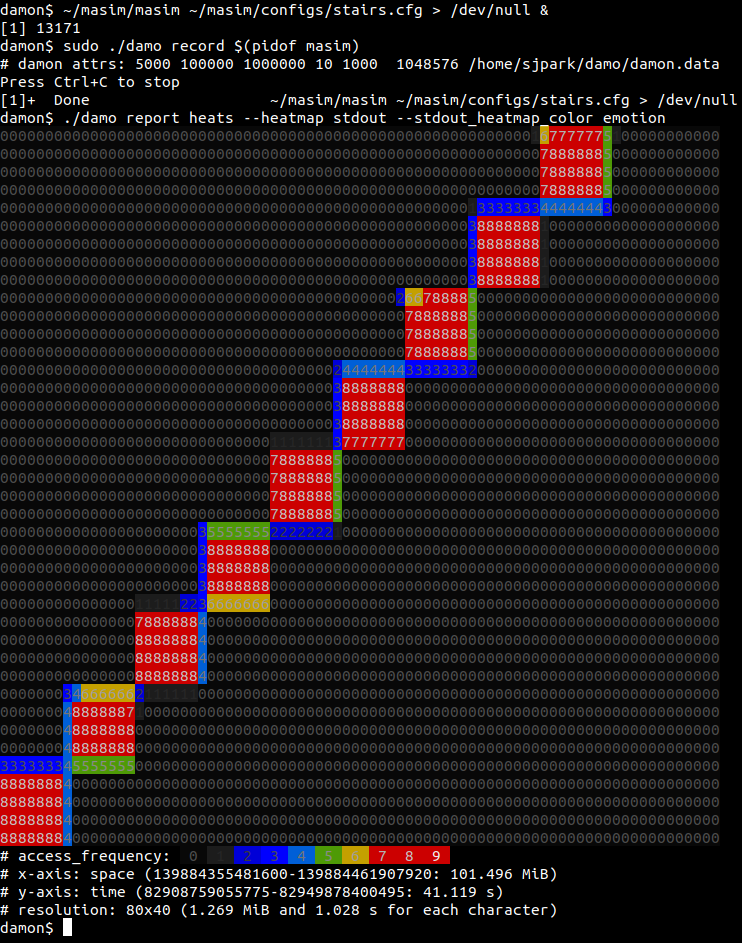
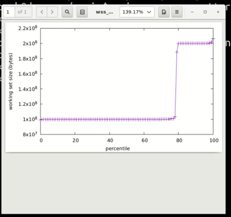

.. Kenneth Lee 版权所有 2021

:Authors: Kenneth Lee
:Version: 1.0
:Date: 2021-11-26
:Status: Draft（未完成分析）

5.15
****

2021年10月31日发布。\ [1]_

大特性
======

persistent内存迁移
------------------

传统的DRAM swap策略是DRAM页不足了，通过shrink放弃部分页面，如果Page dirty就自动
同步到back file上了。这个版本提供了一个新功能，把这些Page迁移到Persistent内存中。
我就不明白了，为什么不直接把swap建立在这些Persistent上？

Btrfs支持fs-verity和id-mapped
------------------------------

我不怎么用Btrfs，但我们把这个作为大特性来分析一下fs-verity和id-mapped是什么东
西。

fs-verity是一个文件级别的dm-verity。后者用于创建一个device-mapping层，这一层会
调用crypto API对readonly的目标进行摘要，从而保证目标的数据是可靠的。dm-verity的
摘要放在另一个块设备上，通过dm-verity参数<dev>和<hash_dev>分别指定目标块设备和
摘要块设备完成整个算法。

fs-verity的功能类似，你通过ioctl要求校验一个文件，请求生效后，文件系统里面会另
外创建一个透明的摘要影子，目标文件会变成只读，之后你再访问这个文件，它就必须校
验通过才能访问得到了。这个功能最早是在ext4和f2fs上支持的。

fs-verity的ioctl命令包括：

* FS_IOC_ENABLE_VERITY 激活verity
* FS_IOC_MEASURE_VERITY 读verity算法数据
* FS_IOC_READ_VERITY_METADATA 读verity数据本体
* FS_IOC_GETFLAGS 检查文件是否有verity支持

我没有看到接口上有去激活的接口，我猜只能通过删除来去激活。

这个框架要求文件系统提供少量代码支持（我猜主要是用于放这个影子文件吧）。

而id-mapped特性也许应该叫id-remapped特性，它可以把文件系统里面的用户id，map到另
一个id上。这种事情我自己就经常遇到，比如我有一个备份用的U盘，把我的用户（比如叫
kenny）的文件备份上去，它的id是1000，但到了另一台机器，我这个kenny的用户对应到
1001，这样U盘上的用户就对不少我另一台机器的kenny了。id-mapped运行你在mount的时候
指定这个映射关系，比如你要映射1000到1001，1001到1002，你可以用参数：::

  u1000:k1001:r2

来mount（具体命令如何设计还没有看），这样就映射了两个id的关系了。这里u和k表示
user和kernel，具体的算法有不少规则（而且我一眼看上去没有看懂），但和我关系不大，
就不看下去了。

DAMON
------
这个特性叫DAta access MONitor，是一个轻量级内存访问监控框架。它可以告诉你一个进
程的内存怎么被使用的，哪地方访问得比较多，哪些地方访问得比较少，哪些地方干脆就
没有访问。

工具的输出通过一个叫\ `damo <https://github.com/awslabs/damo>`_\ 的工具提供，它
的输出结果是这样的：

也可以生成图形的报告：

框架的代码实现在mm/admon下，它是一个针对每个跟踪对象的内核线程（kdamond），启动
跟踪后周期性扫描被跟踪对象的页表，根据dirty bit找到它是否被修改过，从而得知对应
的区域有没有发生更改，它的跟踪项不以页为单位，而是以有相同特征的region为单位（
感觉这只能节省没有访问过的空间的跟踪数据结构）。

它还在自己的跟踪点上设置了tracepoint，这样这个工具可以通过trace接口来跟踪每个变
更的事件。

它也提供的debugfs接口在/sys/kernel/debug/damon目录下。

它同时提供了kunit和sleftest的测试用例，我觉得kunit这个框架也算是简单有效了，以
后我们的代码也可以把它们作为基本方法放进去的，专门用来测试数据接口挺好的。

amzon德国提交的补丁。

新系统调用：process_mrelease
----------------------------
这个系统调用用于做OOM Killer的工作，也就是“收割目标进程”。OOM Killer主要是用于
系统内存不足的时候，杀掉一个最值得牺牲的进程从而获得额外的资源。Android上的“杀
后台”功能是一种最常见的情况了。但OOM Killer是有不少障碍的，因为如果被杀的进程正
在做系统调用，里面做了uninterruptable的锁，你的信号可发过去，但那个进程不一定能
立即响应你，你还是拿不到想要的内存。解决思路当然是让这家伙回不去用户态，一旦退
出uninterruptable区就让它死掉，这就算提前清它的内存也不用担心了。这就叫killer和
reaper分离。

新的process_mrelease(pidfd, flags)调用就完成独立的reaper功能，它只有两个参数，
一个类似pidfd_send_signal()那样的pid文件句柄，另一个是flags，暂时没有用，只要不
是0就行。完成的功能就是直接找到这个任务，把它的vma全部释放掉再说。只是任务句柄
什么时候被释放，那就等其他的kill流程来搞了。

实时锁
------
PREEPT-RT特性提供了新的锁机制，提升系统的实时性。这个修改包含72个补丁，包括：
rtmutx，rtlock, rwlock, spinlock，futex等锁的修改，它需要在schedule中认知正在做
这些锁的进程的行为，对调度策略进行调整。

为了这个算法，rb-tree的依赖关系出了问题，调整了对应的数据包含关系。

这个代码涉及东西太多了（大部分不能修改的东西都不如commit comment长，可想而知这
些修改的内聚有多低），我没能把逻辑都连起来。等有需要的时候再看吧。

BTW，ttwu是try to work up的缩写。

同一批补丁一起修改的还有33个修改SLUB的补丁，这些工作应该是是一组提高实时性的工
作成果。我现在不怎么管嵌入式系统，可能做嵌入式的同学可以跑跑实时测试套看看提升
了多少。

异构调度绑定
------------

Symmetric Scheduling Affinity。也许应该成为非对称调度绑定。主要是在CPU支持的用
户态的指令集不一样的时候，把CPU分成不同的类别，限定进程只能在这些CPU间迁移。这
我还以为肯定是ARM给的补丁，结果是Google的，但Will Deacon以前是ARM的，说是ARM的
补丁也差不离了。

现在这个方案是需要用户态制定自己可以兼容的CPU在什么位置上的，设置后反映为
task.user_cpus_ptr上的一个掩码。

有趣的东西
===========

1. NFS内核实现实现了一个全功能支持（原来只能做只读）。这个东西我不怎么用，不关
   心，这是Parangon Software做的，这家伙让我花了几百块买了一个不能升级的ufsd驱
   动，所以我记得他：（。
2. 内核提供了一个SMB 3 Server，这是大特性，不过我一般不用，所以也不关心。
3. cgroup支持一种新的调度类型：SCHED_IDLE。用途是这个group里面的进程只在没有任
   何其他东西可以调的时候再调度。
4. 这个版本初步支持基于DM的IMA（一个TPM安全验证的DM方案）
5. 这个版本XFS的修改颇多，大部分是Redhat和Oracle的补丁，前者为主。
6. madvise增加了一个新的参数：MADV_WILLNEED。作用是“建议prefault”，比较有趣的是
   这个特性是oppo的人提交的，但那个madvise_willneed()函数却好像不是他们写的，不
   知道这背后是个啥故事？
7. 增加了一个新的MPOL（NUMA内存策略，通过set_mempolicy()或者mbind()系统调用设置）：
   MPOL_PREFERRED_MANY。这是MPOL_PREFERRED的扩展，后者prefer一个node，前者
   perfer多个节点。Intel的补丁。
8. perf/trace这两个框架的修改似乎每个版本都没有停过，开发真是活跃。perf bench现
   在多了一个针对evlist的benchmark。
9. UEFI支持非标准GPT的启动位置

华为和海思的相关提交
====================

1. 鲲鹏1630加速器支持RUNTIME_PM，同时修改了一个debugfs接口
2. 鲲鹏1630网卡驱动（hns3）增加一个ethtool功能，如link状态控制等。

参考
====
.. [1] https://kernelnewbies.org/LinuxChanges
