.. Kenneth Lee 版权所有 2024

:Authors: Kenneth Lee
:Version: 0.3
:Date: 2024-08-07
:Status: Draft

LKMM
****

介绍
====

本文解释一下LKMM模型的原理。我在我的私有笔记上对这个做了较长时间的调研了，但这
个领域太多变数，我甚至觉得不一定存在一个统一的认识。到现在我还有不少认识和LKMM
的文档的说明不完全一致，但已经不多了，所以我想写这个公开笔记，把这些认识整合一
下，以便我自己对我们指令集的进一步定义打一个概念空间的地基，同时也把这些认识分
享给更多的中文世界的开发者。

内存模型和内存序模型简介
------------------------

LKMM，Linux Kernel Memory Model，Linux内存模型，是一个对Linux内部API在内存上的
访问模式的建模。

内存模型是个很模糊的说法。在写我们的指令架构手册的时候，我把所有内存访问的行为
特性都叫做内存模型，包括如何寻址，寻址的时候可以指定多大的访问范围，允许有什么
样的边际效应，地址如何翻译，原子性，内存序，Cache的使用，都看作是内存模型的一
部分。

但我也看过很多上下文仅仅把其中一个主题作为内存模型，比如有些资料会把虚拟地址翻
译特性称为内存模型。而我们现在讨论的LKMM，谈到内存模型，则主要指的是内存序模型。

那么什么是内存序模型呢？就是我们怎么认知我们的内存改变和读取的顺序。我们先从单
个CPU说起，比如你写这样的代码（假定内存的初值都是0）：

.. code-block:: c

  *((int *)0x12340000) = 1;
  *((int *)0x12340000) = 2;
  output(*((int *)0x12340000));

最后输出的应该是多少？显然应该是2，不能是1啊。因为我们对内存改变的顺序是有期望
的。总得是先改成1，再改成2，然后才读的，不能是先改成2，然后才读，最后才改成1的。
如果是后面这样，我们的程序就没法编了。

所以，在早期（特别是只有一个CPU的时候），我们就没有“内存序”这个概念，序是针对
指令的，我们只有指令序的概念，而且这个概念是隐含的，不需要拿出来说。

但如果我们把这些行为分解到多个CPU上，又怎么说呢？比如前两个指令放在一个CPU上，
最后一个指令放在另CPU上，前面的逻辑还成立吗？或者我们把问题更突出一点，我们把
代码改写成这样：::

       CPU1                             CPU2
  *((int *)0x12340000) = 1;      while (*((int *)0x12340000))!=1);
  *((int *)0x56780000) = 2;      output(*((int *)0x56780000));
  
output（如果能输出的话）应该是多少？肯定是2吗？换句话说，我们承认在单个CPU上指
令是有序的，但我们承认这个顺序被其他CPU观察到的时候，这也是一样的吗？

有人可能认为“显然啊，把内存看作一个实体，这明明就是先修改了0x12340000再修改
0x56780000，CPU当然也应该先看到0x12340000被修改了，再看到0x56780000被修改啊。

这种想法可以用这张图来示意一下：

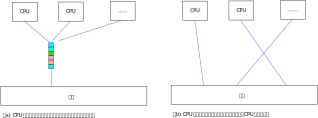

你看我在图标注上用的语气，就能看出来，认为整片巨大的内存，非要等一个CPU修改完
才轮到下一个CPU，这不那么被待见。而且这确实不是一种“显而易见必须有的承诺”。没
人承诺过整片巨大的内存是个单独的实体啊，实际上它就是多片DIMM条组成的，甚至连在
不同的CPU的插槽上，再通过更慢的总线连在一起的。

所以，这种把内存看作是一个整体排队接受访问请求的想法只能用作一种“学术意义上的基
线模型”，称为SC，Sequential Consistency。其他实用的商业实现（比如我们熟悉的
x86，ARM，PPC等等），几乎都不是这样保证的。

其实我们还可以换一个角度：我们为什么非要在CPU之间在内存上保序呢？本来就是CPU的
辅助存储，又不是用来做通讯的，我们能不能把通讯留给通讯，内存留给内存呢？

我曾经做过这方面的方案，让内存只在单个CPU上保序，如果两个CPU之间要通讯，只能通
过独立的“队列”服务来完成。这种方法在特定的场景上其实非常高效，特别是那种AMP信
号处理系统上，比如收到一个通知，向另几个服务提供另一组通知，进而引发更多的通知。
这种就很方便。但如果要发送的不是简单的控制信号，而是大量的数据，这种方法就不实
用了。比如你处理的是个报文系统，我们收到一个报文，先由层二协议处理，然后转给层
三，再转给层四，每层因为计算压力不同，部署在不同的CPU上，每层只是修改同一片内
存的不同位置，这种你很难把整个报文反反复复在不同的CPU之间发送的。到头来你只能
让内存访问是有序的，保证你的通知信号（虽然不必要，但这个信号常常就是内存变化本
身）发到另一个CPU的时候，所需的内存的更新已经到达这个CPU了。

所以这个没有什么办法，即使我们现在也提供了独立于内存CPU间信号通知手段，这种通
知机制还是必须和内存的更新顺序问题结合在一起来用，没法不考虑内存的实际读写顺序。

所以，这里的关键问题在于：内存不是系统中的一个单一的实体，而是由很多很多，被很
多CPU共享的，公共存储单元，组成的。如果我们要求所有的访问者都要排队，那就会拖
慢整个系统计算的速度。这种排队，无论对于直接访问内存，还是通过CC协议在多个CPU
之间同步Cache的状态，都是一样的。

内存序模型
==========

这一章我们分编程、数学、物理三个模型来讨论内存序模型的更多细节。

内存序的编程模型
----------------

内存序模型在编程上主要解决这样一个问题：我在一个上下文中按某个顺序更新了几个内
存，我能否在另一个观察中保证我看到的顺序和这个顺序是一致的。

.. note:: 上面的说法，其实已经隐含了我们承认在一个CPU（上下文）上，所有操作都
   是有序的这个假设。这个基本假设，是我们全文讨论的基础。

我们拿MP（Message Passing）模式来具象一下这个意思。考虑如下程序：::

        上下文1                   上下文2
     update_data();            wait_ready_flags();
     set_ready_flags();        use_data();

第一个上下文中，我们更新了数据（data），然后我们把两个上下文的通讯标记（flag）
置位。第二个上下文，我们等待flag被置位，然后我们再去使用data。我们编程上的期望
是：如果我这样写了，我的use_data()一定能用到update_data()所更新的数据。

.. note:: MP这个模式是我们研究很多内存序模型的最常见的应用场景，另一个更常用的
   模式是SB（Store Buffering，一个线程读x写y，一个线程读y写x），但后者主要用来
   突出不同内存序模型的不同，反而没有直接的“使用感受”，所以本文中主要通过MP作
   为例子来具象化我们讨论的问题。

   MP和SB模式都有更多线程的变体，但我们这里主要用两个线程的场景作为思考的例子。

我们前面说过了，如果我们可以写成这样：::

        上下文1                   上下文2
     push(data);                use_data(pop());

我们是不需要这种保序功能的，这才是我们原始的诉求，但我们前面也说过了，这种方法
效率不高。所以，我们只能对内存的更新顺序有所要求了。

这个问题，就算队列只发送一部分数据，比如只有指针发过来，我们还是有保序要求的：::

        上下文1                   上下文2
     update_data();             data_p=pop()
     push(data_p);              use_data(*data_p);

我们就是要跨着两个上下文，让use_data()用到update_data()的数据。保证上下文1的更
新被“传播”到上下文2上。

在上面的讨论中，我们一直只说“上下文”，而不说CPU，因为我们编程的时候不一定有CPU
这个概念的，我们只有线程的概念，线程表示我们承诺了我们的行为是一个“序”，我们用
这个序来谈我们的期望。这个可以是我们某种编程库上的线程（比如pthread）的概念，
也可以是CPU的执行本身，因为CPU也维护了一种序。谈编程期望的时候我们不考虑这具体
是什么，但到实现到具体的上下文中，这还是需要考虑的。

内存序的数学模型
----------------

序这个问题，是有专门的数学理论的，它的基础就是集合论（Set Theory）。在这种理论
中，顺序表达为一种关系的集合。我们看个例子，比如下面这个顺序：::

  a -> b -> c -> d

从信息论上，我们的结论是a先于b，b先于c，c先于d。这样我们可以描述这个集合R：::

  R = {(a, b), (b, c), (c, d)}

但，在上面那个顺序中，我们是否还有“a先于c”这个信息？细想想，确实是有的，这也是
我们的信息的一部分。所以我们把这部分信息补充一下，上面这个集合应该这样写：::

  Q = {(a, b), (a, c), (a, d), (b, c), (c, d), (c, d)}

我们把可以用来组成关系的元素的集合称为E，上面这个例子中，E={a, b, c, d}。

这样，我们可以这样定义Q：Q是R的超集，对于任意元素x、y、z，x、y、z属于E，如果(x,
y)，（y, z)属于R，那么(x, z)属于Q。

Q称为R的迁移闭包。用后面我们会谈到的cat语言，这可以标记为：::

  Q = R+

有了一个这样的基础定义，我们就可以用集合的方法来对我们定义的各种序来进行数学运
算了。这就构成了一个数学模型，让我们可以研究各种序的组合关系。比如前面的MP问题，
我们这样定义这个问题：::

  令：
  up = update_data()
  s = set_ready_flags()
  w = wait_ready_flags()
  us = use_data();

  已知：
  上下文1指定的顺序：{(up, s)}
  上下文2指定的顺序：{(w, us)}

  问：需要增加什么条件才能保证：
  {(up, us)}总是成立？

这样就变成一个数学问题了。我们用集合论（其实还包括一些一阶谓词逻辑的理论）来研
究这个问题。

我这里的讨论不一定需要读者去深入学习集合论和一阶谓词逻辑（但看一些基本的内容是
有好处的），我这里先做一些基本的科普以便读者可以看懂后面的内容。

首先，我提醒读者注意：有了上面这样的定义后，我们一般理解的“序”就变成了一种特殊
的概念了，因为我们一般定义的一个序，不是这个泛泛的关系组合，我们还要求它无环
（不能a先于b，b先于c，c又先于a），可迁移，任意两者可比。这样的要求对比我们前面
关于“关系”的定义，其实多了很多约束。

在数学上，满足所有这些约束的，我们称为全序（Total Order）。如果仅仅是无环，可
迁移，而不是任意两者可比，这种我们称为偏序。如果能保证无环，那我们还可以认为这
是一个序，至少可比的时候还有先后的特征，一旦有了环，就无法确定谁在谁的前面了。
这种情况，我们就只能认为这是一种泛泛的“关系”，而无法把它称为“序”了。

为了方便，如果两个对象a, b可比，a先于b，我们会记做“a>b”。一旦两者可比，而我们
编程上两者又有因果关系，我们就很容易构造一个“因果”的逻辑来确定如何构造程序的逻
辑了。

所以，内存序问题的重点，甚至不是所有的行为构成一个序。我们只是要求的其中一部分
可以构造出序来，这样我们可以基于这些行为（事件）来写我们程序的因果关系。

更多需要的数学基础概念，我们介绍概念的时候顺带描述，以支持读者可以不需要翻太多
的数学书就可以阅读下去。

数学建模工具
~~~~~~~~~~~~

你可以想象得到，推理“序”这种数学关系很难不使用计算机配合的，因为这种基于“集合”
而不是公式的推理，不穷举几乎没法做到。所以，我们的介绍很难不和数学工具结合在一
起。内存序这个领域，早期都是用一些通用的建模工具来做，比如之前分析过的
:doc:`Sail`\ 。还有更多的人使用自己开发的专用工具，现在慢慢都在统一到Herd上了。
本文写作的时候Herd的最新版本是7，它的语法在不同版本间是有更改的，所以如果我们
需要确切指定具体格式，我们称它为Herd7。

Herd是一个用于内存序研究的专用谓词逻辑分析工具。它使用一个类似Ocaml（Herd自己
就是用Ocaml写的）的语法定义一个针对内存行为的，基于集合论二元关系运算，的关系
集合，以便验证不同的模式（比如前面提到的MP模式和SB模式），在所述的定义中，是否
符合设计预期。

Herd7的集合定义文件用.cat作为扩展名，所以一般把这种定义的格式称为cat格式。现在
很多流行的平台，比如x86，ARM等都在使用cat格式，RISCV原来使用Sail，现在也切换到
cat上了，我们要讨论的LKMM现在也是用cat格式定义的。

所以cat格式很大程度上可以认为是内存序描述的事实标准，一种用于内存序定义的DSL
（Domain Specific Language）。即使我们不通过Herd推理行为，也不影响我们用cat语
法描述我们对内存序的要求。

Herd7的主页在这里：\ `herdtool7 <http://diy.inria.fr>`_\ 。上面有手册（但不是
十分完善，有一些关键的东西没有深入解释，这里还有一个LKMM的人写的总结：
`herd <https://mirrors.edge.kernel.org/pub/linux/kernel/people/paulmck/LWNLinuxMM/herd.html>`_
，可以作为辅助参考。）我这里不打算介绍它的使用细节，我主要解释一下它的原理和基
本思路和概念。我自己第一次研究它的时候浪费了很多时间在这些基本思路和概念的理解
上，希望我这个介绍可以让读者避免走一样的弯路。

首先我们要理解，Herd7不可能穷举或者彻底证明所定义模型是否完备，也不大可能证明
两个定义是否等价，这些计算量都超过它的能力范围了，它只能测试你的模式（在Herd7
上称为litmus测试）下，某些条件是否成立。

也许我们可以这样理解：我们每个CPU都发出了一组内存操作，这组内存操作在每个观察
者看来，都有先有后，任何一种组合都可能。这是一个完全自由的集合变量空间。比如我
们观察前面提到的编程模型的up和us的关系，{(up, us)}可以是这个集合变量的一个解，
{(us, up)}也可以是这个集合的一个解。然后我们通过这个cat文件强制了一些条件，我
们能否把结果约束在{(up, us)}这一个解上？这就是Herd7帮我们穷举的东西。

其次，模型定义不是通用的，因为内存行为就不是通用的，我们确实有一部分行为是通用
的，比如读，写，但内存屏障就是每个平台不同的，对于LKMM这种软件方案，spin_lock
这种原语也不能简单解释为读，写行为。所以，我们确实有一些可以跨平台使用的模型定
义，但复杂的模型定义都是平台相关的。这也导致了Herd有平台限制，你必须用它模拟它
支持的平台和它支持的平台要素，无法用它推理那些还没有支持的平台。

如果你要用它推理你的平台，你就要在Herd的源代码上适配你的平台上去。

我们通过一个例子感受一下cat语言的特点，通过它解释更多的cat格式的概念。比如下面
是一个SC（前面提到的Sequential Consistency模型）的cat定义：::

  SC
  include "fences.cat"
  include "cos.cat"

  (* Atomic *)
  empty rmw & (fre;coe) as atom

  (* Sequential consistency *)
  show sm\id as si
  acyclic po | ((fr | rf | co);sm) as sc

两个头文件我们暂时不管，主要定义一些基本集合，我这里先解释一下这些基本集合的含
义：

* po：程序序，表示同一个CPU上的所有内存行为的序。
* fr: From Read，同位置读后写关系。
* rf: Read From，同位置写后读关系。
* co：Coherent Write，同位置的写后写关系。
* rmw：Read-Modify-Write，组成同一个原子指令的三个基本行为。
* fre：From-Read-External，跨CPU的fr。
* coe：Coherent Write External，跨CPU的co。
* sm: Same Memory，这个概念后面解释。
* id: 这表示所有事件自己和自己的关系（用来过滤事件用的内部常数）

除了集合变量的定义，剩下的主要就是限制集合可能性的谓词了。

首先，as xxxx这个语法表示某个约束的名字命名为xxxx。Herd完成穷举的后，如果找到
符合条件的例子会把这个例子的关系图输出来，类似这样：

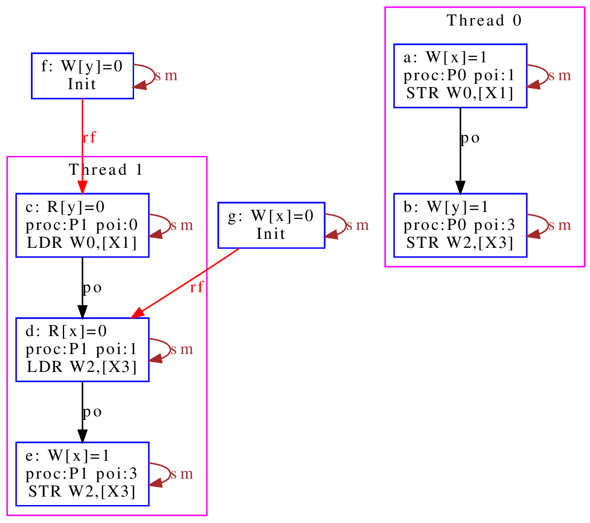

加上这个名字有助于可以在图上标记出这个关系，从而让你知道如何修正你的规则。后面
的show命令就是强制输出某个特定的关系。如果仅仅要看定义的规则，我们可以忽略它。

所以这个SC的定义仅仅定义了两个规则（约束），一个叫atom，一个叫sc。

atom定义的是原子性规则。它说的是：rmw交fre;coe是一个空集。其中分号是“序列操作
符”，其实本质是复合函数。如果我们把关系集合看作是一个函数，每对关系就相当于函
数图像上的一个点，关系中的前一个元素就是定义域的输入，后一个元素就是值域的一个
元素。那么，两个关系集合的复合，就是把第一个集合的值域输入到第二个集合的定义域
中，得到第一个集合的输入和第二个集合的输出的关系集合（中间有匹配不上的都放弃）。

比如我们计算{(a, b), (c, d)};{(b, c), (d, e)}，输入a的时候，在第一个集合得到b，
用b作为输入在第二个集合中得到c，所以结果会得到(a, c)，如此类推，最终的结果就是
{(a, c), (c, e)}。

用序来理解就是：如果我们有两个序x和y，那么x;y就表示存在一个a-b-c这样的序，其
中a, b属于关系x，而b, c属于关系y，而结果是(a, c)。

下面这个例子更具象化一些，可以帮助我们建议对这个关系的感性认识：::

  父子;父女 = 爷-孙女关系

所以这里fre;coe就表示下面CPU A的read_a和CPU C的write_a的关系：::

          CPU A                CPU B               CPU C
          read_a---\
                    \-(fre)--->write_a---\
                                          \-(coe)-->write_a
  
所有有这样的顺序关系的读写关系，都属于集合fre;coe。把这个集合交上rmw，rmw是一
条指令，表示同时做读-修改-写，这就表示上面CPU C的事情发生在CPU A上的那种情
况（CPU C就是A）：::

          CPU A                CPU B
          read_a---\
                    \-(fre)--->write_a
                                 /
          write_a<------(coe)---/

所以这个意思就是说：如果A上的read_a和write_a两个事件属于同一个rwm指令，那么不
可能出现另一个CPU中的write_a，覆盖了a的值，还被A的write_a覆盖。这就是“rmw的原
子性”的定义。

我不知道读者是否注意到这一点：这个模型并不认为一个指令就是一个“内存事件”，这里
rmw本来只是一条指令，照理说就只产生一个事件，但实际上我们已经看到了，这有两个
事件。

所以这里的关键问题不在于几条指令，而在于我们有没有独立的行为可以单独关注到这个
事情。这个问题影响很多定义，比如一个原子的32位写操作，照理说应该是一个事件，它
也会被一个独立的读操作读到。但我们指令上也允许单独去读这个内存每个独立的字节。
为了说明这些每个独立的观察，我们也只能把这个原子操作定义成4个“内存事件”。如果
我们不需要推理那种情况，我们可以不分解这个定义，如果我们需要，那就只能分开，这
都会导致模型的不同。

所以，你不能认为模型就是“事实”，模型永远都是事实的“数字孪生”，你把什么东西放进
来讨论，你就只能模拟那些东西，它不是事实本身，也永远无法完全代表事实。

所以，其实就只有最后一个sc才是SC这个定义本身。为了理解这个定义，让我们先来理解
一下fr|rf|co的概念。fr表示一个地址上的值被一个写覆盖了。这听起来是个上帝视角，
没说是谁看见的。所以这样的定义存在，这个模型（herd本身）已经承认内存至少在每个
独立可以观察的地址上是有“队列”的，这个fr指的就是在“内存”上，你再也读不到原来的
值了。

然后是rf，它表示一个读，读到了前一个写的内容。这是从发起这个读的观察者的眼中看
到的，如果(w, r)属于rf，那么r就是读到了w的值。至于它是通过cache读到的，还是通
过寄存器读到的，我们都不管。

最后是co，它表示coherent write，表示一个写，把前一个写覆盖了。和fr一样，这又是
一个上帝视角。这次让我画个图解释一下：

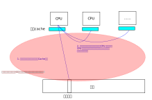

CPU有自己的Cache，当你要求访问内存，它当然可以选择写透Cache，一直写到内存上，
它也可以选择通知其他CPU，更新他们Cache的状态，让所有CPU都知道这个内存已经修改
了，再做下一个动作。这些动作的协议，称为Cache Coherency（CC）。如果你有实施CC
协议，无论你用的是什么方法，你在这个地址上总是形成一个序的。就是你的写，只要碰
到这个CC协议，你就会在CC这个接口上呈现一个顺序，让其他CPU在向这个CC接口请求数
据的时候，读到的数据就是符合这个序的。

所以，这里的co和fr定义一样，说的都是它承认了CC接口的存在，而且必然呈现一个序。

但这不是必须的，如果我们不实现CC协议（就好像我们在很多CPU和设备之间通讯，要主
动更新Cache才能把一些数据同步给设备），这一点并不成立。所以，你不要觉得Herd给
了你所有的关于“关系”的自由度，其实它的语本身已经承认了很多东西了。

还有一个值得注意的点是：即使我们承认的CC协议，也不表示每个读写都会进入CC，因为
完全有可能在一个CPU上写了什么东西，在本CPU内部就被读走了，根本没有经过CC这个接
口。在后面要讨论的LKMM定义中，这种情形称为Forward。我们这里借用一下这个概念，
也称为Forward。

好了，下一个问题是sm是什么。这个其实我不知道，我几乎查不到关于这个概念的介绍，
无论是Herd7的文档还是它的源代码的注释。我还没有足够时间直接看着代码去还原这个
概念。我猜它的意思应该是Same Memory。但如果你注意前面我们作为例子用的那个输出，
我是故意把sm这个关系show出来的，它除了和自己的关系，其他同地址的关系基本都不认
为是sm。但我最后还是认为它是Same Memory（带条件的），原因后面我再解释。到现在
为止，我们理解的时候就当它是id好了。这样，“(fr|rf|co);sm”基本上可以简单理解为
“(rf|fr|co)”。

那么（rf|fr|co）这个东西又是什么意思呢？本质上它就是我们可以“观察到的所有顺序”。
请想想这个问题：当我们认为“事件A发生在事件B前面”，我们说的是“我观察到A对B的执
行效果的影响”。注意这个说法，我们不是“先看到A的效果，再看到B的效果”，因为在“关
系”的世界中是没有时间的。我们看到的“序”，都是关系。一个事件发生在另一个事件的
后面的唯一观感是后一个事件的发生是以前一个事件的结果为前提的。fr表示我在CC接口
上看到本来可以读到的数据x现在变成y了，所以写发生在读的“后面”。这才构成了序。所
以，fr|rf|co就是所有可以观察的序。从这个角度来说，也许我们可以把sm看作“（如果
有的话）其他的关联影响”，就是如果后一个事件还引起了一个连锁反应，那么这种观察
也考虑在内。而读后读不是一种观察，你读了一个值，随后又读了一次。上帝视角这在时
间上有先后，但在观察上没有任何区别。所以这种关系不是“观察”的一部分。

所以，综合来说，rf|fr|co，就是所有可能的观察，在很多模型中，这种观察称为com
（通讯）。

所以，po|com，如果是无环（acyclic）的（构成一个序），就是SC。cat语言来表述，我
们就可以写成：::

  let com = rf|fr|co
  acyclic po|com

这和我们一般理解的SC很不一样是不是？回想前面把整个内存看作一个实体，把所有访问
都排到这个队列上的情景，那个队列上的顺序不是才是SC吗？

问题是，那个队列是个上帝视角，没法用com去确定事情发生了还是没有发生啊。再说了，
我们前面说，我们允许Forward的，那就有部分的com没有发生在那个队列上了，这也说不
通啊。

所以这里干脆换一个思路：把po和com放在一起，这两个东西放在一起，要不你观察不到，
但如果你观察到了，po在前面的，就不可能被观察到在后面：

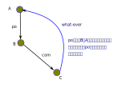

我们拿MP模式来感受一下这个定义怎么起作用的：

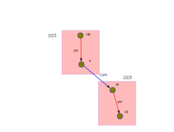

w rf s是我们编程逻辑保证的，我们现在要确认rs一定rf up。上面的序并不是全序，为
什么前面的定义可以保证这一点呢？

这要考量一下所有的可能性才能想清楚：us和up是同一个地址，如果us没有rf up，那程
序执行到最后，就只能是us rf初值，而up fr us了。这样就会构成一副这样的图：

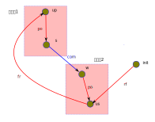

很明显，这会产生一个up对us的反向观察，导致原来的路径成环。这里的关键在于，如果
us不rf up，那么up就必须fr us，所以才会有这个环。前面我们定义的观察中，如果不包
含这个fr，这个保护就不成立了。但反过来说，如果fr不在定义中，后面更多对这个地址
的观察，就只能观察到us，而不会观察到up，那us是不是在up的后面就不重要了。

通过这个感性的认识，我们可以发现，如果我们把所有的“有效观察”和我们要强制的“序”
放在一起，并且维持这个“序”，那我们就可以保证我们的观察之间是可以“有逻辑”的。

最后让我们总结一下：一个cat定义基本上就是集合和谓词定义，集合的主要运算符号我
在附录（\ :ref: `cat_op`\ ）中放了一个速查表，语法和Ocaml是一样的，用let
var=xxx的形式表达，支持in语法，比如：::

  let com_ext = 
    let com = rf|fr|co in
    com & ext
      
这定义了com_ext，等于com & ext，其中的com是一个内部定义，它等于rf|fr|co。

剩下的主要就是定义规则的“谓词”，herd7就只三个谓词：

* acyclic
* irreflexive
* empty

有两个我们都介绍过，最后这个irreflexive（非反身映射）需要解释一下：这个概念完
全来自数学，表示id的任何元素都不属于所述集合（不存在自己到自己的关系），这个集
合就是irreflexive的。它其实完全可以不需要的，因为它等价于：::

  empty myset & id

你认为irreflexive就是一个更容易看的别名好了。

序的理论有一个概念叫DAG（Directed Acyclic Graph，有向无环图）。这个有向，就是
irreflexive；无环，就是acyclic，如果两者都成立，就构成一个DAG。有标准算法
（Topological Sorting，拓扑排序）可以把符合某个DAG的所有可能的全体成员的全序穷
举出来。Herd7实现这个算法的函数叫linearisation(E, r)，它返回所有符合r约束的全
序的集合。从这个角度来考虑序这个问题，Herd7的本质是通过规则定义一个的DAG，然后
穷举它的所有拓扑排序（上帝视角允许的所有可能顺序），然后判断这些全序是否都在我
们的期望的范围内。

谓词前可以加~表示取反。

更多的语法可以看Herd的手册，我这里介绍的应该足够支持看本文了。

litmus
^^^^^^

然后我们接着看litmus的例子，下面是一个关于MP模式的测试：::

  X86 MP
  {x=0;y=0;}
   P0         | P1          ;
   MOV [x],$1 | MOV EAX,[y] ;
   MOV [y],$1 | MOV EBX,[x] ;
  exists (1:EAX=1 /\ 1:EBX=0)

这个语法很简单，基本上可以猜到含义：先给平台类型和名字，然后是设置变量初值（和
C BSS变量类似，等于0可以不设），然后是每个处理器上的汇编，最后是判定条件。

我想着重强调几个点：

1. 如前所述，测试用例是平台相关的，因为每个平台的指令对模型的定义的解释是
   不同的。比如同一个测试，如果是ARM的，它是这样的：::

        AArch64 MP
        { 0:X1=x; 0:X3=y; 1:X1=y; 1:X3=x; }
         P0          | P1          ;
         MOV W0,#1   | LDR W0,[X1] ;
         STR W0,[X1] | LDR W2,[X3] ;
        
        exists (1:X0=1 /\ 1:X2=0)

   cat文件更容易跨平台一些，比如前面的SC.cat，在x86和ARM平台上都可以用的，但
   更复杂的定义也是可能平台相关的，比如LKMM的定义：::

        let acq-po = [Acquire] ; po ; [M]
        let po-rel = [M] ; po ; [Release]

   这里的Acquire和Release的定义专指内核的smp_load_acquired()和
   smp_store_release()函数，这也无法跨平台。

2. Herd可以基于模型推理litmus指定的条件是否成立，也可以直接生成平台相关代码让
   你真跑一下，看看那个平台硬件是不是真的符合条件（反复跑很多次尝试是否会遇到
   反例）。

3. 它的条件不一定是正向的，也可以是反向的，比如上面这个用例中，我们其实期望的
   是这种情况不会发生，但运行的时候你是希望发现有这种情况的时候告诉你。

我们可以这样运行这个模型：::

  sh> herd7 -model sc.cat -nshow 10 -show prop -view gv mp.litmus

-model指定cat文件。-nshow表示最多显示多少个推理的结果。-show选择正向还是反向用
例的场景。-view选择显示引擎，这里用了gv格式。最后给定测试例就可以了。按上面的
sc.cat和x86的mp用例，我们显示正向用例（-show prop）结果就是没有。我们改成反向
用例（-show neg），我们就会看到gv显示的反例的输出了。

我们还可以试试修改一下sc.cat把sc规则删除掉，还是显示prop，我们会得到这样的输出：

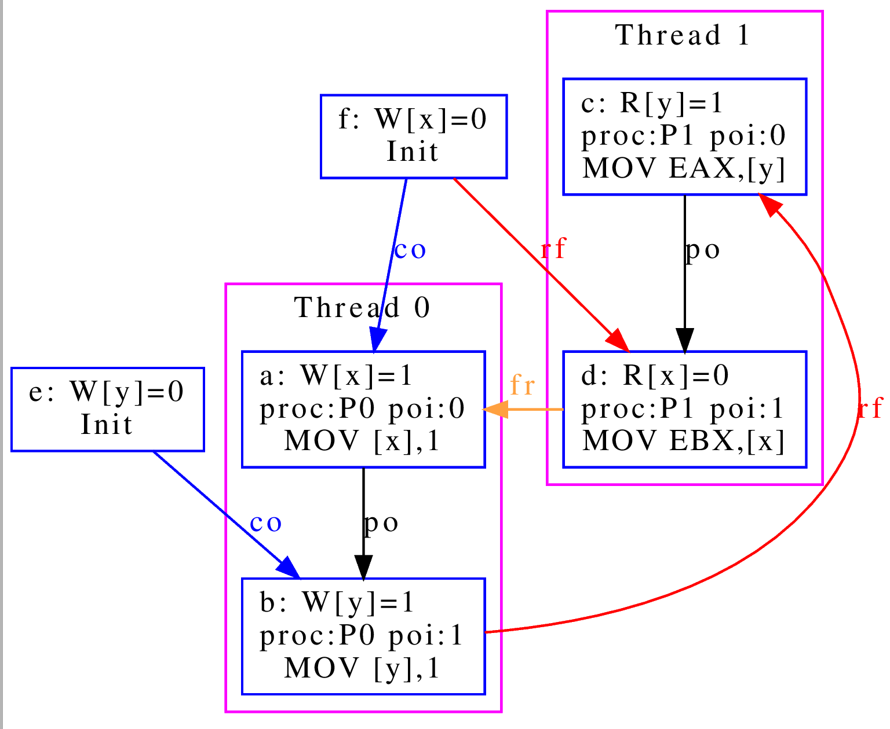

这个图展示了我们前面说的理论：如果不对环作出限制，最终能达成us读到初值的条件就
是构成一个环。

实际上，这个litmus最终的目的还是让我们调试我们的模型定义，这里的重点还是优化
cat的定义。在本文中，我们更关心的是用cat语法来描述我们对硬件设计的要求。

内存序的物理模型
----------------

前面介绍了数学模型，数学模型是边界而已，我们没法按着它来设计总线和CPU的，数学
上定义出来的原则，可以用来约束物理模型，但物理模型必然会引入额外的约束。反过来，
物理上有额外的约束，但数学模型不使用这个约束，其实也给软件带来来浪费。因为这个
地方本来没有自由度的，非要给一个自由度，软件就要加分支去处理，但这个分支从来不
进去，变成了浪费资源。

所以，总结一下物理实现上的抽象模型，有助于我们优化数学模型。

关于po
~~~~~~

在讨论物理模型之前，让我们深入探讨一下po。po是个天然的概念，因为我们一开始定义
指令的时候，是隐藏了这个概念在里面的。我们认为CPU的状态在一个一个的指令驱动下
发生改变，从而形成一个“序列”或者“线程”的。这里天然就是在描述一个“全序”。

但前面读者已经看到了，实际上我们如果需要深入探讨各种关系的时候，po的事件集合就
不能是指令。

甚至现在有些平台在把取指，Page Walk的访存行为也放到内存模型中来讨论，这个po的
基本事件集合就变得非常复杂了，我们也很难直接认为它是一个全序了。

所以，我们以前可以很自然把po看作是一个全序，其实现在这个事情已经变得非常困难了。
我们只能认为po是一个偏序，甚至有时只能把它作为一个“序”，无法规定它的全序。像取
指和Page Walk这种很难预期的行为，常常是没有确定的先后关系的，比如，取指，往往
是一次取多条指令，然后同时发出执行的，这种情况你不能说序列是“取第一条指令，根
据第一条指令的要求访问内存，取第二条指令……”，你也不能确定地说，一定是“取8条指
令，执行8条指令，然后再取八条指令……”，你甚至不能说“必然在取指后才执行某条指令”，
因为这个取指行为完全有可能被缓存到CPU内部，导致根本不产生取指操作。

所以，如果可能，取指这个行为我们尽量就不定义在一般的模型中，我们把它作为一个独
立的模型来定义，这样才能避免多余的复杂度。（但显然，某些平台不是这样做的。这只
能说，各有选择了。）

但由于po不是承诺的序，所以，其实我们非要把po定义为一个全序，并没有什么不可以的。
把po定义为一个全序的好处是，我们再定义其他的序的时候，就可以以这个序为基础，这
能简化模型。

这个问题，现在很多定义都是模糊其词的。po必须被认为是一个全序，因为没有这个承诺，
我们没法说清楚CPU对“线程”的承诺，但很多地方我们就只能简单认为它是一个序，而没
法承诺它一定是全序。

对此，我进行一个折中，我们还是尽量让po接近一个全序，但这个全序的其中一段是无序
的，类似这样：::

  A -> B (a, b, c) -> C -> D (d, e, f)

ABCD是个全序，但B可以有多个子事件组成，这几个事件每个可以取代B构成这个全序，但
a, b, c之间是不一定有序的。比如B是一个SIMD指令，同时操作多条Lane，哪条Lane算在
前面？这不确定。但我们能肯定的是，SIMD指令前面的指令在任何一条Lane的前面，而
SIMD后面的指令在任何一条Lane的后面。在本文中，我把(a, b, c)这个集合称为B的无序
替代。如果a, b, c是有序的，我称为它是针对这个全序的有序替代。::

  B对po的无序替代：A ->a/b/c -> C -> D
  B对po的有序替代：A -> a -> b -> c -> C -> D

CC接口
~~~~~~

对CPU来说，内存操作是个慢速行为。在CPU的流水线中，一条指令可能需要经过取指，解
码，执行，访存，回写等多个阶段，每个阶段不过1到数个时钟周期不等，由于流水线的
作用，某条指令执行后面阶段的时候，执行前面阶段的硬件已经在执行下一条指令了。所
以综合起来，一条指令的执行时间不过一个或者几个时钟周期（通常就是1个），但一次
内存访问就要上百个时钟周期。所以CPU有足够的理由缓存部分数据在CPU内部，一旦这个
缓存存在了，就会出现我们前面提到的Forward问题：数据可能不用经过CC接口就在内部
消化了。

我们当然可以说如果它修改过这个数据，最终总要更新到CC接口上的。但别忘了，事情可
以这样发生的：在CPU内部写了一个值a，然后它被读走，然后CPU内部再写了一个值b，之
后b被写出去，那么a写这个行为就在内部被消化了，在CC接口上从来没有发生过。

这是CPU内部的情况，我们再看看CC接口上的行为。首先，我们忽略多层Cache的问题，因
为本质上，CPU一层看到的CC接口，已经代表内存的态度了，CC接口的下一层如果还有一
层Cache，那么是这个上层的CC接口通过CC接口再去为下一层的一致性负责，对CPU来说，
它只考虑CC接口的承诺就行了，下一层都由这个低一层的接口代表了，对运行在CPU里面
的程序来说，下一层的逻辑是可以忽略的：

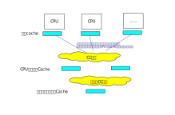

所以，我们更关心的是第一层的CC协议到底怎么承诺这个序的。这又分成这个CC接口的内
部和外部两个部分了。

我们先看内部。首先几乎所有的CPU都要保证po构成的逻辑必须在单个CPU上是一致的，所
以只有一个CPU的话，po的序就是逻辑判断可以依靠的序，这一点算是种向前兼容吧，至
少现在还没有人会推翻这个逻辑。

关键就在于，这个离开不一定就是按po的顺序离开的。比如对于TSO（x86采用的内存序模
型），它称为Total Store Order，表示“写是一个全序”。它在CPU内部放了一个队列，所
有的写都必须排队然后才到CC接口上，所以写出去是有序的，而读的，如果读的内容还在
写队列中，那么就从写队列读，如果不在，那就直接出去了。这变成两个序了：

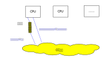

对这个模型做推理，结论就是它在对外上，写写，写读，读读都是保序的，就是读写不是
保序的。这是它和SC模型的主要区别，后者是全保序的。

作为对比，我们还有ARM，RISCV等采用的WMO方案，这个干脆什么出去的顺序都不保证，
只要指令没有强制要求，他们都直接出去了。所有的保序都是针对CPU本地的，出去的顺
序这些模型都不保证。如果这些平台需要保证确切的顺序，就需要使用特定的指令去控制，
这称为Memory Barrier。在WMO方案上，Memroy Barrier显得特别重要。

.. warning:: 需要说明的是，WMO不是一个明确定义的模型，它们在不同平台上是不同的。
   而且，这些不同的实现也不是完全没有队列，但由于队列的使用策略不同，也会形成
   不同的顺序模型。

然后我们看外部，根据《A Primer on Memory Consistency and Cache Coherency (2nd
Edition）》的定义，CC接口大致可以分成两种：

1. Consistency-Agnostic Coherence，CAC，一致性不可知CC
2. Consistency-Directed Coherence，CDC，一致性指定CC

前者通常用在CPU上，表示CPU不知道CC协议具体是怎么同步的，所以做写操作必须等所有
同步对象承认已经同步成功了，才认为写成功了。后者通常用在GPU上，表示GPU知道CC协
议的具体行为，它可以根据需要决定是否等待写成功返回。

但这是个模糊地带，因为现在CPU也集成了不少向量计算单元，根据需要这个接口也是有
可能发生变化的。

所以，如果我们确定CC接口使用的是CAC协议，我们可以认为离开CPU内部队列的请求，在
CC接口开始是有序的。但如果无法确定，我们并不能保证这一点，我们只能退一步，承认
对于同一个地址，这些行为是有序的。这一点现在看来是几乎所有CPU都承认的。

这里提到两种CC接口，让我们注意到一个事实：指令只能管到CC接口，如果指令一开始不
等待CC接口完成，那么后面什么时候完成它也管不着了。比如一个写指令，CPU要不选择
写了等待CC接口反馈完成（确定已经传播到所有CPU上），要不发出去后直接执行后面的
指令，不等待这个传播完成。它没法全局控制其他CPU什么时候收到这些操作要求的。这
一点我们后面讨论LKMM的传播模型的时候很容易遇到。

但还要提醒的是，这种等待CC接口完成不一定需要在单条指令上，CPU也可以发出多个写
操作，不等待CC接口反馈完成，然后加入一个写屏障指令，强制在这个指令上等待所有的
写都反馈完成了，然后才继续后面的操作。这看起来既不是CAC，也不是CDC，这也是常见
的实现。

.. note:: 这个地方还要提醒一句：屏障指令是作用的各种内存访问队列上的，它并不能
   阻断其他指令的执行，但因为它是放在po路径上的，很容易产生它会拦住所有的指令
   的错觉，这一点需要特别注意。

   特别是如果你的平台有独立的IO指令，那么IO指令就不一定能被内存平台所阻隔。

另外，现在很多CC协议会衍生到设备上，比如在我们的服务器处理器，所有系统设备也工
作在CC接口上，但它的CC协议地位和CPU是不一样的，总线不一定认为设备上有Cache，它
可能仅仅是更改某个页目录的状态，保证设备需要读内存的时候从正确的地方去读。所以，
我们这里的讨论，特别是性能相关的，不能简单应用到设备上，那些必须具体问题具体分
析。现在有很多接近CPU的“外设”（比如各种算法加速器，TPU等），这个地方会变得越来
越模糊。原来我们都不需要注意这种问题，但慢慢可能就不是了。

预测执行导致的乱序
~~~~~~~~~~~~~~~~~~

除了队列可以导致乱序，预测执行也会造成乱序。下面这个例子来自LKMM，但它是硬件实
现导致的：

.. code-block:: c

  q = READ_ONCE(a);
  if (q)
    p = READ_ONCE(b);

如果按po，这个顺序应该是先读a，然后读b。但CPU可以预测执行，它可以发射a的操作，
在a返回之前，它可以先尝试预测执行读b的操作，这个b就可以先发射出去了。等a的结果
返回了，如果正好就不等于0，那说明预测正确了，读b的操作就直接生效。这样在CC接口
上看到的就是先发射了b，然后才发射a。

所以你不能认为po上有了依赖，就一定能保证发射到CC接口上也是有序的。不能正确认识
一点，就可能导致程序写错，因为和你通讯的程序可能先更新了a，然后才更新b的，你提
前读了b，然后才去读a，那个b就是一个旧版本的内容了。你必须在if语句前放一个rmb()
才能保证后面的读访问不能发射出去。

这个问题就算是某些TSO平台都不一定可以避免，因为这两个都是读操作，不需要经过写
队列的（当然，如果这些平台保证外部总线是CAC的，那是可以保证的）。

小结
~~~~

让我们总结一下这个模型：我们认为一个SMP系统由一组CPU组成，通过CC接口连在一起，
CPU内部按po维持语义逻辑，但不一定按po的顺序把内存请求发送的CC接口上，也不一定
把所有的请求都发送到CC接口上。如果请求发送到CC接口上了，同一个地址的请求会被保
序，但如果不是同一个地址，就不一定会保序。

其他的，都是平台相关的特殊特性。

LKMM
====

介绍
----

我们前面说的内存序模型都是基于硬件的，LKMM是把一样的理论用于Linux Kernel编程接
口，这是一个基于软件的模型。

软件模型会叠加很多软件的要素，一个最基本的，是编译器的影响。比如我们一开始提到
的例子：

.. code-block:: c

  *((int *)0x12340000) = 1;
  *((int *)0x12340000) = 2;
  output(*((int *)0x12340000));

编译器完全没有必要执行前面两条指令（执行一条就够了），如果不指定地址，而是一个
就在这个上下文上有效的变量，一条都不会执行。只要output(2)就行了：

.. code-block:: c
  
  void do_output() {
     int a = 1;
     a = 2;
     output(a);
  }

所以LKMM要专门区分Plain和Marked两种访问，所谓Plain的访问，就是像上面这样，直接
写访问的代码，这种是不一定真的产生内存访问指令的。而Marked访问是用READ_ONCE()
或者WRITE_ONCE()这样的接口（包括基于这种接口实现的其他接口，比如锁、原子函数，
RCU操作、smp_store_release()/smp_load_acquired()等）强制真的产生真正的指令。无
论硬件按什么顺序实际访问过去，但至少指令的真的。

但就算加上Marked访问，也不能保证我们的所有期望都可以成立。下面是另一个例子：

.. code-block:: c

  q = READ_ONCE(a);
  if (q) {
        WRITE_ONCE(b, 1);
  	do_something();
  } else {
        WRITE_ONCE(b, 1);
  	do_something_else();
  }

这个类似前面提过的预测执行问题，我们期望读a以后再写b，但因为预测执行的问题存在，
这可能不符合期望。但即使没有这个预测执行，这个也是没有保证的，因为编译器有可能
会这样优化它（两个分支中有重复代码）：

.. code-block:: c

  q = READ_ONCE(a);
  WRITE_ONCE(b, 1);  /* BUG: No ordering vs. load from a!!! */
  if (q)
  	do_something();
  else
  	do_something_else();

一旦代码被编译器改成这样了，不需要预测执行，就算是TSO也不要求读后写要保序的，
最终的结果就可能是先写出去了，这样读进来的值可能就不是你期望的值了。

还有些问题是，语言本身就没有规定任何序。比如如下程序：

.. code-block:: c

  a = b + c;

这个加法，C语言并没有规定先加载b还是c。

更多的编译器优化导致问题的例子参考\ :ref:`compiler_opt_issue`\ 。

软件模型的另一个问题是它是跨平台的，同一段代码我们是期望在不同的硬件平台上都要
满足期望的，这即使在一个平台上测试成功，也不能保证在所有平台上都是成功的。所以
研究和定义LKMM显得尤其重要，否则我们无法知道硬件平台（包括编译器）需要满足什么
要求才能保证Linux Kernel可以正常工作。而写这种类型的代码，也必须严格按LKMM的模
型来写程序，否则都是不能肯定代码是具有持续性的。

LKMM规则
--------

LKMM定义在内核源代码树的tools/memory-model/linux-linux.cat中，它主要包含这些规
则（我忽略了原子性方面的规则，因为我们这里重点讨论序的问题）：::

  acyclic po-loc | com as coherence
  acyclic hb as happens-before
  acyclic pb as propagation
  irreflexive rb as rcu
  acyclic xb as executes-before  （* 这个是意图上的，不是实际定义的 *)
  
我们通过理解这些规则来理解LKMM是如何抽象Linux Kernel面对的平台的。

coherence
~~~~~~~~~

com是观察，这个我们前面解释过了。po-loc是同地址的po访问。所以，这个coherence表
达的是同地址的po（后面我们就直接叫po-loc吧），被观察的时候是有序的。这很像之前
解释过的SC模式，只是它限制了是同一个地址。

这个规则，其实就是我们前面说的，Linux并不认为CC接口是CAC的，仅保证同一个地址
（其实是同一个Cacheline）上的CAC。

happens-before
~~~~~~~~~~~~~~

HB规则是最能说明LKMM是如何抽象Linux Kernel面对的平台实现的。所谓happens-before，
说的就是：在物理实现上，我们认为某件事一定发生在另一件事的后面。

最基本的，如果A rf B，那么我们至少可以肯定B一定发生在A的后面，这就叫
happens-before，我们并不肯定A修改内存，和B读取内存是不是一先一后的，因为这涉及
到什么叫A修改了内存（这个修改可能按不同的速度传播到不同的CPU上），但仅仅谈A的
修改被B读到这两件事，我们还是可以在一个绝对时间上认为两者是有先后关系的。

.. warning:: 这里只是谈泛化的Happens Before，但LKMM并不承认rf&int是HB，这后面
   会解释。

hb的定义如下：::

  let hb = [Marked] ; (ppo | rfe | ((prop \ id) & int)) ; [Marked]

这个规则定义两个Marked的内存行为之间的序，只要两者被ppo，rfe或者内部prop连接，
就在范围内。

我们看看这些基础元素的含义：

ppo
^^^

ppo，preseved po，这表示在po上明确说对外保序的行为。比如依赖，或者明确的
barrier行为等等。

依赖主要指这三种：

* data：后一个内存访问需要使用前一个内存访问的结果。比如a=b+3。
* ctrl：执行分支上的内存访问需要前一个内存访问结果。比如if(a)b+=3。
* addr：后一个访问序要前一个访问的结果作为地址。比如b[a]=3。

依赖和rf一样，后面的行为以前面行为为基础，显然必须是happen before的。

这里要澄清一点：前面提到的预测执行的例子并不违反这里的hb涉及的ppo定义。因为读
了一个值，然后基于这个值来做跳转，这个序就算预测执行也是被保证的，但在这之后再
做一个操作，那个操作是否还保序，是没有承诺的。

所以这里一定避免把保序的边（关系），当作一种barrier，觉得它维持了所有的顺序。
它仅仅是在保证所有这样的边，不会造成自环，只有有一环扣不上，它就有可能逃过控制。
这在判断的时候需要非常小心。

还要注意的是：依赖这个问题，在软件层面很容易有误会的。比如这个例子：::

  b[GET(a)]=3;

看起来b依赖a，但GET是个宏，它的定义可以很复杂，在某些#ifdef分支中，如果这个
GET(a)固定返回0，你看着代码觉得这里有个依赖，其实它没有。

我们这里用了barrier这个名字，指的是memroy barrier，不是barrier()函数。前者是指
smb_mb()，smb_rmb()，smp_store_release()这样的函数，这会产生真正的内存屏障指令，
而barrier()是“编译器屏障”，它只是给编译器提示说这个位置发生了内存修改，如果后
面要访问某个变量，不要认为变量的值已经加载过（到寄存器中），要重新加载进来。它
不产生内存屏障指令的。我们这里讨论的所有屏障，都不包含这种屏障。所以后面我们也
尽量不用barrier这个词，我们把这些行为称为fence。

说到fence，我们要开始真正看到Linux Kernel是怎么抽象执行平台的执行模型的了。
LKMM把这个模型称为操作模型（Optional Model）。它的基础很接近我们前面定义的一般
的硬件抽象模型：系统由多个CPU组成，通过CC接口连接，CPU内部可以Forward数据，也
可以把数据传播到CC接口上，解释前一个规则的时候我们也提到了，这个CC接口不完全是
CAC或者CDC的。但对于同一个地址是CAC的。除此之外，它还支持一组fence语义：

* 强fence（包括synchronize_rcu()和smb_mb()），强制这个fence之前的内存操作必然
  比fence之后的内存操作先发射到CC接口上。

  同时，所有在这个fence之前传播到本CPU的写，必须在本CPU这个fence之后的所有内存
  访问之前传播给所有的CPU。也就是这个CPU在fence之后看到的更新，其他CPU都已经看
  到了。

* smb_rmb()，强制这个fence之前的读内存操作总比之后的读操作先发送到CC接口上。没
  有传播上的额外保证。

* smb_wmb()，强制这个fence之前的写内存操作总比之后的写操作先发送到CC接口上，同
  时前者也先于后者传播到其他CPU。

* smb_store_release()，这是一个写，它保证这个写必然后于之前的内存操作发射到CC
  接口上。

  同时，如果这个fence执行的之前，有任何CPU的写操作传播到本CPU（包括本CPU之前的
  写），那么这些所有的写，都需要先于这个写本身传播到其他CPU。换句话说，如果本
  CPU在这个fence（兼写入）之后看到了别人的更新，别人就必须看到它之前的所有更新。

* smb_load_acquire()，这是一个读，它保证这个读必然先于之后的内存操作发射到CC接
  口上。没有传播上的额外保证。

.. note:: store_release和load_acquire是学术上的一对名字，在内存序这个上下文中
   常可以用release和acquire表示，一般应用在MP的场景中：release表示先写数据再写
   标记，acquire表示先读标记再读数据。我感觉release就是表示发送方准备好了，可
   以释放资源给对面用了，而acquire表示现在开始获得release释放的信息。

   LKMM的这个定义和这个和一般通用的定义不大一样，一般定义的release是仅仅隔断前
   置的写，acquire仅仅隔断后续的读，但那个是站在传播是有一个全局的序的基础上来
   说的，我们后面详细讨论这个问题。

如前所述，这个定义既不是CAC也不是CDC，它只是一个Linux需要的“上帝视角”定义，硬
件实现的时候几乎很难保证自己满足这种“在A点遇到某个事件的时候，B点某个事实已经
成立”这种要求的，所以硬件常常只能过度满足。比如，如果直接就用CAC接口，那它只要
在fence的时候清空队列，发送到CC接口上，要求就满足了。如果要做得精细一点，在非
CAC接口上，它可以在fence的时候等待某种类型的消息全部返回了，再允许后续的特定访
问，等等。

fence是一个明确约束CPU按什么要求让一些行为生效的行为，所以很明显，它也是ppo的
一部分，从而也会导致Happen-Before。

.. note:: 在fence这个主题上，Linux支持的平台中有一个异类，Alpha，很多主题都要
   针对它特别讨论的，主要就是它的CPU本地Cache不是FIFO的。比如MP的场景中，如果
   一个CPU用wmb隔离data和flag的写操作，按我们前面的定义，两个写操作必然一先一
   后传播到读一方的CPU，形成一个序。但在Alpha上这个是不成立的，因为Alpha的CPU
   Cache不是FIFO，这两个写操作确实按顺序发到Alpha了，但Alpha可以让后者先呈现到
   Cache中。

   如果不是专门写LKMM规则，我是建议忽略这个平台，没有其他平台是这样的。

fence类型很多，但谈内存序的时候我们一般只关心他们在信息传播上的属性，所以LKMM
引入了一个辅助的概念，叫“积累”。所有对传播有要求的fence，就认为是“可积累”的，
特别地，对于强fence和release，它们控制到本CPU看到了别人的更新，那么fence之后就
可以假设别人也看到它之前的更新。这属于“高级积累”，称为A-cumulative。从上面的列
表解释可以看到，smb_wmb()是积累fence，但不是A-cumulative fence，只管对端收到的
数据的顺序，不管本端的观察和对端的观察之间的顺序关系。

本质上，所谓A-cumulative，指的是这个顺序它在观察上对所有人都是有序的。因为
A-cumulative要求屏障前观察到的变化，在屏障前已经被其他CPU观察到了。这样，本CPU
观察的内容产生的后续效果，比如根据这些观察制造的新值，就必然在其他CPU的观察后
面。这个写传播到那些CPU后，就比如在这些观察的后面，而不会构成环。而一般的积累
指令（比如smp_wmb），仅仅保证屏障前面的写总被其他CPU先于后面的写观察到，这个再
传递出去，也能保持，但保持不了前面说的那个交叉的传递过程。

所以这个积累属性不但可以影响简单的HB关系，还会影响我们后面会提到的PB关系。

rfe
^^^

rf显然是个hb关系，但在LKMM的定义中，只接受rfe，因为根据前面描述的操作模型，rf
可以是个forward关系，在其他CPU的观察中，这个顺序完全可以是反的，只有写rf写到外
面去了，在同地址CAC接口的作用下，才能保证对它的观察是有序的。

从编程的角度，rfe是我们关注的中心。因为我们总是根据某个值等于某个写了，才决定
（来自其他CPU的）其他其他值应该处于什么状态，所以判断都是依赖rfe这个结构。

所以为什么coe和fre不是hb的一部分呢？这个我觉得LKMM现在的文档是没有解释清楚的，
我认为其实主要原因是这两货被定义在prop中了。

prop
^^^^

prop是propagate，传播。这个关系在LKMM的文档中解释得非常迷惑，我们看一个例子：::

  P0:                        P1:
  r1 = READ_ONCE(x);         WRITE_ONCE(x, 9);
  r2 = READ_ONCE(x);

这里如果知道r1等于0，r2等于9，那么P0的两个读之间就是prop关系。这很怪吧？这其实
是一个变形的rfe关系，因为如果能得到r1等于0，r2等于9，说明肯定是P1的写插在两个
读的中间了，这样就有一个这样的关系：::

  r1=READ_ONCE(x) --(fre)--> WRITE_ONCE(x, 9) --(rfe)--> r2=READ_ONCE(x);

这样，第二个读就必然发生在第一个读的后面，所以这是一个Happend Before关系。

所以，如果反过来，我们发现了一个r1等于9，r1等于0，那么第二个读到第一个读之间也
有一个prop关系。

所以prop关系其实也是因为一个隐性的对外传播而导致我们认为它们之间有一个先后发生
的关系。但这个没法控制，rfe容易控制，我们就判断一些那个读是不是读到对端设置的
参数，我们就知道这是一个rfe了，但prop是rfe前面还要配一个fre或者coe，我们才能判
断出这是prop。这个关系最后总结出来是这样的：::

  let prop = [Marked] ; (overwrite & ext)? ; cumul-fence* ; [Marked] ; rfe? ; [Marked]

overwrite就是co和fr，加上ext就是coe和fre。前面说为什么coe和fre不属于hb，这里可
以看到，其实是属于的，我们把这个类别简称为owe。

如果你看了附录中的基本cat操作符介绍，整个prop就可以简单这样理解：

两个Marked操作，如果中间被0个或者一个coe/fre加任意个积累fence在加上0个或者
任意个rfe连接。这两个操作就能构成prop关系。

这个表达为了能一个连续逻辑说完，我没有提中间的那个[Marked]的作用。我们现在解构
一下细节：

首先，中间的关系不是可选（问号）就是任选的（星号），那是不是说任何两个Marked的
关系就是prop呢？显然不是，如果这些关系不存在，这两个Marked就得是同一个了。而你
也看到了，hb中对prop的使用是这样的：（(prop\\id)&int)（减掉相同的操作，而且必须
在同一个CPU中）。同一个操作确实也是prop关系，但它不属于hb。

所以这些关系你确实可以随意选，但至少得留一个。但确实，你可以没有一个独立的中间
的那个Marked，但如果你在这个Marked前后两段关系中各要选一个存在，那么中间这个连
接用的访问（其实这时它肯定是个写，否则没法连接后面的rfe），必须是个Marked。这
就是这里表达的意思。所以，下面这些关系都是prop关系：::

  marked --(cumul-fence)--> marked --(rfe)--> marked
  marked --(owe)--> mem --(cumul-fence)--> marked --(rfe)--> marked
  marked --(owe)--> marked --(rfe)--> marked
  marked --(cumul-fence)/(owe)--> marked
  marked --(rfe)--> marked

所以你有没有发现？其实prop已经覆盖rfe了。那么我们能不能删掉前面提到的rfe呢？啊，
这其实是不行的，因为一个单独的rfe一定跨越两个CPU，它会被&int过滤掉。

这些是根据操作模型扩展出来的更多hp类型，它依赖的就是推导模型中认为CPU之间要通
讯必须经过CPU，你在一个CPU里面可以发生Forward，但只要你跨CPU有了行为，那么你就
必然在CC接口上构成一个序，从而让happen-before有了依据。

小结
^^^^

我不知道读者看了这个定义有什么感觉。我的感觉是：这就不是给人看的。实际上这也是
不少相关设计者的观点，他们认为这种程序就是应该通过建模工具辅助设计的，设计之后
可以封装出更高层的接口，比如锁操作，一般程序用这些高层接口就好了。这个问题我们
在后面再回来讨论。

如果读者还记得我们前面对SC关系的分析，你会发现它和SC的定义非常相近，但SC是对所
有观察起作用的，因为SC认为只要传播到CC接口上的都是有序的，所以，只要观察到了，
就一定是全局有序的。而hb其实定义是所有观察，都只有经过了CC传播的，而且能被所有
CPU看到的，才算是观察，其他的观察，因为到达时间不一，所以不在承诺范围内。

所以hb的定义其实和SC的定位非常接近：

1. ppo：就是在单个CPU上，承诺一定传播出去的时候保序的那些行为。
2. 观察：所有可以被全局共同观察到的顺序。

把这些东西全部合并在一起说它是Acyclic的，就提供了一个支持各种Litmus模式的范围
控制了。

propagation
~~~~~~~~~~~

传播序是在hb的基础上，结合强fence扩展的序。::

  let pb = prop ; strong-fence ; hb* ; [Marked]

在分析这个序的语义前，我们需要提醒一句：就定义来说，这是一个独立的序，并不能和
hb一起用的，hb不能成环，pb也不能成环，但两者的并集可没说不能成环。

整个定义是围绕强fence展开的，因为后面的hb是可选的，而prop上虽然没有修饰符，但
我们前面分析过，prop在没有\\id过滤的时候，是可以什么都没有的。所以其实它也是可
选的。

而最后一个[Marked]，主要是修饰强Fence的。因为hb本来就必须用Marked结尾，它不需
要修饰。

所以这个规则的就是在定义强fence那个传播特性：如果数据不是内部forward（prop的作用），
而是发到了CC接口上（发生了传播），那么强fence就一定能让这个传播发生在后面的内
存行为之前。

所以，虽然理论上这个规则是独立的序，但其实和hb放在一起，它也不会成环的。

rcu
~~~

RCU是当作原子行为来用的，但RCU会构成序，我们需要深入理解一下RCU的行为需求来理
解这个序的产生。

RCU大致是这样用的：::

  P0                      P1
  rcu_read_lock()         c:分配并根据旧数据区更新新的数据区data
  a:p=rcu_derefence()     d:rcu_assign_pointer(p, &data)
  b:通过指针p读数据       synchonize_rcu()
  rcu_read_unlock()       e:释放旧数据

它的原理是依靠数据指针更新的原子性，在读一方构造一个安全区（a的范围），安全区
中通过读指针然后用其中的数据，而写一方总是先修改里面的数据，然后才一次性更新指
针，这样通过这个指针使用的数据就是同一个版本的。指针等一个阶段（称为优雅期）
后再释放，这时所有在这个阶段拿到的指针肯定已经离开任意一个CPU的安全区了，这时
就可以安全地释放这个版本的指针了。

这个方案的意图就是实现一个读优锁，读一方成本很低（安全区不靠真正的锁实现），
写一方需要生成新的数据，更新后还要等待一个固定的时间才能释放原来的旧版本。而且
同一时刻，系统中可能有多个版本的数据。

整个算法的关键在于如何实现这个优雅期，Linux的算法是在rcu_read_lock的时候关闭调
度，unlock的时候恢复调度，这样优雅期就是等待所有的CPU都经过一次调度。这个方案
的缺点是读端不能休眠，这限制了适用范围，所以还有一个Sleepable版本，叫SRCU，它
唯一的区别是把rcu_read_lock/unlock改成一个引用计数版本，把计算优雅期从等待调度
变成等待计数清零。因为一个公共的引用计数可以导致所有CPU的等待，所以这个版本的
伸缩性是打了折扣的，。

但无论是哪个版本，原理都是一样的，它们有相似的“序”上的要求。因为我们期望新版本
的数据一旦生效（指针被修改），那么，所有拿到这个数据的CPU，手上的版本应该都是
一样的。所以：

* 如果在任何一个a, b这样的位置上看到了某个数据，在本优雅期结束前，所有CPU看到
  的也应该是同一个版本。

* 在c, d这样的位置上看到了某个数据，在任何一个a，b开始前，所有CPU也应该看到了
  这个数据。否则b通过这个数据准备出来的新版本，在被其他CPU看到的时候就可能不是
  新的。

这可以图示如下：

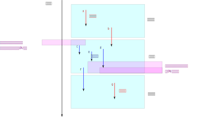

可以看到，这些都是强fence才能保证的序，都是那种“一方观察到特定数据，其他方也需
要被传播到了”那种要求。所以，LKMM用这样的测试来验证这个序的有效性：::

  P0                      P1
  a:rcu_read_lock()       e:Rx=1
  b:Wx=1                  f:synchonize_rcu()
  c:Wy=1                  g:Ry=1
  d:rcu_read_unlock()

这里，如果e rf b，那么g一定rf c。因为按前面的设计目的，e rf b的话，b就必须被传
到给所有CPU，而c也必须在f结束前，传递给所有的CPU，而g在f结束前不能开始，那么g
就只能rf c了。

这个验证很有趣，或者说有点反直觉，因为它是在读端写，写端读。原因是它测试的是内
存内容的传播，而不是RCU的功能，也就是说，它测试的是如果有数据从什么地方传播给
了P0，导致P0产生了观察，并得到b和c的结果，这个结果，被P1观察到，那么只要再等待
一个优雅期，那么，全局都应该观察到。把e和g放在一起比较只是为了在这里对齐双方用
的是同一个优雅期而已。

这个定义和Linux Kernel的实现其实不一致。因为Linux的保序对齐不是发生在
rcu_read_lock/rcu_read_unlock/synchonize_rcu()上的，而是在rcu_deference()和
rcu_assign_pointer()上的。但看来LKMM是打算让这个模型泛化一点，尽量希望做在更大
的边界上（这样，你可以在指针前访问指针指向数据也落在范围内），但至少我们知道，
现在的代码不是这样写的。

按LKMM这个定义，这个范围定义出来很怪，主要是它划定的范围不是通过一个个点决定的，
而是多个范围的交集范围决定的。比如它会这样定义：::

  let rcu-gp = [Sync-rcu]		(* 定义一个虚拟的优雅期 *)
  let rcu-rscsi = rcu-rscs^-1           (* 反方向定义读安全期 *)
  let rcu-link = po? ; hb* ; pb* ; prop ; po

  let rec rcu-order = rcu-gp | srcu-gp |
	(rcu-gp ; rcu-link ; rcu-rscsi) |
	((srcu-gp ; rcu-link ; srcu-rscsi) & loc) |
	(rcu-rscsi ; rcu-link ; rcu-gp) |
	((srcu-rscsi ; rcu-link ; srcu-gp) & loc) |
	(rcu-gp ; rcu-link ; rcu-order ; rcu-link ; rcu-rscsi) |
	((srcu-gp ; rcu-link ; rcu-order ; rcu-link ; srcu-rscsi) & loc) |
	(rcu-rscsi ; rcu-link ; rcu-order ; rcu-link ; rcu-gp) |
	((srcu-rscsi ; rcu-link ; rcu-order ; rcu-link ; srcu-gp) & loc) |
	(rcu-order ; rcu-link ; rcu-order)
  let rcu-fence = po ; rcu-order ; po?
  let fence = fence | rcu-fence
  let strong-fence = strong-fence | rcu-fence

  let rb = prop ; rcu-fence ; hb* ; pb* ; [Marked]

这里我忽略了SRCU相关的定义，但原理是一样的。我个人觉得它不是定向设计出来的，而
是“调试”出来的，所以我这里也不尝试深入解释它的定义逻辑，我只是说明：RCU确实也
定义了一个序：优雅期结束后，在它之前的数据传播到其他读方的数据，总能被之后的数
据访问到。这也是一种可以观察的先后行为。这个本身定义为一种可以被观察的先后关系。
这个关系就是rb。而这个rb，也是和hb，pb组合在一起使用的。

executes-before
~~~~~~~~~~~~~~~

LKMM的模型并没有包含这个定义，但从设计者的描述来看，他们其实是认为这里的每个定
义都是基于某个有时间先后关系的事件的，所以他隐式地认为：::

  let xb = hb | pb | rb
  acyclic xb as executes-before

所以，其实hb, pb和rb都是我们在hb的分析中说的，是ppo和“全局观察”的一部分，而这
两者都是“执行时间线上全局认知的有先后关系序”的一部分。

LKMM把这种肯定不会在两个线程上同时访问的关系称为visibility关系，定义为vis。vis
不但要求两个操作不能同时在两个线程上发生，还要求操作传播到另一个CPU的时候不能
同时发生。反过来，如果两个操作可以对同一个地址同时操作，我们称这两个操作是“竞
争”（Race）的。LKMM建议一般情况下不要写KCSAN代码，Linux的KCSAN检查器会尽量对竞
争的代码告警。但部分代码确实不在乎竞争（比如各种统计项，有一点点错误是无所谓
的），这种情况可以把这些代码打上data_racy()宏作为标记。

小结
----

xb就是LKMM最基本的原则，其他的保护都是在eb的基础上实现的。比如spin_lock()和
spin_unlock()就通过aquire和release语义保序的。release是A-cumulative fence，所
以它总能保证锁内的更新，都是传递给所有CPU了。这就使我们写基于锁的代码很轻松，
不用再考虑那么多的可能性了。当然，在某些情况下，这个性能可能不是最优的。

除了上面三个基本的原则，LKMM还有针对Plain读写方面的顺序要求，这个更多是针对编
译器的，由于我写本文的的目的主要还不是怎么使用LKMM，而是要支持LKMM需要做什么样
的硬件。所以这个版本我们不深入讨论这个部分了。说起来大部分其实前面已经讨论过了，
因为ppo里面的三种依赖关系（数据，地址，控制）就是可以包含Plain操作的。所有的
fence操作也是自动包含了barrier()的，这种情况下，大部分寄存器Cache也被过滤了。
通常要保证Plain是安全的，在中间找一个Marked操作，然后用fence连起来就可以了。这
称为post-bounded和pre-bounded：

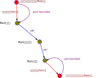

bounded关系可以自己对自己，所以，它本质上说的就是Plain关系可以用fence来做保护，
加入到xb关系中。

总结LKMM的特征，我们发现它其实就是围绕xb的一个单序的模型。为了维持xb，它重点关
注的是什么观察进入这个序了，就必须让所有人都观察到同一个版本。这主要依赖操作模
型在单地址上的CAC属性，以及对积累fence能力的要求。

这个定义对硬件设计是不友好的，因为积累fence定义是个上帝视角的“最小定义”，它经
常要求“CPU如果观察到了x，那么其他CPU必须观察到y”，硬件更容易设计“单个部
件何时发出某个行为”，没法控制“本部件如何的时候，同时另一个部件如何”。所以，前
面这个要求，常常只能过度地转化为：

* 发出x的CPU必须等待y在CC接口上传播完成才能发出x。或者
* x和y必须在CC接口上排队，y广播完成后才能把x更新到其他CPU上。等等。

但哪个性能更高，这似乎都是针对不同场景进行测试才能知道的事情。

实现支持LKMM的硬件
==================

本章探讨一下如果我们要支持一个LKMM的硬件的最小特征应该是什么样的。

首先，作为最小要求，我们天然选择WMO，po不需要是全序，但做有序或者无序替换后可
以是全序。

然后单个CPU内部保证逻辑自洽这是天然要做的，这是所有的前提。（po-consist）
然后是同地址CAC，这也是基本要求。（cc-loc）

然后fence指令是不是直接和LKMM一一对应呢？即是不是就是这些就可以了？：

* smp_mb
* smp_rmb
* smp_wmb
* smp_release
* smp_acquire

暂时这么一想，我觉得没有什么不可以的。这个定义没法作为硬件直接实现的参考，但肯
定可以作为范围约束。

然后就是rcu/srcu我们能否也用原语来实现？在Linux内核中这是用上面的指令模拟的。
这里的关键是Linux的实现也不是LKMM定义的那样用安全区来保护的，而是在
rcu_deference()这些接口上实现同步的，这变成了内存访问之间的简单依赖关系了，也
没有什么特别的东西可以从硬件单独提供。

SRCU倒是可以通过队列来记录优雅期结束没有：读方写数据进队列，写方发现队列空就通
过当前优雅区。这样按LKMM协议，写方离开上一个优雅区的时候，需要在CC接口上插入一
个顺序tag，之后写方再收到数据更新，都要在读方进入全部进行全序广播。这样就会符
合要求。

todo：但这个符合了LKMM，但似乎并不完全符合Linux Kernel的定义。

根据我们前面推理的顺序和无序替代方案，po的乱序部分没有保序要求，它乱序部分的单
个行为仍在全局上有序，这足以支持任何LKMM的协议了，这一点不会有问题。

按前面的想法，取指，MMU的访存可以不和普通的内存序一起考量，我们可以仅仅
在单个CPU上设计屏障，保证代码更改以后，这个屏障可以然后po上的后续代码都可以读
到正确的位置就可以了。

外设（包括IOMMU和中断控制器）的访存，如果我们能保证接口都通过队列指令来实现，
那么只要满足MP模式就足够做任何通讯了。我们甚至可以给这种队列加上外设和CPU通讯
的标记，这样这里的顺序模型可以独立于CPU的模型进行通讯。

附录
====

.. _`cat_op`:

cat主要操作符的解释
-------------------

* \|, &, \，;表示并集，交集，差集和序列。

* {}表示空集，++是元素加到集合中。

* r+和r\*分别表示r的迁移闭包和迁移反射闭包。0表示空集。r^-1表示r的反射。r?表示
  r加上iden。（注意了，herd中这个反射包括所有事件的全集，但我看数学上的定义似
  乎只包括r包含的元素本身。)

  所谓迁移反射的定义是：r\* =r+ | id

* R*W表示R和W的笛卡尔乘积。

* [E]=E*E & iden

从序的角度来理解，上面这个符号体系其实有点像正则表达式。

如果我们有一个序列r1;r2;r3，这个序列定义了一个这样的关系序列：::

  a--(r1)-->b--(r2)-->c--(r3)-->d

中的a->d关系。

如果我们加上一个+号，变成这样：r1;r2+;r3，这表示r2这个关系还需
要存在，但可以有多个：::

  a--(r1)-->b--(r2)-->c--(r3)-->d
  a--(r1)-->b--(r2)-->c--(r2)-->c1--(r3)-->d
  a--(r1)-->b--(r2)-->c--(r2)-->c1--(r2)-->c2--(r3)-->d

这些情况的序列，都符合我们定义的a->d关系。r2至少有一个，但有更多个也在范围内。

如果我们加上一个\*号，变成：r1;r2*;r3，这表示r2这个关系可以有任意多个，那么除
了前面的，这个也符合条件：::

  a--(r1)-->b--(r3)-->d

如果我们家一个?号，变成：r1;r2?;r3，这表示r2可选，那么这两种情况都符合定义：::

  a--(r1)-->b--(r3)-->d
  a--(r1)-->b--(r2)-->c--(r3)-->d

这和正则表达式的通配符是一样的。而[]操作符可以用于过滤，比如[R];r1;r2;r3;[W]，
如果R表示所有的读，W表示所有的写。那么这个表示在r1;r2;r3定义的序列中，前后的两
个操作必须一个是读，一个是写。

如果我们写成这样：r1;[R];r2，这表示连接r1和r2的那个操作必须是个读。对于下面这
种情况：::

  a--(r1)-->b--(r2)-->d

它要求b必须是个读。理解这一点，就比较容易读懂LKMM的各种定义了。

.. _`compiler_opt_issue`:

更多的编译器优化的可能性
~~~~~~~~~~~~~~~~~~~~~~~~

`Who's afraid of a big bad optimizing compiler? <https://lwn.net/Articles/793253/>`_
中对编译器常见的优化可能性做了一个介绍，我总结一下作为具象化考虑编译器对内存访
问影响的例子。

* load/store tearing：加载写入指针可能被一段段处理。

* load/store fusing：循环变量依赖外部变化，但变量已经在寄存器中了。或者修改一
  个变量两次，第一次可能根本不会写出去。

* code reordering：代码由于没有依赖被重排了。

* Invented load/store：连续使用全局变量，本来只预期加载一次，但实际加载了多次。
  这样，对这个变量的读取和判断，其实来自不同的加载，可能和你的预期是不同的。
  写这个复杂一点，看程序：::
    
    if (cond) a=1;
    else do_sth();

  这里两个分支，可能被优化成这样：::

    a = 1;
    if(!cond) {
        a = 0;
        do_sth();
    }

  这样少了一个分支，逻辑也是合理的，但a被写了两次，这是预期外的。如果和其他线
  程配合，你就很容易出问题了。

* store-to-load：这个场景也是看代码：::

      int r1, x, y;
      void cpu1(void) {
        WRITE_ONCE(y, 1);
        smp_mb();
        WRITE_ONCE(x, 1);
    }
    void cpu2(void) {
        r1 = READ_ONCE(x);
        if (r1 == 1)
                y = 0;
    }

  最后一个y访问没有用ONCE原语，编译器可以优化成if(y!=0)y=0，由于y没有保护，又
  是独立变量，这个判断可以被CPU移到r1的读前面，代码就错了。

* dead code elimination：全局变量编译的时候可能被认为没有用，自动删除了，但这
  个东西可以被其他不经过编译器观察的流程改变。
