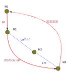

.. Kenneth Lee 版权所有 2024

:Authors: Kenneth Lee
:Version: 0.1
:Date: 2024-07-23
:Status: Draft

LKMM
****

介绍
====

本文解释一下LKMM模型的原理。我在我的私有笔记上对这个做了较长时间的调研了，但这
个领域太多变化，我甚至觉得不一定有一个统一的认识，所以，到现在我还有不少认识和
LKMM的文档的说明不完全一致，但已经不多了，所以我想写这个公开笔记上总结，把这些
认识整合一下，以便我自己对我们指令集的进一步定义，也把这些认识分享给更多的中文
世界的开发者。

内存模型和内存序模型简介
------------------------

LKMM，Linux Kernel Memory Model，Linux内存模型。内存模型是个很模糊的说法。在我
写我们的指令架构手册的时候，我把所有内存访问的行为特性都叫做内存模型，包括如何
寻址，寻址的时候可以指定多大的访问范围，允许有什么样的边际效应，地址如何翻译，
原子性，内存序，Cache的使用，都看作是内存模型的一部分。

但我也看过很多上下文仅仅把其中一个主题作为内存模型，比如有些资料会把虚拟地址翻
译特性称为内存模型。而我们现在讨论的LKMM，谈到内存模型，则主要指的是内存序模型。

那么什么是内存序模型呢？就是我们怎么认知我们的内存改变和读取的顺序。我们先从单
个CPU说起，比如你写这样的代码（假定内存的初值都是0）：

.. code-block:: c

  *((int *)0x12340000) = 1;
  *((int *)0x12340000) = 2;
  output(*((int *)0x12340000));

最后输出的应该是多少？显然应该是2，不能是1啊。因为我们对内存改变的顺序是有期望
的。总得是先改成1，再改成2，然后才读的，不能是先改成2，然后才读，最后才改成1的。
如果是后面这样，我们的程序就没法编了。

但如果我们把这些行为分解到多个CPU上，又怎么说呢？比如前两个指令放在一个CPU上，
最后一个指令放在另CPU上，这一点还成立吗？或者我们把问题更突出一点，我们把代码
该写成这样：::

       CPU1                             CPU2
  *((int *)0x12340000) = 1;      while (*((int *)0x12340000))!=1);
  *((int *)0x56780000) = 2;      output(*((int *)0x56780000));
  
output应该是多少？肯定是2吗？换句话说，我们承认在单个CPU上指令是有序的，但我们
承认这个顺序被其他CPU观察到的时候，这也是一样的吗？

有人可能认为“显然啊，把内存看作一个实体，这明明就是先修改了0x12340000再修改
0x56780000，CPU当然也应该先看到0x12340000被修改了，再看到0x56780000被修改啊。

这种想法可以用这张图来示意一下：

.. figure:: _static/mem_order.svg

你看我在图标注上用的语气，就能看出来，认为整片巨大的内存，非要等一个CPU修改完
才轮到下一个CPU，这不那么被待见。而且这确实不是一种“显而易见必须有的承诺”。没
人承诺过整片巨大的内存是个单独的实体啊，实际上它就是多片DIMM条组成的，甚至连在
不同的CPU的插槽上，再通过更慢的总线连在一起的。

所以，这种把CPU看作是一个整体排队接受访问请求的想法只能用作一种“学术意义上的基
线模型”，称为SC，Sequential Consistency。其他实用的商业实现，几乎都不是这样保
证的。

其实我们还可以换一个角度：我们为什么非要在CPU之间保序呢？本来就是CPU的辅助存储，
又不是用来做通讯的，我们能不能把通讯留给通讯，内存留给内存呢？

我曾经做过这方面的方案，让内存只在单个CPU上保序，如果两个CPU之间要通讯，只能通
过独立的“队列”服务来完成。这种方法在特定的场景上其实非常高效，特别是那种AMP信
号处理系统上，比如收到一个通知，向另几个服务提供另一组通知，这种就很高效。但如
果要发送的不是简单的控制信号，而是大量的数据，这种方法就不实用了。比如你处理的
是个报文系统，我们收到一个报文，先由层二协议处理，然后转给层三，再转给层四，每
层因为计算压力不同，部署在不同的CPU上，每层只是修改同一片内存的不同位置，这种
你很难把整个报文反反复复在不同的CPU之间发送的。到头来你只能让内存访问是有序的，
保证你的通知信号发给另一个CPU了（虽然不必要，这个信号常常就是内存变化本身），
所需的更新已经到达这个CPU了。

所以这个没有什么办法，即使我们现在也提供了独立于内存CPU间信号通知手段，这种通
知机制还是必须和内存的更新顺序问题结合在一起来用，没法不考虑内存的实际读写顺序。
这里的关键问题在于：内存不是系统中的一个单一的实体，而是很多很多，被很多CPU共
享的公共存储单元。

内存序模型
==========

这一章我们分编程、数学、物理三个模型来讨论内存序模型的细节。

内存序的编程模型
----------------

内存序模型在编程上主要解决这样一个问题：我在一个上下文中按某个顺序更新了几个内
存，我能否在另一个观察中保证我看到的顺序和这个顺序是一致的。

我们拿MP（Message Passing）模式来具象一下这个意思。考虑如下程序：::

        上下文1                   上下文2
     update_data();            wait_ready_flags();
     set_ready_flags();        use_data();

第一个上下文中，我们更新了数据（data），然后我们把两个上下文的通讯标记（flag）
置位。第二个上下文，我们等待flag被置位，然后我们再去使用data。我们编程上的期望
是：如果我这样写了，我的use_data()一定能用到update_data()所更新的数据。

我们前面说过了，如果我们可以写成这样：::

        上下文1                   上下文2
     push(data);                use_data(pop());

我们是不需要这种保序功能的，这才是我们原始的诉求，但这种方法不是效率不高吗？我
们只能对内存的更新顺序有所要求了，就算队列只发送一部分数据，比如只指针发过来，
我们还是有保序要求的：::

        上下文1                   上下文2
     update_data();             data_p=pop()
     push(data_p);              use_data(*data_p);

我们就是要跨着两个上下文，让use_data()用到update_data()的数据。保证上下文1的更
新被“传播”到上下文2上。

在上面的讨论中，我们一直只说“上下文”，而不说CPU，因为我们编程的时候不一定有CPU
这个概念的，我们只有线程的概念，线程表示我们承诺了我们的行为是一个“序”，我们用
这个序来谈我们的期望。这个可以是我们某种编程库上的线程的概念，也可以是CPU的执
行本身，因为CPU也维护了一种序。谈编程期望的时候我们不考虑这具体是什么，但到实
现到具体的上下文中，这还是需要考虑的。

内存序的数学模型
----------------

序这个问题，是有专门的数学理论的，它的基础就是集合论（Set Theory）。在这种理论
中，顺序表达为一种关系的集合。我们看个例子，比如下面这个顺序：::

  a -> b -> c -> d

从信息论上，我们的结论是a先于b，b先于c，c先于d。这样我们可以描述这个集合R：::

  R = {(a, b), (b, c), (c, d)}

但，在上面那个顺序中，我们是否还有“a先于c”这个信息？细想想，确实是有的，这也是
我们的信息的一部分。所以我们把这个补充一下，上面这个集合应该这样写：::

  Q = {(a, b), (a, c), (a, d), (b, c), (c, d), (c, d)}

我们在集合R上增加了一条规则：对于任意a, b, c是组成R的关系的基本元素，如果(a,
b)，（b, c)属于R，那么(a, c)也属于R。对R实施这条规则得到的集合Q称为R的迁移闭包。
用后面我们会谈到的cat语言，这可以标记为：::

  Q = R+

有了一个这样的基础定义，我们就可以用集合的方法来对我们定义的各种序来进行数学运
算了。这就构成了一个数学模型，让我们可以研究各种序的组合关系。比如前面的MP问题，
我们这样定义这个问题：::

  令：
  up = update_data()
  s = set_ready_flags()
  w = wait_ready_flags()
  us = use_data();

  已知：
  上下文1指定的顺序：{(up, s)}
  上下文2指定的顺序：{(w, us)}

  问：需要增加什么条件才能保证：
  {(up, us)}总是成立？

这样就变成一个数学问题了。研究这种问题常常需要使用使用一些数学工具，就我自己的
认识，早期像RISCV这样的平台会使用\ :doc:`Sail`\ 这样的工具来建立这个推理模型，
但现在很多平台比如流行的x86和ARM都在引入Herd平台（现在的版本是7，语法有了很大
的改变，所以我们一般称为Herd7），RISCV也切换了，连LKMM也是用这个模型来定义这种
数学模型的，所以Herd7使用的cat格式已经成为研究这种数学模型的某种意义上的实施标
准了。所以我们这里也会用cat来讨论这个数学模型的问题。

在开始介绍Herd7前，让我再补充一个关键概念：有了上面这样的定义后，我们一般理解
的“序”就变成了一种特殊的概念了，因为我们一般定义的一个序，不是这个泛泛的关系组
合，我们还要求它无环（不能a先于b，b先于c，c又先于a），可迁移，任意两者可比。这
种是这种数学上的非常特殊的情况了，这种我们称为全序（Total Order）。如果仅仅是
无环，可迁移，而不是任意两者可比，这种我们称为偏序。如果连可迁移和无环都做不到，
我们就只能仅仅称为一种关系，而无法说它是一个序了。

Herd7的主页在这里：\ http://diy.inria.fr\ 。上面有手册（但不是非常完善，很多就
没有深入解释）。我这里不打算介绍它的使用细节，我主要解释一下它的原理和基本概念。
我自己第一次研究它的时候浪费了很多时间在这个基本概念的理解上，希望我这个介绍可
以让读者避免走一样的弯路。

首先我们要理解，Herd7本身是个穷举功能。它的原理是你定义一个cat文件，说明所有的
约束，然后你再说明一个场景（比如像前面这种MP），这称为一个Litmus测试，它帮你穷
举你期望的某个条件是否可以成立。它不能给你完整的“定义”，不能确定你的定义满足某
个要求，它也不能给你证明两个定义是等价的。它就是在你的自由空间中给你穷举所有的
可能性。

看一个例子感受一下。比如下面是一个条件定义（cat文件）：::

  SC
  include "fences.cat"
  include "cos.cat"

  (* Atomic *)
  empty rmw & (fre;coe) as atom

  (* Sequential consistency *)
  show sm\id as si
  acyclic po | ((fr | rf | co);sm) as sc

两个头文件我们暂时不管，主要定义一些基本集合，我这里只解释一下这些基本集合的含
义：

* rmw：这是原子指令要求的“读-修改-写”原子指令组合
* fre：这是跨CPU的所有读后写关系
* coe：这是跨CPU的所有写后写关系
* sm: CC总线上认为有序或者相同的一对行为（这个我后面将物理行为的时候深入讨论）
* id: 这表示所有事件自己和自己的关系
* fr: 这表示所有的同一个位置的读后写关系
* fr: 这表示所有的同一个位置的写后读关系
* co：这表示所有的同一个位置的写后写关系
* po：程序序，表示同一个CPU上的所有内存行为的序

后面的就是在这些基本集合基础上定义的主要约束了。

首先，as xxxx这个语法表示某个约束的名字命名为xxxx。Herd给你做穷举的后，如果发
现特定条件成立的场景，可以通过图形的方式把各种事件的关系展现出来给你看，这时这
个名字就有用了。但如果仅仅要看定义的规则，我们可以忽略它。

所以，第一个规则说的是：rmw交fre;coe是一个空集。其中分号是“序列操作符”，这个定
义起来很晦涩，我举个例子吧：，比如前一个集合是{(a, b), (c, d)}，后一个集合是
{(b, c), (d, e)， (e, f)}，那么用分号组合后，结果是{((a, c), (c, e)}。如果我们
把一个关系集合看作是个函数，每个关系就定义了一个点，那么{(a, b), (c, d)}的定义
域就是{a, c}，值域就是{b, d}。而fre;coe就是一个复合函数coe(fre(x))。

用序来理解就是：如果我们有两个序x和y，那么x;y就表示存在一个a-b-c这样的序，其
中a, b是关系x，而b, c是关系y。

所以这里fre;coe就表示下面CPU A的read_a和CPU C的write_a的关系：::

          CPU A                CPU B               CPU C
          read_a---\
                    \-(fre)--->write_a---\
                                          \-(coe)-->write_a
  
所有有这样的顺序关系的读写关系，都属于集合fre;coe。把这个集合交上rmw，rmw是一
条指令，表示同时做读-修改-写，这就表示上面CPU C的事情发生在CPU A上的那种情
况：::

          CPU A                CPU B
          read_a---\
                    \-(fre)--->write_a
                                 /
          write_a<------(coe)---/

所以这个意思就是说：不可能发生A上做一个rmw指令，读完以后被B修改了，然后才写回
到A上的情形。这就是“rmw的原子性”的定义。

我不知道读者是否注意到这一点，这个模型并不认为指令就是一个“内存事件”，这里rmw
本来只是一条指令，照理说就只产生一个事件，但实际上我们已经看到了，这有两个事件。

所以这里的关键问题不在于几条指令，而在于我们有没有独立的行为可以单独关注到这个
事情。这个问题影响很多定义，比如一个原子的32位写操作，照理说应该是一个事件，它
也会被一个独立的读操作读到。但我们指令上也允许单独去读这个内存每个独立的字节。
为了说明这些每个独立的观察，我们也只能把这个原子操作定义成4个“内存事件”。如果
我们不需要推理那种情况，我们可以不分解这个定义，如果我们需要，那就只能分开，这
都会导致模型的不同。

所以，你不能认为模型就是“事实”，模型永远都是事实的“数字孪生”，你把什么东西放进
来讨论，你就只能模拟那些东西，它不是事实本身，也永远无法完全代表事实。

我们往下看，show命令用来更改输出的关系图用的（决定显示哪些关系），这里我们先跳
过。然则，下一个定义就是那句acyclic了。fr|rf|co是所有写后读，读后写，写后写关
系的并集（无论是否跨CPU），这其实是所有你能被“观察”的关系（仔细想想，两个读是
不能被观察到先后关系的，必须中间有个修改才能感知关系）。把这个集合序列到sm上，
就表示发生了这种关系后面还发生其他的CC同步行为，这个问题等后面讨论物理模型的时
候深入讨论，这里我们先认为就是前面的三个观察关系就好了。这种关系并上po，没有循
环，就表示无论从本CPU上观察，还是从其他CPU上观察，po关系在内存上都不可能反过来：

内存序的物理模型
----------------

LKMM
====

todo：LKMM模型和CPU模型的区别和LKMM的细节
