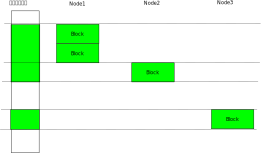

.. Kenneth Lee 版权所有 2025

:Authors: Kenneth Lee
:Version: 0.1
:Date: 2025-05-30
:Status: Draft

Linux内核内存管理概念空间建模
*****************************

介绍
====

Linux内核的内存管理概念层次和观察视图极多，而且经过长期的历史变化，很容易造成
误解，本文试图理清这些概念的关系。

这个分析基于6.12的主线内核。

Linux内核启动的时候，它已经在使用内存了，它至少认为自己正在占用的代码和静态数
据的内存是可以用的。更多的内存在哪里，它从两个地方获得：

* 内核参数mem=指定
* BIOS说明

有了这些数据，它就有一个内存表，这是一个分段的数据。类似“地址aaa到地址bbb是系
统内存”，“地址cccc到地址dddd是IO空间等等”。这些数据被记录在两个地方：

* memory_resource。这个接口是add_memory_resource()系列函数，这个部分的信息主要
  是用来全局观察用的，不作为具体的内存分配算法的输入。主要用于知道整个系统的物
  理地址空间具体如何分布，是否有重叠等等，在部分地方也用这个结构作为指定内存范
  围的输入参数。这个数据在启动后可以从/proc/iomem看到。

* memblock。这个接口是memblock_add()系列函数。每片内存按一个个连续空间的方式保
  存起来，可以通过memblock_alloc()系列函数进行分配。在其他机制没有起作用的时候
  这种分配都被认为内存被reserved了（不能释放）。等buddy管理系统初始化
  （mem_init())的时候，没有reserved的内存全部交给buddy/slab系统进行管理。这之后
  memblock_alloc()调用就会转化成kalloc()系列调用，被slab系统进行管理。这个数据
  在使能了相关编译选项的时候，可以在debugfs的memblock子目录中查到。

buddy的接口是alloc_pages()系列函数，它提供指数方式指定页数的接口分配的页分配接
口，要求每次分配的页数都是2的指数，该指数英文称为order，所以每次分配的页数是
:math:`2^{order}`\ 。它称为伙伴系统，就是
因为低次的分配可以从高次分配中分裂出来。比如，分配\ :math:`2^3`\ 个页，可以从
:math:`2^4`\ 个页中分成两份得到。这两片\ :math:`2^3`\ 的内存就是
:math:`2^4`\ 内存的一对伙伴。释放的时候只要两个伙伴都释放了，就可以合并起来作
为\ :math:`2^4`\ 的内存使用。这种方法不容易出现碎片，只是分配的大小通常和期望
不完全一致，空间利用率比较低。

slob/slab/slub算法是buddy之上的实现。三个名字是三代不同的实现，当前版本主要用
slub，但因为这个东西在用户态看到的管理接口叫slab，我们后面统一称为slab。对外接
口有两部分：

* kmemcache_alloc系列函数
* kmalloc系列函数

这两者的原理都是把order化的页按固定的大小拆成小块，以零存整取的方式供内核的各
个模块使用。所以，这个接口可以和Buddy同时使用。Slab是Buddy的一种高层封装。
Buddy是大部分内核程序观察内存世界的窗口。理解整个内存的概念空间，以这个部分的
概念为中心。其他的，比如PageCache，LRU，都是在Buddy基础上的二次管理。

让我们在现在的理解层次上做一个总结：Linux启动的时候把内存记录为
MemoryReresource和MemBlock。以MemBlock为基础支持第一波内存分配需求。然后以
MemBlock剩下的内存初始化Buddy模块，建立以页为单位的管理设施。最终，分配的页部
分用于支撑内核模块的内存分配需求，部分用于支撑用户程序的内存使用需求。内核使用
的部分还封装了slab接口，用于支撑通用化的内存分配需求。

Block
=====

初期的内存分段记录在MemBlock模块中。这个模块混用两个概念：这种分段的空间，在一
些数据结构或者函数中称为一个Block或者MemoryBlock，在一些数据结构中称为一个
Region。我们在下文中统一称为Memory Block或者在不会引起误会的时候简称Block。

Linux设定了一个基本的Block大小（MIN_MEMORY_BLOCK_SIZE），这些内存空间必须对这
个基本单位对齐并且大小是它的整倍数。这个基本单位在不同的平台是是不一样的，比如
在ARM64上，这是128M。这个大小主要受限于管理成本，这种成本主要体现在Buddy系统所
需的线性地址寻址要求上。Linux经常要进行虚拟地址和物理地址的变换，所以主要的内
存都要虚拟地址和物理地址是线性对应关系（va=pa+base)。这种对应如果出现如果中间
出现空洞，就会需要多一个基址(base）来表示这一段的截距，从而增加变换的成本，所
以，这种128M的选择，是一种根据具体情况的选择。

MemBlock中的内存如果没有被分配，就叫Memory，分配出去了，就叫Reserved。每个
Block会被生成一个kobject device，呈现在/sys/bus/memory/devices中，下面是一个例
子：::

  # ls
  auto_online_blocks  memory2045          memory2058
  block_size_bytes    memory2048          memory2059
  hard_offline_page   memory2049          memory8
  memory10            memory2052          memory9
  memory11            memory2053          power
  memory2041          memory2056          soft_offline_page
  memory2044          memory2057          uevent
  
每个memory开头的设备代表一个Block，每个可以单独控制，后面的数字是这个Block的物
理地址（以MIN_MEMORY_BLOCK_SIZE为单位）。lsmem命令主要就是从这里获得信息：::

  # lsmem
  RANGE                                  SIZE   STATE REMOVABLE     BLOCK
  0x0000000040000000-0x000000005fffffff  512M  online       yes      8-11
  0x0000003fc8000000-0x0000003fcfffffff  128M offline                2041
  0x0000003fe0000000-0x0000003fefffffff  256M offline           2044-2045
  0x0000004000000000-0x000000400fffffff  256M offline           2048-2049
  0x0000004020000000-0x000000402fffffff  256M offline           2052-2053
  0x0000004040000000-0x000000405fffffff  512M offline           2056-2059
  
  Memory block size:       128M
  Total online memory:     512M
  Total offline memory:    1.4G

启动了debugfs和memblock调试的时候，可以在/sys/kernel/debug/memblock中查看这些
内存片段。下面是一个例子：::

  # cat memory
     0: 0x0000000040000000..0x000000004fffffff    0 NONE
     1: 0x0000000050000000..0x000000005fffffff    1 NONE
     2: 0x0000003fc8000000..0x0000003fcfffffff    0 DRV_MNG
     3: 0x0000003fe0000000..0x0000003fefffffff    0 DRV_MNG
     4: 0x0000004000000000..0x000000400fffffff    0 DRV_MNG
     5: 0x0000004020000000..0x000000402fffffff    0 DRV_MNG
     6: 0x0000004040000000..0x000000405fffffff    0 DRV_MNG
  # cat reserved 
     0: 0x0000000040210000..0x000000004125ffff    0 NONE
     1: 0x00000000416f0000..0x00000000419affff    0 NONE
     2: 0x0000000048000000..0x00000000480fffff    0 NONE
     3: 0x000000004fa00000..0x000000004fdfffff    0 NONE
     4: 0x000000004ffdc000..0x000000004fffbfff    0 NONE

内核命令行参数reserve_mem=可以主动预留部分内存。（不要和reserve=参数混淆了，后
者预留的是IO空间。）

Block是内存管理的单位，可以通过向memory设备的online属性文件写入控制参数控制内
存段的online，offline，或者控制具体online到什么zone里面（参考下文）。

所以，Linux内存热插拔的单位是Block，但如果你物理上一个热插拔的单位不止一个
Block，可以把他们创建为同一个group。这样它们会被一体插拔。

在系统启动后，内核驱动可以通过add_memory_driver_managed()系列函数增加更多的内
存，这样的内存都是热插拔内存。

Node
====

MemBlock还有Node的概念。下面是一个例子：::

  # ls /sys/devices/system/memory/memory2045
  node0        phys_device  power        state        uevent
  online       phys_index   removable    subsystem    valid_zones

这里的memory2045就属于node0。

Node这个概念和物理地址是正交的，所有的MemBlock在一个物理地
址空间中编址，但不同的Block可以在不同Node上。参考如下例子：

从物理地址的角度，所有的MemBlock都编址在一个空间中，但不同的空间可以属于不同的
Node。

Node表达的是距离的概念，每个Node包含一组CPU和一组内存，在同一个Node内的，就认
为距离是最短的，到其他不同的Node，有不同的距离。这样Linux调度器可以尽量把应用
的内存和CPU限制在一个Node内，不能在一个Node内，就尽量分布在距离近的Node之间，
这样可以提高效率。

Linux把Node的具体抽象为一张二维表，类似这样：::

  Node  0  1  2  3
  0     10 20 20 30
  1     20 10 30 20
  2     20 30 10 20
  3     30 20 20 10

这是一个无向（1->2的1<-2的距离默认是一样的）的二维距离图，即使你物理上的连线是
个3D甚至Mess的结构，在内核的数据表达（__numa_distance[]）上都是二维的。

CPU和内存总是归属于某个Node，Buddy等系统在分配内存的时候根据当前的CPU决定尽量
从最近的Node上分配内存，也允许强制指定从什么Node上分配内存（比如
alloc_pages_node()）。

内核也有内核线程在后台根据内存和应用的距离，把页动态迁移到靠近CPU的Node上。

关于CPU，Node，内存的关系，通过qemu创建Node的命令最容易看出来，下面是一个qemu
创建一个4 Node的机器的参数：::

        ...
	-m 512M,slots=2,maxmem=1G \
	-smp 4,sockets=4 \
	-object memory-backend-ram,id=mem0,size=256M \
	-object memory-backend-ram,id=mem1,size=256M \
	-numa node,nodeid=0,cpus=0,memdev=mem0 \
	-numa node,nodeid=1,cpus=1,memdev=mem1 \
	-numa node,nodeid=2,cpus=2 \
	-numa node,nodeid=3,cpus=3 \
        -numa dist,src=0,dst=1,val=20 \
        -numa dist,src=0,dst=2,val=20 \
        -numa dist,src=0,dst=3,val=30 \
        -numa dist,src=1,dst=2,val=30 \
        -numa dist,src=1,dst=3,val=20 \
        -numa dist,src=2,dst=3,val=20 \

这里我们创建了四个Node，分别分配了一个CPU，内存则只在Node 0/1上才有，所以CPU2
必须从距离最近的Node 0上才能分配到内存。

这种参数通过ACPI的SLIT，HMAT表，DeviceTree的numa-node-id系列参数等形式传递给内
核，内核通过这些创建对应的管理结构。

Zone
====

CPU和外设都可能访问内存，访问地址长度不同，就会造成访问能力的不同。所以Linux又
把地址分成了ZONE。比如说，在64位的CPU上，可能它的物理寻址能力是52位（是的，虽
然理论上可以实现64位的物理地址，但现阶段没人需要那么大的物理内存，所以通常CPU
的寻址范围不会是64位的），所以内存编址在52位这个空间上都是可以的，但外设比较简
单，可能只能访问24位以内的地址，所以如果内核要和外设共享内存，就必须分配物理空
间在24位以内的地址。所以，管理内存分配的时候，要决定内存在哪个物理空间内。这个
空间，在Linux中称为Zone。

这种分配又和Node有关，所以Zone属于Node。但其实Zone还是在物理地址空间中统一编址
（不会重复）的。

一些常见的，最基本的ZONE是：

* ZONE_DMA，一般设备能寻址的空间（通常是24位）
* ZONE_DMA32，增强的32位设备能寻址的空间
* ZONE_NORMAL，CPU能寻址的空间

每个Node都可以有自己的，相同类别的ZONE。比如Node 0有一个Block在地址0上，属于
ZONE_DMA，而Node 1上有一个Block在地址128M上，也属于ZONE_DMA。如果你指定Node来
分配内存，它就会找对应那个Node上的DMA ZONE来分配内存。这些分配的内存是可以同时
使用的，因为他们的物理地址不同，只是从不同的Node上发起访问，它们的效率不一样而
已。

Buddy的内存分配函数通过GFP标志说明对ZONE的要求，比如alloc_pages(GFP_DMA)指明必
须在DMA ZONE分配内存。但GFP不一定只说明对Zone的要求，还可以是其他要求，比如
GFP_ATOMIC要求不要进行可以引起调度的操作等。

Zone不需要连续，它可以由多个Region组成，但它确实有首地址（start_pfn），同时它
也有span_pages, present_pages的概念，前者是跨越的空间（包括空洞），后者减去空
洞。它还有一个预留水线的概念，保留部分内存在紧急的时候使用，称为reserved_pages，
present_pages减去reserved_pages，表达为managed_pages。

内核启动的时候时候会打印zone的初始化信息，下面是一个例子：::

 NODE_DATA(0) allocated [mem 0x4fffd9c0-0x4fffffff]
 NODE_DATA(1) allocated [mem 0x5fef3f00-0x5fef653f]
 Zone ranges:
   DMA      [mem 0x0000000040000000-0x000000005fffffff]
   DMA32    empty
   Normal   empty
 Movable zone start for each node
   Node 0: 0x0000000048000000
   Node 1: 0x0000000058000000
 Early memory node ranges
   node   0: [mem 0x0000000040000000-0x000000004fffffff]
   node   1: [mem 0x0000000050000000-0x000000005fffffff]

插入新的memblock后，内核会更新这个结构，但不会再打印了，下面是一个我人为加入的
打印显示的结果：::

 # chmem -e 0x0000003fc8000000-0x0000003fcfffffff
 node[0].zone DMA: from pfn: 40000, span:8000
 node[0].zone DMA32: empty
 node[0].zone Normal: empty
 node[0].zone Movable: from pfn: 48000, span:8000

加入一个新的memblock后(128M），Movable Zone被更新了。

线性区
======

现代CPU支持页表映射，可以设定每个页（通常是4K）从虚拟地址的不同位置指向物理地
址的不同位置。我们把这种映射关系称为乱序映射，使用这种映射，要从虚拟地址获得物
理地址，或者反过来，需要查表，内核中经常要做这种操作，这非常影响效率。所以
Buddy系统使用线性映射的方式来加速这个查询过程。也就是说，对于每片连续的空间
（称为Section），物理地址pa和虚拟地址的va，总是呈现如下关系：

        va=pa+PAGE_OFFSET。

在这个范围内的va和pa，就称为处于线性区。在线性区内，va和pa可以快速翻译。

由于线性区的存在，32位系统就多了一种ZONE，这种ZONE称为HIGHMEM。它的来源是这样
的：32位的虚拟和物理空间都可以达到最大，4G。但虚拟空间要同时给用户态和内核态使
用，所以如果真的有4G物理空间，那么内核就不可能线性映射全部物理空间。很多实现中，
内核是1G的虚拟空间，最多就只能映射1G的物理空间，其他物理空间内核完全访问不了，
这会导致很多功能都无法实现。为了解决这个问题Linux把内核的虚拟空间分成两部分，
一部分用于线性区，一部分根据需要进行映射，前者用于ZONE_NORMAL，后者用于
ZONE_HIGHMEM。ZONE_NORMAL的空间属于线性区，而ZONE_HIGHMEM属于非线性区。

实际上ZONE_DMA和ZONE_DMA32都属于线性区。这些也可以用作ZONE_NORMAL，所以其实
ZONE_NORMAL只是用于剩下的线性区，这三者都属于线性区，都可以被Kernel的模块使用，
这些ZONE就被统称为KERNEL ZONE（通过alloc_page(GFP_KERNEL)分配）。

.. note::

        请注意：ZONE是物理空间的概念，ZONE_HIGHMEM是一个物理空间的范围，这个限
        制是虚拟空间不足造成的，这个这个限制被传递到物理空间是因为我们有线性映
        射这个要求。这很容易让我们误会ZONE是个虚拟空间的概念，其实它不是。

对于64位的系统，这个问题就不存在了，比如ARM64的内核空间用64位空间的一半，这也
是EB级别了，现阶段几乎没有什么系统有这么大的物理空间。所以线性区可以覆盖所有物
理内存，这种情况下就没有ZONE_HIGHMEM这个区了。

页
==

Buddy系统提供页的分配功能，这里的页，是页表管理的最小块的大小。现代CPU可以支持
多种页大小，这些大小都是最小块的2的指数倍。Linux中用最小那个作为页的大小。

这也是一个被发展的概念，因为过去的CPU只支持一种页大小，并没有上面这个问题。这
种历史遗留还在代码有体现，会认为这种最小的页，就是唯一的页的存在形式。

比最小页更大的页，在内核中以透明大页（THP，Tranparent Page）或者大页文件系统
（HugePageFS）的形式存在，它们都是Buddy系统之上的设施，而不是Buddy系统提供的接
口。换句话说，你在Buddy系统中分配的永远都是小页的概念，THP和HugePageFS只是对这
些拼接在一起的小页的应用。为了表达一组小页实际被用作了大页，页具有Compound属性，
当一个页是Compound页，它表明它之后的所有小页，都是大页的一部分。这通过
PageCompound(page)检查函数来检查，我们把Compound页称为复合页。

在历史上，内核通过一个全局数组memmap[]保存所有的页的属性（比如上面这个Compound
属性等），alloc_pages()分配一个页，返回的就是这个数据的一个数组项的内容。这就
叫struct page。为了定位这个数组的下标，引入一个概念，pfn，page frame number，
它和物理地址线性相关，所以，我们很容易从物理地址得到pfn（通常就是物理地址的高
位），然后从pfn直接查表得到map。

这样，我们就有两个“页”的概念了。一个是struct page，一个是这个page本身表示的物
理内存。前者是后者的索引。我们常常混用这两个概念，但我们必须知道，这里有两个不
同的实体。当我们需要强调我们说的是索引，我们用struct page这个名字。

在Linux支持稀疏物理内存分布的时候，物理空间由多个section组成，memmap也被分布到
每个section（struct mem_section）上，叫section_mem_map。这本质是一个页表一样的
radix结构，我们从物理地址先定位section，然后从section定位section_mem_map，从而
用pfn确定page。这也解释了为什么需要限制memblock的最小大小，因为这被section的大
小影响了。这种情况下，pfn不是简单的section_mem_map的下标，而是一个全局的page表
示，可以通过mem_section和section_mem_map定位page的位置。

.. note::

   section还被另一个要素影响：它需要大于alloc_pages()的最大order表达的范围
   （MAX_ORDER_NR_PAGES）。这可以保证每个setion都可以分配最大Order的成组页。

mem_map是基于最小页的，对于Compound页来说，这对应多个page。这对使用者很不友好。
所以最近的内核引入了另一个概念：folio。它表示一般意义的页，而不是最小页。这个
概念在数据结构上和struct page是重叠的。也就是说，如果这是一个普通的最小page，
它的数据结构实际上就是struct page。但如果它是一个复合页，它的数据接口会延伸到
后续的struct page上，但如果你拿到后面的page的指针，你也能有办法确定这是一个复
合页的一部分，同时能通过指针值得得到这个复合页的folio的指针。

所以，在概念上，我们用page表示最小页，而用folio表示硬件页表意义上的“页”。

alloc_pages()分配的是page，folio_alloc()分配的是folio，两者其实是可以换用的，
因为你完全可以用folio->page来得到page，也可以用page_folio(folio)得到page。

page和folio通过引用计数管理生命周期，alloc_pages()得到的页，可以通过put_page()
释放，可以通过get_page()增加生命周期。对应也有folio_get/put()函数。

但要注意，这种管理是作用在单个页上的，不是成组的页。也就是说，你只能对
alloc_page()分配的页做这种引用计数。如果你调用alloc_pages()而order不是0，那么
你得到成组的页，这些页不会每个都有引用计数，这种情况下，你只能用free_pages()释
放。或者，你也可以用split_pages把这组页（也称为“高阶页”）分成单个struct page，
这样你就可以一个个管理了。

在线性区分配的页，可以用page_address(page)转化为线性地址，这个转换过程是线性变
换，速度很快。同样page_to_pfn(page)和page_to_phys(page)，分别把page转换为pfn或
者pa，这些转换都是很快的。但如果不在线性区，这种转换需要特别的算法（内核没有固
定的接口做这种转换），所以一般情况内核模块分配空间都用GPF_KERNEL属性，保证总在
线性区进行内存分配。ZONE_HIGHMEM不到极端情形基本上是不会用的。

页的锁和标记
------------

页状态管理是Linux内核最复杂的数据结构之一，它就好像一组巨大的全局变量，很多模
块都在页上附着属性来进行状态管理，每个状态的功能很难单独解释，比如结合那个组功
能单独讨论。所以在这个属性上我们无法简单建出概念空间，它和细节设计相关，没有宏
观的，粗糙的概念理解可以记忆。

但我们可以解释一些它的基本使用惯例。

页的状态主要记录在struct page中，通常是一组原子化访问的位域。比如，页是否Dirty
（被访问过），可以这样访问：::

  SetPageDirty(page)        // 属性写1
  ClearPageDirty(page)      // 属性写0
  PageDirty(page)           // 读属性

这组函数用一般方法是找不到定义的，因为它们都是通过宏加宏的方式叠加定义出来的，
要找到大部分定义要直接去看include/linux/page-flags.h。这里也有每个属性的的基本
解释，但细节含义，基本上都要找到和使用这个属性相关的所有代码片段才能最终确定。

其中lock也是一个这样的属性（PG_locked），通过如下函数进行封装：::

  lock_page(page);           // 上锁（TASK_UNINTERRUPTIBLE）
  lock_page_killable(page);  // 上锁（TASK_KILLABLE）
  unlock_page(page);         // 解锁
  PageLocked(page);          // 检查

lock/unlock函数通过对PG_locked进行检查实现上锁，从上锁函数的TASK属性就可以看出
来，这不是spinlock，上锁的时候是可以被以不同的休眠方式进行休眠的。

页的锁层次关系也是和具体使用这个页的模块相关的，必须和有影响的模块的实现细节联
动才能维护好这部分代码。

ZONE_MOVABLE
============

如前所述，在64位系统中，内核线性区已经足够覆盖所有内存了。但由于内存热插拔的需
求的存在（这个需求现在变得很普遍，就算不考虑热插拔的硬件，在虚拟机里面根据需要
动态增加内存的场景也非常普遍），这又造成了另一个ZONE的需求：ZONE_MOVABLE。在这
个区域内的内存可以被移动到其他地方，这样，如果所在的物理地址需要热插拔，上面的
内存可以被迁移到其他区，这样这个区内的Block就可以整个offline。

ZONE_MOVABLE的语义是：这部分空间不分配给GFP_KERNEL（虽然它的物理地址仍可以在线
性区），这样内核肯定不会使用它（实际上ZONE_MOVABLE允许内核用特殊的方法使用，这
个后面再展开），而用户态的内存(又叫LRU内存，LRU是Least Recently Used的缩写，这
是用户态页调度算法的名字）总是可以迁移的，在需要热拔这边内存的时候就可以移走这
些内存。

请注意：ZONE_MOVABLE的内存可以处于线性区，只是它不用于内核，所以不会有内核应用
使用它，所以可以迁移而已。

内核通过如下参数控制不同物理空间的内存，哪些属于ZONE_MOVABLE：

* kernelcore：这个参数决定有多少内存属于KERNEL ZONE（如前所述，这是个虚拟概念，
  表示ZONE_MOVABLE之外的空间有多少）

* movablecore：这个参数决定有多少内存用于ZONE_MOVABLE，这是换一个角度定义
  KERNEL ZONE的内存数量。

* movable_zone：这个参数决定把所有热插入的内存都看作MOVABLE的。

对于热插拔的内存，在/sys/bus/memory/devices/memoryXXX中有一个online的文件，写
入不同的参数可以把这片内存online到不同的zone。这可以动态改变启动的时候预设的参
数。（注：通常我们不会直接操作这些文件，而是通过chmem命令操作memblock，但当前
的chmem版本不支持选择online参数，所以，这种功能需要直接操作这些文件。）

内存如果加入movable_zone，基本上内核就不会使用它了，只用于用户态的分配。由于
LRU不是线性映射的，物理空间移动到其他地方，只要重新映射就可以了。

内核不能直接使用ZONE_MOVABLE的内存，因为内核使用线性映射，如果直接做页迁移，va
也需要改变，这会导致用户态的应用工作不正常。但内核程序可以在显式知道这一点的情
况下使用它。方法类似这样：::

  struct page *p_movable= alloc_page(GFP_HIGHUSER_MOVABLE);
  lock_page(p_movable);
  __SetPageMovable(p_movable, &movable_mops);
  unlock_page(p_movable);
  
核心就是你必须为这一页提供移动时的回调函数，从而内核程序主动认知这个地址是会改
变的。如果这个迁移过程失败，这片memblock就不能offline。

如果出现迁移失败，内核会输出失败的页的信息，如果开启了page_owner调试功能，这可
以定位具体是什么地方分配的页导致的迁移失败，这对于优化热插拔功能非常有用。

ZONE_DEVICE
===========

ZONE_DEVICE是个占位符，表示这片ZONE用于设备映射，不能用于内存分配。这个ZONE和
内存分配是无关的，就是一个简单的物理地址空间预留。

Slab
====

Slab内存是在页之上进行二次管理的算法，一种用法是用kmem_cache_create()建立一个
固定大小的分配器，以后基于这个分配器分配固定大小的object就可以实现“不够的时候
分配更多的页，整页用完释放整页”。它还能实现一些对象的管理，比如在临时释放的对
象中保留一些信息，下次分配的时候就不需要初始化了，但根本就是一种把页打零的管理
方法。

kmem_cache_create()是针对大量使用固定大小内存的模块的，有些模块只是用少数内存，
可以让所有模块共享一组分配器，这就构成kmalloc()结构。

以上两个概念，结合/proc/slabinfo的具体形式就很容易建立概念：::

  # name            <active_objs> <num_objs> <objsize> <objperslab> <pagesperslab> : tunables <limit> <batchcount> <sharedfactor> : slabdata <active_slabs> <num_slabs> <sharedavail>
  ext4_groupinfo_1k     23     23    176   23    1 : tunables    0    0    0 : slabdata      1      1      0
  p9_req_t               0      0    160   25    1 : tunables    0    0    0 : slabdata      0      0      0
  ip6-frags              0      0    184   22    1 : tunables    0    0    0 : slabdata      0      0      0
  RAWv6                 26     26   1216   26    8 : tunables    0    0    0 : slabdata      1      1      0
  UDPv6                  0      0   1344   24    8 : tunables    0    0    0 : slabdata      0      0      0
  tw_sock_TCPv6          0      0    248   33    2 : tunables    0    0    0 : slabdata      0      0      0
  request_sock_TCPv6      0      0    312   26    2 : tunables    0    0    0 : slabdata      0      0      0
  TCPv6                  0      0   2496   13    8 : tunables    0    0    0 : slabdata      0      0      0
  nf_conntrack_expect      0      0    208   39    2 : tunables    0    0    0 : slabdata      0      0      0
  nf_conntrack           0      0    256   32    2 : tunables    0    0    0 : slabdata      0      0      0
  ...
  kmalloc-8k            20     20   8192    4    8 : tunables    0    0    0 : slabdata      5      5      0
  kmalloc-4k            72     72   4096    8    8 : tunables    0    0    0 : slabdata      9      9      0
  kmalloc-2k           176    176   2048   16    8 : tunables    0    0    0 : slabdata     11     11      0
  kmalloc-1k           566    576   1024   32    8 : tunables    0    0    0 : slabdata     18     18      0
  kmalloc-512          603    672    512   32    4 : tunables    0    0    0 : slabdata     21     21      0
  kmalloc-256          667    736    256   32    2 : tunables    0    0    0 : slabdata     23     23      0
  kmalloc-128          576    576    128   32    1 : tunables    0    0    0 : slabdata     18     18      0
  ...

这个列表前半段就是每个模块各自的slab，后半段就是kmalloc给各个模块公共的slab，
概念是一目了然的。

LRU
===

LRU是用户态部分的页管理算法。它和内核直接使用的页最大区别在与它肯定不在线性区，
所以，它需要复杂的反向映射表（rmap）用于表达pa到va的映射关系。这是其一，更重要
的是，这种映射是不稳定的，它在缺页的时候分配，分配后只要进程没在运行，都是可以
回收的（回收前把内容同步到磁盘上），大不了下次要用的时候再分配一次就行了。LRU
解决的主要问题就是这个回收问题，这决定了先回收谁的问题。这个回收在页管理相关算
法中，称为Reclaim。

LRU，Least Recently Used，这个名字就是这个算法的特征：最近最少使用的先回收。这
是一种通用算法，广泛用于各种缓存的回收算法。基本原理就是访问了的页提升到队列头，
然后优先淘汰队列尾的页。

但这只是理想的算法，实际上软件模型无法直接捕获页被访问的信息。所以，这个算法通
常是硬件在页被访问的时候更新页表中的ACCESSED位（设置了这个位的pte状态标记为
young），然后通过特定的流程去扫描所有被监控的页（新加入的页天然是最热的，这个
不用担心），发现有页的ACCESSED位被更新了，就提升它的热度（并且清掉这个ACCESSED
位，以备后续继续跟踪）。所以在每个扫描周期内，我们无法区分谁是最热的。所以，只
能分级来监控。传统的LRU算法只分成active和in_active两个列表，现在升级到MGLRU
（当前阶段不是默认算法，但测试结果是很好的），Multi Generational LRU。这里的
Generational是“代”的意思，本质是把冷热程度分了更多的层，减少扫描链表需要的CPU
成本。不过这些已经都是算法细节了，和我们这里要建模的基本概念影响并不大。
