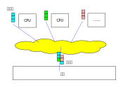
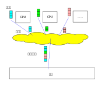
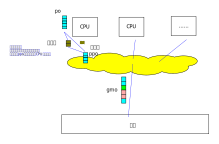

.. Kenneth Lee 版权所有 2022

:Authors: Kenneth Lee
:Version: 1.0
:Date: 2022-12-5
:Status: Released

Alloy
*****

介绍
====

分析Alloy主要有三个目的：

1. 本身要用这个工具，完成初步的学习自然要对它的整个逻辑建一次模。

2. 学习这个东西对理解
   :doc:`维特根斯坦的理论 <../逻辑哲学论分析/README>`
   很有帮助，写出来可以作为那边的一个参考。

3. 学习这个东西对理解什么是
   :doc:`软件架构设计 <../软件构架设计/README>`
   很有帮助，写出来可以作为那边的一个参考。

本文组织上以第一个目的为主线，然后用下面的方式表示对维特根斯坦理论的讨论：

.. note::
     
   这是对维特根斯坦理论的讨论。

用下面这种方式表示对软件架构设计理论的讨论：

.. warning::
     
   这是对软件架构设计原理的讨论。

Alloy是一个建模工具，它的主页在这里：
`Alloy <https://www.csail.mit.edu/research/alloy>`_
。

它可以做很多纯逻辑模型的分析，比如Spetre/Meltdown的攻击模型，内存序模型等等。
RISC-V的内存序就是用这种方法进行的分析。

Alloy有Mac的Native版本，其他平台是java的，可以用java -jar运行，没有额外的依赖，
代码在github上开源：
`Alloy Source <https://github.com/AlloyTools/org.alloytools.alloy/releases>`_

作者为这个工具写了一本书，叫《\ *Software Abstractions*\ 》，详细介绍了这个工具
的用法。但如果不熟悉相关概念，纯从程序员的角度去理解它，很容易把自己绕晕。本文
会通过澄清一些基本的概念来避免这个问题。而澄清这些基本概念，也有助于我们理解前
面提到的逻辑哲学论和软件架构设计的思路。

集合论基础
==========

谓词逻辑
--------

Alloy作者写的那本书，如果没有集合论的基础，是比较难看懂的。因为对于集合论已经定
义的概念，包括保留字，作者都是不解释的。对于没有学过或者已经把集合论还给老师的
程序员来说，他会看到很多熟悉的概念（在程序世界中熟悉的概念），但这些概念很可能
不是你理解的那个意思，这样就不容易看懂了。

所以，我建议学习这个工具的读者可以先去翻一下CHARLES C. PINTER教授的《A Book of
Set Theroy》，看完前半段就够了，把相关词语的概念复习一下，然后再看后面的概念就
容易多了。

本文把其中和Alloy相关的一些重点列出来，帮助已经有相关概念，但部分细节已经想不起
来的读者建立一个针对Alloy的，有结构的逻辑空间。

集合论是一个和公理体系、谓词逻辑等理论有千丝万缕关系的学科。它把我们习惯的逻辑
变换成了集合运算。这个变换的基础就是谓词逻辑。我们考察一个我们经常使用的三段式
论证模型：

1. 卡拉是条狗
2. 狗有四条腿
3. 所以卡拉有四条腿

这叫“命题逻辑”（Prepersition Logic）。它更接近哲学的范畴，是不能做数学运算的。
你必须从语义上理解它。为了更容易沟通（或者说让表达更精准），数学家们定义了谓词
的概念。简单说，我不管你那些什么“狗”啊，“卡拉”啊，这些概念，我们就谈某个集合，
把对这个集合的属性进行定义（范围定义）的描述都用一个函数来表示，这样，我们就不
再说狗有四条腿了，“有四条腿”这个谓语我们说f(x)，其中x是狗的集合，所以狗有四条
腿就被定义成：“存在狗x，使得f(x)”。卡拉属于狗这个集合，所以，卡拉满足谓词f(x)，
如此而已。这就更接近数学了。这叫谓词逻辑（Predicate Logic，或者Quantification
logic）。

.. note::

   从谓词逻辑理解维特根斯坦的理论会很简单，一旦你用上文这个方法来理解逻辑，你很
   自然就会理解什么是Can be said clearly和Must Be Passed Over In Silence了。存
   在x属于集合A，使得f(x)成立，这是逻辑，是Can be said clearly的。而A是狗的集合，
   考拉是否属于A这个集合，这个事情每个人理解都不一样，这就只能“你知我知”，就是
   只能Must Be Passed Over In Silence了。

   这也是《道德经》中的名和道的区别，名就是你已经总结的逻辑元素，它来自集合的分
   割方法（把什么定义为“集合内”，就是有；把什么定义为“集合外”，就是无）。而“道”
   是被分割的那个全集，那个东西也是只能Passed Over In Silence。所以，“道”才不可
   “道”。因为一旦“道”出来，那就是“名”了。就比如是个抽象，就必然是个数字孪生，而
   不能完全代表我们希望描述的那个东西了。

基于谓词逻辑，我们对于每件事的叙述（比如“x有四条腿”），都是一种范围的收缩。都构
成一个集合。

让我提前用一个Alloy的例子来让你理解这一点：

比如说，我们讨论水果的颜色，假定我们都是小孩子，知道的东西也只有有限的水果和颜
色。在我们的世界中，我们只有三种水果：苹果，橙子和梨子（请注意，为了让问题简单，
我们并没有很多的苹果，很多的梨子，我们只有一个苹果，一个梨子，一个橙子）。而颜
色我们只认识两种：红，不红。在我们的（信息）世界中，我们只有这五个实体，它们互
相之间都可能有关系，也可能没有关系，假定我们的脑子更差一点，只能建立二元的关系：
比如我们认为苹果是红的。或者苹果是梨子的母亲，都行，反正这五者两两之间才能发生
关系，我们的脑子认识不了三个或者三个以上的关系。那么在我们没有对这个世界建立任
何其他认识之前，这个世界的所有可能关系组成的空间，就包含2的20次方个组合（每个成
员都有是否和另四个成员有没有关系的可能性，这需要4个bit表示，5个成员总共20个
bit）。用计算机的单位，这是1M的信息。如果和Alloy一样，我们承认自己可以和自己有
关系，那这是25个bit，总共512M的关系。

        注：有读者觉得这个地方好像用不了这么大的信息空间，而觉得只有5个对象，每
        个是否和其他对象是否有关系，所以只有5×5种情况。这个理解是不对的。每个对
        象你不是只选择其中一个作为关联，而是和每个是否发生关联都是不同的情况。

        看看下面这幅图就明白了：

        .. figure:: _static/rel_world.svg

.. note::

   实际这里为了简化问题，我们忽略了给“关系”本身命名包含的信息（比如苹果是梨子的
   母亲中母亲这个信息，我们只关心了苹果具有梨子这个属性这一个信息）。所以，现实
   中的名字关系引起的集合运算其实更复杂一些。《道德经》中把这形容为：玄之又玄。
   具体的说法是：有无同谓之玄（有无的分割是玄），玄之又玄（分割上再交叉分割），
   众妙之门（所有概念原理的入口）。

这构成我们这个理解的“世界”的全集。我们增加的认识，都是对这个全集的一个收缩。

.. note::

   如果你看不懂维特根斯坦说的“World”的概念，不明白他说的World的特性为什么会这么
   奇怪，回来看看集合论的概念，你就会发现其实他说得很直白了：他说的World，并不
   是我们以为我们认识了的那个世界，而是真正的世界在我们头脑中的那个“数字孪生”，
   是抛弃了Pass Over In Silence而剩下的那个数字建模。缺乏哲学思维的人总是把两者
   等同，但其实你的数字孪生是对真实世界的一个抽象和建模，并不包含所有的信息。

   五行相克你也可以解释你看到的真实世界的信息，生产力改变生产关心你也可以解释这
   些信息，这会导向完全不同的结论。但真实世界永远按它的规律走，不因为你用了不同
   的方法去“名”（建模）它而有所改变。

   理解这一点，《道德经》里面的道和名也就很好理解了。道就是外部影响你的认知的那
   个东西（维特根斯坦把这叫做“Thing”），而名，就是你脑子里面的“数字孪生”。

好了，现在如果我们说：苹果都是红色的（你不用管这是不是事实，我们现在谈的是我们
脑子中理解的那个世界）。那么前面这个集合就变小了，因为苹果必须和红色发生关联，
苹果对红色的那个bit必须等于1（假定1表示有关联），前面的1M的可能性的空间，就少了
一个bit，变成512K了。

这就是集合论看待逻辑的方法。我们的所有“属性的描述”，都是对范围空间的收缩。无论
你说的是“苹果是红的”，还是说“如果苹果是红的，那么梨子就一定是不红的”，都是把前
面的那个全集的一部分空间消除掉。

在直觉上，我们可能可以理解“苹果都是红色的”是一种范围的收缩，但无法理解为什么“如
果苹果是红的，那么梨子就一定是不红的”是一种范围收缩，而更容易认为这是一种”推理“。
认为它“仅在假设成立的时候才是范围收缩“。但请用前面那个全集来想这个问题：这个推
理本质不就是说：当苹果这个对象和红这个对象发生了关联，那么梨子和不红那个对象就
一定有关联吗？不就是不能再认为我们的世界中不能存在苹果红，梨子也红这种组合了吗？

所以，到头来，“推理”这个认识本身，也是一种范围限定。

.. warning::

   从这个角度，也许更容易让我们理解设计是什么了：你有一个客观世界，你对它有期望，
   这个期望在一个范围里面（假定叫T）。你可以通过控制你可以控制的东西，对这个世
   界进行限制，得到一组范围限定A1，A2，A3，...，这组我们设计的An能够包住现实制
   造的限制Bn。我们希望达成的目的是：A1交A2交A3...是T的子集。

   这就是为什么我们描述T和定义A1, A2, A3在满足要求的时候让自由度尽量大，因为这
   样我们在面对Bn造成的实际限制的时候，我们的设计目的可以活下来的机会就会更大。

   我们做构架设计，都是为了解决这个问题。我们根据我们对Bn的理解，控制我们可以控
   制的An，保证我们最终得到的系统在T的范围内。

发明了这个理论以后，数学家开始对各种数学理论都进行了“标准化”（Formalization），
保证它们都是基于一组基本的公理（范围定义）和集合运算来描述的。这个努力开始没多
久……就数学危机了。

罗素悖论
--------

因为这样泛化以后，人们发现了一堆的悖论。最著名的当然是小学数学爱好者都听说过的
“罗素悖论”：理发师说他只给村子里的不给自己理发的人理发。然后我们问：理发师是否
给自己理发？

这个问题如果我们用具体的语义去理解，完全无聊，只是这个理发师在说胡话。但如果你
把它表达成为谓词逻辑，那就是不一样了，它定义了一个这样的集合：
:math:`R=\{x:x \in x\}`
，这个定义会让经典的推理逻辑自相矛盾。

允许这个定义破坏上面定义的各种集合为基础的逻辑，让当时的数学家觉得自己原来的推
理的基础都是错的，所以它才称为数学危机。最终要解决这个问题就是要避免出现这种定
义。不同的科学家，比如罗素自己的Theory of Type，维特根斯坦的自然哲学论，冯诺伊
曼的变量分类，都可以解决这个问题。它们的本质都是接受了“阶”（Order）的概念，集合
的成员和集合只能独立定义或者有限度共用。现在大部分数学上用的是Zermelo和Skolem提
出的，我们耳熟能详的方法：你只能用这种方法定义谓词范围：

.. math::

   \exists x:A \mid P(x) \\
   \forall x:A \mid P(x)

这种定义方法保证了，x只能被分别限制范围，而不能被循环定义：你先用A集合约束x的范
围，然后用P又收缩它的范围。但你不能拿A本身去当作P的变量来做范围判定。

这种定义方法叫做“一阶谓词逻辑”（First Order Predicate Logic），Alloy支持的就是
一阶谓词逻辑。如果我们支持一定程度的集合和谓词的叠加，那就会叫二阶，三阶……高阶
谓词逻辑。

这种定义方法在变量前面加上了x的取值范围的约束符，被称为量词。所以谓词逻辑，又称
为“量词逻辑”（Quantification Logic），强调的就是前面这个量词的必要性。

贝尔悖论
--------

另一个经典悖论是“Barry悖论”，又称为语义悖论。它的一个具体描述是这样的：假定有一
本固定单词数量的英语书。我们定义集合Q是这本英语书的20个单词以内可以表达的所有自
然数。由于英语书的单词有限，我们可以认为Q是一个有限的集合。那么我们可以认为Q有
一个最大值。那么，我们可以用英语说：“比Q的最大值大一的自然数”，这句话用不了二十
个单词就可以表达。然则，这个数字也是可以用少于20个单词就可以表达的自然数。这就
自相矛盾了。

这个悖论在直觉上也是怪里怪气的，但它真正的问题是什么呢？在前面提到的Charles教授
的书里面，他认为这个问题是因为定义的方法太“大”了，这个定义已经不是定义了，而是
意图本身了。

“少于20个单词可以表达的自然数”，这不是一种可以直接限制范围的定义，它只可以被证
伪，但不能被穷举。这最多就是我们的目的，但没有人说目的就总可以实现啊。就好比你
可以定义{
:math:`\exists x \in R \mid x^2=-1`
}为范围限制，但没有人说这个x是必须存在的啊。你基于它存在来推理，得到什么结论都
是可以的啊。

这一点，数学家们又定义了很多的定义上的约束的方法，但本质上就是说，你必须用简单
的，可以直接的判断标准（elementary predicate）定义谓词，不能用这之外的东西来定
义它。

.. warning::

   这个问题在我们的设计中经常出现。比如我说，我要做一个编辑器。让你做第一层设计，
   你制造这样一个限制：做一个在Linux上运行的编辑器。这是不是一种设计呢？可以说
   是，因为它确实收窄了范围。但这个设计到这个程度行不行呢？我看是不行，因为它太
   “大”了，没有到可以被执行的程度。

   这个例子太极端，我们看一个更细节的。比如有人设计一个CPU的中断处理单元，他说：
   “CPU收到中断以后，如果现在被关闭了，CPU就不收这个消息，后面的消息设备也不要
   报上来了……”，这种就是“大”了，没法实施。它是一种上帝视角，CPU收到中断以后，决
   定自己如何做，只能从自己的角度出发，它代表不了所有人，你可以说，你自己的中断
   单元设置为“不收中断”时，你直接丢弃这个中断，或者你自己决定缓存这个中断。但如
   果你说的是“不收这个中断，设备也不要报过来了”，范围就太大了，这个打算没法实施。
   这样的设计，只能用作很高层的参考，设计的控制程度是不足的。

   不过，这个主要还是个度的问题。在数学上，我们很容易定义这个度，但工程上，我们
   只能靠意会了，一个只有5个对象的模型，都要1M的数据来建模推理空间，我们做一个
   软件，状态成千上万，乃至上百万，上千万，你不可能像数学那样推演。所以，大部分
   时候我们都只能Pass Over In Silence。但无论如何，我们认为原理是一样的。

无论如何吧，消除了这些悖论以后，我们就只剩下了谓词，以及所有的集合运算：

1. 常量：\ :math:`\emptyset` （空集）

2. 关系：\ :math:`\in \subset \supset \subseteq \supseteq '`

3. 运算：\ :math:`\cap \cup \bigvee \bigwedge \overline - \times`

4. 推理：\ :math:`\implies \iff`

5. 量词：\ :math:`\forall \exists`

然后我们的所以范围定义，就都用这些运算和一组集合的基本公理来约束了。

实际上，正如Charles教授说的，数学家们也保证不了所有的推理都完全按这种规整化的标
准来描述（因为工程成本实在是太高了），只是说，我们有了这样一个标准，当我们遇到
在理解上有分歧的地方，我们可以随时细化到这个程度，来消除这种分歧。::

        Thus mathemticians are usually content to satisfy themselves that an
        axiomatic theory can be formalized, and then proceed to develop it in
        an informal manner.

.. warning::

   这也是为什么，在工程上，我们更多还是用命题逻辑来描述和推理我们的设计，只有在
   空间足够小，组合足够多的地方（比如我们后面会举的内存序的例子），我们才会用严
   格的谓词逻辑来进行有限度的推理。因为后者的工程成本通常不是人类现有的方法（可
   能永远都不会有）可以承载的。

绑定和自由变量
--------------

量词在谓词逻辑中是个很不好处理的东西，因为它没法直接参与一般的集合运算，所有通
常需要很多特殊的手法来处理。在Alloy这种建模语言中，一种很常用的算法是Skolem提出
的，所以叫Skolemization。可以在一定程度上把推理空间变得更接近集合。所以，我们需
要知道一下它的基本概念。

如果一个谓词中提到一个变量，而我们没有说它对于某个集合有效还是对于某个集合的部
分成员有效，我们的约束对这个变量就没有范围要求（相当于可以取所有对象的值），这
个变量就叫自由变量，这种变量不会对我们的推演空间有任何约束，它是Free的。否则，
它们就是Bound的。

比如下面这个例子：

.. math::

   \exists a \mid P(a, b)

a是bound的，b是free的。free的变量在计算的时候不会对结果产生约束。对于被“存在”绑
定的量词逻辑描述，可以通过Skolemization方法转换成普通的集合运算。比如：::

   \exists x: A \mid R(x)

可以转化成：::

  x' in A && R(x')

其中的x'不是原来的x，而是Skolem转换函数的一个自由变量，大部分形式验证工具（比如
Alloy）通过这种方法把所有的定义转换成纯粹的集合运算，从而把所有的推理变成集合上
的穷举。

还有一些和推理有关的集合运算，可以通过其他一些公式进行转换，比如著名的德.摩根定
理（反演律)，它的集合本质是：

1. :math:`A \bigvee B = !A \bigwedge !B`
2. :math:`A \bigwedge B = !A \bigvee !B`

在谓词逻辑中它的表达是：

.. math::

   (1) {\forall x \mid P(x)} \iff {!\exists x \mid !P(x)}

.. math::

   (2) {\exists x \mid P(x) } \iff {!\forall x \mid !P(x)}

关联
----

用集合论进行逻辑推理，我们经常不得不引入“关联”的概念。因为我们总是用“苹果是红色
的”这种思路去考虑属性问题。

在数学上，苹果和红色，是平等的“名字”，但现实的思考中，我们总是不由自主地认为红
色其实不过是附属在苹果上的一种“特征”。

所以，我们用“函数”来表达这种思维上的考虑。比如我们可能总结出：水果都是红色的。
它的数学表达就是：\ :math:`\forall x \in F \mid color(x) = red`\ 。

如果有的水果不是红色的，那么我们需要对那些水果有不同的定义，最后，你会发现，这同样
是一个集合，一个二元组的集合。

还用前面的水果颜色为例，你有一个集合A表示水果，另一个集合B表示颜色。那么函数
color(x)就是一个从A到B的映射，你输入A的一个成员，比如苹果，如果有唯一的输出y（y
属于B），那么我们就有一个A到B的函数映射。而函数本身，也是一个集合，只是它是关联
的集合，比如，在前面的例子中，我们认为AxB的映射全集是这样一个集合：::

  （苹果，红），（苹果，不红），
  （橙子，红），（橙子，不红），
  （梨子，红），（梨子，不红）。

color作为函数，就是这个全集的其中一个子集，比如可能是这样的：::

  （苹果，红），
  （橙子，不红）
  （梨子，不红）

所以，所谓函数，也是一个集合，一个关联的集合。它也有我们平时用的连续函数的特征，
比如单调性，值域（range），定义域（domain），对称性（Symmetric）等等。

同时作为有限集合（集合论也研究无限集合，但很多的理论研究都聚焦在有限集合上），
它还有其他一些属性，比如内射（Injective，每个x的y唯一），满射（Surjective，所有
y都有x），自反（Reflexive，每个成员至少和自己关联），传递（Transitive，如果a和b
有关系，b和c有关系，则a和c必然有关系），有序（Ordered，不同的a和b有关系，那么b
和a一定没有关系。这还分Total Ordered，Partial Ordered），对称（Symmetric，
Anti-symmetric），矩阵可逆（invertible），等价（Equivalence）等等，为此也有很多
的定理，单独研究这种函数的问题。

这样研究这个问题，会带来很多新的方法论。比如把集合用一个函数的结果分成多个正交
的子集，每个自己就是原集合的一个类。对于不同的分类方法就对应不同的分类函数。这
些函数又会有一些特征。

如果一个Partition A的所有集合是另一个Partition B的所有集合的子集，那么我们吧A称
为B的“细化”（Finer）,B称为A的“粗化”（Coarser）。分类的结果叫做父分类对于分类函
数的商。在每个子集中挑一个成员出来作为这个子集的特征代表，这个选择的函数就叫
Choice Function。这些概念和引申出来的公理和定理，可以帮助我们把一个大的问题，分
解成一层层的小问题，然后用一个规则的方式去处理它。

.. warning::

   这些理论和我们平时做设计的理念几乎是一一对应的。比如我们做高层概念建模，本质
   上就是先用一个Partitions，把问题进行分类，然后在每个分类中进行细化。所以如果
   高层设计不构成一个Partition，那么你在细节设计中做的再好，结果可能都是错（有
   漏洞）的。

   而如果你的高层设计没有partition好，下层设计就需要在同一个子集中解决相同的问
   题，这个成本就可能无限增大，最终问题就不可解决了。而如果你的子设计不是上一层
   Parition的Refine，那么你上一层的设计也没有任何意义。我们不少人写设计文档，上
   一层按UML的要求画一堆的图，下一层按代码的要求写一堆的类，两者的边界却是交叉
   的，这种就会变成形式主义，就相当于没有设计了。更糟糕的是，无论那层设计都不是
   针对某个全集的Partition，留下一堆的漏洞，这种设计就更没有意义了。

我们这里主要点了一些关键的概念，以便读者在后面看Alloy相关的东西，想起这些东西都
是集合论中的。其他的细节，比如，定义，公理，定理，推论等等，还是看书吧。

把集合论逻辑对应到Alloy
=======================

Alloy的概念模型
---------------

Alloy基本上是和集合论和一阶谓词逻辑的概念是一一对应的。每个Alloy的源代码，主要
是定义一个全集空间，然后用集合语言进行范围搜索，然后和一些意图定义的范围进行匹
配，看你“设计”定义的范围，是不是越过“意图”的范围，从而判断这个逻辑设计是否有自
相矛盾的情况出现。

Alloy中用sig定义我们前面提到的对象的集合，这个单词是Signagure，也是一阶谓词逻辑
的概念。对于我们一开始提到的水果颜色的例子，你可以这样定义sig：::

  sig Fruit {}
  sig Color {}

这样，你的“世界”里面就有一组都属于Fruit的对象，和一组属于Color的对象。请注意一
下这个定义的细节，它不是定义对象本身，它定义了一类对象。Fruit里面可能有{Apple，
Orange，Pear}，这个定义没有定义有多少个对象（Atom）本身，我们定义的是一个对象的
类别。按我们一开始的例子，这个世界的对象的全集（Alloy中用常数univ表示）可能是
{Apple, Orange, Pear, Red, NotRed}。到了实际推理的时候，你指定你每种sig要多少个，
Alloy在那个范围里面给你推理就是了。

程序员很容易误会Fruit和Color是格格不入的两个“类”，其实Alloy根本不区分这个，
Alloy认为所有成员都是univ的组成部分，Fruit只是univ中的其中一组对象的集合而已。
这毫不影响你把{Apple, Pear, Red}组成一个集合。对Alloy来说，都是一样理解的。

.. note::

   自然哲学论中说，定义一个对象的只有它的属性。这里的例子能让你很容易让你理解这
   一点：这里的Apple你换成Epple或者Green对你的推理没有任何影响，逻辑不在名字和
   名字本来的意义上，推理只认关系，其他一概不知。

sig可以继承，比如这样：::

  sig Fruit {}
  sig JuicyFruit extends Fruit {}
  sig TastyFruit extends Fruit {}

这里的JuicyFruit和TastyFruit也是完全是集合的概念，比如说，你Orange可以属于Fruit，
也可以属于JuicyFruit，但如果它属于JuicyFruit，那么它就一定属于Fruit（因为
JuicyFruit是一种Fruit）。反过来，也可以存在一种Fruit，比如Apple，它不属于
JuicyFruit。如果你希望这种情况不存在，所有的Fruit，要不是Juicy的，要不是Tasty的，
但不能是两者都不是的。那你可以在Fruit上加上abstract关键字，这样保证Fruit中没有
只属于它的Atom。这些都是平坦的集合的概念。和编程语言一般意义的类和内存的关系是
不同的。

正如我们在前面的说谈集合论的里面说，在集合的角度，“属性”不过是一种关联。所以，
如果我们要表达“水果的颜色”，这最终表达的是水果的集合元素和颜色的集合元素的关联。
所以，下面这个定义：::

  sig Fruit { col: Color }

其中的col，其实也是一个集合，对于前面例子的全集，它的全集是这样的：::

  （Apple，Red），（Apple，NotRed），
  （Orange，Red），（Orange，NotRed），
  （Pear，Red），（Pear，NotRed）。

所以，和编程语言很不一样的地方就是，你其实随时可以访问col，不是非要用Fruit.col
这种编程语言的namespace的概念去理解它的。

.. note::

   理解这个概念，你就可以理解维特根斯坦在自然哲学论里面要反复强调所有属性其实是
   一种空间概念（本质是几何空间的线性关联），为什么说所有对象都是没有颜色的，为
   什么说两个对象如果所有属性都一样，那么它们的唯一区别是它们有一个“它们是不一
   样的”属性，等等这些要素了。

那么Fruit.col是什么意思呢？这表示用Fruit这个集合，去作为col的定义域（domain），求
它的值域。所以，最终你得到的是所有的Fruit的可能的所有颜色。如果你的JuicyFruit中只有
Red的水果，那么JuicyFruit.col得到就集合就是{Red}。

所以，Fruit.col还可以写成col[Fruit]，因为，这就是用Fruit作为index查找col这个数
组的值，这是把下标和数组内容都理解为集合的时候，数组的含义。这样理解这个问题，
能让我们更清楚理解我们平时说的对象，对象的属性，数组这些编程的概念，在逻辑的角
度，本质到底是什么东西。

.. warning::

   在架构设计中，我们经常会遇到这种情况：某个数据结构，封装在什么地方，我们觉得
   它们是不可移动的，但其实从逻辑或者信息论的角度，信息在世界中存在，是因为那个
   问题存在，信息本身是可以藏身在任何一个地方的。一个中断调度到什么CPU上，可以
   呈现为中断发送者上的一个目标选择，可以呈现为中断控制器的路由，也可以呈现为
   CPU是否接受这个中断。但中断必须发给一个CPU，这个信息，在整个“世界”中，总是存
   在的，我们应该考虑的是把它放在什么地方，而不是认为某个对象中没有它了，问题就
   可以不存在。Alloy的模型，因为总从一个全集上看待问题，可以让我们更轻易看清楚
   这一点。所以，其实无论你是不是用Alloy来建模，学习类似工具的原理，对做好架构
   设计来说，都是必须的。

无论属性还是数组，在集合论中都是关联的集合，所以，本质上，col是一个集合到集合的
关联，可以表示成col: Fruid->Color。这是一个二元关联（Binary），Alloy可以支持多元的
关联，比如：::

  sig MyFruitCollection {
    myfruit: Fruit->Color
  }

这就是一个三元关联（Ternary）：MyFruitCollection->Fruit->Color。实际上，Alloy把
sig也看作是关联：一元关联（Unary）。这其实都是针对Atom的一个向量。

还有一个问题值得注意。我们说，col是Fruit到Color的一个关联，但我们没有做过任何限
制，所以，col中可以同时存在Apple到Red的关联以及Apple到NotRed的关联，这是我们的
全集空间中一种可能的选择。你没有限制它不能选择这种可能性。要拒绝掉这种可能性，
你需要其他条件来限制它。

比如一种方法是这样的：::

  sig Fruit { col: one Color }

这表示说，col是Fruit到Color的1对1的关联，在col的可能性空间中，只能是(Apple,
Red)，或者（Apple，NotRed)，不能两者同时存在。同样，你也可以这样说：::

  fact OneColor { 
    all x: Fruit | #x.col = 1
  }

这同样在限制范围：对于任何一个Fruit的成员x，x.col的数量正好等于1。说起来，理解
的时候你可以多想想那个全集是什么样的，但实际写定义的时候，你完全回到你的数学逻
辑上就可以了。

好了，理解了这个基本原理，其他概念的建立，我们主要通过例子来实现。

例子
----

这个小节我们通过《\ *Software Abstractions*\ 》中的一个例子来展开介绍Alloy的语
法和用途。

下面这个模型定义建模“我是我自己的爷爷（或者外公）”这个命题的可能性：

.. code-block:: none

  abstract sig Person {
    father: lone Man,
    mother: lone Woman
  }
  sig Man extends Person {
    wife: lone Woman
  }
  sig Woman extends Person {
    husband: lone Man
  }
  fact Biology {
    no p: Person | p in p.^(mother + father)
  }
  fact Terminology {
    wife = ~husband
  }
  fact SocialConvention {
    no (wife + husband) & ^(mother + father)
  }
  assert NoSelfFather {
    no m: Man | m = m.father
  }
  check NoSelfFather
  fun grandpas (p: Person): set Person {
    let parent = mother + father + father.wife +mother.husband | p.parent.parent & Man
  }
  pred ownGrandpa (p: Man) {
    p in grandpas [p]
  }
  run ownGrandpa for 4

这里用的保留字几乎全部都是谓词逻辑直接继承过来的。其中sig就是signature。pred就
是predicate。在我们这个“世界”（后面我们统一称为univ）里，只有两种对象：Man和Woman。
它们都是Person。我们给所有的Person都定义了两个属性（如前所述，这是关联）：
father和mother。而Man有一个属性：wife，反过来wife有一个属性husband。

你会注意到，这些所有的属性的定义，最终都是为了建立集合，从而让你可以进行有效的
集合运算，而不是让你考虑编程的时候怎么存储这些信息。

fact
----

如果没有其他约束，那么我们的univ只受限于sig和它们在定义上的集合关系。Alloy中通
过fact收窄世界可以取的解的范围。上面的例子中，它定义了三个fact：

.. code-block:: none

  fact Biology {
    no p: Person | p in p.^(mother + father)
  }
  fact Terminology {
    wife = ~husband
  }
  fact SocialConvention {
    no (wife + husband) & ^(mother + father)
  }

第一个fact Biology从“生物性”上约束我们的集合，它定义：不存在Person p（“不存在”
是量词），使p属于集合p.^(mother + father)，这里涉及三个操作符：

第一个是join（“.”），它的含义我们已经解释过了。

^是迁移闭包操作符（可迁移性是集合论中Order章节的内容，表示(a, b), (b, c)在集合
中，保证（a, c)也在集合中，如果：

father = {(Peter, John), (John, Kenneth)}

那么我们有：

^father = {(Peter, John), (John, Kenneth), (Peter, Kenneth)}

在father中，Peter和John有关联，John和Kenneth有关联，那么我们认为Peter和Kenneth
也有关联。

最后是+，这是并集。

所以^(monther + fater)是所有有祖先关系的关系。

所以Biology这个fact约束的范围是：不存在一个属于Person的p，使得p是p的祖先。也就
是自己不能是自己的祖先。

同理，Terminology（用语）定义的是：所有妻子关系是丈夫关系的转置。~是什么意思我
们应该可以猜到了。

SocialConvention（社会习惯）定义的是：没有人和自己的祖先是夫妻关系。

这样我们又把范围收窄了。

其实想想这个模型，我们定义的这些条件是不是完全和现实一致呢？显然不是，甚至不说
一些违反条件的特例了。就算完全符合条件，我们也有很多条件没有引进来，比如“同一个
father的两人不能是夫妻”。

我强调这一点，是想说：

1. 不能认为模型就代表你建模的那个对象了，你只是在一个你构想的世界里面用你的认知
   来对这个世界的逻辑进行预判而已。

2. 我们头脑对世界的全部认识其实本质也是这样一个模型（只是更大，而且很多时候没有
   进行过完整的穷举），Can be said clearly的东西也只是Can be said而已，不代表事
   实。但我们用这种方法弄清楚我们的大脑在进行决策的时候，是根据什么认知的判断来
   得到结果的。

Assert
------

断言是Alloy的“应用”，前面的sig和fact定义世界的基本边界，而assert是让Alloy在剩下
的空间中找一个反例，如果找不到，assert就成立，否则告诉你，你原来定义的空间里面，
并不能保证你这个断言。

Assert的语法像下面这样：

.. code-block:: none

  assert NoSelfFather {
    no m: Man | m = m.father
  }
  check NoSelfFather

这里检查：在前面的条件下，是否我们可以认为“没人会成为自己的父亲”。Alloy尝试找一
个反例，让它符合前面的所有要求，但不满足assert定义的范围。

Predicate
---------

check找反例，而run负责找正例，找一个满足条件的解。这个条件，通过Predicate来声明。
语法像下面这样：

.. code-block:: none

  fun grandpas (p: Person): set Person {
    let parent = mother + father + father.wife +mother.husband | p.parent.parent & Man
  }
  pred ownGrandpa (p: Man) {
    p in grandpas [p]
  }
  run ownGrandpa for 4

其中fun只是一个辅助设施，用来生成某个集合以便计算。set关键字是量词，这样的量词包括：

* one： 一个
* lone：0个或者一个
* set：0个或者多个
* some：一个或者多个
* all：全部

这里的fun定义了一个以p为索引的集合，成员由p的父母的父母和Man的交集组成（就是p的
爷爷或者外公）。有了这个基础设施，它定义的谓词是：对于某个属于Man集合的p，它符
合p是p的爷爷或者外公这个条件。

run表示开始寻找一个符合条件的解，后面那个4用于指定世界的规模，比如4表示给每个
sig产生4个Atom。

让我们再深入探讨一下fact，fun和pred到底有什么区别。fact是直接作用在世界上的，直
接认为不符合fact的不是世界的一种可能性。而fun和pred只是划定了一个范围，并没有说
这个范围内的东西是这个世界的一部分，还是不是这个世界的一部分。所以，你需要通过
run来让Alloy判断某个pred是否和直接的定义，或者和其他pred互相冲突。

而pred和fun的区别在于是否有返回值，fun限定的范围是作为返回值来用的。所以它通常
用作基础设施，你比如这里，根据你已经定义好的sig，它用这些集合计算grandpas是什么。
然后你可以用这个定义去组合运算其他定义。如果你丢开你定义的fact，fun在univ的空间
里面定义了一个集合，但你把它使用起来的时候，它最终肯定要和fact做交集的。

pred没有返回值，它就是一个范围限定，所以它通常用来做校验。而因为它本身是一种校
验，你完全可以把它作为fun或者fact的一部分，控制其中定义的范围。

小结
----

总的来说，Alloy的模型是让你用sig定义一个世界，用fact限定这个世界的可能关系，然
后你通过Assert确认你的限定条件之下，某些目标是否就可以成立了。或者通过run pred
确认一下你的目标在这个限定之下是不是有可能成立的。

Alloy的模型和维特根斯坦描述的世界一样，没有时间，没有空间的概念的，是个纯粹的信
息的概念。所以，你不能有编程那种：现在什么状态，做一个什么动作，会得到另一个什
么状态。如果你要建这样的概念，你必须把每个状态定义成sig的一个Atom，然后然后用集
合和关联的方法来思考这种关系。比如一个登记表Book，当前状态是做了一个add的动作，
变成另一个状态。你需要这样定义：::

  some a, a': Book | (a, a') in add

这里，a和a'并没有什么时间关系，我们只是认为它们在add这个集合中，表示它们是一种
add前后的状态而已。

这完全看你要怎么建模的（关键是它要代表现实的关键矛盾，而且你得能通过这些有限的
信息抽象出你可以控制的东西和描述你的意图），它还可以是这样的（这是原书的一个地
址本的例子）：::

  pred add (b, b’: Book, n: Name, t: Target) {b’.addr = b.addr + n -> t}
  pred del (b, b’: Book, n: Name, t: Target) {b’.addr = b.addr - n -> t}
  assert delUndoesAdd {
    all b,b’,b“: Book, n: Name, t: Target | no n.(b.addr) and
    add [b,b’,n,t] and del [b’,b”,n, t] implies b.addr = b“.addr
  }
  check delUndoesAdd for 3

这里定义add这个条件是：问题空间中找到两个Book的状态，后者比前者的属性集合中多一
个n->t的成员。而del是相反的。然后做集合的交集，肯定经过add和del后，那个属性集合
相同而已。这里同样没有时间关系。只是校验了这样的逻辑下，目标得以实现。

所以，建模其实是千变万化的。关键是你抽取其中什么要素出来分析可能性，可能性成立
了，也不表示你加上所有细节，这个东西就能成立了。我们千万不能指望有一个固定的流
程，无论遇到什么问题，只要完成这个特定的流程，你就能得到一个的通用的、人人都能
一样得到结果。

.. warning::

   这个认识，明确告诉我们：架构设计是一种艺术，是对问题的抽象和角度的问题，没有
   办法通过“生产线”，“标准化”，“Checklist”的方法来完成。它是发明生产线，决定标
   准化，制造Chechlist的方法本身。

   由于Alloy是个集合的概念，你没法像普通顺序编程那样一步步调试看自己的结果对不
   对。你只能在你的定义中，不断用不同的run和assert去校验你的定义和你的预期是不
   是一样的，如果不是，就再调整它，所以，Alloy的调试是不容易的，但这其实是构架
   设计的常态。构架设计是不能被编码所取代背后的理论基础也就是这个，编码只是设计
   范围中其中一个“特例”，这个“特例”成立，不表示所有逻辑成立。它能保证它现在能运
   行，不表示它未来修改和升级以后还能运行，忽略架构设计，没有为未来留余地，设计
   是简单了，但也很快就没有了未来了。

一个更真实的例子：RISCV的内存模型
=================================

介绍
----

最后我们看一个复杂一点的实用模型来完成对这个工具的理解。

本文开始的时候提到的一些内存序模型是用Alloy建模的，其中RISCV是个典型的例子，RISCV是个
开放的CPU构架标准，它的内存序模型开源在这里：
`riscv-memory-model <https://github.com/daniellustig/riscv-memory-model>`_
。

我们用这个真实的例子来了解Alloy是如何解决实际的问题的。

::

  注：RISCV的这个模型包括两个定义：其中riscv.als定义RVWMO（弱内存序），
      ztso.als定义的是TSO（强内存序），后者只是前者的一点补充，我们这里只看前者。

      RISCV的这个模型在最新的Alloy 6上是不能运行的（语法不兼容），
      必须用旧的5或者更低的版本。

内存序问题
----------

内存序是这样一个问题：当一段代码交给一个执行体（比如CPU核，RISCV中叫Hart）的时
候，会形成一个代码作者意图中的序列，这叫程序序。但CPU让这个结果生效需要时间，这
个先后时间有可能会导致在程序序后面的指令先于前面的指令起作用。

在上图中，Hart在程序的要求下执行一组操作，这是人期望的顺序，我们称为po（Program
Order），这组通过一个网络（我们这里不管它的细节），到达内存的不同位置，可能一先
一后发下去，可能同时发下去，它们的作用时间可能和po是不同的。如果这个没有约定的
规矩，程序就没法写了，因为程序员没法预期结果到底是什么。所以就需要有一组约定，
这组约定，就是内存模型。内存模型包括多个不同的角度，比如原子性（多大范围的内存
读写是可以被整体看待的），读写的生效顺序，地址的指定方式等等。我们这里主要讨论
的是顺序这一个模型。

顺序这个问题，对Hart说，对程序员，对内存控制器，对内存里面的通讯网络……来说，都
是不一样的。所以我们把这个问题抽象一下：我们不管CPU内部是什么样的，也不管它内部
是什么要求，也不管那些不和内粗打交道的指令是什么顺序，我们只管内存读写对CPU内部
造成的影响。所以，我们的模型我们只需要关心“内存中的数据”和“CPU里的数据”的关系。
我们只要能保证，内存里的数据和CPU里的数据，在各种可能性上认识是一样的，我们就认
为无论其他地方的顺序是什么样的，其实都是一样的。

.. note::

   自然哲学论中说：如果两个对象（概念）的属性全部相同，那么这两个对象就是同一个
   对象。但自然哲学论中了整整一章来放这句话：What we cannot speak about we mush
   pass over in silence。

   这说的是：我们能说清楚“我们关心的问题的问题里面的逻辑”，但其他对象会看到什么，
   那是另一个问题，这里的结论并不能推广到那些问题上。所以同样，这里我们关心程序
   最终会“觉得”内存是怎么修改的，我们并没有承认，从内存的角度，内存就必然是怎么
   修改的。

即使如此，由于CPU的要求可以同时到达内存，这个问题也非常复杂。为了简化问题，很多
研究都把问题进一步化简为：内存接收各种请求也是有序的：

我们把CPU（在RISCV里面称为Hart）实际发出去的顺序（这和po可能是不同的）称为ppo
（Preserved Memory Order），把它们作用在内存上的顺序称为gmo（Global Memory
Order）。这样，gmo就是ppo的一个组合关系了。这时，虽然我们无法控制gmo的顺序，但
我们可以给每个CPU发射po的指令立规矩，影响ppo，也就影响了gmo的所有的可能性了。

在Vijay等人的《A Primer on Memory Consistency and Cache Coherence （2nd
Edition）》中，把内存序模型分成两种：

   1. Consistency-agnostic coherence
   2. Consistency-directed coherence

前者常见于CPU，后者常见于GPU。我们这里讨论的，就是他说的第一种模型，现在几乎是
所有CPU设计的标准方法。

.. warning::

   也许您已经注意到了，这个方法其实效率不高。因为明明可以并行的行为（比如访问不
   同的内存位置），还需要在gmo上排队，但现在内保证语义一致的方法也就做到这个程
   度了。如果你能提出一个更好的模型，也许就改变整个竞争格局了。

   我强调这一点，是要一再强调：设计，特别是构架设计，是一种在工程成本下找路的艺
   术。我们对增加的每个约束，其实都非常谨慎。增加约束可以收缩范围，我们的设计难
   度就可以变低，但我们的自由度变低了，我们的竞争力就会下降，这是一个两难，而且
   大部分情况下，我们因为工程成本的原因，无法在数学上判断这个两难孰轻孰重。最后
   我们只能选择尽量把条件放在一起，构成一个逻辑闭包，让我们看得更清楚一点而已。

最简单的ppo模型当然是ppo和po一致了。这个模型称为SEQUENTIAL CONSISTENCY（简称
SC），它常常被用作基准，用来和其他模型进行比较。但实际中，也有真实的产品是直接
用这个模型的，因为它实现起来也比较简单。

从内存的角度来说，SC模型的ppo对如下行为保序：

* LL，Load后Load是保序的
* SS，Store后Store是保序的
* LS，Load后Store是保序的
* SL，Store后Load是保序的

这个规则有一个效果：如果A核写x读y，B核写y读x，那么无论怎么组合，不可能读出来的x
和y都等于初值。考虑下面这个程序：::

   x, y是内存地址，初值为0
          A核              |            B核
       store x, 1          |          store y, 1
       load y, r1          |          load x, r1

如果是SC，因为内存序和程序序总是一致的，两个核只有这些组合：::

  (x, y初值为0）
           A:store x, 1 | A:store x, 1 | A:store x, 1 | B:store y, 1 | B:store y, 1
           A:load y, r1 | B:store y, 1 | B:store y, 1 | A:store x, 1 | B:load x, r1
           B:store y, 1 | A:load y, r1 | B:load x, r1 | B:load x, r1 | A:store x, 1
           B:load x, r1 | B:load x, r1 | A:load y, r1 | A:load y, r1 | A:load y, r1
  (A.r1,B.r1)= (0,1)    |    (1,1)     |     (1,1)    |     (1,1)    |     (1,0)   

没有两者都是0的组合。但其实软件很少需要做这种通讯的，所以我们可以放松相关的要求，
比如在X86和SPARC里使用的TSO模型（Total Store Order。Total Order也是集合论的概念，
是对比于一般偏序（Partial Order）的“全序”的概念）。

TSO放松了其中一个要求，它不保证SL。在实现上，它用了叫Write Buffer的FIFO队列来保
存写到内存去的队列，如果读的内容在读列中，就从队列读，否则才到内存系统上去排队。
这样一组合，你会发现，LL和LS是在内存上排队的，自然可以保证，SS是在FIFO中排队后
到内存上排队的，也可以保证，只有SL是无法保证的。但核间通讯的大部分场景是A核SS，
B核LL的（A核写数据再写flag，B核读flag，在flag变化以后读数据），不保证这一点大部
分时候并没有问题。不保证SC那个交叉访问得到(0, 0）几乎不会遇到什么问题。实在要用，
就用一个指令（通常成为Fence）去强制FIFO刷新，也能达成目的。

其实这里还有更多放松的机会，比如前面说的这个A核SS，B核LL的场景中，数据读写通常有
很多个内存访问（所以其实是个SSSSS....，和LLLLL....模型），这通常不需要保序
（SS...只要保序最后一个，LL...只要保序第一个就可以了）。所以在ARM等一些平台上，
会使用一种称为WMO（Weak Memory Order）的机制，也就是说，ppo和po除非对同一个地址
做操作，否则什么顺序都不保证，要保证就要主动加上Fence。

RISCV是两种都支持，让实现者自己选择用TSO还是WMO。

但因为fence和内存访问是互相独立的动作，这样不一定能满足原子性的要求。所以无论
TSO还是WMO，都会加上一些额外的约束，以保证编程语言在原子性能方法的语义要求。

比如典型的用于C++内存模式的LR/SC（Load Reserved / Store Conditional。其中Load
Reserved在有些地方也称为Load Linked，Load Link或者Load Locked）。它支持一对指令，
先向一个地址中写，后面根据这个地址是否被其他核修改过决定是否修改。这对指令就是
有顺序要求的。

不同的指令语义制造各自的顺序要求，那么组合起来，他们的那些独立的承诺还能够成立
吗？这就是对这个问题建模的目的。

内存序建模
----------

如前所述，我们通过设定ppo的标准来决定我们的“设计”，但作为一个模型，我们还要定义
我们的“意图”来校验我们的设计能符合我们的意图。

这个意图怎么设计呢？这也有一套比较成熟的方法论的。这个方法论这样认知这个问题：
我们在程序上判断一个行为，说到底就是我们在内存中的值，呈现程序的目的中（也就是
CPU读到了什么值），到底有多少种可能（而在内存中短暂停留的，没有CPU去读的值，完
全不影响程序员的观察）。所以我们重点关注两个组合可能性就可以了：

1. rf：Read From：这表示对于一组内存行为来说，对于同一个地址，某个读指令，可能
   是从哪个写里面写进来的。任何一个结果，都是这段代码我们最终取得的值是否符合我
   们的预期。用这个思路，可以构造一个集合。如果你的rf集合中还有可能性，那么，你
   最终的结果中，CPU的里面的“认知”，就可能是被那些指令决定的。

2. fr：From Read：同上，这表示我把一个数据从内存读到CPU里面了，它在内存上有多少
   中可能被别人给覆盖了，数据和我读到CPU中的内容不一样。这同样可以构造一个集合。
   如果fr中还有值，就意味这，你CPU的值可能是旧的，和这些写期望获得的结果是不一
   样的。

把这两个集合，和ppo的定义一组合，得到的就是我们的设计是否符合预期的一个判定了。
不但Alloy的建模使用了这个思路，其他工具，比如Herd7，也是类似的思路。

据此，RISCV的Alloy模型（下面简称rv.als）这样建模这个univ：::

  sig Hart {  // hardware thread
    start : one Event
  }
  sig Address {}
  abstract sig Event {
    po: lone Event // program order
  }
  
  abstract sig MemoryEvent extends Event {
    address: one Address,
    acquireRCpc: lone MemoryEvent,
    acquireRCsc: lone MemoryEvent,
    releaseRCpc: lone MemoryEvent,
    releaseRCsc: lone MemoryEvent,
    addrdep: set MemoryEvent,
    ctrldep: set Event,
    datadep: set MemoryEvent,
    gmo: set MemoryEvent,  // global memory order
    rf: set MemoryEvent
  }
  sig LoadNormal extends MemoryEvent {} // l{b|h|w|d}
  sig LoadReserve extends MemoryEvent { // lr
    pair: lone StoreConditional
  }
  sig StoreNormal extends MemoryEvent {}       // s{b|h|w|d}
  // all StoreConditionals in the model are assumed to be successful
  sig StoreConditional extends MemoryEvent {}  // sc
  sig AMO extends MemoryEvent {}               // amo
  sig NOP extends Event {}

主要就是Hart，Event和Address三种关键对象。Hart把MemoryEvent分成每个Hart一个的事
件序列；事件里面带上各种属性来表示在不同的“序”上作出的承诺和期望；而Address用来
判断事件是否作用在同一个地址上面（特别用来判断前面这些rf和fr事件）。

基础定义之上就是对各种“天然事实”的约束了，比如对于gmo：::

  pred acyclic[rel: Event->Event] { no iden & ^rel }
  pred total[rel: Event->Event, bag: Event] {
    all disj e, e': bag | e->e' in rel + ~rel
    acyclic[rel]
  }
  fact { total[^gmo, MemoryEvent] }

这里这个定义是这个意思：任选两个（不同的）内存事件e和e'（无论它们是否在同一个
Hart中），它们必然在gmo上被定义了顺序：要不e在e'前面，要不e'在e的前面，而且，不
可能出现循环。

这个定义收缩了什么可能性呢？主要是保证了gmo是一个全序函数（这也是集合论的定义）。
没有这个约束，其他地方引用了gmo的时候，可能会让两个事件在先后关系上自相矛盾。

解释一下用到的几个Alloy的语法和技巧：

1. no iden & ^rel是个很常用的技巧，rel定义了一个“序”，^rel完整定义了它的全序关
   系，用iden（这是Alloy的常量，表示univ x univ）和它做一个交集，如果交集是
   :math:`\emptyset`
   ，就说明没有任何循环了。

2. disj是集合论中的disjoin关键字，表示两者正交。

基于基础模型，就可以定义ppo了：::

  fun ppo : Event->Event {
    // same-address ordering
    po_loc :> Store
    + (AMO + StoreConditional) <: rfi
    + rdw
  
    // explicit synchronization
    + ppo_fence
    + Acquire <: ^po :> MemoryEvent
    + MemoryEvent <: ^po :> Release
    + RCsc <: ^po :> RCsc
    + pair
  
    // syntactic dependencies
    + addrdep
    + datadep
    + ctrldep :> Store
  
    // pipeline dependencies
    + (addrdep+datadep).rfi
    + addrdep.^po :> Store
  }
  
  // the global memory order respects preserved program order
  fact { ppo in ^gmo }

最基本的承诺，当然是ppo就是^gmo的子集了（这个定义其实很有意思，我自己反正没有想
过这么复杂的，所有的ppo如何组合到统一的gmo中的描述，最终总结出来居然是这么简单
的数学定义）。

其他的都是人为承诺，我们在指令上承诺的规矩，也是我们建模的核心。每个独立定义的
要求限定了一个范围，一个个并起来（注意：不是交集。因为是独立作用的。你不可能说
我同时要求两个读保序，而且它们必须写保序的），就是所有ppo的要求了。

我们打开一个子集看，比如这个same-address ordering，它包括几个要素：

1. 同一个地址是的Store，承诺保序。

2. AMO和SC指令，如果属于rfi（从写中读），承诺保序。

3. rdw（同一个地址的两个读），承诺保序。

这里也涉及一个Alloy的语法，定义域和值域过滤。比如对Acquire的顺序要求，是这样写
的：::

    Acquire <: ^po :> MemoryEvent

po是程序序，定义域留下Acquire的指令，后面跟任意内存操作，那么这两个顺序是ppo上
要求是要求保序的。从集合的角度这很难理解，其实我们应该这样理解这句话：^po是程序上
要求的一个顺序，定义域剩下Acquire指令，值域剩下MemoryEvent。用程序员的逻辑去理解，
就是：程序上在Acquire指令后面做一个内存操作，那么这个内存操作在ppo上，必然发生在
Acquire指令的后面。

这里rf和fr这些定义怎么起作用的呢？比如这个rf是这样限制的：

.. code-block:: none

  fact { rf.~rf in iden } // each read returns the value of only one write
  fact { rf in Store <: address.~address :> Load }

首先rf本身是MemoryEvent的一个属性，最自由的时候，系统的自由度包含任何两个
MemoryEvent都可以是rf关系。但我们说好了：rf就是从谁那里读的问题，既然是从别人那
里读，所以它们至少是同地址的。所以，很自然，两者必然关联同一个地址。这就是第一
个fact的作用。然后我们再收缩：rf必然是其中一个前者是读，后者是写的关系。这是所有
组合有可能产生rf的情形。然后我们把这个要求和(AMO + StoreConditional) <: rfi结合
（rfi是rf的衍生物，我们这里不深入解释它，读者可以自己看定义），那我们就变成了要
求：所有的rfi关系中，一开始那个写，只能是AMO或者SC，否则规则上不保序。之前已经说过，
rf其实不是定义，而是意图，这里把意图作为条件定义到规则中，其实是求两者的交际，
然后看空间中还有没有自由空间，就可以支持后面的run来判断规则是否是冲突的了。

所以，最后就是写测试了：

.. code-block:: none

  // 给定一个内存事件，求gmo和po都在它前面的同地址写
  fun candidates[r: MemoryEvent] : set MemoryEvent {
    (r.~^gmo & Store & same_addr[r])
    + (r.^~po & Store & same_addr[r])
  }

  // 给定一个event集合，求每个事件gmo在它前面的集合
  fun latest_among[s: set Event] : Event { s - s.~^gmo }
  
  // 一对写读操作，如果符合read-from的条件，那么写在gmo和po上都在读前面。
  // 反之依然：如果写gmo和po都在读前面，那么它必然符合read-from的条件。
  pred LoadValue {
    all w: Store | all r: Load |
      w->r in rf <=> w = latest_among[candidates[r]]
  }
  
  // 对于Store的LR操作，没有同地址的另一个Hart的Store，使得这个Store是一个Read-From
  // 同时，
  pred Atomicity {
    all r: Store.~pair |            // starting from the lr,
      no x: Store & same_addr[r] |  // there is no store x to the same addr
        x not in same_hart[r]       // such that x is from a different hart,
        and x in r.~rf.^gmo         // x follows (the store r reads from) in gmo,
        and r.pair in x.^gmo        // and r follows x in gmo
  }

  run MP {
    some disj a, b, c, d : MemoryEvent, disj x, y: Address |
      a in Store & x.~address and
      b in Store & y.~address and
      c in Load & y.~address and
      d in Load & x.~address and
      a->b + c->d in ppo and
      b->c in rf and
      d->a in fr and
      RISCV_mm
  } for 8

这些，其实都是对典型场景的测试。它不是所有场景的穷举。所以，其实这个内存模型，
其实是一种严格的语义定义，并且在一定程度上对这些定义的范围的校验，但它不能穷举
所有场景都符合预期。它也不能取代Litmes测试等测试套用于对硬件进行兼容性测试。

附录
====

Alloy集合操作符速查
-------------------

* p->q：关联操作，求p，q两个集合的所有对应关系。想象p，q是男女的集合，p->q是所
  有婚姻的组合可能。
* p.q：join操作，用关联p的值域对消q的定义域生成新的关联。想象q是p的属性关联，
  p.q是求所有属性的集合。
* []：数组关系，join的另一个写法
* ~p：转置，p的值域和定义域对掉
* ^p：可达性闭包，求关联中的所有可达的对应关系。想象一张连通图上，所有可以经过
  其他节点关联起来的两个节点都对应起来。
* \*p：反身转换闭包，就是^p + iden。即加上自己到自己的关联。
* p <: q：定义域过滤，把q的定义域限制在p的范围内
* p :> q：值域过滤，把p的值域限制在q的范围内
* p ++ q：重载，用q中定义域和p相同的记录替换p中的记录，想象q是p的斟误表。
* p + q：合集
* p - q：删除子集
* p & q：交集

这些操作有一些常见的组合套路：

* p.~p：p中所有值相同的输入。设想p是一个名字到地址关系的地址本，p.~p就是所有住
  在一起的人的组合。如果p.~p in iden，就说明映射是单调的，不同的输入没有相同的
  输出。
* p.^~e：发生在p之前的所有事件。Alloy常常用同一个sig的关联表示时间上的关系。比
  如一个线程的一系列事件，或者一个程序在操作前和操作后的状态。如果把这个事件定
  义为p，后面的时间定义为它的属性e（关联），那么p.^~e是发生在p前的所有事件，而
  p.^e是发生在它之后的所有事件。如果这些操作中把^换成\*，那就包括p自己。
