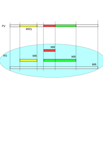

.. Kenneth Lee 版权所有 2020-2021

:Authors: Kenneth Lee
:Version: 0.3

qemu概念空间分析
****************

:index:`qemu`

介绍
=====

最近修改qemu的东西越来越多，很多原来可以忽略的概念都不得不去面对了，基于这个初
始文档把内容扩展为一个完整的概念空间分析：

        :doc:`../软件构架设计/在qemu中模拟设备`

这个文档当前的版本还在不断更新中，后面根据需要会慢慢补充更多的内容。等我觉得补充
的内容足够多了，我会把版本升级到1.0以上。

基础名称空间
============
我们先定义一些基本的名称以便后面容易说清楚各种概念：

Host
        Host表示模拟虚拟机的那个平台。这个概念比较模糊，可以表示Qemu这个程序，
        也可以表示运行Qemu的那个操作系统，反正不是被虚拟的那个平台。

VM/Guest
        这表示被模拟的那个平台。如果我们在X86上模拟一个RISCV的机器，X86就是Host
        ，而RISCV是VM或者Guest。如果我们说Host的CPU，那么这个CPU是X86的，而如果
        我们说Guest的CPU，那么这个CPU是RISCV的。

Backend
        这是Host中模拟Guest中某种行为的那些代码。比如我们用Qemu模拟了一张e1000
        网卡，在Guest中我们要“看到”这张网卡，我们需要在Guest的OS中装e1000的
        驱动，这个驱动是Guest中的。但为了模拟e1000的行为，我们也需要在qemu装
        一个驱动，这个驱动我们称为这个e1000的backend，它是Qemu概念上的。

Qemu使用glib作为基础设施，所以，读者如果需要和代码细节进行对应，最好对GLib的数
据结构有基本的了解，Glib提供基本的内存，线程，链表，事件调度等基础设施的封装，
本文本身不会深入到这些概念上。

执行模型
========

整个qemu软件的执行模型用Pyhton作为伪码可以表达如下：

.. code-block:: python
  
   def run_a_guest():
     vm = create_vm()
     vm.create_cpu_object()
     vm.create_device_object()
     for cpu in cpus:
       create_thread(cpu_thread, cpu)

   def cpu_thread(cpu):
     while true:
       try:
         cpu.run(vm)
       except EIO eio:
         find_device(eio.io_address).handle_io();

Qemu是Host上的一个进程，它模拟了一个VM，这是我们理解Qemu的基础。

一个VM是一组被模拟对象（Object）的组合体，Qemu的模拟过程就是模拟这些对象在时间
的发展过程中的状态变化，以及它们之间的互相影响，从而模拟整个VM的行为。

Qemu的对象主要有两种：cpu和device。qemu为每个Guest的CPU对象创建一个线程，这些线
程就可以利用Host CPU的算力，模拟VM CPU在遇到每条指令时的行为，更新VM CPU对象的
状态，如果遇到VM CPU做了IO一类的影响其他对象的行为，这个线程就暂时离开VM CPU的
模拟，跳出来，寻找对应的设备（或者其他CPU），去处理这个变化了。

Device当然也可以创建自己的线程，但更多时候，是它被动地被CPU的行为所控制。

.. note::

   这里特别提醒一句：概念空间分析要重视名称空间的“空间”概念，这里说“qemu为每个
   cpu创建一个线程”，其中的CPU是被模拟的系统空间中的“CPU”，而不是Host中的“CPU”
   ，而线程，是Host中的线程，而不是被模拟系统中的线程。进行概念空间分析的时候，
   我们常常不得不跨越这些独立空间之间的交叉空间，请读者特别注意分清楚这些概念属
   于哪个概念空间。

上面代码中的cpu.run(vm)，有不同的cpu backend。比如，对于KVM backend，这本质是一
个系统调用，用户进程进入Hypervisor，由Hypervisor决定如何实际执行相关代码，而用
户进程自身则等待在系统调用上。而对于TCG backend，TCG程序会直接使用当前线程去翻
译当前指令为一段本地执行代码，然后跳进翻译缓冲去执行，这个执行本身就是用户线程
的一部分。

无论是哪种过程，我们在总体上都可以看作是一种黑盒，如果它用自己的逻辑可以一直执
行下去，就在黑盒中一直占据Host上的这个线程，直到它碰到一个无法处理的事件，它就
可以从cpu.run(vm)退出，Qemu本身的代码可以根据退出的原因，调用其他的对象去响应这
个原因。比如cpu.run(vm)中有人访问了io，Qemu退出来后就可以根据这个io的地址看是哪
个device backend提供的，让对应的backend完成自己的响应动作。

User模式
--------

Qemu有两种运行模式：softmmu和user，前者模拟整个系统，后者模拟单个进程。前面我们
描述的主要是softmmu模式。User模拟的行为基本上是类似的，只是它不模拟VM，而是用一
个vCPU模拟一个线程，在每个vCPU线程中的循环变成这样：

.. code-block:: python
  
   def run_user():
     load_elf()
     while true:
       try:
         cpu.run(vm)
       except SysCall:
         do_local_syscall()

如果程序中发起创建新线程的系统调用，Qemu会创建新的线程去做一个新的循环。这种模
拟模拟器里面再也不用做设备处理了，因为那些都是内核的事情，内核也不用通知Guest，
所以只要模拟系统调用的行为就可以了，很多时候这种模拟的速度会快很多，如果要在一
个平台上支持多种平台的进程，这是一种相当好的方式。

QOM
====

Qemu的代码主要是基于C的，不支持面向对象特性，但偏偏设备极为适合使用面向对象管理
。所以Qemu写了一套用C模拟的面向对象接口，QOM，Qemu Object Model。Qemu几乎所有被
模拟的对象，都通过这种对象管理。

QOM是一个粗封装的面向对象模型，它包含这样一些子概念：

Type
        类型。每种类型用TypeInfo描述。请注意了：类型是类的描述，在实现的时候，
        它本质是一个用名称（字符串）索引的一个全局列表的成员，包含父类的索引（
        也是通过字符串索引），class_size，instance_size，以及各种回调等信息。它
        不代表那个类，它是说明类的相关信息的对象，通过type_register_xxx()系列函
        数全局注册。

Class
        类。这个才是类本身，这个概念类似Java中的class和object的关系：class的静
        态数据全局唯一，被所有同一类型共享，而object是实例，每个class可以创建
        很多实例（比如在Java中通过New创建的对象）。类自己的数据（类似Java中类的
        静态数据），保存在class_size的空间中，这个size必须包含父类的空间。在操
        作上，通常是在定义TypeInfo.class_size的时候，让它等于你的私有数据结构，
        并保证这个数据结构的第一个成员等于父类的私有数据结构。这样的结果就是父
        类拿到这个指针也可以直接索引到自己的数据结构。

        类有abstract这个概念，和其他语言的abstract的概念相识，表示这个对象不能
        被实例化。

        Class的继承树的根是ClassObject。
        
Object/Instance
        实例。通过object_new()等方法创建，当我们执行qemu -device xxxx的时候，本
        质就是在创建实例。它的数据保存在instance_size的空间中，原理和Class一样，
        需要为父类留空间。

        Object可以通过类型转换（使用类似OBJECT_CHECK这样的函数）转换为父类来使
        用，这种转换的本质是把父类的Class指针找出来，放在Object的Cache中，然后
        用这些指针来操作这个类的数据结构（如前所述，子类的数据结构本来就包含了
        父类的数据结构）。

        Instance的继承树的根是Object。

Interface
        一种特殊的类。不用于继承，用于实现。类不能有多个父类，但可以有多个
        Interface。它的基本原理和父类本质上是一样的，只是只有函数指针而没有数
        据结构而已。

State
        一个纯概念的东西，表示类或者类实例的数据。呈现为TypeInfo的class_size和
        instance_size，子类的State必须包含父类的数据本身。

props
        DeviceClass的一组属性，每个成员叫Property，包含一对set/get函数，从而可
        以呈现为命令行的-device driver-name的参数。

        （qemu -device driver-name,help 可以直接查询device的属性）

        一个非常重要的Property是realized，表示这个类创建以后真正被初始化。作为
        属性，它的类型是Bool，可以通过object_property_set_bool()设置。对大部分
        设备，我们都通过设置它的realize和unrealize函数来支持这个属性，从而让设
        备被创建以后，可以统一进行初始化。这个初始化和instance_init的区别在于
        ：前者初始化的时候，其他对象的数据结构可能还没有初始化，所以只适合用于
        和别人没有关系的初始化，后者是在所有静态对象初始化后才被调用的。

在内存上的理解用下面这张图表达：

.. figure:: _static/qom_mem_model.svg

QoM可以动态构架，只要内存中有对应的函数，class和instance的空间，相关的设施就可
以成立。

下面是一些常用的全局的类：

.. list-table::
   :header-rows: 1

   * - 类
     - 名称
     - Class
     - State
     - 备注
   * - 机器
     - "machine"
     - MachineClass
     - MachineState
     - 
   * - 总线
     - "bus"
     - BusClass
     - BusState
     - 包含一组qbus_控制函数
   * - 设备
     - "device"
     - DeviceClass
     - DeviceState
     - 可以通过qdev_new创建，还包括一组qdev_控制函数

实例化这些类，就可以构成一个完整的VM。

我们看一个简单的例子对类建立感性认识：

.. code-block:: C

   typedef DeviceClass MyDeviceClass;
   typedef struct MyDeviceState { //这个定义类的实例的数据
          DeviceState parent; //包含父类的State数据，而且必须保证在第一个位置上
          int my_own_data;
          ...
   } MyDevice;

   static void mydevice_class_init(ObjectClass *oc, void *data) {
        DeviceClass *dc = DEVICE_CLASS(oc);

        dc->realize = mydevice_realize;
        dc->unrealize = mydevice_unrealize;
   }

   static const TypeInfo my_device_info = {
          .name = "mydevice",
          .parent = TYPE_DEVICE, // "device"
          .instance_size = SIZEOF(MyDevice);  //State数据的大小
          .instance_init = mydevice_init,
          .class_init    = mydevice_class_init,
          .interfaces = (InterfaceInfo[]) {  //一组接口
              { TYPE_HOTPLUG_HANDLER },
              { TYPE_ACPI_DEVICE_IF },
              { }
            }
   };

   static void my_device_register_types(void) {
          type_register_static(&my_device_info);
   }
   type_init(my_device_register_types)
   //这一段可以通过提供一个TypeInfo的数组这样定义:
   //DEFINE_TYPES((devinfo_array)

在这个例子中，我们首先用type_register_static注册了一个叫“mydevice”的TypeInfo，
父类是“device”，没有定义class_size（表示这个类没有自己的静态数据），instance的
私有数据由MyDviceState定义，这个数据结构的第一个成员是DeviceState，保存了自己的
父类的instance的State。

.. note::

   type_register_static()用的是类似Linux Kernel中module_init()的技术，把一组函
   数指针放到同一个数组中，让整个程序可以初始化的时候自动调用而已。

然后我们提供了两个初始化函数mydevice_init和mydevice_class_init，分别对实例和类
对象进行初始化。

在这个class的init里面我们用OBJECT_CLASS_CHECK把父类转换为子类，然后设置了
Device这个子类的realize和unrealize函数。这样，整个类的初始化逻辑框架就撑起来了。

在实际实现中，整个QOM主要就管理两种对象：Device和Bus。两者通过props进行互相关联
。这种关联有两种类型：composition和link，分别用object_property_add_child/link()
建立。比如你在创建machine的时候，可以在machine中创建一个bus，然后把它作为
machine的child连到machine上，之后你还可以创建bus上的设备，作为bus的child，连到
bus上，你还可以创建一个iommu，作为一个link连到这个bus的每个设备上。这种关联接口
，可以在qemu console中用Info qom-tree命令查看（但只有child没有link）。

child和link关联
----------------
除了一般用于设置对象参数的Property，qemu内部会经常使用child和link的概念。child
和link是通过对象props建立的关联。本质上就是给一个对象增加一个prop，名字叫
child<...>或者link<...>，和手工创建一个这样的属性也没有什么区别。

child的主要作用是可以枚举，比如：

.. code-block:: C

   object_child_foreach();
   object_child_foreach_recursive();

利用这个机制，比如你模拟一个SAS卡，上面有多个端口，端口就可以创建为SAS的一个
child，而端口复位的时候就可以用这种方法找到所有的子端口进行通知。

实际上，整个机器的对象machine就是根对象的一个child。下面是qemu控制台下运行
qom-list的一个实例：::

        (qemu) qom-list /
        type (string)
        objects (child<container>)
        machine (child<virt-5.2-machine>)
        chardevs (child<container>)

        (qemu) qom-list /machine
        type (string)
        ...
        virt.flash1 (child<cfi.pflash01>)
        unattached (child<container>)   <--- 没有指定parent的对象都挂在这下面
        peripheral-anon (child<container>)
        peripheral (child<container>)
        virt.flash0 (child<cfi.pflash01>)
        ...

我们简单解释一下这个list的含义：

1. /是整个被实例化的而对象的根，下面是它的所有属性。

2. 属性的表述成“name (type)”这种模式，name是属性的名字，type是它的类型。

3. 如果属性是child<type>，后面的type是它被链接的子对象的类型

和Child不同，link通常用来做简单的索引，你可以这样找到这个关联的对象：

.. code-block:: C

   object_link_get_targetp();

link用info qom-tree看不到，只能用qom-list一个节点一个节点看。它通常用于建立非包
含关系的对象间索引。比如你的网卡和IOMMU都挂在总线上，但网络需要请求IOMMU去翻译
它的地址，这之间就可以是一个link。

Link可以直接在先通过device_class_set_props()创建，具体的instance通过
object_property_set_link()去设置。这两个步骤相当于在一个接口中定义一个指针和给
这个指针赋值的两个动作。前者一般实现在索引多方的那个对象的初始化，后者一般实现
在建立系统关联关系的代码中，比如创建machine的时候，把IOMMU和网卡关联起来的时候
。Link是有类型的，不能把不同类型的对象挂到Link上。

这不算什么特别的功能，只是简单的数据结构控制而已。用户自己用其他方法建立索引
去找到其他设备，也无不可。但qemu的惯例是用child和link。

MemoryRegion
=============

本小节看看qemu的内存管理逻辑。对于VM来说，它有它视角中的内存，当这个内存被VM中
的CPU或者设备访问，我们还需要Host中有backend去支撑这个访问，所以，qemu有Host视
角中的内存。Qemu使用MemoryRegion描述这个视角的内存。它包含如下一些子概念：

MemoryRegion
        这表示一个面向VM的内存区，以下简称MR。请注意了，MR是一片内存区的描述，
        而不是那片内存本身。MR的要素是base_address, size这些信息，而不是void
        \*ptr这样的内存本身。整个系统的所有内存就是一个MR，整个系统的所有IO空间
        （不是说mmio，是说x86的LPC的IO）也是一个MR。MR内部包含多个不同设备的
        mmio也是一个MR。

        但部分基础的内存层是真的分配和Host一侧用于支持前端的backend内存的，这个
        这个真正的内存指针在MR->ram_block中。

RAMBlock
        这是MR的ram_block的类型，表示一段真实的Host一侧的内存，它可以是创建的
        时候就分配的，也可能是用Lazy算法动态一点点增加的。

MemoryRegionSection
        MR中的一个分段，简称MRS。当多个MR叠在一起的时候，MR会被隔离成一段一段，
        每段就是一个MRS。MRS的行为决定于它所在的MR。

Container
        包含其他MR的MR叫Container。没有RAM或者IO属性的Container叫纯Container，
        不影响理解的时候也可以简单叫Container。纯Container是透明的，要判断一段
        MRS的行为，如果它属于纯Container，就要看它上一层MR的定义了。

AddressSpace
        这表示一个地址空间，以下简称AS。一个地址空间可以包含多个不同属性的MR，
        MR可以包含其他MR，这些MR互相覆盖，最终层叠在一起，所以AS是MR的层叠表述。

FlatView
        这表示看到的地址空间，本文简称FV。这个概念比较绕。我们这样说：AS是立体
        的，里面的MR是相互独立的，他们可以交叠，转义，动态开关等。但当你去访问
        的时候，某个时刻，某个物理地址总是对应着某个MR中（某段MRS）的地址，
        FlatView用来表示层叠的结果。另外它也提供多个访问源互斥的锁。

MemoryRegionCache
        IO MR中访问过的数据可以放在Cache中，这个Cache简称MRC，现在主要就是给
        virtio用。

综合来说，我们用MR定义一个有特定属性的内存区（比如RAM或者IO），然后把它们叠起来
构成一个AS，backend用这个AS去访问内存，首先压平为一个FV，然后匹配到一个MRS，最终
用这个MRS所在MR决定如何访问。

全系统的根container是对所有backend可见的，它包括system_memory和system_io两个，
分别代表内存空间和IO空间（像ARM或者RISCV这些没有IO总线的系统，后者完全没有意义
）。两者合起来就是Guest的虚拟空间。其他MR，都是这两者的子MR。

system_memory和system_io可以通过get_system_memory()和get_system_io()获得。对应
的AS可以直接用全局变量address_space_meory和address_space_io访问。所以，其实对所
有backend驱动来说，系统内存是直接敞开的。

整个概念可以用下图展示：



我们通过例子看看MR的创建方法。

RISCV的系统RAM是这样创建的：

.. code-block: C

   memory_region_init_ram(main_mem, NULL, "riscv_virt_board.ram",
                           machine->ram_size, &error_fatal);
   memory_region_add_subregion(system_memory, memmap[VIRT_DRAM].base,
        main_mem);
   
原理是：你创建一个RAM的MR，然后根据位置，加到全系统的MR（system_memory）中。
MMIO空间的MR一般由设备创建，通常长这样：

.. code-block: C

   memory_region_init_io(&ar->pm1.evt.io, memory_region_owner(parent),
                         &acpi_pm_evt_ops, ar, "acpi-evt", 4);
   memory_region_add_subregion(parent, 0, &ar->pm1.evt.io);

同样是创建MR，然后作为一个子region加到上一级的MR中。这样最后在系统的AS中，看到
的就是一个叠起来的AS了。

Guest访问的时候有两种可能，一种是Guest的CPU直接做地址访问，这会变成TLB的访问过
程在这个过程中，CPU模拟程序把系统的AS压平为FV，然后找到对应的MR，最后根据MR的属
性去回调IO或者直接访问RAM（RAM MR中有ram_block的地址）。

另一种是backend的设备直接调函数去访问地址了，这样的调用：

.. code-block: C

   dma_memory_rw(&address_space_memory, pa, buf, size, direction);
   pci_dma_rw(pdev, addr, buffer, len, direction);

pci的调用本质还是对dma_memory_rw的封装，只是有可能用比如iommu这样的手段做一个地
址转换而已。

这个实现和前面CPU的访问没有什么区别，仍从AS开始，从AS得到FV，然后定位MRS，最终
找到MR。之后作为RAM处理还是IO处理，就由MR的属性决定了。这个代码是这样的：

.. code-block: C

   static MemTxResult flatview_write(FlatView *fv, hwaddr addr, MemTxAttrs attrs,
                                  const void *buf, hwaddr len)
   {
       ...
       mr = flatview_translate(fv, addr, &addr1, &l, true, attrs);
       result = flatview_write_continue(fv, addr, attrs, buf, len,
                                     addr1, l, mr);
       ...
   }

还有一种Device Backend的DMA访问路径是这样的：

.. code-block: C

        dma_memory_map(address_space, pa, len, direction);
        dma_memory_unmap(address_space, buffer, len, direction, access_len);

这有两种实现策略：如果这片MR背后有直接分配的内存，那最好办，直接把本地内存的指
针拿过来就可以了，unmap的时候保证发起相关的通知即可。如果没有，那可以使用Bounce
DMA Buffer机制。也就是说，直接另外分配一片内存，到时映射过来就是了。

MR有很多类型，比如RAM，ROM，IO等，本质都是io，ram和container的变体：

.. code-block: C

   memory_region_init(mr, owner, name, size);
   memory_region_init_alias(mr, owner, name, orig, offset, size);
   memory_region_init_io(mr, owner, ops, opaque, name, size);
   memory_region_init_iommu(_iommu_mr, instance_size, mrtypename, owner, name, size);
   memory_region_init_ram_nomigrate(mr, owner, name, size, errp);
   memory_region_init_ram_shared_nomigrate(mr, owner, name, size, share, errp);
   memory_region_init_ram_shared_nomigrate(mr, owner, name, size, share, errp);
   memory_region_init_ram(mr, owner, name, size, errp);
   memory_region_init_ram_ptr(mr, owner, name, size, ptr);
   memory_region_init_ram_device_ptr(mr, owner, name, size, ptr);
   memory_region_init_ram_from_fd(mr, owner, name, size, share, fd, errp);
   memory_region_init_ram_from_file(mr, owner, name, size, align, ram_flags, path, errp);
   memory_region_init_rom(mr, owner, name, size, errp);
   memory_region_init_rom_device(mr, owner, ops, opaque, name, size, errp);
   memory_region_init_rom_device(mr, owner, ops, opaque, name, size, errp);
   memory_region_init_rom_device_nomigrate(mr, owner, ops, opaque, name, size, errp);
   memory_region_init_rom_device_nomigrate(mr, owner, ops, opaque, name, size, errp);

其中，iommu是最特别的一种MR，它一般用于实现IOMMU，放在设备视角的MR和AS中（而不
放在系统MR和AS中）。

IOMMU MR
---------

IOMMU MR不放入系统MR和AS空间中，因为系统MR和AS相当于物理地址空间，但加了IOMMU，
设备访问的就不是物理地址了，它必须是针对每个设备的虚拟地址。

下面是这种MR的一个应用实例（这个例子是ARM SMMU的，但由于ARM的SMMU在qemu中是专门
为PCI子系统定制的，我们在例子中把两个模块中的流程进行了组合和化简，突出关键逻辑）：

.. code-block: C

   // 为设备创建设备自己的AS，包含一个代表物理空间的container
   memory_region_init(&dev->bus_master_container_region, OBJECT(dev),
                       "bus master container", UINT64_MAX);
   address_space_init(&dev->bus_master_as,
                       &dev->bus_master_container_region, dev->name);

   // 创建一个设备的iommu，TYPE_SMMUV3_IOMMU_MEMORY_REGION是iommu的类型名称
   memory_region_init_iommu(&dev->iommu_mr, sizeof(dev->iommu_mr),
                            TYPE_SMMUV3_IOMMU_MEMORY_REGION,
                            OBJECT(s), name, 1ULL << SMMU_MAX_VA_BITS);

   // 创建iommu MR的别名，以便可以动态开启和关闭
   memory_region_init_alias(&dev->bus_master_enable_region,
                            OBJECT(dev), "bus master",
                            dev->iommu_mr, 0, memory_region_size(dev->iommu_mr));

   // 初始化的时候先关掉iommu，等设备启动的时候再让它生效
   // 对于PCI设备来说，通常是设备被下了PCI_COMMAND_BUS_MASTER命令的时候，才会开启
   memory_region_set_enabled(&dev->bus_master_enable_region, false);

   // 加到设备的container MR中
   memory_region_add_subregion(&dev->bus_master_container_region, 0,
                               &dev->bus_master_enable_region);

这样创建出来的dev->bus_master_as就是可以用于dma_memory_rw()访问的AS了。有人可能
奇怪，为什么这个AS中没有包含system MR。答案在translate的实现中可以找到：

.. code-block:: C

   static IOMMUTLBEntry smmuv3_translate(IOMMUMemoryRegion *mr, hwaddr addr,
                                         IOMMUAccessFlags flag, int iommu_idx)
   {
       ..
       IOMMUTLBEntry entry = {
           .target_as = &address_space_memory,
           .iova = addr,
           .translated_addr = addr,
           .addr_mask = ~(hwaddr)0,     //地址空间长度掩码，如果要求的读写范围超过这个限度，会分多次翻译
           .perm = IOMMU_NONE,
       };
       ...
       return entry;
   }

   static void smmuv3_iommu_memory_region_class_init(ObjectClass *klass, void *data)
   {
       ...
       imrc->translate = smmuv3_translate;
       imrc->notify_flag_changed = smmuv3_notify_flag_changed;
   }

   static const TypeInfo smmuv3_iommu_memory_region_info = {
      .parent = TYPE_IOMMU_MEMORY_REGION,
      .name = TYPE_SMMUV3_IOMMU_MEMORY_REGION,
      .class_init = smmuv3_iommu_memory_region_class_init,
   };

所以答案是，iommu自己提供目标AS是什么（这个例子中就是address_space_memory）。

在qemu的当前实现中，大部分iommu都作为PCI的总线属性的一部分来设计，当你创建一个
iommu设备的时候，通过primary_master属性（一个link）指定所述的PCI总线，从而调用
pci_setup_iommu()设置回调，之后每个EP注册到这个总线上，就会创建一个针对这个设备
的IOMMU设备（以及相应的IOMMU MR）。

但这个设计其实是有毛病的。主要有两个问题：

1. 这个是人为限定了虚拟设备的硬件结构：真实的硬件可不是每个设备都有一个IOMMU设
   备的，按现在的实际，保证功能是没有问题的，但要模拟一个真实硬件的行为，这是不
   够的。

2. translate函数只有VA和属性作为输入。但现代IOMMU设备支持多页表（ASID Index），
   这个接口需要通过iommu_idx参数索引MemTxAttrs，现在的版本MemTxAttrs不支持pasid
   ，需要增加上去才能支持。这个地方其实设计得不是很好看，因为iommu_idx这个名字
   就预期这只是一个index，而不是一个值，但要把pasid编码进来，未来如果有更多参数
   ，这就不好发展了。

中断
=====
在qemu中，中断本质是cpu_exec()过程中的一个定期判断（如果是KVM一类的真正执行就靠
KVM本身的硬件机制了，那个原理可以自然想像）。

qemu通过cpu_reset_interrupt/cpu_interrupt()把一个标记种入到CPU中，CPU执行中就
可以检查这个标记，发现有中断的要求，就调用一个回调让中断控制器backend修改CPU状
态，之后CPU就在新的状态上执行了。

所以，最原始的方法是你强行调用cpu_reset_interrupt()和cpu_interrupt()。当然，很
少硬件会这么简单，大部分CPU需要通过中断控制器来控制。中断控制器是个设备（比如
qdev），具体怎么做完全是实现者的自由度。

可能是历史原因，qemu各种实现都把中断看作是CPU的gpio行为，变成一套完整的接口。
比如RISCV就是这样的：

.. code-block:: C

   static void sifive_plic_irq_request(void *opaque, int irq, int level) {
        plic_dev = opaque;
        ...
        cpu_interrupt(); //给对应的CPU发中断，是哪个CPU看plic算法了
        ...
   }
   qdev_init_gpio_in(plic_dev, sifive_plic_irq_request, plic->num_sources);

这样组织一下，给中断控制器加下级中断的方法就变成一套统一的函数：

.. code-block:: C

   qdev_init_gpio_in_xxx(plic, callback, num_irqs);
   qemu_irq qdev_get_gpio_in(plic, n);
   qdev_connect_gpio_in_xxx(cpu, n, qemu_irq);
   sysbus_connect_irq(dev, n, qemu_irq);

这里的in可以换成out，是gpio的片信号标记，对于模拟来说我觉得关系不大，都用同一
种就好了。qemu_irq是表示中断的控制结构，包含中断控制器的信息，n是中断控制器内
的下标。sysbus_开头的接口是对qdev接口的封装，把处理中断的设备作为参数传递进去
而已（会据此建立设备间的一些关联）。综合起来，这个概念是：

1. 用init实现中断控制器

2. 中断控制器用qev系列函数建立qemu_irq的管理，把plic本地中断号和qemu_irq对应起
   来

3. connect系列函数把qemu_irq和设备关联起来，和CPU或者全局中断号关联起来（具体
   和谁关联看中断控制器的设计）。

有了这个设施以后，其他后端发中断就不用去找对应的CPU和设备了，只要给定qemu_irq就
可以了。这个核心函数是qemu_set_irq()，在实际使用的时候封装成这样一些更贴近使用
名称空间的接口：

.. code-block:: C

        void qemu_irq_raise(qemu_irq irq);
        void qemu_irq_lower(qemu_irq irq);
        void qemu_irq_pulse(qemu_irq irq);
        void pci_irq_assert(PCIDevice *pci_dev);
        void pci_irq_deassert(PCIDevice *pci_dev);
        void pci_irq_pulse(PCIDevice *pci_dev);

如果用的是PCI MSI/MSI-X，则中断触发通过msi_notify()来做。按MSI/MSI-X的原理，这
个行为实际上就是根据MSX PCI配置，在对应的内存地址中写入要求的参数，这个内存地
址写入的过程通过MR的翻译，最终会匹配到中断控制器的io写上，最后还是那组
qemu_set_irq()调用。

PCI/PCI-E
==========
PCI/PCI-E本质上就是一个代理了很多设备的设备。所以它才有那些BDF的复杂概念，好像
很灵活，但如果我们从地址分配这个角度看，每个PCI/PCIE根桥就是一个平台设备，这个
平台设备有自己的MMIO空间，它的所有动态协议，不过是对这个空间的重新分配（基于设
备对应的Bus-Device-Function）。

所以PCI/PCIE根桥的创建本质上分配一个MMIO空间，并用PCI/PCIE作为这个MR的管理设备
而已。一般套路是：

1. 创建一个PCI/PCIE设备作为Root Bridge，比如TYPE_GPEX_HOST（General PCI EXpress）。

2. 创建ECAM空间（配置空间）
   * mb = sysbus_mmio_get_region()
   * mem_region_init_alias(alias...)
   * memory_region_add_subregion(system_memory, addr, alias)

3. 创建BAR空间
   * 同2

剩下的事情就是TYPE_GPEX_HOST驱动的问题了。

.. note::

   我们这里快速补充一下PCI/PCIE上的基本概念：

   在谈PCI/PCIE的时候，Host表示CPU子系统，Host Bridge表示把CPU和PCI/PCIE总线连
   起来的那个IP。这个IP包括三个功能：Bus Master，Bus Target，以及Configure
   Access Generation。

TYPE_GPEX_HOST的继承树结构：::

  DEVICE <- SYS_BUS_DEVICE <- PCI_HOST_BRIDAGE <- PCIE_HOST_BRIDGE <- GPEX_HOST 

中断的行为类似，先为整个RP分配中断，然后用gpex_set_irq_num()建立PCIE局部irq和全
局irq的关系即可。

PCI/PCI-E驱动
--------------

前面是全系统的PCI桥的概念，我们用一个PCI设备的backend来看具体的backend的写法：

.. code-block:: C

   static void my_class_init(ObjectClass *oc, void *data) {
     PCIDeviceClass *k = PCI_DEVICE_CLASS(oc);
     k->realize = my_realize;
     k->vendor_id = MY_VENDOR_ID;
     k->device_id = MY_DEVICE_ID;
     k->revision = MY_REVISION;
     k->class_id = PCI_CLASS_XXXX;
   }

   static const TypeInfo my_pci_device_info = {
     .name          = "my-pci-device"
     .parent        = TYPE_PCI_DEVICE,
     .class_init    = my_class_init,
     .interfaces    = {
       { INTERFACE_CONVENTIONAL_PCI_DEVICE },
       { },
     };
   };

这个和其他类没有什么区别，只是父类设置成了TYPE_PCI_DEVICE，在类初始化的时候把
父类的基本属性都设置类（vendor id等），realize中可以调用pci模块提供的比如::

    pci_config_set_interrupt_pin()/msi_init(),
    pci_register_bar()

这些函数，创建相应的pci资源，剩下的工作，留给父类去做就可以了。


virtio
=======

virtio是OASIS的标准，我没有调查它的背景，应该是Redhat和IBM等发起的组织吧，它的
目标是定义一个标准的虚拟设备和Guest的接口。也就是说在设备上实现“半虚拟化”，让
guest感知host的存在，让guest上的模拟变成一种guest和host通讯的行为。

virtio标准
------------

在本文写作的时候，最新的virtio标准的版本是1.1，我们这里先看看这个版本的语义空间。

virtio现在支持三种传输层，virtio的语义可以建立在任一种传输层上，只要传输层能满
足这些语义的表达就可以了：

PCI
        这是较通用的方式，设备可以通过PCI协议自动发现，Host-Guest之间也可以直接
        模拟成PCI/PCI接口进行相互访问。

MMIO
        这用于平台设备，需要通过devtree一类的方式进行设备枚举。Host-Guest间通过
        一般的MMIO方式进行通讯。

Channel I/O
        这是IBM S/390的通用IO接口，我们有两种方式做分析就够了，这种忽略。

所谓传输层，本质是用什么语义来提供guest一侧的接口。我们前面已经看到了，host有
办法访问guest的所有内存，但Guest还得做出一副“我是个正经的系统”的样子，表明什么
数据是打算让Host去访问的，把这个仪式封装成一个协议，就是virtio的传输层。比如说
，PCI传输层，就是guest认为自己是在访问一个PCI设备，它访问bar空间的时候，就会转
换为host一侧的IO MR的读写，它对内存做DMA，要求Host访问，Host就要打开对应的AS，
从AS上访问这片内存。它不做这个DMA，Host其实也能访问这些内存，只是不知道应该访
问哪里而已。所以传输层，更多是Guest的接口概念。Host只是在配合。

我们这里的建模主要关注传输层以上的语义，传输层怎么实现，总是可以做到的，我们看
做是细节。

下面是一组virtio标准中定义的关键概念：

控制域
`````````

控制域相当于设备的MMIO空间，提供直接的IO控制。下面是一些典型的控制域：

Device Status
        设备状态。这个概念同时被Host和Guest维护，而被虚拟机管理员认知。它包含
        多个状态位，比如ACKNOWLEDGE表示这个设备被Guest驱动认知了，而
        DEVICE_NEED_RESET表示Host出了严重问题，没法工作下去了。

Feature Bits
        扩展特性位。这个域也是Host和Guest共同维护的。Host认，Guest不认，对应位
        也不会设置，反之亦然。

在MMIO传输层中，部分控制域甚至是复用的，比如配置第一个queue的时候，给queue id
这个控制域写0，后面写其他控制域进行配置就是针对vq 0的；给queue id控制域写1，后
面的配置就是针对vq 1的。

强调这一点，是要说明，标准的制定者并不指望用共享内存来实现控制域。

通知
`````
通知用于主动激活另一端的行为。virtio支持三种通知：

配置更改
        Host到Guest，在配置空间发生更改的时候发出

Available Buffer更改
        Guest到Host，表示数据被写入virtio队列

Used Buffer更改
        Host到Guest，表述virtio处理了数据，返回数据到Guest。

这些通知在不同的传输层协议会有不同的方式，比如Host到Guest常常会用Guest一侧的中
断，但这个不是根本性的要求。

virtqueue
``````````
virtqueue是Host和Guest的通道，目标是要建立一个两者间的基于共享内存的通讯通道，
后面把它简称为vq。和其他共享内存的通讯方式一样，vq通过环状队列协议来实现。队列
的深度称为Queue Size，每个vq包括收发两个环，称为vring，其中Guest发方的叫
Available ring，另一个方向称为Used ring，深度都是Queue Size。

vq的报文描述符称为Descriptor，在本文中我们简称bd（Buffer Descriptor）或者desc，
它不包含实际的数据，实际的数据称为Buffer，由bd中的指针表达，指针是Guest一侧的物
理地址。virtio允许bd分级，bd的指针可以指向另一个bd的数据，这可以扩展bd数量的不
足。Buffer可以带多个Element，每个Element有自己的读写属性，新的Element需要使用另
一个bd，通过前一个bd的next指向新的bd，把多个Element连成同一个Buffer。

整个通讯的内存控制方都在Guest，是Guest分配了vq和Buffer的内存，然后传输到Host端
，而Host端根据协议，对内存进行读写，响应Guest的请求。这一点和普通的真实设备是一
样的。这也是为什么很多人希望把硬件接口直接统一成virtio接口。这样可以少写一个驱
动，而虚拟设备管理说不定可以直接交给下一层的Hypervisor。

前面描述的概念是virtio 1.0和之前支持的格式，称为split vq。1.1以后增加了一种
packed vq，其原理是把Available和Used队列合并，Buffer下去一个处理一个，不需要不
同步的Used队列来响应。除了这一点，概念空间完全是自恰的。

Host侧的实现
----------------

理解了标准接口定义上的基本理念，现在看看Host一侧实现的概念空间。

Host一层virtio设备的继承树一般是这样：::

        TYPE_BUS -> TYPE_VIRTIO_BUS -> TYPE_VIRTIO_PCI_BUS
        TYPE_DEVICE -> TYPE_VIRTIO_DEVICE -> TYPE_VIRTIO_XXXXX
        TYPE_PCI_DEVICE -> TYPE_VIRTIO_PCI -> TYPE_VIRTIO_PCI_XXXX_BASE -> TYPE_VIRTIO_PCI_XXXX
                                                                        -> TRANSITIONAL_DEV
                                                                        -> NON_TRANSITIONAL_DEV

总线类用于设备的总线注册，属于辅助性质的，重点的是设备本身。在设备中，PCI这里比
较特别，分了两层，下面有多种设备的类型的变体，这涉及VIRTIO不同版本的兼容性问题
，这里不深入讨论，我们下面的讨论聚焦在TYPE_VIRTIO_DEVICE的通用概念上，PCI设备可以
类比。但我们还是给出这个概念的定义：

TRANSITIONAL_DEV
        这个概念现在仅针对PCI virtio设备，表示这个设备是否支持新旧接口的过渡。
        NON_TRANSITIONAL_DEV就支持一种接口，TRANSITIONAL_DEV支持多个版本接口的
        协商。

TYPE_VIRTIO_XXXXX
``````````````````
TYPE_VIRTIO_XXXX实现一个具体的设备，这层实现主要通过virtio接口建立通讯通道，原
理大致是：

.. code:: c

   virtio_init(vdev, ...); //设备初始化
   vq[i] = virtio_add_queue(vdev, callback);... //创建q，可多个
   ...
   virtio_delete_queue(vq[i]);
   virtio_cleanup(vdev);

这里的初始化主要是在vdev中创建基本的数据结构，然后挂入vm的管理系统中（比如挂入
vm状态更新通知列表中等）。由于真正的queue的共享内存是Guest送下来的，所以这里仅
仅是在创建相关的管理数据结构而已。

callback用于响应guest发过来的消息，可以这样收：

.. code:: c

   element = virtqueue_pop(vq[i], sz);
   my_handle_element(element);
   if (need_respose) {
       virtqueue_push(vq[i], element);
       virtio_notify(vdev, vq[i]);
   } else {
       virtqueue_detach_element(vq[i], element, ...);
       g_free(element);
   }

内存由pop函数负责分配，如果不复用这个内存（push回去），由调用方自己负责用glib标
准方法释放。这个内存的大小至少是sz，但根据实际有多少个sg，实际大小是不同的，如果
数据在push进来的时候就是scatter-gather的，host收到也是一样的，数据就在原地（
guest和host共享），如果你不用iov_to_buf()这种方法强行把它们拷贝在一起，你完全
可以直接一段段进行处理。所以virtio的通讯效率还是很高的。

virtio_init()等初始化行为可以在类的realize/unrealize回调中做，这些回调可以在
class_init中初始化，类似这样：

.. code:: c

   static void my_class_init(ObjectClass *oc, void *data) {
     DeviceClass *dc = DEVICE_CLASS(oc);
     VirtioDeviceClass *vdc = VIRTIO_DEVICE_CLASS(oc);

     vdc->realize = my_realize;
     vdc->unrealize = my_unrealize;
     vdc->get_features = my_get_features;
     vdc->get_config = my_get_config;
     vdc->set_status = my_set_status;
     vdc->reset = my_reset;
   }

注意了，这里的realize设置的不是DeviceClass的realize，而是子类VirtioDeviceClass
的realize（其他回调类似）。因为这是VirtioDeviceClass要靠父类DeviceClass的
realize来进行自己的初始化，在用子类提供的realize进行子类的初始化。

get_features()用于guest和host协商协议，当这个函数被调用的时候是guest问host能否
提供对应的feature，host可以修改相关的项，返回回去，告知自己想要支持的属性，双方
可以多次协商取一个双方认可的子集。get_config用于guest向host要配置参数，具体是什
么格式，是这种自己的定义。

.. note::

   feature是跨层使用的，比如如果你在get_feature中给对方返回了
   VIRTIO_F_RING_PACKED特性，应用层不需要做任何事情，协议层会根据这个属性把
   vring的格式修改成pack的。

而set_status()用于host和guest交换Device Status控制域用的，一般一个设备启动会逐
步把下面这些位都置上，设备才是可用的：::

        VIRTIO_CONFIG_S_ACKNOWLEDGE     1
        VIRTIO_CONFIG_S_DRIVER          2
        VIRTIO_CONFIG_S_DRIVER_OK       4
        VIRTIO_CONFIG_S_FEATURES_OK	8

特定的设备可以有更多的Status位。

最后reset()用于设备复位到原始状态。

TYPE_VIRTIO_DEVICE
````````````````````
TYPE_VIRTIO_DEVICE一层提供基本的virtio功能（由TYPE_VIRTIO_XXXX继承），并对外部
提供公共的操作接口，这一层对上一层的接口在分析上一层的使用接口时已经可以看到了。
这里完整整理一下。这一层又分成两层，对上可见的一层包括这样一些接口::

        virtio_instance_init_common(obj); //用于PCI的实现中子类instance_init的初始化

        //设备级处理
        virtio_init(vdev, ...);
        virtio_cleanup(vdev, ...);
        virtio_error(vdev, ...);
        virtio_device_set_child_bus_name(vdev, bus_name);

        //队列管理
        virtio_add_queue(vdev, ...);
        virtio_del_queue(vdev, ...);
        virtio_delete_queue(vq);
        virtqueue_push(vq, elem, ...);
        virtqueue_flush(vq, ...);
        virtqueue_detach_element(vq, elem, ...);
        virtqueue_unpop(vq, elem, ...);
        virtqueue_rewind(vq, ...);
        virtqueue_fill(vq, elem, ...);
        virtqueue_map(vdev, elem);
        virtqueue_pop(vq, ...);
        virtqueue_drop_all(vq);
        qemu_get_virtqueue_element(vdev, file, ...); //用本地文件做backend
        qemu_put_virtqueue_element(vdev, file, ...);
        virtqueue_avail_bytes(vq, ...);
        virtqueue_get_avail_bytes(vq, ...);

        // 通知和状态类
        virtio_notify_irqfd(vdev, vq);
        virtio_notify(vdev, vq);
        virtio_notify_config(vdev);
        virtio_queue_get_notification(vq);
        virtio_queue_set_notification(vq, ...);
        virtio_queue_ready(vq);
        virtio_queue_empty(vq);

        // snapshot管理
        virtio_save(vdev, file);
        virtio_load(vdev, file, ...);

这一层之后下面提供了Host的直接访问接口层：::

        /*
         * 注1：X是字长后缀
         * 注2：modern修饰1.0以后的版本的协议
         */
        virtio_config_<modern>_readX(vdev, addr);
        virtio_config_<modern>_writeX(vdev, addr, data);
        virtio_queue_set_addr/num/max_num...(vdev, ...);
        virtio_queue_get_addr/num/max_num...(vdev, ...);
        int virtio_get_num_queues(vdev);
        virtio_queue_set_rings(vdev, ...);
        virtio_queue_update_rings(vdev, ...);
        virtio_queue_set_align(vdev, ...);
        virtio_queue_notify(vdev, ...);
        virtio_queue_vector(vdev, ...); //MSI-X特性支持
        virtio_queue_set_vector(vdev, ...);
        virtio_queue_set_host_notifier_mr(vdev, mr, ...);
        virtio_set_status(vdev, ...);
        virtio_reset(vdev);
        virtio_update_irq(vdev);
        virtio_set_features(vdev, feature);

PCI传输层
----------
TYPE_VIRTIO_DEVICE只封装了virtio核心接口，但没有包含传输层的封装，我们用一种传
输层(PCI)来感知加上传输层后的概念空间。

前面的继承树可看到，PCI传输层继承TYPE_PCI_DEVICE，和TYPE_VIRTIO_DEVICE不兼容，
而QoM是单继承的，所以PCI的virtio设备被实现成了TYPE_VIRTIO_DEVICE的一个代理，实
现起来是这样的：

.. code:: c

   static VirtioPCIDeviceTypeInfo my_virtio_pci_proxy_info = {
     .base_name     = MY_PROXY_TYPE_NAME "-base",
     .generic_name  = MY_PROXY_TYPE_NAME,
     .transitional_name      = MY_PROXY_TYPE_NAME "-transitional",
     .non_transitional_name  = MY_PROXY_TYPE_NAME "-non-transitional",
     .instance_size = sizeof(struct BBoxProxyState),
     .instance_init = my_proxy_init,
     .class_init    = my_proxy_class_init,
   };

   static void my_register_types(void)
   {
     virtio_pci_types_register(&my_virtio_pci_proxy_info);
   }
   type_init(my_register_types)

virtio_pci_types_register()是register_type_static的封装，同时注册了多个相互继
承的对象，但基本可以认为主要名字是.gnereric_name的类的封装，下面的那些回调函数
这是针对这个类的，我们这里不深入细节。

PCIE的BAR空间，中断等设计都代理给这个类，从而实现整个PCI之上的传输层。而真正的
驱动要做的是把这个PCI设备的行为代理到一个真正的TYPE_VIRTIO_DEVICE设备，像这样
：

.. code-block:: c

   static void my_proxy_realize(VirtIOPCIProxy *vpci_dev, Error **errp) {
     MyProxyState *dev = BBOX_PROXY(vpci_dev);
     DeviceState *vdev = DEVICE(&dev->the_real_virtio_device);

     qdev_realize(vdev, BUS(&vpci_dev->bus), errp);
   }

   static void my_proxy_init(Object *obj)
   {
      MyProxyState *s = MY_PROXY(obj);

      virtio_instance_init_common(obj, &s->impl, sizeof(s->impl), BBOX_TYPE_NAME);
    }

   static void my_proxy_class_init(ObjectClass *klass, void *data)
   {
     DeviceClass *dc = DEVICE_CLASS(klass);
     PCIDeviceClass *pcidev_k = PCI_DEVICE_CLASS(klass);
     VirtioPCIClass *vpci_k = VIRTIO_PCI_CLASS(klass);

     pcidev_k->vendor_id = ...;
     pcidev_k->device_id = ...;
     pcidev_k->revision = ...;
     pcidev_k->class_id = ...;
     vpci_k->realize = my_proxy_realize;
   }

在这个proxy的class_init中，我们原样设置pci的vendor_id等信息，但如果你的Guest中
需要用Linux的virtio-pci驱动，你这里的vendor_id就需要匹配redhat的PCI驱动，
device_id也必须落在这个驱动支持的范围内，否则你只能整个协议自己写了。

但realize要注意了，要用PCIDeviceClass的realize，不能覆盖DeviceClass的realize，
否则proxy自己就没法初始化了。

而在instance_init中，除了做一般你自己希望做的初始化，最终要的是要用
virtio_instance_init_common()创建真正的virtio设备，这样proxy的传输层才这个设备
关联起来，当PCI Proxy被guest访问的时候，才转化为virtio的上层语义。

而在realize的时候，还要一个关键问题需要做：你要主动调用qdev_realize()把那个真
virtio设备的bus实例化了，否则这个真virtio设备会没有总线。

Guest
------
再看看Guest一侧Linux的概念空间。Guest一侧包括两层，传输层和协议层。传输层对应
virtio标准中定义的三种传输层，呈现为PCI，Platform，CCW等设备。比如PCI传输层就呈
现为一个pci的驱动，它用通用的PCI方法发现virtio设备，匹配到Redhat的VendorID，然
后就直接用传输层协议找到设备，用register_virtio_device()创建virtio设备。

另一层是协议层，这一层的驱动匹配register_virtio_device()创建的设备，根据类似PCI
device_id表一样的virtio_device_id表来匹配具体的设备，其他行为基本上就和其他设备
驱动一样了。

这个驱动主要包含这些回调：

.. code-block:: c

   static struct virtio_driver kenny_bbox_drv = {
       ...
       .id_table = id_table,
       .validate = my_validate,
       .probe = my_probe,
       .remove = my_remove,
       .config_changed = my_config_changed,
   };

其中validate是给驱动一个机会判断是否支持这个设备，config_changed用于对端通知配
置更改，而关键的probe主要就是用virtio_cread()读配置，创建vq，并在初始化成功后
，通过virtio_device_read()把这个设备的status设置到DRIVER_OK的状态，两端的状态
对齐成功后，就可以发消息了。

发消息一般分两步，一步是用virtqueue_add_xxx()系列函数把数据写入两者的bd队列，第
二步是用virtqueue_kick()通知对端取取。

收消息通过创建virtqueue时指定的函数回调，这个有可能在中断上下文中（取决与传输
层的实现），里面用virtqueue_get_buf()读，当然你也可以像其他驱动那样，raise一个
softirq来读。

CPU模拟
=======

CPU对象
-------

和其他设备一样，CPU也是一种QoM，继承树是：::

        TYPE_DEVICE <- TYPE_CPU <- TYPE_MY_CPU

CPU有自己的as，mr，如果是全系统模拟，这当然就是system_as这些东西了。

CPU对象的模拟使用不同的算法，在CPU的概念中称为一种加速器，Accelerator。TCG，KVM
都是Accelerator。

CPU的状态定义在它的QoM的State中，由加速器在模拟的过程中进行同步修改，但这种修改
不是实时的。

就现在来说，无论是哪种加速器，Qemu都创建了一个本地线程去匹配它，所以我们可以简
单认为每个虚拟的CPU就是Host上的一个线程，在这个线程之内的调用，都是串行的，只有
访问CPU间的数据结构才需要上锁保护。

TCG
----

TCG，Tiny Code Generator，是Qemu最基本的模拟加速器，它是一个纯软件的模拟器，可
以在任何qemu支持的平台上，模拟任何其他硬件平台。

和很多解释型的CPU模拟系统不同，TCG不是通过一条条指令解释执行的，而是先把Guest的
指令翻译成Qemu中间代码，进行中间代码优化，然后再把中间代码翻译成Host代码，才投
入执行的（这相当于是个JIT）。所以，在TCG的概念空间中，target不是qemu中那个被模
拟的系统的概念，而是翻译结果的概念，而这个翻译结果是本地平台的指令，刚好和qemu
的target相反。比如你在x86上模拟RISCV，qemu的target是RISCV，但tcg的target是x86，
而RISCV，则称为Guest。

TCG target组织成多个Translate Buffer，简称TB。它把Guest的代码分成多个小块，一次
连续翻译多条指令到这个TB中，然后跳进去执行，执行完了，再翻译一个TB。这些TB作为
Cache存在，如果指令跳回到到翻译过的地方，可以直接复用这些Cache。这个算法大幅提升
了Qemu的模拟效率，是qemu最初被称为“Quick EMUlator”的原因。

.. note::

        如果运气好（通常Qemu很容易有这种运气），每段代码在Qemu中都只会被翻译一
        次，之后基本上Qemu就在TB之间流转，而不再进入翻译。这在实际应用中，可以
        成百倍提高Qemu的模拟速度。

我们Review一下前面这个过程，这里其实有三个程序上下文：

1. Guest的执行上下文，我们简称G。
2. Qemu自身的执行上下文，我们简称Q。
3. TB的执行上下文，我们简称T。

比如在ARM上执行riscv的jal指令，jal是guest的期望，jal表现的行为就是G上下文，Qemu
的程序负责把jal翻译到TB中，这个执行翻译的程序属于Q上下文。而TB中的动态代码需要
负责修改Qemu中定义的那些表示CPU状态的数据结构，这些动态代码，就在运行T上下文。

本质上，Q和T是同一个上下文，只是如果用gdb去跟踪qemu，你只能看到Q上下文，T上下文
对gdb是黑盒，但从执行的角度，它们的地位是相同的。另一方面，虽然它们地位相同，由
于T上下文是动态生成的，所以T上下文的程序，只能访问Q上下文程序给它链接的符号，例
如，在T上下文的程序其实可以直接调用Qemu自己的函数，但你需要主动把这些函数声明为
helper函数，这样生成程序才能把这些函数链接进去。

.. note::

   如果用User模式运行Qemu模拟程序，并用perf record跟踪这个程序，perf会报告部分
   时间消耗在JIT中，这个JIT就是T上下文消耗的时间。

在TB之外还有一个BB，Basic Block，的概念，它的定义是一个中间没有跳转的TB中的一段
代码。这是一个逻辑上的概念，主要用于QOP变量的生命周期管理，后面我们讲TCGv的时候
单独讨论。

为了支持多个平台，TCG框架支持南北两个翻译模块。北向是Qemu Target，这部分程序负
责把Guest指令翻译到TB中（当前代码在target/<arch>目录下）。南向是TCG Target，这
部分程序负责把TCG中间代码翻译成TB里面的真实代码（当前代码在tcg/<arch>目录下）。

整个CPU的模拟过程可以总结为这样一个过程的循环：

1. 用北向模块的gen_intermediate_code()把Guest代码翻译成TCG的中间代码，作为一个
   链表保存在TB中。
2. 优化中间代码
3. 用南向模块的tcg_out_op()接口生成Host测代码，也保存在TB的运行缓冲中
4. 跳入TB中执行本地代码

这个跳入的过程对Q上下文来说，就是一个函数调用：::

        tcg_qemu_tb_exec(CPUArchState *env, uint8_t *tb_ptr)

T上下文根据这个调用的要求更新CPU的状态（即CPUArchState对象中相应的内存）就可以
了。

北向模块接口
````````````

Qemu写了一个Python程序基于定义文件自动生成decode程序，以便降低南向模块的写作成
本。它的输入是一个.decode文件，格式在这里有介绍：docs/devel/decodetree.rst。在
qemu的Make文件meson.build中调用decode_tree，可以生成一个.inc文件，里面包含一个
decode_xxx函数，你包含这个inc文件，就可以直接调用这个函数直接进行解码。解码后，
inc文件会主动调用对应代码的trans_函数，向TB中填充代码。所以，一般来说，你只需要
写一个translate文件，包含decode产生的decode函数，并在里面定义所有的trans_函数，
就可以支持这个Arch的TCG了。

trans_函数完成guest代码到tcg target的翻译过程，生成TCG中间代码，这通过一系列的
tcg_gen_xxxx()函数来完成。

看一个例子。下面是一个为了说明问题而改进过的riscv的trans_addi翻译算法：

.. code-block:: C 

  static bool trans_addi(DisasContext *ctx, arg_addi *a)
  {
      TCGv tmp = tcg_temp_new();

      tcg_gen_mov_i64(tmp, cpu_gpr[a->rs1]);
      tcg_gen_addi_i64(tmp, tmp, a->imm);
      tcg_gen_mov_i64(cpu_gpr[a->rs1], tmp);

      tcg_temp_free(source1);
      return true;
  }

这表面上生成了3条指令：::

  mov_i64 tmp, rs1
  addi_i64 tmp, tmp, imm
  mov_i64 rs1, tmp

但那三个函数其实生成了4条TCG指令：::

   mov_i64 tmp2,x5/t0
   movi_i64 tmp3,imm
   add_i64 tmp2,tmp2,tmp3
   mov_i64 x12/a2,tmp2
  
这是因为tcg_gen_addi_i64()实际上把那个立即数也换成了一个TB上的临时变量。

Qemu优化器合并临时变量，4条TCG指令优化成2条：::

   movi_i64 tmp2,imm2
   mov_i64 x12/a2,tmp2

这些中间指令再翻译成ARM指令，就是这样的：::

  0xffff8f41b0d0:  f9001674  str      x20, [x19, #0x28]
  0xffff8f41b0d4:  52820514  movz     w20, imm2
  0xffff8f41b0d8:  f9003274  str      x20, [x19, #0x60]               

这里第一条指令先把前一条指令的结果（x20）更新到CPUState(env)上，然后更新tmp2分
配的寄存器，再把它更新到CPUArchState上。

从这个例子可以看到：

1. Guest翻译程序使用gen系列函数生成目标TCG程序逻辑。
2. gen系列函数生成QOP。
3. TCG框架对QOP进行优化。
4. 把优化过的代码生成Target代码。

这些过程可以通过qmeu命令的-d参数跟踪。

QOP指令不使用寄存器，而是使用自己的变量来支持各种计算。这些变量称为TCGv，它们被
翻译成T上下文指令的时候，会用Target的寄存器来取代。为了支持这种取代，它们有不同
的生命周期，这主要包括：

1. 普通TCG变量：通过tcg_temp_new()等函数创建的临时变量，它们只在一个BB之内有效。

   TCG变量对target寄存器的映射，在经过TCG跳转（比如tcg_jump, tcg_br，tcg_brcond
   等）以后就会不保留，所以，要保证target代码正确，就不能跨BB使用它们。

2. 本地TCG变量：通过tcg_temp_local_new()创建，它在一个TB内有效。

3. 全局TCG变量：这种可以跨越BB和TB，一直有效。这种TCG可以绑定一个外界实体，比如

   1. Target寄存器：你可以把这个TCGv绑定一个Target的寄存器，在TB中，这个寄存器就
      一直这样固定分配了。在现在的实现中，基本上都用它放tcg_qemu_tb_exec(env,
      tb_ptr)的env参数，这样需要同步env的变量，就不需要从内存中读了。

   2. 内存类，这种通过tcg_global_mem_new()创建，用来对应env（在CPUArchState中）
      中的内部变量。在生成代码的时候，每次更新了这种TCGv，就会同步回内存中。

所以，整个QOP的执行原理就是：从全局TCGv中读出输入，用普通或者本地TCGv辅助完
成计算，再把结果写回到全局TCGv中。

正如前面说的，TCG框架会一个指令一个指令调用北向接口要求翻译，QOP指令写在这种北
向接口的回调函数中。每个这样的回调接口就称为一个TCG Function。所以，TCG的设计文
档说，一个Function对应一个TB。因为只要还能够调用这个回调，这个回调中产生的代码
就一定属于一个TB。但一个TB不一定只有一个Function。只是Function的设计者（实现北
向翻译的工程师）不能假定两个Function必然在同一个TB内而已。

所以，写每个Function的时候，如果没有QOP的跳转，就可以认为整个Function都在一个TB
内，里面的TCGv都用普通TCGv就可以了。反之，如果跨越了跳转，就要用本地TCGv。

从Function作者的角度，TCGv是翻译用到的变量，和执行是没有关系的。所以，对于普通
和本地TCGv，都定义为Function的局部变量就可以了。但要使用他们，你就必须用
tcg_temp_new()或者tcg_temp_local_new()在翻译上下文上分配它。所以这个变量其实是
一个运行上下文的指针。

这个说法很绕，让我们换个角度再说一次：翻译的时候TCGv是一个说明运行的时候这个变
量的要求一个ID（某种意义上的指针，只是不是C语言意义上的）。TCGv的真正要求在翻译
上下文中，等这个QOP翻译成目标代码的时候，南向接口根据这个上下文分配寄存器去匹配
它，那时就没有什么TCGv了，那就是真正的Target寄存器以及根据类型要求对内存中的数
据进行回写。

因此，tcg_global_mem_new()等函数建立的全局TCGv通常可以是普通的全局变量。因为它
们也是固定分配在每个翻译上下文中的固定上下文，它们的值在任何一个翻译上下文中都
是一样的位置，TCGv本身作为指针，是不会变的。

正如我们前面提到的，T上下文其实就是Q上下文的一部分。所以，Function的作者在写QOP
的时候，基本上可以认为自己就在Q上下文中，除了使用一般或者local TCGv进行计算外，
可以用这些计算结果和外面进行互动。这种互动包括（下面的_y后缀通常是字长，_op表示
某个的QOP）：

1. 如前所述，通过全局TCG变量绑定env（本身就是CPUArchState的一部分）

2. 直接用tcg_gen_ld_y, tcg_gen_st_y, tcg_gen_op_ptr等QOP通过env相对偏移直接访问
   CPUArchState的其他变量，这常用于访问一些没法固定位置的变量，比如某个数组的下
   标。

3. 用tcg_gen_qemu_ld_y，tcg_gen_qemu_st_y访问guest内存。请注意这和前一个方法的
   区别，tcg_gen_ld_y是直接访问Qemu上下文的内存，tcg_gen_qemu_ld_y是访问Guest的
   内存，要经过MR翻译那一套的。

4. 调用helper函数直接进入Q的上下文任意访问Q的变量。这个方法相比前面的访问方法更
   通用，几乎可以无所不为，但有一定的成本。这种成本一方面体现在函数调用本身的成
   本上，同时由于无法预判你在helper中会用到和修改什么CPUArchState的环境，所以调
   用前后所有有可能受影响的绑定需要全部进行同步。最基本的，至少PC就必须同步一次，
   否则在TB执行的过程中，是不会更新PC的（实际上，如果更新了PC，一般你需要退出本
   TB，查找下一个TB了）。

   所以，选择不同的helper flags，可以有效提高helper的模拟效率，比如如果你不写
   CPU状态，加上TCG_CALL_FLAG_WG就能保证生成代码的时候不会恢复这些状态。

Chained TB
``````````

Qemu从Q上下文跳到T上下文执行，需要经过TB的prologue和epilogue进行上下文保存，这
需要成本，为了提高执行速度，如果一个TB完成了，下一个TB已经翻译过了，就可以直接
跳转过去，这些TB就可以全部连成一个链条，一直在TB间跳转，而不需要回到Q上下文。

这个技术称为Chained TB，对于那些循环之类的代码，Chained TB可以大幅提高性能。为
此对于跳转指令的翻译，Qemu提供了两个手段进行TB间的关联：

1. tcg_gen_lookup_and_goto_ptr()，这个函数在TB里产生一个跳转代码，这个段跳转代
   码会先调用helper函数查找下一个TB，如果查找成功，就直接跳转到那个TB中。这个效
   率比退出TB高，但因为每次都要查找，而且用绝对跳转，这个效率也有点低。

   这个函数要使用CPU状态中的PC，但PC的更新是在退出TB才做的，所以如果使用这个函
   数，先要主动更新PC。

2. tcg_gen_goto_tb()，这个函数在TB里面产生一个调用桩，第一次设置的时候，它跳到
   epilogue代码中，退出当前tb，但退出以后，Qemu会检查是否有这个桩，有的话，会把
   下一个TB的地址写入这个桩，之后再进入前面那个TB的时候，就不需要退出，直接跳到
   下一个TB了。这个方法显然更快，但它只适合固定跳转，不能动态计算目标地址。Qemu
   提供了两个目标地址供固定关联，用来处理if/else两个固定链接点。

tcg_gen_goto_tb()还涉及另一个Qemu比较复杂的算法：物理地址管理。

本来Qemu的物理地址是不需要管理的，物理地址决定物理地址以后，按ram MR记录的首地
址访问对应的Host虚拟地址就可以了。但因为有这个直接链接TB的功能，我们就要担心这
个TB的代码有没有被修改过了（自修改代码和重新启动进程都可以导致物理地址被修改）。

这样，我们就要监控每个代码修改是否更新过TB涉及的位置了。Qemu用物理Page管理这个
关系，这个数据结构称为PageDesc，如果某个TB是基于某个物理地址修改的，它的
PageDesc中就记录这个TB的相关信息，之后如果这个PageDesc被修改了，影响到的TB也会
被清除掉，这样才能保证代码正常。这也导致了，在跨Page的时候，不能产生goto_tb的代
码，这有时也会影响性能。

.. note::

   从现在的代码（比如我正在看的V7.2.50，但其实更早的代码已经是这样的了）逻辑上
   看，我认为这个跨物理页不能调用goto_tb的要求，已经过时了。现在的版本有页被修
   改以后chained到相关TB的其他TB的invalidate操作，应该是不需要的。我在
   qemu-devel@nongnu.org问了一下，Linaro的Richard Henderson答复我说断点还依靠这
   个检查。我猜有就只剩下这一个地方了，所以，如果你不需要使用调试功能，这个检查
   其实是可以关掉的，不过很多平台的代码具有局部性，很多时候这个对性能影响不大。

南向模块接口
````````````

南向模块接口的实现在tcg/<arch>目录中，它主要是提供tcg_target_qemu_prologue()和
tcg_out_op()函数。实际工作就是根据tcg中间指令，决定如何映射成TB中的一段本地代码。

tcg_target_qemu_prologue()用于生成prologue和epilogue，也就是根据
tcg_qemu_tb_exec()这个函数输入，设置生成代码的工作环境，比如保存callee-saved寄
存器，这样就可以让出所有的寄存器给目标代码使用了。

而tcg_out_op()就是一条条tcg指令的映射实现，这完全是个体力活了。

TCG的线程模型
`````````````

如前所述，Qemu为每个vcpu创建了一个线程。而main函数所在的线程称为iothread。由于
qemu原来设计是单线程的（称为STTCG，Single-threaded TCG），升级到多线程后（称为
MTTCG，Multi-threaded TCG），很多传统的代码并不能处理多线程。所以Qemu设计了
:ref:`BQL<bql>`
机制：除了vcpu翻译执行和iothread polling，其他处理的进入都是加上BQL的，所以，
vcpu的中断异常处理，一般设备程序的事件处理，都是串行的，不需要额外的锁保护。

iothread机制后来升级了，除了main线程天然是个iothread外，用户可以通过iothread命
令创建更多的io线程。（todo：其他iothread的BQL原理待分析）iothread使用glib的main
loop机制进行事件处理，简单说就是所有的外部事件监控都封装成文件，然后对文件组进
行polling，来一个事件用本线程处理一个事件，相当于所有io行为都在本线程上排队。这
些我文件可以是字符设备，socket，eventfd，signalfd等等。

原子操作模拟
````````````
如前所述，每个Guest的CPU对应的就是Host的一个线程，所以要模拟Guest CPU的原子操作
，只要用Host的原子仿存就可以了。但如果要模拟的平台没有对应的Host原子仿存怎么办？
比如我们要在没有Transaction Memory的系统上模拟Transcation Memory怎么做？

最粗暴的方法是用锁。但这样效率最低，因为每个访存操作都要上锁，而且你不可能每个
内存单元都上锁，这样，只要访存，撞上的机会都会很高。

一种可能的优化是对内存分段上锁，但这个算法成本也很高。由于\ :ref:`BQL<bql>`\ 的
存在，TCG选择了另一个成本更低的算法：互斥区。这个执行区域通过start_exclusive()
和end_exclusive()制造，它通过pthread_cond一类的接口，等待所有vcpu都离开翻译执行
区以后，上锁，不让它们再进入执行，这样，成功进入start_exclusive()的vcpu就可以在
其他vcpu停下的情况下执行了。

在遇到需要翻译这种复杂的原子操作的时候，让翻译程序在TB中调用一个
helper，helper_exit_atomic()，像发生异常一样离开TB，然后进入互斥区，在互斥区中完成
原子功能，这种情况下，其他vcpu就不能在中间插入操作了。这个过程通过
cpu_exec_step_atomic()来完成（它是框架的一部分，如果只是做翻译，这个事情留给框
架就可以了）。

.. note::

   cpu_exec_step_atomic()方法只支持一条指令，如果需要更多，需要更多的修改才能做
   到。

mmap_lock
`````````

（这是一个独立的主题。)

TCG代码中经常用到mmap_lock的概念，它是一个简单的可叠加的锁机制，qemu的代码模拟
通过mmap TB的代码区域让代码生效，但代码准备的时候必须上锁，mmap_lock允许所有这
些操作嵌套调用mmap_lock，直到真的发生冲突的时候再真的上锁。


Machine
=======
Machine代表一个整机，它本质就是个后端驱动，可以定义在比如hw/xxxx/board.c里面。
实现为一个QoM，父类是TYPE_MACHINE，class_init设一些父类的基本回调，关键应该是
init，里面创建内存映射，增加基本设备这些东西。没有多少新东西。

其他小设施
===========

.. _bql:

BQL：Big Qemu Lock
------------------

BQL是一个简化Qemu IO调度模型的锁机制。Qemu中主流的线程包括：

1. 进程的主线程，这个线程完成初始化后，剩下的时间全部用于IO调度。调度通过glib的
   MainLoop机制完成。也就是说，所有的IO都转化为文件fd，注册成MainLoop的一个
   Source，内部的通知也通过eventfd和signalfd这些机制注册，之后只要用poll这组fd，
   然后一个事件一个事件串行处理就可以了。

2. vcpu线程，每个vcpu一个，用于处理翻译，执行和异常处理。

3. 通过-object iothread,id=my_id额外创建的io线程。

其中第三个是后来加的功能，在这个功能之前，第一个线程才是iothread，这个名字在代
码现在还有痕迹。我们这里为了区分，把第一个叫main iothread，第三个叫extra
iothread。

BQL就是一个简单的mutex，通过qemu_mutex_lock/unlock_iothread()调用。和大多数锁不
同，那些锁是在少数关键区域才上锁的，而这个锁在大部分时候都是锁上的，只在小部分
地方才放开，比如：

1. vcpu翻译和执行的时候
2. main iothread做polling的时候

除此以外，所有时间都是有锁的。这保证了qemu那些传统的io代码，比如设备模拟，vcpu
的中断和异常处理，都是独占的。

在这个基础上，Qemu提供start/end_exclusive()，这个两个函数创建一个互斥区，等待所有
cpu都进入BQL的lock状态，这样在这个范围内的操作就是在所有CPU间互斥的。

Extra iothread是另一个独立的体系，它的原理和main iothread相近，代码都有部分共享
，有自己独立的时钟和bottom half等所有辅助机制。但它没有BQL，互斥使用
aio_context_acquire/release()，也是个mutex。它的存在主要是为了帮某些子系统（主
要是块设备）挂在它上面的事件处理独立运行，如果需要发回主线程处理，就只能通过发
消息回去main iothread中来完成了。


RCU
----

qemu也支持类似内核的RCU机制（从liburcu移植过来的），接口是这样的：

1. 用到这个机制的线程都要调用rcu_register_thread()设置相关线程变量

2. 读方用rcu_read_lock/unlock()保护，或者直接放一个RCU_READ_LOCK_GUARD进行区域
   自动保护。

3. 用原子指令替换变量，释放旧数据的有两种模式：

   1. 修改完替换指针，调用sychonized_rcu()等所有reader都退出访问了，再释放旧数
      据。

   2. 用call_rcu1(head, func)设定一个释放函数，等reader退出自动释放。启动head通
      常是放在数据中的一个成员，类型是struct rcu_head。
      call_rcu(head, func, field)和g_free_rcu(obj, field)是call_rcu1的封装。

Monitor
--------
Qemu的Monitor是Qemu的控制界面，它可以占据当前的控制台，也可以通过其他tty控制台
进行访问。Qemu的Monitor当前在概念空间上有两种：

QMP
        Qemu Message Protocol，这是通过json消息对运行中的Qemu进行控制。
        通过Qemu参数-qmp启动。启动后可以用telnet一类的中断登录上去控制。

HMP
        Human Message Protocol，这直接就是命令行接口了，这在Qemu启动后通过热键
        进入（默认是ctl-a c）。

QMP是Qemu的核心逻辑，HMP最终都是解释为QMP的实现完成相应的功能的。比如
hmp_info_version查qemu的版本，实际调用的是qmp_query_version()。

Error
------
Qemu使用一种层次化的报错机制，也就是说，由调用者决定这个错误的严重程度。比如这
样一个调用关系：

.. code-block:: C

   a(err) {
     b(err) {
        c(err);
     }
   }

当a调用b的时候，不是b决定这个错误有多严重，而是a决定这个错误有多严重。c用b的err
参数报错，而b用a提供参数报错。如果b调用c的时候，觉得我不在乎这个调用会错（这很
常见，比如我查找一个字符串，找不到就找不到了，无所谓），就可以传一个NULL进去，
这样c继续基于这个NULL报错，这个错误就会被忽略。

Qemu当前提供了两种错误控制类型：

error_abort
        需要abort()的错误。

error_fatal
        需要exit()的错误。

报错的一层用这些函数报告错误：::

        error_setg(error, ...);         // 设置错误
        error_append_hint(error, ...);  // 补充错误提示
        error_propagate(error, ...);    // 向上一级传递

调用一方把error_abort或者error_fatal传进去，出来的时候根据这个参数检查实际的错误
是什么。

事件通知
--------
Qemu的事件通知用于两个线程间进行消息同步，在Linux下主要是对eventfd(2)和
signalfd(2)的封装，在Windows下是对CreateEvent()的封装。它主要是封装这样一对接口
：::

        event_notifier_set(EventNotifier);
        event_notifier_test_and_clear(EventNotifier);

前者发起通知，后者测试通知。

编译系统
---------
Qemu使用\ `meson`_\ 作为基础的编译系统，但它也提供一个基础的./configure文件作为
配置命令入口，只是这个配置命令不靠auto-tool工具生成。

meson的主配置文件是根目录下的meson.build，qemu的这个基本文件定义了所有下属子目
录用的子meson.build，在这些meson.build文件中，你只需要把你的文件加到对应的
xxx_ss文件集中，就可以参与编译。所以每个子目录的行为还是很简单的。

.. _meson: https://mesonbuild.com

.. vim: set tw=78
