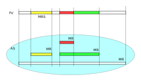

.. Kenneth Lee 版权所有 2020-2025

:Authors: Kenneth Lee
:Version: 1.0

MemoryRegion
************

本小节看看qemu的内存管理逻辑。对于VM来说，它有它视角中的内存，当这个内存被VM中
的CPU或者设备访问，我们还需要Host中有backend去支撑这个访问，所以，qemu有Host视
角中的内存。Qemu使用MemoryRegion描述这个视角的内存。它包含如下一些子概念：

MemoryRegion
        这表示一个面向VM的内存区，以下简称MR。请注意了，MR是一片内存区的描述，
        而不是那片内存本身。MR的要素是base_address, size这些信息，而不是void
        \*ptr这样的内存本身。整个系统的所有内存就是一个MR，整个系统的所有IO空间
        （不是说mmio，是说x86的LPC的IO）也是一个MR。MR内部包含多个不同设备的
        mmio也是一个MR。

        但部分基础的内存层是真的分配和Host一侧用于支持前端的backend内存的，这个
        这个真正的内存指针在MR->ram_block中。

RAMBlock
        这是MR的ram_block的类型，表示一段真实的Host一侧的内存，它可以是创建的
        时候就分配的，也可能是用Lazy算法动态一点点增加的。

MemoryRegionSection
        MR中的一个分段，简称MRS。当多个MR叠在一起的时候，MR会被隔离成一段一段，
        每段就是一个MRS。MRS的行为决定于它所在的MR。

Container
        包含其他MR的MR叫Container。没有RAM或者IO属性的Container叫纯Container，
        不影响理解的时候也可以简单叫Container。纯Container是透明的，要判断一段
        MRS的行为，如果它属于纯Container，就要看它下一层MR的定义了。

AddressSpace
        这表示一个VM眼中的地址空间，以下简称AS。同一个VM可以有多个不同角度的AS，
        比如系统内存，这是一个AS，这个AS中的不同地址会map不同的属性的内存片段
        （MR/MRS）。但比如x86还支持用io指令去访问IO的地址空间，这个也是一个AS，
        但就不是前面那个AS了。如果VM中而某个设备观察它可以访问的地址空间，看到
        的可能和CPU看到的不一样，这就会有这个设备自己的AS。

FlatView
        这表示看到的地址空间，本文简称FV。这个概念比较绕。我们这样说：AS是立体
        的，里面的MR是相互独立的，他们可以交叠，转义，动态开关等。但当你去访问
        的时候，某个时刻，某个物理地址总是对应着某个MR中（某段MRS）的地址，
        FlatView用来表示层叠的结果。另外它也提供多个访问源互斥的锁。

MemoryRegionCache
        IO MR中访问过的数据可以放在Cache中，这个Cache简称MRC，现在主要就是给
        virtio用。

综合来说，我们用MR定义一个有特定属性的内存区（比如RAM或者IO），然后把它们叠起来
构成一个AS，backend用这个AS去访问内存，首先压平为一个FV，然后匹配到一个MRS，最终
用这个MRS所在MR决定如何访问。

CPU眼中的AS是全局变量，可以用address_space_meory和address_space_io直接访问（没
有io指令的平台没有后者），这两个AS对应的基础container可以通过
get_system_memory()和get_system_io()获得。

整个概念可以用下图展示：

我们通过例子看看MR的创建方法。

RISCV的系统RAM是这样创建的：

.. code-block:: C

   memory_region_init_ram(main_mem, NULL, "riscv_virt_board.ram",
                           machine->ram_size, &error_fatal);
   memory_region_add_subregion(system_memory, memmap[VIRT_DRAM].base,
        main_mem);
   
system_memory是个纯container，初始化的时候就可以创建，真正的内存用
memory_region_init_ram()创建，然后用memory_region_add_subregion()加到container
中。

如果其中有一段IO的空间，这个通常是你有了某个系统总线的IO设备的时候才会有，这由
驱动来创建，通常长这样：

.. code-block:: C

   memory_region_init_io(&ar->pm1.evt.io, memory_region_owner(parent),
                         &acpi_pm_evt_ops, ar, "acpi-evt", 4);
   memory_region_add_subregion(parent, 0, &ar->pm1.evt.io);

如果是系统一级的IO，这里的parent就是system_memory container了。

Guest访问的时候有两种可能，一种是Guest的CPU直接做地址访问，这会变成TLB的访问过
程。在这个过程中，CPU模拟程序把系统的AS压平为FV，然后找到对应的MR，最后根据MR
的属性去回调IO或者直接访问RAM（RAM MR中有ram_block的地址）。

另一种是backend的设备直接调函数去访问地址了，这样的调用：

.. code-block:: C

   dma_memory_rw(&address_space_memory, pa, buf, size, direction);
   pci_dma_rw(pdev, addr, buffer, len, direction);

pci的调用本质还是对dma_memory_rw的封装，只是有可能用比如iommu这样的手段做一个地
址转换而已。

这个实现和前面CPU的访问没有什么区别，仍从AS开始，从AS得到FV，然后定位MRS，最终
找到MR。之后作为RAM处理还是IO处理，就由MR的属性决定了。这个代码是这样的：

.. code-block:: C

   static MemTxResult flatview_write(FlatView *fv, hwaddr addr, MemTxAttrs attrs,
                                  const void *buf, hwaddr len)
   {
       ...
       mr = flatview_translate(fv, addr, &addr1, &l, true, attrs);
       result = flatview_write_continue(fv, addr, attrs, buf, len,
                                     addr1, l, mr);
       ...
   }

还有一种Device Backend的DMA访问方法是这样的：

.. code-block:: C

        dma_memory_map(address_space, pa, len, direction);
        dma_memory_unmap(address_space, buffer, len, direction, access_len);

就是说，你有一个VM意义上的pa，你不调用前面的函数去访问它，而是map它变成一个指
针，之后，你可以直接访问上面的内容。

这两个函数的原理是：如果这片MR背后有直接分配的内存，那最好办，直接把本地内存的
指针拿过来就可以了，unmap的时候保证发起相关的通知即可。如果没有，那可以使用
Bounce DMA Buffer机制。也就是说，直接另外分配一片内存，到时映射过来就是了。

MR有很多类型，比如RAM，ROM，IO等，本质都是io，ram和container的变体：

.. code-block:: C

   memory_region_init(mr, owner, name, size);
   memory_region_init_alias(mr, owner, name, orig, offset, size);
   memory_region_init_io(mr, owner, ops, opaque, name, size);
   memory_region_init_iommu(_iommu_mr, instance_size, mrtypename, owner, name, size);
   memory_region_init_ram_nomigrate(mr, owner, name, size, errp);
   memory_region_init_ram_shared_nomigrate(mr, owner, name, size, share, errp);
   memory_region_init_ram_shared_nomigrate(mr, owner, name, size, share, errp);
   memory_region_init_ram(mr, owner, name, size, errp);
   memory_region_init_ram_ptr(mr, owner, name, size, ptr);
   memory_region_init_ram_device_ptr(mr, owner, name, size, ptr);
   memory_region_init_ram_from_fd(mr, owner, name, size, share, fd, errp);
   memory_region_init_ram_from_file(mr, owner, name, size, align, ram_flags, path, errp);
   memory_region_init_rom(mr, owner, name, size, errp);
   memory_region_init_rom_device(mr, owner, ops, opaque, name, size, errp);
   memory_region_init_rom_device(mr, owner, ops, opaque, name, size, errp);
   memory_region_init_rom_device_nomigrate(mr, owner, ops, opaque, name, size, errp);
   memory_region_init_rom_device_nomigrate(mr, owner, ops, opaque, name, size, errp);

其中，iommu是最特别的一种MR，它一般用于实现IOMMU，放在设备视角的MR和AS中（而不
放在系统MR和AS中）。

IOMMU MR
========

IOMMU MR不放入系统MR和AS空间中，因为系统MR和AS相当于物理地址空间，但加了IOMMU，
设备访问的就不是物理地址了，它必须是针对每个设备的虚拟地址。

下面是这种MR的一个应用实例（这个例子是ARM SMMU的，但由于ARM的SMMU在qemu中是专门
为PCI子系统定制的，我们在例子中把两个模块中的流程进行了组合和化简，突出关键逻辑）：

.. code-block:: C

   // 为设备创建设备自己的AS，包含一个代表物理空间的container
   memory_region_init(&dev->bus_master_container_region, OBJECT(dev),
                       "bus master container", UINT64_MAX);
   address_space_init(&dev->bus_master_as,
                       &dev->bus_master_container_region, dev->name);

   // 创建一个设备的iommu，TYPE_SMMUV3_IOMMU_MEMORY_REGION是iommu的类型名称
   memory_region_init_iommu(&dev->iommu_mr, sizeof(dev->iommu_mr),
                            TYPE_SMMUV3_IOMMU_MEMORY_REGION,
                            OBJECT(s), name, 1ULL << SMMU_MAX_VA_BITS);

   // 创建iommu MR的别名，以便可以动态开启和关闭
   memory_region_init_alias(&dev->bus_master_enable_region,
                            OBJECT(dev), "bus master",
                            dev->iommu_mr, 0, memory_region_size(dev->iommu_mr));

   // 初始化的时候先关掉iommu，等设备启动的时候再让它生效
   // 对于PCI设备来说，通常是设备被下了PCI_COMMAND_BUS_MASTER命令的时候，才会开启
   memory_region_set_enabled(&dev->bus_master_enable_region, false);

   // 加到设备的container MR中
   memory_region_add_subregion(&dev->bus_master_container_region, 0,
                               &dev->bus_master_enable_region);

这样创建出来的dev->bus_master_as就是可以用于dma_memory_rw()访问的AS了。有人可能
奇怪，为什么这个AS中没有包含system MR。答案在translate的实现中可以找到：

.. code-block:: C

   static IOMMUTLBEntry smmuv3_translate(IOMMUMemoryRegion *mr, hwaddr addr,
                                         IOMMUAccessFlags flag, int iommu_idx)
   {
       ..
       IOMMUTLBEntry entry = {
           .target_as = &address_space_memory,
           .iova = addr,
           .translated_addr = addr,
           .addr_mask = ~(hwaddr)0,     //地址空间长度掩码，如果要求的读写范围超过这个限度，会分多次翻译
           .perm = IOMMU_NONE,
       };
       ...
       return entry;
   }

   static void smmuv3_iommu_memory_region_class_init(ObjectClass *klass, void *data)
   {
       ...
       imrc->translate = smmuv3_translate;
       imrc->notify_flag_changed = smmuv3_notify_flag_changed;
   }

   static const TypeInfo smmuv3_iommu_memory_region_info = {
      .parent = TYPE_IOMMU_MEMORY_REGION,
      .name = TYPE_SMMUV3_IOMMU_MEMORY_REGION,
      .class_init = smmuv3_iommu_memory_region_class_init,
   };

所以答案是，iommu自己提供目标AS是什么（这个例子中就是address_space_memory）。

在qemu的当前实现中，大部分iommu都作为PCI的总线属性的一部分来设计，当你创建一个
iommu设备的时候，通过primary_master属性（一个link）指定所述的PCI总线，从而调用
pci_setup_iommu()设置回调，之后每个EP注册到这个总线上，就会创建一个针对这个设备
的IOMMU设备（以及相应的IOMMU MR）。

但这个设计其实是有毛病的。主要有两个问题：

1. 这个是人为限定了虚拟设备的硬件结构：真实的硬件可不是每个设备都有一个IOMMU设
   备的，按现在的实际，保证功能是没有问题的，但要模拟一个真实硬件的行为，这是不
   够的。

2. translate函数只有VA和属性作为输入。但现代IOMMU设备支持多页表（ASID Index），
   这个接口需要通过iommu_idx参数索引MemTxAttrs，现在的版本MemTxAttrs不支持pasid
   ，需要增加上去才能支持。这个地方其实设计得不是很好看，因为iommu_idx这个名字
   就预期这只是一个index，而不是一个值，但要把pasid编码进来，未来如果有更多参数
   ，这就不好发展了。
