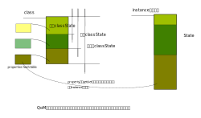

.. Kenneth Lee 版权所有 2020-2025

:Authors: Kenneth Lee
:Version: 1.0

QOM
***

Qemu的代码主要是基于C的，不支持面向对象特性，但偏偏设备极为适合使用面向对象管理
。所以Qemu写了一套用C模拟的面向对象接口，QOM，Qemu Object Model。Qemu几乎所有被
模拟的对象，都通过这种对象管理。

QOM模拟的其实不是简单的编译型语言的面向对象功能，还模拟了部分解释型语言的面向
对象能力，这些对象可以被通过名字（字符串）等方式创建和访问。比如，你可以用
object_new("digic")动态创建一个称为“digic”的对象，或者用
object_property_get/set_xxx(object, property_name...)读写一个对象的属性。

QOM包含这样一些子概念：

Type
        类型。每种类型用TypeInfo描述。请注意了：类型是类的描述，在实现的时候，
        它本质是一个用名称（字符串）索引的一个全局列表的成员，包含父类的索引
        （也是通过字符串索引），class_size，instance_size，以及各种回调等信息。
        它不代表那个类，它是说明类的相关信息的对象，通过type_register_static()
        系列函数全局注册。

Class
        类。这个才是类本身，这个概念类似Java中的class和object的关系：class的静
        态数据全局唯一，被所有同一类型共享，而object是实例，每个class可以创建
        很多实例（比如在Java中通过new创建的对象）。类自己的数据（类似Java中类的
        静态数据），保存在class_size的空间中，这个size必须包含父类的空间。在操
        作上，通常是在定义TypeInfo.class_size的时候，让它等于你的私有数据结构，
        并保证这个数据结构的第一个成员等于父类的私有数据结构。这样的结果就是父
        类拿到这个指针也可以直接索引到自己的数据结构。

        类有abstract这个概念，和其他面向对象语言的abstract的概念相似，表示这个
        对象不能被实例化。

        Class的继承树的根是ClassObject。
        
Object/Instance
        实例。通过object_new()等方法创建，当我们执行qemu -device xxxx的时候，本
        质就是在创建实例。它的数据保存在instance_size的空间中，原理和Class一样，
        需要为父类留空间。

        Object可以通过类型转换（使用类似OBJECT_CHECK这样的函数）转换为父类来使
        用，这种转换的本质是把父类的Class指针找出来，放在Object的Cache中，然后
        用这些指针来操作这个类的数据结构（如前所述，子类的数据结构本来就包含了
        父类的数据结构）。

        Instance的继承树的根是Object。

Interface
        一种特殊的类。不用于继承，用于实现。类不能有多个父类，但可以有多个
        Interface。它的基本原理和父类本质上是一样的，只是只有函数指针而没有数
        据结构而已。

State
        一个纯概念的东西，表示类或者类实例的数据。呈现为TypeInfo的class_size和
        instance_size，子类的State必须包含父类的数据本身。具体具象可以参考下面
        的例子。

Device
        又叫qdev，它是一种特殊类型的对象。它的Instance是DeviceState，Class是
        DeviceState。

Property
        对象可以包含一组属性，它包含一对set/get函数，用于读写属性的内容。属性
        的值可以是对其他对象的引用。

现在让我们组合一下这些概念的关系。首先，看一个类的实现例子建立一个基本的具
象：

.. code-block:: C

   struct MyDeviceState { //这个定义类的实例的数据
          DeviceState parent; //包含父类的State数据，而且必须保证在第一个位置上
          int my_own_data;
          ...
   };
   OBJECT_DECLARE_SIMPLE_TYPE(MyDeviceState, MYDEVICE)

   static void mydevice_class_init(ObjectClass *oc, void *data) {
        DeviceClass *dc = DEVICE_CLASS(oc);

        dc->realize = mydevice_realize;
        dc->unrealize = mydevice_unrealize;
   }

   static const TypeInfo my_device_info = {
          .name = TYPE_MYDEVICE, // "mydevice",
          .parent = TYPE_DEVICE, // "device"
          .instance_size = SIZEOF(MyDevice);  //State数据的大小
          .instance_init = mydevice_init,
          .class_init    = mydevice_class_init,
          .interfaces = (InterfaceInfo[]) {  //一组接口
              { TYPE_HOTPLUG_HANDLER },
              { TYPE_ACPI_DEVICE_IF },
              { }
            }
   };

   static void my_device_register_types(void) {
          type_register_static(&my_device_info);
   }
   type_init(my_device_register_types)

首先，type_init是一个类似Linux Kernel的module_init宏的技术，反正这个函数会自动
在qemu启动的时候调用。所以，type_register_state注册这个TypeInfo会在一切开始之
前被注册到类型数据库中。这样，我们还没有分配任何对象，我们至少有了可以通过字符
串查找到类型的机会。

有着这个注册以后，在其他地方，你做object_new("mydevice")，或者在命令行上做：::

  qemu-system-xxx -object xxx,id=xxx,...

或者在monitor中运行：::

  object_add xxx,id=xxx,...

都可以创建这个对象。在这些时机中，qom系统就有机会先去找对应的class，如果class
没有，就创建这个class，如果已经创建了，就基于这个class创建instance。这样我们就
有了这个对象了。

这个过程中，class_init()和instance_init()的时机也是很明显的。

这样构成的内存结构就是这样的：

我们上面的例子创建的类是一个Device。这个类要特别拿出来讨论，主要是因为qemu对它
是特别处理的。上面对object做的操作，都可以对应地用Device独有的方法来实施：::

  object_new() 对应 qdev_new()
  qemu-system-xxx -object 对应 qemu-system-xxx -device
  object_add 对应 device_add

这些对应的行为都不是子类对父类方法的继承，而是互相独立的实现。object和device的
属性（Property）也不是继承的关系。这是两个不同的列表。

.. note::

   qemu -device driver-name,help 可以直接查询device的属性。

   qemu -object object-name,help 可以直接查询object的属性。

   但两者不可互相取代。

所以，不要期望用object_new()来创建一个Device类型的实例，Device仅仅在继承上使用
了Object的能力，其他看起来一样的设施，都是互相独立的。

查询两者的monitor命令也不一样：::

  info qom-tree         查询对象树
  info qtree            查询设备树

Device包含有bus的概念，通过它的bus_type属性来说明，你可以通过bus=bus_id的方法
指定Device的Bus，也可以在设备中直接指定bus_type属性（字符串），对于后者，QOM的
Device子系统会全局查找这个名字的Bus，用第一个实例或者创建一个实例作为总线。如
果两者都没有，这个总线不存在，那么这个Device的上级就是Machine。

.. note::

  Machine代表一个整机，它本质就是个后端驱动，可以定义在比如hw/xxxx/board.c里面。
  实现为一个QoM，父类是TYPE_MACHINE，class_init设一些父类的基本回调，关键应该
  是init，里面创建内存映射，增加基本设备这些东西。没有多少新东西。

前面提到的qtree描述的就是这个机器的组成结构，它说明整个VM的组成。下面是一个不
完整的示例：::

  /                                  <-- object_get_root()
    machine                          <-- qdev_get_machine()
      peripheral
      peripheral-anon
    objects
    backend
    chardevs

回到前面的例子，在OBJECT_DECLARE_SIMPLE_TYPE()是一个系列的宏，用来实现一组辅助
函数或者宏，实现类型的各种转换。这包括：

* 所有struct MyDeviceState的类型或者实例的定义，都定义称没有struct的形式

* 定义MYDEVICE(instance) 为任意继承树上的对象转换为MyDeviceClass，按我们前面对
  内存结构的理解，其实这个就是个强制类型转换，因为大家的指针都是一样的。

* 定义MyDeviceState结构的g_autoptr指针（这是glib的机制）的析构函数定义成
  object_unref，保证范围内定义的实例会自动释放

* 定义XXX_GET_CLASS(instance)为从MyDeviceState获类MyDeviceClass
* 定义XXX_CLASS(class)从任意继承树上的类转换为本类的类型。

这些基本的机制基本覆盖了我们在C++等语言中需要用到的关于类的各种转换了。对于接
口，可以用OBJECT_CLASS_CHECK()进行类型转换。这个是通过查找字符串获得对应的类的。

QOM的对象函数其实主要不是用来封装的，而是用来回调的。比如说，你的Device管理需
要把设备加入总线，连入总线后需要给这个特定的设备一个回调，假定就是realize吧，
这样你就会给DeviceClass设置一个realize函数，这个函数不是为了Device自身调用的，
而是为了下一级，比如MyDeviceClass，在这个Class的class_init中你设置了这个函数，
那么通用的Device管理逻辑就可以调用MyDeviceClass的realize函数了。

Interface也是一样的原理，你的类实现了某个接口，你在class_init转换成那个类，然
后设置所有需要的回调函数，其他拿到你这个Instance的对象用那个Interface的回调调
用你的Instance，就实现这种类型的调用了，这个回调是你这层设置进去的，你肯定也认
识这个Instance的内容，实现起来也不会有任何问题。

如果MyDeviceClass下一级还有子类，用MyDeviceClass这层抽象去管理它们的时候，你会
在MyDeviceClass这层再增加回调函数，然后在SubMyDeviceClass的class_init中再挂入
新的函数来响应MyDeviceClass这一层的回调。

就Device这个框架来说，它预期你是这样的：

* class_init中初始化所有这种Device的全局变量，挂入需要的回调函数和属性，不要碰
  其他资源

* instance_init中初始化这个Device的全局变量，不要碰其他资源，也不要读任何属性
  （因为可能还没有初始化）

* realize中初始化开始为设备分配资源，这时所有属性已经有效，总线也已经可以访问
  （Device->parent_bus）。

Object使用引用计数接口进行访问：

* object_new()得到的对象引用计数为1
* object_ref()增加计数
* object_unref()减少计数

减到0就自动释放，并且自动回调object->release()。

Device是不同的：::

* qdev_new()：得到的对象的引用计数是2，因为它同时被设备管理系统和bus两个系统管理
* object_ref/unref()：增减计数
* object_unparent()：脱离qdev_new()的两个引用

props的实现具象
===============

给类设置属性的方法类似这样：::

  static Property xxx_properties[] = {
    DEFINE_PROP_BIT("prop_bit",   XXXState, field_name_in_state, BIT_MASK, false),
    DEFINE_PROP_BOOL("prop_bool", XXXState, field_name_in_state, false),
    DEFINE_PROP_LINK("prop_link", XXXState, field_name_in_state, TYPE_NAME, field_type),
    DEFINE_PROP_END_OF_LIST(),
  };

  device_class_set_props(class, xxx_properties);  // 这个在class_init中调用

device_class_set_props()可以调用多次，所以，多层继承都可以用这个函数增加属性。
上面例子中的属性都是固定的值，可以直接指向Instance中的某个成员变量。如果你需要
更复杂的setter和getter，也可以手工写这个PropertyInfo结构。

它还可以索引其他对象，这个用途在定义内存的时候最常见：::

  qemu-system-xxx \
	-object memory-backend-ram,id=mem0,size=256M \
	-numa node,nodeid=0,cpus=0,memdev=mem0 \
        ...

这里的numa node定义了一个memdev的索引，指向对象mem0。QOM在所有对象和类创建后，
在初始化属性的时候根据名字给你找到对应的类。只要你在realized的时候引用，就一定
能得到这个对象。

link可以建立复杂的关联关系，QOM还支持另一种关系，称为Composition。两者分别用
object_property_add_child/link()建立。比如你在创建machine的时候，可以在machine
中创建一个bus，然后把它作为machine的child连到machine上，之后你还可以创建bus上
的设备，作为bus的child，连到bus上，你还可以创建一个iommu，作为一个link连到这个
bus的每个设备上。这种关联接口，可以在qemu console中用Info qom-tree命令查看（但
只有child没有link）。

child和link关联的进一步解释
===========================

除了一般用于设置对象参数的Property，qemu内部会经常使用child和link的概念。child
和link是通过对象props建立的关联。本质上就是给一个对象增加一个prop，名字叫
child<...>或者link<...>，和手工创建一个这样的属性也没有什么区别。

child的主要作用是可以枚举，比如：

.. code-block:: C

   object_child_foreach();
   object_child_foreach_recursive();

利用这个机制，比如你模拟一个SAS卡，上面有多个端口，端口就可以创建为SAS的一个
child，而端口复位的时候就可以用这种方法找到所有的子端口进行通知。

实际上，整个机器的对象machine就是根对象的一个child。下面是qemu控制台下运行
qom-list的一个实例：::

        (qemu) qom-list /
        type (string)
        objects (child<container>)
        machine (child<virt-5.2-machine>)
        chardevs (child<container>)

        (qemu) qom-list /machine
        type (string)
        ...
        virt.flash1 (child<cfi.pflash01>)
        unattached (child<container>)   <--- 没有指定parent的对象都挂在这下面
        peripheral-anon (child<container>)
        peripheral (child<container>)
        virt.flash0 (child<cfi.pflash01>)
        ...

我们简单解释一下这个list的含义：

1. /是整个被实例化的而对象的根，下面是它的所有属性。

2. 属性的表述成“name (type)”这种模式，name是属性的名字，type是它的类型。

3. 如果属性是child<type>，后面的type是它被链接的子对象的类型

和Child不同，link通常用来做简单的索引，你可以这样找到这个关联的对象：

.. code-block:: C

   object_link_get_targetp();

link用info qom-tree看不到，只能用qom-list一个节点一个节点看。它通常用于建立非包
含关系的对象间索引。比如你的网卡和IOMMU都挂在总线上，但网络需要请求IOMMU去翻译
它的地址，这之间就可以是一个link。

Link可以直接在先通过device_class_set_props()创建，具体的instance通过
object_property_set_link()去设置。这两个步骤相当于在一个接口中定义一个指针和给
这个指针赋值的两个动作。前者一般实现在索引多方的那个对象的初始化，后者一般实现
在建立系统关联关系的代码中，比如创建machine的时候，把IOMMU和网卡关联起来的时候
。Link是有类型的，不能把不同类型的对象挂到Link上。

这不算什么特别的功能，只是简单的数据结构控制而已。用户自己用其他方法建立索引
去找到其他设备，也无不可。但qemu的惯例是用child和link。
