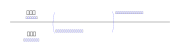
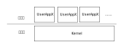
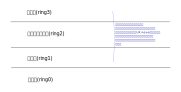
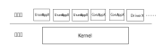
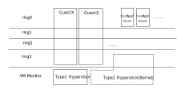
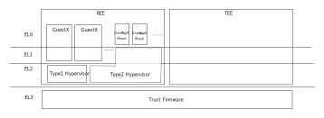
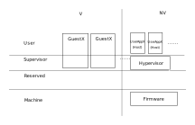
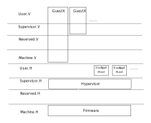

.. Kenneth Lee 版权所有 2021

:Authors: Kenneth Lee
:Version: 1.0

虚拟化特权级
*************

本文分析一下虚拟化下，CPU的特权级的概念空间。

CPU通过特权级的概念为管理软件提供保护，一个最简单的模型是这样的：

这里内核态控制系统的所有资源，包括设置用户态可以访问的资源，这样管理程序（比如
操作系统内核）可以进行资源权限的分配后，切换到用户态，用户态的程序就只能访问这
些指定的资源，无论你怎么写这个用户态的程序，它都不能越过操作系统内核设定的限制
，访问没有提供的资源。用户态程序通过系统调用指令，或者操作系统设定其他原则（例
如中断，用户态程序异常等），回收用户态程序的控制权，让CPU回到内核态的特性位置，
让内核态的程序重新获得对系统的控制。

这个地方有一个很容易混淆的点：CPU是一个单一的对象，它的特权级是它的“态”，CPU的
设计代表一个头脑（CPU设计者的头脑），而程序不同，操作系统内核(Kernel)和用户态程
序(UserApp）都是程序，它们的程序员分别是另外的头脑。所以，当我们说，UserApp发起
一个系统调用，把控制权交给Kernel，从软件的角度是两个对象进行了通讯，因为UserApp
的程序员头脑和Kernel程序员的头脑是互相独立的。但对CPU来说，这是CPU这个单一的对
象，从一个状态，切换到了另一个状态，这并没有发生两个头脑的切换。了解这一点非常
重要，因为我们后面说的每个概念，从软件工程师的角度说和从芯片工程师的角度说，它
是不一样的。

所以，前面这幅图，更详细一点可以画成这样：

特权级的概念可以扩展，只在于你要把程序分成多少份，最早的Intel就是这样想的，所以
它把特权级设置成了4级，你怎么用是你的事情，比如你可以这样用：

然后你的程序就是这样的：

.. figure:: _static/cpu_privelege2_m.svg

这在今天看来无疑是一个失败的选择。因为你知道吧，如果我写这个程序，用户程序要被
管理程序隔离，这是实打实的需求，其他的，我可以晚点再切分，省的那么复杂。我要不
断想“这个资源给不给驱动？”这类问题，等我推好了我才有可能去想能不能细分的问题。
但那时我已经没有做这个修改的驱动力了。而且我也没有兴趣把我的OS绑定在Intel的设计
上。这个东西只要一直没有需求驱动，我很可能弄来弄去，都只有2层。现实也确实是这样
，最后大家都只用了ring0和ring3，然后中间那两层就没人想了。

.. note::
   
   不为天下先，别过度设计，这在构架设计中的例子是无处不在的。

关键在于，这种模式我干嘛要分层？这样组织不是一样的？：

你下一层又不管理整个上层，我要给不同权限，Kernel分不同的资源不就结了？吃饱了撑
的才分层呢。

而且这个地方用分层，其实很有毛病，想想前面那副考虑软件对象的图，在多层的情况下
应该怎么画？

好了，现在我们开始想虚拟化的问题。硬件要做虚拟化支持，就要再加一个管理层，用它
来分配资源给每个虚拟机，说起来呢，如果我们现在重建整个软件协议栈，完全可以ring3
用户，ring2内核，ring3虚拟机管理器（以下称Hypervisor）。

但你不敢，因为你承诺了3层给OS了，你鬼知道有没有某个OS就用了3层啊？所以Intel VMX
的设计是这样的：

我知道你们看惯的图不是这样的，但请想想，本质上是否根本就是这么回事。

所以，这个方案其实和ARM没有任何区别，ARM仅仅就是没有了那4个ring的历史包袱。至于ARM
的安全模式，本质上其实还是加了一层：

EL3的最大特点是很多CPU的状态参数都是多份的，而不指望你从TEE切换到REE就都替换一次。
这和Hypervisor的调度本质的区别是，Hypervisor在切换Guest是准备把资源全部让出来的，
而TEE和REE的切换，主要换的只是CPU的算力和一些关键寄存器。

好了，我们最后看看代表最新CPU设计理念的RISCV又是怎么选择的：

它的选择是，在特权级变量P之外另外增加一个变量V，表示当前是否在Guest中。这看起来
就不是个层的概念了，系统的可能状态是P*V，如果P有4个状态，V有2个状态，整个系统会
有8个模式。但Hypervisor管理Guest，却实实在在是个层的概念，那我们尝试把它堆成一
个层的概念，看是不是等效的：

好吧，我承认这是一个没有人性的设计。
