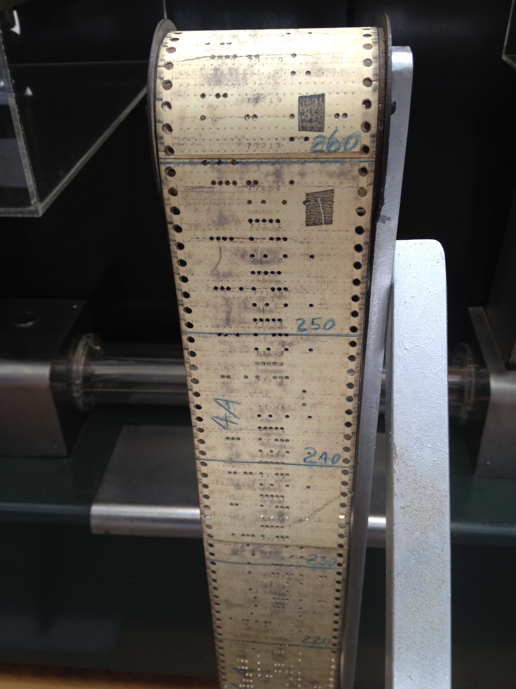
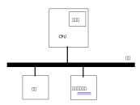

.. Kenneth Lee 版权所有 2022

:Authors: Kenneth Lee
:Version: 0.1
:Date: 2022-08-26
:Status: Draft

C++编程入门1：什么是C和C++
***************************

这个教程写给我家姑娘。她准备要学这门课（C++），这我当然不可能代替老师和教材，但
作为同行，有机会交流一下心得，我也想给她做一些超过课程的入门引导，这样有希望可
以让她早早跳过一些学习陷阱，对整个问题建立一个更好的模型。这无论对于入门效率，
还是未来扩展知识面，都有帮助。

第一章我们讲原理，看就行了，不用把计算机拿出来。如果看不懂的就问，我再补相关的
细节。

编程语言是和计算机沟通的语言，这和人的语言很类似，但计算机比人蠢，所以计算机的
语言通常非常简单。但计算机计算比人快，我们通过组合这种简单的语言来实现复杂的功
能。

我们以前说过，最早的计算机就是在纸带上打孔，不同的打孔组合表示不同的要求，计算
机根据这些要求改变内部的状态，完成不同的计算。类似这样：

你可以认为这里有孔的就是1，没有孔的就是0，纸带进去一格，就输进去一个二进制数，
计算机就做一个动作。这个二进制的数，就是计算机认识的“语言”。这就是所谓的编程语
言了。

现在我们的计算机复杂，其实本质是一样的，只是用电压取代了孔，电压高点叫1，电压低
点叫0（反过来也行），就好像这样：

这个输入就相当于那个输入指令的纸带，输出就是打印输出的纸带。时钟就相当于机械计
算机的一个发条，它不断改变高低电平，就会让计算机内部电流倒来倒去，实现需要的计
算。

所以整个计算过程就是时钟跳一下，数据从输入的电压影响了计算机内部的电压电流，这
个指令就影响计算机里面的状态了。然后时钟继续跳，计算机就在里面一步步得到计算结
果，然后最终影响那个输出。输出完了，到时钟又跳一下的时候，计算机又从输入得到下
一个指令，做下一个动作。

所以，现在也许你明白为什么计算机科学叫“信息科学”，计算机的电路叫“数字电路”了：
我们在中学学电学，我们关心计算机的电流，电压，都是为了发出更多的光，更多的热，
我们关心的是能量。但计算机只是为了表达一个信息。你用3V表示1，0V表示0，计算机无
所谓，你用10V表示0，-2V表示1，计算机也无所谓，反正都是一样用。所以，计算机关心
的是信息的表达，不是物理上的多少伏。但从实现的角度来说，能做到多低的电压，多快
的时钟，这个数字还能被分辨出来，这是硬件要解决的问题，对我们做软件的人来说，我
们只知道怎么把一个数字给到计算机里面，计算机能把计算的结果尽快给我就行了。

真实的现代计算机，每个输入输出部件都变得非常复杂，但本质是不变的，只是功能变得
更加方便，能力变得更加强，细节变得更加复杂而已，从软件的角度，我们基本上可以认
为它是这个样子的：

其中前面提到的所有计算有关的东西，都放到这个CPU里面，它负责计算。它计算的中间结
果就在这个寄存器里面，但这个东西很少，一般的CPU里面也就16个到32个。所以，更大的
数据就放在内存里面，才能完成所有的计算。你可以认为，寄存器的数据只要时钟跳一次
，就可以读进来做计算了，但内存的数据可能要跳100次才能读进来。而其他输入输出设备
呢，要可以几万次才能把数据读进来。

而总线，就是原来那些判断高电平低电平的线，只是现在它也变得复杂了，里面有很多根线。
在没有打开这个东西内部怎么设计前，你就认为谁连在上面都可以给定一个地址和一个数字，
就把数字送到那个地址上就可以了。

对总线来说，内存也是地址，输入输出设备也是地址。每个地址上可以放一个数字，这么
多年了，已经约定成俗，一个数字就是8根线，每根线就叫一个bit，8根就是一个byte，包
括8个bit，可以表示2的八次方种情况。然后2的10次方个byte就是1K，2的10次方K就是一
个M，然后是G，T……如此类推，这些你都知道了。

地址本身也有长度，第一个Byte叫地址0，第二个byte叫地址1，那么第1024个byte叫地址
1024，这要10个bit才能放得下，对不对？所以如果你的内存有1024个byte，你的地址至少
要超过10个bit才能表示它。如果你有8G的内存呢？你的地址至少是3+10+10+10个bit才能
表示它。这叫地址的长度，总线要能接受这么长的地址，才能让你访问那么大的内存，这
个长度，就叫总线的宽度。

每个输入输出设备，也有一些地址，每个地址上读写不同的数据可能用来让屏幕变亮啦，
改变屏幕上的显示啦，读磁盘上保存的数据啦，等等，和内存也差不多。只是速度不一样
，功能不一样。内存是纯粹的数字读写，你可以写个数字进去，一会儿读出来。读到的就
是当时写进去的数字。输入输出设备用来物理世界联系在一起。比如你按了一个键盘上的A
，可能它某个地址读出来就是A，这不需要你写。反过来，你写一个地址，键盘上的一盏灯
亮了，你读这个地址，可能什么都读不到，也可能读出来1表示灯亮，读出来0表示灯不亮，
这都是看你用这个数字代表什么。

这就是信息科学的本意：所有东西都是个数字而已。

所以，也许你现在可以从编程的角度理解计算机是什么了：计算机就是计算器，把外设的
指令，读到内存中，然后好像过去纸带机那样，在时钟的激励下，跳一下就读进去一条指
令，修改一些数据，再跳一下，在里面做做加减乘除，修改一下寄存器，跳几下算完了，
又读一条指令进去，接着跳，如此类推。也就是一个这么简单的东西了，只是这东西跳得
特别快，比如我们现在用的电脑，常常可以达到3GHz，每秒跳3000000000次。如果你要做
那些重复的计算，它一转眼就搞定了。关键是你得告诉它怎么重复。

所谓编程，就是你把重复的方法告诉计算机，让计算机来完成这些重复。你的脑子用来创
造，计算机的脑子用来重复。

我们来看看真实的指令是什么样的，下面是一段我们平时常用的电脑（Intel公司）的指令
：::

  00:	f3 0f 1e fa
  04:	55
  05:	48 89 e5
  08:	8b 15 00 00 00 00
  0e:	8b 05 00 00 00 00
  14:	01 d0
  16:	5d
  17:	c3

冒号前面的是地址，后面是这个地址上的数字。你可能很奇怪，为什么和纸带机不一样，
不是每条指令一样长的？问得好，这种指令叫“复杂指令集指令”，要输进去的数据多，就
多放点数字，要输进去的数据少，就少放点数字。现在很多CPU不用这种指令，比如手机上
常用的ARM CPU，它的指令就是这样的：::

  00:	90000000
  04:	91000000
  08:	b9400001
  0c:	90000000
  10:	91000000
  14:	b9400000
  18:	0b000020
  1c:	d65f03c0

这叫“精简指令集指令”，不过这些名字最初写的时候也不完全是我现在说的这个意思，这
我们就不深究了，否则就说不完了。

最早的程序员就是这样写代码的。可以想像，写这种程序要折腾死人。那么第一步，他们
就想着要写一些助记符，好不用这么记这些数字。你看，我给你配上这些助记符，上面的
代码是不是好看多了？::

  00:	f3 0f 1e fa          	endbr64 
  04:	55                   	push   %rbp
  05:	48 89 e5             	mov    %rsp,%rbp
  08:	8b 15 00 00 00 00    	mov    0x0(%rip),%edx        # e <add+0xe>
  0e:	8b 05 00 00 00 00    	mov    0x0(%rip),%eax        # 14 <add+0x14>
  14:	01 d0                	add    %edx,%eax
  16:	5d                   	pop    %rbp
  17:	c3                   	retq   

那些带着%的就是“寄存器”，push %rbp表示把rbp写到rbp的地址的内存中——是不是很拗口
？习惯一下吧，这是计算机领域的常态，以后你会要学各种对象，对象的指针，对象指针
的指针各种拗口的说法，考试也经常考这个。每个出色的程序员都会成为说话玄之又玄的
哲学家的。

有了助记符，程序员就简单多了，他们只要写右边的助记符，然后用另一个程序把这些助
记符转换成左边那串数字就可以了。

这个助记符组成的“程序”，就叫“汇编程序”，写“汇编程序”的程序员就叫汇编程序员，右
边那些数字，我们叫它“二进制”，把汇编程序翻译成二进制的程序，就叫“汇编器”。而这
套助记符，就叫“汇编语言”，它是我们和计算沟通的最基本语言。

现在你对“编程语言”，有最基本的印象了吧？

汇编语言比写那些数字简单多了，但很明显也很难写。我们就有了更接近人脑的语言。C语
言就是其中一种，它的历史反正教材上肯定会有的，你自己看。反正就是汇编不好写，所以
我们得找一个更加接近人的理解的语言来写这个程序。比如前面这个汇编程序，它原始的C
程序是这样的：::

  int a = 3;
  int b = 4;

  int add() {
    return a+b;
  }

这个是不是容易看多了。它的意思是这样的：给我在内存里面找个地方，放个3，再给我在
内存里面找个地方，放个4，然后再从内存中找个地方，放个程序，这个程序里面用汇编给
我想个办法，把内存里面原来放着3和4的那个数字读到CPU里面，随便你用哪个寄存器，反
正给我读进来，然后把它们加起，写到一个寄存器里面（如果你看前面的例子，就是14这
个地址上那句话：add %edx, %eax，结果就写到eax这个寄存器里面了。

你看，写这种程序很多事情程序员就都不用关心了，内存里面先放个a还是先放个b，用什
么寄存器来做这个加法，都无所谓，一把交给一个翻译程序，给你转化成汇编语言就可以
了。这个翻译程序，就叫“编译器”，它负责把C程序翻译成汇编程序，然后最终让汇编器把
汇编程序翻译成二进制。

C语言叫“中级语言”，它已经比较高级了，但基本上，等你熟练了，你就知道了，你从C语
言基本上是可以猜到对应的汇编是怎么样的。只是很多你不关心的问题，不用你管而已。
所以，一般我们不叫它高级语言。而你以前学习的Python这种，才叫高级语言，比如你这
里说int a = 3。虽然你不关心a放在哪里，但你说这个a是个int类型的，int在我们现在用
的PC上，通常是32bit，那么它就要占据4个byte，这一点，你是知道的。所以你知道的细
节还是挺多的，这算是比较了解计算机的。你知道你这个a最大大不过2的32次方（其实是
31次方，有一个bit需要用来表示正负），如果你的计算超过这个长度了，你要自己处理进
位以后怎么办的问题。而在高级语言，像Python这种编程里面，可能你就完全不用考虑这
种问题了，长度不够，Python会另外找个地方放一个更高的位的。

所以，所谓高级语言，就是更接近人的语言，低级语言，就是更接近计算机的语言。如果
你要更好控制计算机，你需要使用低级语言，如果你只想容易说，你需要使用高级语言，
在两者之间的，就是中级语言。

就好像你去茶餐厅，说“给我来个奶茶走冰”，这就是高级语言，你不管他们怎么做的，也
不管走冰是不是一块冰不放，这些让茶餐厅给你决定。如果你要控制，你可能需要说，“我
要一个奶茶，用你们那个10年龙井泡，过三道水，然后加一块冰就可以了”。这就是低级语
言，你需要管的东西就多了很多。

所以我是认为学计算机的没有必要一开始学C语言的，应该先学高级语言，建立更多的认识
以后再学会更容易入门。非要一开始就学，我就得把计算机一些基本原理给你先讲了，否
则你听不懂，容易走弯路。

更高级的语言，关心的东西少，通用性就强。比如前面这个加法的C程序，如果你写成了汇
编，在Intel的CPU上用是上面展示的样子，在ARM的CPU上用，它就是另一个样子了：::

  00:	90000000 	adrp	x0, 0 <add>
  04:	91000000 	add	x0, x0, #0x0
  08:	b9400001 	ldr	w1, [x0]
  0c:	90000000 	adrp	x0, 4 <add+0x4>
  10:	91000000 	add	x0, x0, #0x0
  14:	b9400000 	ldr	w0, [x0]
  18:	0b000020 	add	w0, w1, w0
  1c:	d65f03c0 	ret

如果你写这样的汇编语言，写完以后你想拿到Intel的CPU上用，你要把程序重新写一次。
但如果你写的是C，那么，只要用不同的编译器来编译就可以了。在Intel上用，用Intel给
你的编译器编一下，就是Intel的代码，在ARM上用，就用ARM给你的编译器编一下，得到的
就是ARM上用的二进制。

同理，如果你的程序是C写的，数字放在int类型里面，用在数字大于2的32次方的地方计算
结果就错了，但如果你是用Python写的，就没有这个问题。

但反过来，Python对CPU和内存的利用率肯定没有C高，C也很可能没有汇编高。这些都是要
配合使用的。

最后我们来说一下，C++又是什么语言呢？我觉得我可以叫它中高级语言，它是一种语法基
本上和C一样，但加了很多其他语法的“比C更高级”的语言。比如它支持面向对象语法，支
持操作符重载等等（具体什么意思等学到对应的语法的时候，我们再说）。总的来说，我
觉得它是个四不像，因为它又想提供C语言对底层的那种控制力，又想让你像高级语言那样
很多东西不用管。两种语法穿插在一起，特别容易让人脑抽，有人甚至认为它带来的问题
比带来的好处还多。无论如何它，学习这个语言倒是一个学习计算机各种高级低级概念的
捷径，所以，我们就通过啃开这个骨头来开始入门计算机的世界吧。
