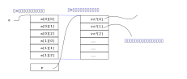

.. Kenneth Lee 版权所有 2022

:Authors: Kenneth Lee
:Version: 0.1
:Date: 2022-10-20
:Status: Draft

C++编程入门10：数组和指针的区别
*******************************

这C/C++中，指针和数组经常被混用，这背后的原因是它们在翻译成汇编和内存中的数据的
时候，常常语义是完全一样的。

考虑一下下面的程序：

.. code-block:: c++

  int a    = 0xaa;
  ...
  int *ap = &a;
  int bp[10];

这两个变量生成的内存是下面这个样子的：

你会看到，ap和bp这两个名字，其实地位非常接近。\*ap要访问的是a那个位置的内容，而
bp[0]访问的b那个位置的内容。ap+i，按定义，就是a向下移动一个a的大小，\*(ap+i)正好
就是ap[1]的内容。bp[1]也正好访问一样的内容。

所以，在C语言实现的时候，这两个语法其实是可以混用的。你定义了一个数组，让它等于一个指针，
然后你用指针的方式访问它也行，用数组的方式访问它也行，比如这样：

.. code-block:: c++

  int a[10] = {0};  //定义一个数组
  int *p = a;
  cout << p[1];
  cout << *(p+2);
      
这些语法都是对的。因为在内存上，它们就是一个意思。

但其实，它们两个也是有不同的，不同的地方还是在内存上。你再回去认真看看上面那张
图。数组和指针的定义有什么区别？

对啦，ap是占着内存的位置的，但bp没有，bp只是个名字，不是个变量。所以，这样是对的：

.. code-block:: c++

  int a[10] = {0};
  int *p = a;
  p++;

但这是错的：

.. code-block:: c++

  int a[10] = {0};
  a++;

a不是变量，没有地方放它的内容，你要它加1，它没法加啊。

在这种地方，数组和指针就是不同的。这是它们的本质区别。

在声明的时候，数组的大小是可以忽略的，考虑下面这个程序：

.. code-block:: c++

  void test(void) {
        cout << a[3];
  }
  int a[10];

这会编译错误，因为编译器编译到cout那一句的时候，根本不知道a是什么东西。

如果你不想把int a[10]移到前面去，你也可以“声明”它，写成这样：

.. code-block:: c++

  int a[];
  void test(void) {
        cout << a[3];
  }
  int a[10];

这表示告诉cout这一行，a是个数组，至于它多长，你不用关心，反正你按距离拿内容就可
以了。实际a要多大的空间，后面会说的。

指针和数组在多维的时候会表现得更不一样，考虑一下下面这个程序：

.. code-block:: c++

  int a[2][3];
  int **p = a;
  cout << p[1][2];

这个程序对吗？其实是不对的。把它们的内容布局画出来就发现了：

这个内容被解释成a的时候，我们知道它是一个2x3的数组，内容是挨着放的。而内容被解
释成p的时候，它是指针的指针，我们根本不知道它是一个二维的数组，我们首先认为它是
一个(int \*)的数组，所以我们先把它的内容解释成指针，然后再去访问，这个结果就完全
错了。

所以上面这个程序，你真想用p来访问a[1][2]的内容，你要这样写：

.. code-block:: c++

  int a[2][3];
  int *p = (int *)a;
  cout << p[1*3+2];

这才是a[1][2]的位置。
