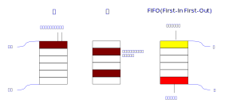
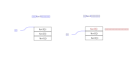
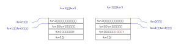

.. Kenneth Lee 版权所有 2022

:Authors: Kenneth Lee
:Version: 0.1
:Date: 2022-10-21
:Status: Draft

C++编程入门11：对内存的深入认识
*******************************

知不知上
========

这一章我们要讲一些复杂的主题，所以，我先来澄清一个比较哲学一点的概念，谈谈什么
叫“不知道”。

这是个很简单，但很多人以为自己明白，其实常常不明白的概念。

考虑如下程序：::

  int a = 3;
  int b;

我问个问题：在内存上，b放在a的后面吗？

这个问题的答案是——“不知道”。有时b会放在a的后面，有时不会，在有些硬件上会，在有
些硬件上不会，在有些操作系统上会，在有些操作系统上不会。作为全局变量的时候可能
不会，作为函数变量的时候可能会……如果，从写程序的角度来说，这个问题我们“不知道”。

所以，“不知道”不是“不是”。我们既不是说b一定放在a的后面，也不是说b一定“不”放在a
的后面，这个事情，我们“不知道”。

这就是《道德经》里面，里面说的：

        | 知不知上，不知知病，夫为病病，所以不病

我们知道“我们不知道b是不是放在a的后面”，这是好事。“我们不知道b是不是放在a的后
面”，这是坏事，病。我们不靠“b放在a的后面”或者“b不放在a的后面”来写程序，这就是
“病病”（以病为病），我们的程序就不会错（“不病”）。

这就是写程序的基本原则：我们基于“知道”写程序，不基于“不知道”写程序。

b是不是放在a的后面，跟你写好一个算法一点关系没有，你知道a和b是int类型的变量，知
道它可以表示最大INT_MAX，最小INT_MIN的整数就好了，其他东西你“不知道”，你别管那
么多（到该管的地方再管，比如你是写编译器的那个人）。这就叫“知不知上”。

所以，“不知道”本身很简单，但它的外延其实是很大的，你说不定知道这个不知道在你现
在的情况下是什么样的，但当你认为你“不知道”的时候，你建立程序逻辑的时候，不依赖
这一点，无论b在a的后面还是不在它的后面，你的程序都是对的（不病）。

我后面要讲的东西，很多都会给你透露这种“不知道”的细节，但当我们说这个东西我们“不
知道”的时候，我们认为，这一点不能在写程序的时候被依赖。

操作系统的内存管理
==================

在
:doc:`第三章 <C++编程入门3>`
和
:doc:`第九章 <C++编程入门9>`
中，我们简单介绍过C/C++是怎么使用它的内存的。我们说过，C/C++是中低级语言。这里
关键就是它有指针这个概念。有指针这个概念，就相当于直接告诉写程序的人：你的东西
我是给你放到内存上的，这个内存是怎么用的，我都告诉你了。

这是个好事，也是件坏事。好的一面是，程序员可以全面管理计算机的所有东西。不好的
一面呢，如果程序员写错程序了，你很难查哪里出错了。

如果看不见内存，你定义一个数组：::

  int a[10];

你访问a[11]，编译器或者运行的时候马上就可以告诉你，你越过范围了。或者你把a[x]当
作float来用，它们也可以告诉你，这个格式不对。编译器完全可以在这个内存上放上这个
a的大小，什么类型，甚至它的名字是什么，等你用的时候判断一下你搞错了没有。

但一旦你允许了指针，那完蛋了，我可以这样搞：::

  int a[10];
  char *p1 = a;
  float *p2 = a;
  int ****p3 = a;

我怎么解释这个内存都可以，编译器根本不知道你写错了，还是你本来就想这么搞。而且，
由于把内存公开出来了，a这个位置上放什么内容是一个“知道”，你不能再放什么a的大小，
类型这些信息进来的，说好这就是一个10个int大小的空间，就是10个int的空间，不能再
加个什么大小、格式之类的东西进去的。

所以，C/C++特别适合用来写操作系统这种和底层密切相关的程序，不适合写高级的计算为
主的程序。计算机的学生优先学习C/C++有好处的，因为这样你才知道那些高级编程语言是
怎么实现的，会学到更多的计算机知识。但C/C++需要额外的小心，也是因为这个所谓“能
力越大，责任越大”。

现在我们的问题是，操作系统怎么决定C/C++写的代码放在什么位置上的。这个事情，站在
C/C++程序的角度，这是一个“不知道”。但在大部分现代操作系统上，一般应用程序都是使
用页式虚拟内存管理的。简单说，操作系统给你的程序的都不是真的内存的地址，操作系
统给每个程序（称为一个进程）分配多片不连续的内存片，然后在硬件上使用一张映射表，
说明给你的内存和真实的内存的位置是如何对应的。它给你的内存叫“虚拟内存”，真实的
内存叫“物理内存”。你的内存地址叫“虚拟内存地址”（简称VA，Virtual Address），他的
内存地址叫“物理内存地址”（简称PA，Physical Address）。

所以，你以为你是有一片连续的内存地址，其实你的内存里面到处都是洞，它不是连续的，
如果你访问了操作系统没有给你的内存，你的程序就会直接被操作系统杀掉，操作系统会
直接在屏幕上打印segment fault（段异常），这个段，就是它分配给你的内存，它说你访
问了它没有给你的内存。

要验证这个，运行一下下面这段程序就知道了：::

  int main(void) {
        char *p = 0;
        return *p;
  }

这里访问了0地址上的内容，在Windows或者Linux下，这个地址是没有分配的，你访问它，
操作系统就会直接杀掉这个进程。

但我们说过了，这在Windows下和Linux是一个“知”，在所有的操作系统的角度，这是一个
“不知”，不是一定会这样的。

所以，我们只能根据操作系统承诺给你的内存位置访问内存，在这个内存之外是什么，那
些都是“不知”，这是写程序的常态。

:doc:`第九章 <C++编程入门9>`
里面我们给出了一般进程的几个关键的内存片，你可以用下面这个程序看看它们都在什么位置：

   .. code-block:: c++

      #include <iostream>
      
      using namespace std;
      
      int a;
      int b = 10;
      int c;
      int d = 20;
      
      int main(void) {
	      int e = 10;
	      int f;
              void *t = malloc(sizeof(int));

	      cout << "uninit data a at " << &a << endl;
	      cout << "uninit data c at " << &c << endl;
	      cout << "init data b at " << &b << endl;
	      cout << "init data d at " << &d << endl;
	      cout << "init stack data e at " << &e << endl;
	      cout << "uninit stack data f at " << &f << endl;
	      cout << "function main at " << (void *)main << endl;;
	      cout << "heap memory at " << t << endl;
	      return 0;
      }

看看谁和谁是放在一起的。基本上，这里有这样一些内存是连在一起的：

1. 静态初始化内存段：这包括全局定义的所有有初值的变量。
2. 静态未初始化内存段：这包括全局定义的所有没有初值的变量。
3. 代码段
4. 堆：所有用malloc和new这些函数分配的内存
5. 栈：所有非静态局部变量

其中静态局部变量视为全局变量一样管理内存。

这些内存大部分都好理解，但反正就是找个地方放内存就是了。只有“栈”这个东西是最值
得深究的，我们下面用一个独立的小节去介绍它。

栈
==

栈是计算机中用得最多的概念，它通常和另外两个数据结构：堆，FIFO来做对比：

堆是最简陋的，内存的管理就是堆，要用哪片就用哪片，用一段时间就会留下很多空洞，
找一片没人用的不容易。栈通常用于函数调用，特点是先进后出，我们马上就会看到它怎
么起作用的。FIFO是栈的反面，通常用于队列，特点是先进先出（名字就叫First-In，
First-Out)，网络上用得最多，别人给你发个消息，你当然会先处理先发过来的。

现在我们来看一段程序：

.. code-block:: c++

   int fun3(int x) {
        int i = 10;

        return i;
   }

   int fun2(int x) {
        int i = 10;

        return fun3(x+i);
   }

   int fun1(int x) {
        int i = 10;

        return fun2(x+i);
   }

现在假定你调用fun1，这个i在什么地方放好？你会发现它特别适合放在堆栈这样的数据结
构中：

我们调用到哪一级的函数，就把栈升高多少，里面就是这些局部变量的空间，这个不需要
像堆那样管得那么麻烦。就是把栈顶的指针升高一点和降低一点而已。

那么函数的参数又放在哪里呢？啊，这个问题的答案是：不知道。

它有时放在堆栈里，有时直接放在寄存器里面，这个东西和操作系统和芯片的类型相关，
不过一般来说，如果你对它做很多处理，它最后还是要放在堆栈（是的，栈又称为堆栈，
这个名字其实和堆没有什么关系）里面的，所以前面这幅图，按这个规律来说，其实是这
样的：

fun1去调用fun2，参数是x+i，那它可以把这个结果放到堆栈中，fun2从堆栈中就可以得到
这个变量了。（另一种选择是它用寄存器传给fun2，func自己压到堆栈中）。然后fun2调用
fun3，它也这样弄一次，把它的x+i压到堆栈中，这样一层层调用下去，所有的内存都被有
效管理起来了。

为什么我们需要知道这一点呢？这决定了我们要知道什么内存是有效的。比如下面这个程序：

.. code-block:: c++

   int fun2(int *x) {
        *i++;
   }

   int fun1(int x) {
        int i = 10;

        return fun2(*i);
   }

这个代码是对的，因为在fun2中，fun1的i是有效的，它在堆栈的底下压着。

但这个代码是错的：

.. code-block:: c++

   int *fun2(void) {
        int i = 10;
        return *i;
   }

   int fun1(int x) {
        int *i = fun2();

        return i++;
   }

因为fun2返回的指针是自己堆栈中的，fun2退出到fun1以后，这个内存已经被放弃了，你
不能再用它了。

现在你可以感受到C/C++对你暴露内存这个概念以后这个程序会多危险了吧？

这样以后，我们就可以理解值引用和索引引用的区别了。看看下面这个程序：

.. code-block:: c++

   void fun3(int &x) {
        x++;
   }
   void fun2(int x) {
        x++;
   }

   void fun1(int x) {
        int i = 10;
        fun2(i);
        fun3(i);
   }

这个程序中，fun1调用fun2的时候，堆栈中是多了一个空间，单独用来放输入参数的，而
调用fun3的时候，用的就是i原来的空间：

但无论如何，这只是其中一种实现，不同操作系统放的位置和策略是不同的，只是原理必
须保证是这样的。
