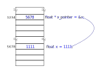

.. Kenneth Lee 版权所有 2022

:Authors: Kenneth Lee
:Version: 0.1
:Date: 2022-08-28
:Status: Draft

C++编程入门3：程序的组成和编译链接的原理
****************************************

这一章我们来看看一个C程序是怎么组成的。

第一章我们介绍了计算机的组成和运行原理。它是个上电开机就开始转的东西，转起来以
后它首先运行什么地方的指令（程序)呢？其实也是一些程序。这些程序叫Boot Loader
（就是启动代码的意思），操作系统（就是基本的管理整个计算机的程序）……等等。这些
程序很多也是用C写的（也有少部分用汇编写），但一般程序员都不写那部分代码。因为它
们是和做计算机硬件的人把内存的地址放在哪里啊，外设每个地址表示什么啊这些东西相
关的。说到底那些都是细节的，做硬件的人和做软件的人怎么约定的问题，和大部分人拿
计算机来做计算这个目的是无关的。学计算机其实主要学的是那个，但作为入门，我们现
在的学习可以先学习比较通用的C/C++语言语法，能做我们需要的计算就可以了，其他东西
慢慢再说。

所以，计算机刚刚启动的代码（叫Boot Loader或者固件），启动完以后控制所有的输入输
出设备、内存这些东西的代码（叫操作系统），我们都先不管。我们编译一个C/C++程序，
这个程序我们交给操作系统，操作系统想办法给我放到一个内存里面去运行，这就可以了，
其他细节，我们不关心。

所以，从这个角度，我们可以理解一下我们的程序到底在干什么：::

  void test_sum(void) {
    int sum = 0;
    for (int i = 0; i < 100; i++) {
            sum += i;
    }
    printf("sum = %d\n", sum);
  }
  
  int main(void)
  {
    test_sum();
    return 0;
  }

上面这个是个完整的C程序。你要把它看作是人给计算机（其实现在是操作系统负责代表计
算机来接受你的要求了）一份任务说明书。

这个说明书的main部分，就是主任务。操作系统拿到这个说明书，首先去找main在哪里，
然后就看到里面要求执行test_sum这个子任务，然后我们去看test_sum这个子任务，里面
首先说：我要一个内存，能放得下一个整数（int），一开始等于0。然后它接着说（注意
，下面的话用数学证明题的方式来理解）：

  对于每个整数i，从0开始，每次加1，直到100，请把sum加上i。

这就是之前我们说的，我们尽量让计算机来做重复的事情，我们来做创造的事情。要有多
少个i加起来，每次加放到什么内存中，这些事情我们去给计算机想（讲）明白，而计算机
负责把这件事重复100遍。

我们的脑子只要简单动一下，把这里说的100改成100000，计算机就会多算1000倍的过程。
我们负责高等级的脑力劳动，计算机负责低等级的脑力劳动。这就是计算机的核心用途。

这个main，定义了一个计算过程，我们称为一个“函数”。C语言的程序主要就是定义这样一
个函数，操作系统负责从这个函数入口的地方开始执行，到结束的地方结束。它和数学上
用函数定义一条公式差不多，它也确实可以直接用来定义一个函数，比如下面这个函数用
来计算一个多项式：::

  float f(float x)
  {
        return 3 * x^2 + 2 * x + 1;
  }

这个函数把输入的x作为一个参数计算一条多项式的值。你还可以分成很多步来计算这个函
数，比如这样：::

  float f(float x)
  {
        float y;

        y = 3 * x * x + 2 * x + 1;
        y = y * y * y;
        return y;
  }

这是先用多项式计算这个y，然后再算y的三次方，这分成了两步来算这个结果。

函数里面可以调用函数，比如前面这个计算过程，我们把两个计算步骤分成两个函数，可
以写成这样：::

  float f1(float x)
  {
        return 3 * x * x + 2 * x + 1;
  }

  float f2(float x)
  {
        return x * x * x;
  }

  float f(float x)
  {
        float y;

        y = f1(x);
        y = f2(y);
        return y;
  }

这个f也可以写成这样：::

  float f(float x)
  {
        return f2(f1(x));
  }

这个形式一写，你应该就明白，这就是复合函数。

经过这样一举例，你应该看出来了：其实一个C程序就是写一堆的函数，用这堆函数来完成
一些计算（计算的方法就称为“算法”，算法有很多经验和技巧，这是你未来的课程之一）。

C程序不用关心寄存器，这事情现在都交给编译器了，所以你唯一要关心的是内存。内存在
哪里，这是编译器和操作系统约定的，你就说你要多少内存就可以了。这叫数据类型定义，
比如前面这个函数的float y，就是一个数据类型定义。它表示在内存里面找个位置，用来
放一个数据。这个数据前面那个声明，叫这个数据的“类型”。它有两个作用：

1. 类型决定这个数据要多少内存才能放得下；
2. 类型决定这个数据怎么用；

比如int，表示这个数据是个整数，在一般的平台上，它是32bit的（有些平台上是其他长
度的，这个教材里面会讲，等你看到再说）。而float，表示这个数据是个小数，它也是
32bit的。这两个类型占的内存一样，但因为类型不一样，你用来做加减乘除，结果就会不
一样。所以我们说，类型不但决定了要多少内存，还决定它怎么用。否则存在内存里面的
就是个冷冰冰的数字，你没法解释它什么意思。

当然，作为中级语言，C语言也可以让你直接控制写什么内存地址，比如我要写0x123456这
个地址，我可以直接这样写：::

  int *a_address = 0x123456;    // 定义一个整数的地址，地址是0x123456
  *a_address = 10;              // 向地址里面写10

这种地址，在C语言里面叫“指针”，Pointer。这个地方思维要拗口一点了：这里你先要求
编译器给你一个内存，用来放“指针”这个数字，然后你把指针的数字当作内存的地址，把
那个内存地址上的内容当作一个数据来用。图示如下：

.. figure:: _static/内存模型.svg

你看，在C语言的认识中，所有东西都是内存，数据是内存，代码也是内存，操作系统是内
存，固件是内存，你自己的程序也是内存。程序就是把内存里面的数字算来算去，得到一个
结果而已。

而指针，就是内存的地址，类似这样：

假设你的程序是这样写的（这个地方其实不符合语法，我只是为了示意和突出要点，按人
脑理解就行）：::

  float x = 1111;   
  float * x_pointer = &x;

这里其实是告诉C编译器，你要一个内存，把他解释为浮点数（什么是浮点数我们一会儿再
说），里面放上1111。然后第二行你还是要一个内存，这个内存用来放一个放浮点数地址
的地址内容。对照前面的示意图，假定你的x放在5678这个地址上，而x_pointer放在1234
这个地址上，那么1234这个地址上的内容就是5678，所以，假定你计算::

        data = x_pointer;

的的data就等于5678，但如果你计算：::

        data = *x_pointer;

这表示访问地址的内容，所以你得到的data就是1111了。当然，因为你说了x_pointer是个
浮点数的指针，所以*x_pointer就是浮点数了，所以1111怎么解释，就要看浮点数是怎么
规定里面的格式的了。

指针是学习C语言要突破的第一个难点，因为我们经常会发生判断什么“指向自己的指针”，
“指针的指针”，“指针的指针的指针”之类的概念。但其实你理解了这个的内存是什么，这
些问题很简单，远不如你们高中学的数学那么难。

然后我们再解释一下类型这个问题。我们说了，对计算机来说，所有计算都是内存里面放
的一个二进制数字。这个数字用来代表什么，就是一个约定了，比如就一个字节来说，你
可以用00000000表示0，00000001表示1，00000010表示2，等等，这样可以表示一些整数，
但怎么表示负数呢？那又需要一套方法了对吧？（这个以后会专门学，叫补码）。然后要
表示小数呢？这又需要一套方法，比如这里这个float，就表示浮点数。浮点，就是那个小
数点的位置是浮动的，我们先把一个小数变成x.xxxx * 10^n这个形式（10^n表示10的n次
方），然后去掉小数点当作一个整数，化成一个前面的整数，然后在把n也当作一个整数，
把两者拼起来放到内存中，这就成为一个“浮点数”了。其实内存里面还是这种0，0, 1, 1
的数字，只是看你怎么解释它而已。大部分时候，基本上我们都是把所有的“数”，都弄成
一个或者多个整数，变成整数以后，就只剩下用多少个bit表示整个整数的问题了。C/C++
的“类型”，就是告诉计算机，用什么方式来解释这些内存里面的“整数”而已。

更高级的语言，自动化程度更高了，你每个数据，它会在内存中同时放类型（类型也是一
个数，比如你可以用0表示整数，1表示浮点数，2表示双倍大小的浮点数，等等）和数据，
这样你用一个数字的时候，它可以自动给你判断这个数据的类型是什么，可以做很复杂的
计算。比如在Python里面，你可以写一个字符串加上一个数字。这在数学上没有什么意义
的，但它可以表示把这个数字解释成一个人可以读的数字，然后加到字符串的后面……这种
也是看你怎么解释这个要求而已。

这是，把一种人理解的东西（数字，类型，文字等等）变成一组数字的过程，叫“编码”，
把数字解释成人能理解的信息的过程，叫“解码”。计算机的所有行为，都是在“编码”，“解
码”。你执行int sum += b; 是把数字编码到sum里面去，你用cout >> sum是把sum里面的
内容解码到屏幕（控制台）上让自己看到。

学习C/C++的时候，如果你不是要做操作系统，编译器，数据库这类程序，通常你不用管这
些数据怎么编码的，你只要保证你要做什么计算，就用对类型，不要超过范围（比如一个
字节最大只有255，你把两个字节大小的东西加起来放到另一个字节中，就会超出范围，结
果就不对了），就行了。

好了，刚才我们知道一个程序是怎么写成的了，用这种方法你可以实现很复杂的计算，也
可以通过直接读写某个输入输出设备的地址来控制这些设备了，但这些一个字节一个字节
的代码，如果全部写在一个C文件中，你那个C文件就会有几百万行，几千万行。这没法管
理啊。

所以C编译器允许你分成很多个C程序来写。比如前面那个f和f1, f2的程序。你可以把f写
在一个文件中，把f1, f2写在另一个文件中。这样我们就很容易分工：张三专门负责一部
分逻辑，写一个文件；李四负责另一部分逻辑，写另一个文件。编译器（严格说是链接器）
负责把它们拼在一起，拼到内存中就可以了。

上一节我们解释编译方法的时候，那个程序就把整个程序分成了my_application.cc和
my_functions.cc。

现在我们可以解释一下，到底怎么控制输入输出设备了。控制外设，这个东西啊，要一个
硬件一个硬件去看，每个硬件都不一样的。但大部分程序员不可能老去看这种硬件的说明
书的。所以，编译器会提供很多做硬件和做操作系统的人提供的文件，那些文件里面直接
就写好了一些函数，那些函数不用你写，你调用它就可以实现你想要的结果了。

本章最前面的test_sum()函数里面，我们就调用了一个函数，叫printf()，这个函数负责
向输出设备输出一串字符。这个函数怎么做的？我们都不关心，这是做操作系统和编译器
的人根据那些硬件和操作系统的定好的约定写的。你用就好了。这些函数就叫“库函数”。

所以，学习C/C++语言你主要学两个东西：

1. C/C++语言的语法
2. C/C++语言支持的各种库函数

这样，我们就介绍完C/C++语言的基本要素了，其他东西看教程和例子就可以。C的语法基
本上C++都支持，写的程序都是文本文件，只是C的程序通常用.c做扩展名，C++的程序用
.cc或者.cpp做扩展名。所以你把C程序的例子改个名字叫x.cc，用C++编译器编译，通常一
点问题没有。C++的新功能都是在C原来就支持的方法上增加的，比如前面那个printf的调
用，在C++里面还有这样的写法：::

  cout << "hello world" << endl;

这种东西叫“语法糖”，就是说这种语法也不影响大局，但这样写起来特别方便，容易看，
特别增加出来的。C++多了很多语法糖和其他比糖更有用的“给计算机说话的方法”（比如对
象，多态，模板等），那些都可以从教材里面学。

在这个一章结束前，让我介绍一个其实你迟早都会体会到的概念。但早点有所了解，会很
有帮助。这就是所谓的“线程”，Thread（就是毛线团那个单词）。

线程表示一个连续的过程。我们研究一下下面这个程序：::

    int sum = 0;
    for (int i = 0; i < 100; i++) {
            sum += i;
    }

我们到底怎么理解这个程序的行为呢？我们可以把它理解成一个连续的过程：::

  内存sum写成0
  内存i写成0
  i<100吗？是
  sum写成原来的sum + i
  i++  (i写成i原来的内容加上1)
  i<100吗？是
  sum写成原来的sum + i
  i++  (i写成i原来的内容加上1)
  i<100吗？是
  ...
  i<100吗？不
  结束

这种毛线一样，一步连着一步的计算要求，就是叫一个线程。所有的程序，都是一个这样
的过程。小一点的程序，比如现在这个，只有两个数字在变化。真正的程序，有几万，几
百万的数据在变化（特别是如果你学的是人工智能这些计算为主的学科）。所以你理解一个
程序，这样理解就行了：先认为所有的数据都有一个值，每个指令，都给一些值一个更新，
你要知道你的程序最后的结果，只要把这些数据全部列出来，然后把这些步骤在脑子里面过
一遍，第一步，那些值变成什么了，第二步，那些值又变成什么了，第三步……。

这样就能理解这个程序到底在干什么了。

后面你会学习在一个程序里面描述多个线程的方法，那个我们等到掌握了基本的语法的时
候再深入来说。

到现在为止，学习例子的前置知识已经说完了。可以停下来，看教材，试着敲十几个例子
，一个个试一下，不同的语言元素怎么使用再说了。等有一些基本认识了，再开始看第4章
吧。
