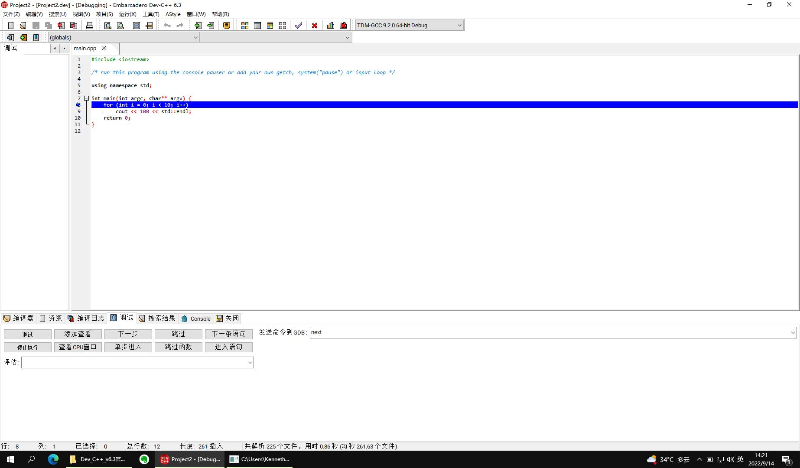
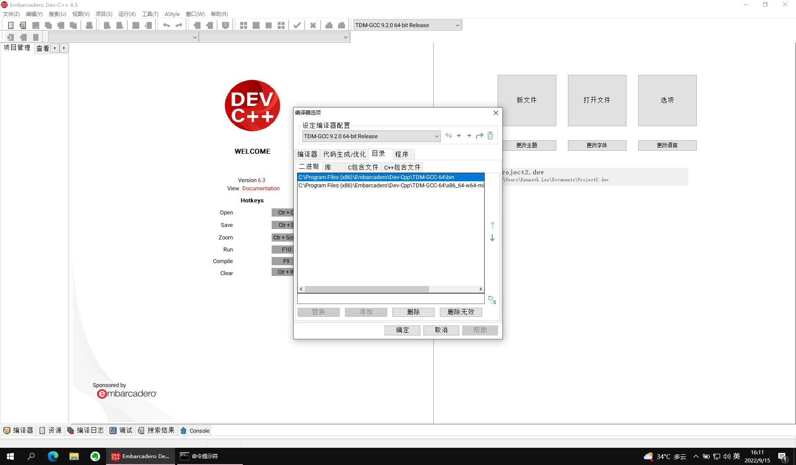
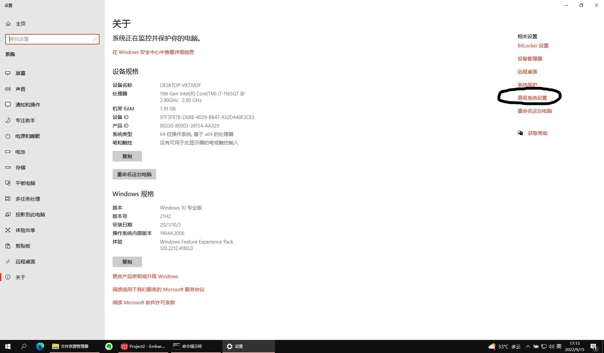
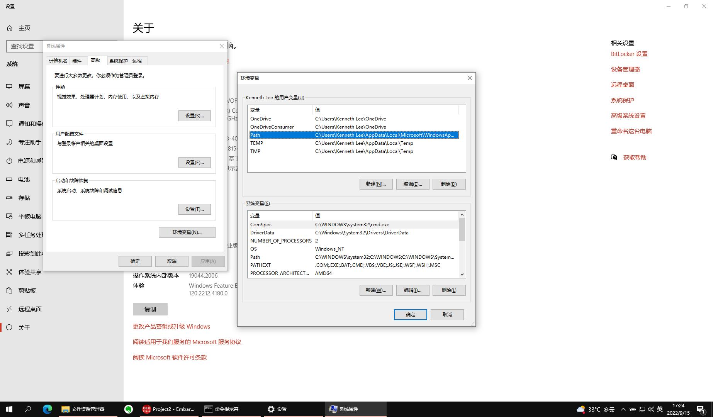

.. Kenneth Lee 版权所有 2022

:Authors: Kenneth Lee
:Version: 0.1
:Date: 2022-09-14
:Status: Draft

C++编程入门6：IDE环境
*********************

Dev C++
=======

好了，我们现在知道你们学校用的环境是Dev C++了。我也来解释一下Dev C++和我们之前
学习的知识是什么关系。

Dev C++是一个IDE，最早是BloodShed公司开发的，后来这个公司不开发了，就开放了源代
码，贡献了出来。所以，这个软件其实是免费的，但国内有些公司组合了一下，直接拿来
卖钱，所以有时你会在网上看到收费的版本，别给钱，找免费的版本就对了（比如这里：
https://devcpp.gitee.io/）。

IDE，是“集成开发环境”的缩写。我一开始建议你不要学用IDE，因为IDE本质上就是把很多
可以自动搞定的事情给你隐藏了。但正如我们一开始说的，它隐藏得越多，你知道得越少，
你能控制的东西也越少。这样你学了半天，你都不知道自己在干什么。但如果要应付考试
呢，你还是要对某个菜单在哪里，某个命令是什么，这些东西很熟悉才行，所以，如果学
校用这个东西做基本环境，最好还是多用用，熟悉些才不会手忙脚乱。

你写了一段时间程序，也知道软件写错了是很常见的现象，特别是DevC++这种老旧的，没
有多少人用，又集成了一堆其他软件的软件，它是有不少问题的，如果你不习惯它的问题
（软件叫Bug），考试会弄半天都没法运行，这很亏。

其实现在国内更流行的IDE是VS Code（这个东西你的Windows上已经安装了），你们学校可
能就是因为懒得升级教材才继续用这个东西。但无论如何，多看一两个环境是什么样的，
也有助于你理解C++这个语言的本质是什么，所以学习一下也没坏。

长期使用，我是建议还是使用前面介绍的Windows的Linux环境比较好，因为那个工具更丰
富，更现代化（比如直接使用git进行版本管理），DevCode太老旧了。等你熟悉Linux的运
行环境，正式写程序的时候，可以根据喜好继续用基本工具，或者直接用VS Code的IDE。

作为开源软件，DevC++用的编译器也是开源的gcc/g++，但它那个环境是基于MinGW的。下
面这个图示意了多种gcc运行环境的区别：

你现在用WSL最大的缺点是不能用图形界面（其实也可以用的，要更多的设置而已，那个我
们先不搞）。还有就是它的根目录是Windows用一个单独的文件模拟的，所以你直接用
Windows的工具访问不了它。不过这个问题现在已经解决了，Windows做了一个特殊处理，
把这个Linux的系统当作一个网络上共享的盘来让你访问了。你可以在Ubuntu的命令行上运
行::

  explorer.exe .

这样会用Windows的文件浏览器打开你当前的Linux目录（explorer.exe是Windows的文件浏
览器，后面那个点是当前目录），这样你喜欢怎么拷贝就可以怎么拷贝了。

当然，你仍可以通过cp命令从Linux中把你目录中的文件拷贝到/mnt/c，从而拷贝到
Windows的C盘上。

但这样一来，你在Windows的一般程序其实是没有办法直接调用Ubuntu里面的gcc的，而这
个用DevC++好处就是不需要WSL，直接就可以当作普通的Windows程序运行。

DevC++运行起来是这样的：

里面那些概念其实你都知道，创建多个.cc，多个.hh，都可以在这个图形界面上看到。但
其实和你一个个打开它们并没有区别。Makefile不需要你写，它会根据你有多少个cc文件，
自动生成这个文件（如果你想知道这个自动生成的Makefile是什么样的，你可以从菜单“运
行-编辑Makefile”打开这个Makefile。但如果你要做更复杂的控制，那你最终还是要自己
写Makefile的。

这里还要理解一个Project的概念，所谓Project，就是我前面讲的“工程”的概念，就是帮
你记住你有多少个文件，每个文件怎么编译，打开这个文件的时候用什么缩进等等。这些
信息记录在一个叫.dev的文件中，但格式是什么样的，就只有这个工具才知道。所以我个
人不是特别喜欢这种IDE环境，因为这样如果我换一个工具，这些内容就都解释不了了。

其他东西你可以一个菜单一个菜单去试，反正概念之前都介绍过。如果你只是写教材中那
些简单的程序，通常你在Project中增加一个个的.cc或者.hh文件，然后敲进去，然后什么
都不管，按F9就是编译，F10就是运行。F2是在当前光标位置设置断点，F5就是开始调试。
简单试一下就可以开始。这种东西很简单，很多老师喜欢拿这个东西教人入门，因为不用
折腾，但这样学习你可能学很久都弄不清楚你的程序是怎么工作的。所以，大部分时间最
好都用WSL（Windows Subsystem for Linux，就是我们前面讲的那种方法）。如果你以后
熟悉这些命令了，我甚至建议不要用Windows，直接用Linux。

VS Code
=======

如果你有兴趣用VS Code，那我们也介绍一下VS Code的基本原理。VS Code不是一个针对
C/C++的IDE，它本质是一个可以写任何代码的编辑器，和你一开始学习的Vim一样。但它提
供了很多插件，你用来写C/C++的时候，它会提供C/C++需要的那些功能（比如编译，调试，
代码自动高亮，自动补全等等），如果你用来写Python，它又会提供Python需要的功能。

作为一个比较现代的工具，VS Code包含很多很新的功能（比如自动分析代码的调用关系，
集成git等等），确实也值得长远使用，特别是如果你以后要分析操作系统，数据库，编译
器这种大型软件的代码的时候，你会发现VS Code会很方便，而Dev C++就全面落后了。

VS Code安装很简单，下载安装包装就是了，它也是免费软件，不需要付钱的。在Windows
上，Linux都能安装。

它的很多功能都由插件提供，但一般你不用专门去装，比如你用它编辑C++文件，要调试，
调试的时候它就建议你装相关的插件的，你到时装就可以了。但有时可能你想装一些你因
为其他原因想用的插件，比如你想用vim的方式编辑文件。那么，你可以通过菜单：查看-
扩展，来打开扩展菜单，然后你就可以通过搜索vim这样那个的关键字找到想要的插件，然
后装上去就可以了。

VS Code没有Project的概念，它的Project就好像我们之前介绍命令行一样，目录就是它的
Project，所以它会要求你打开一个目录，同时，它会问你，是不是这个目录是安全的，然
后它执行的各种动作都在这个目录里面，免得把目录之外的东西弄坏了，所以，你最好创
建一个写你当前程序的目录，然后把所有东西都放在这个目录中，免得东西到处都是。

但VS Code有WorkSpace的概念，这有点类似DevC++的Project，它保存当前的目录，配置信
息，你可以创建一个WorkSpace，它会变成一个.code-workspce文件（这个也是文本文件，
可以直接打开看的），下次你打开这个文件，它也就打开你的目录，然后你设置过的东西
也会留在这里，这会让事情简单一些，但你不用这个功能，每次打开一个目录，其实也没
有任何问题。

对初学者来说，VS Code最大的缺点是它是个编辑器，它是不包含编译器的。就好像vim不
能代替gcc一样，它要求你自己安装gcc，如果你在windows中不能运行gcc，那么VS Code也
无法编译你的程序。

我们可以安装Windows版本的gcc。这有两个办法，一个是安装cygwin，这个东西可以从这
里下载：
`cygwin <http://cygwin.org/setup-x86_64.exe>`_
它是一个类似前面我们介绍的那个MinWG一样的工具（好像它用的就是MinWG，这个我不太
记得了），它把几乎所有的Linux程序，都重新在Windows下编译了一次，包括gcc，你安装
这个东西以后，设置路径就可以让Windows访问它。它也是免费的。

不过cygwin安装要很久，你下下来的只是一个安装器，还不是你要安装的软件，你具体选
装哪些软件，还要你选择从什么服务器装，慢的服务器可能要下载很久，然后才能安装。
我推荐一开始不要用这种办法。

第二种方法是给VS Code装一个MinWG的gcc，这也可以在网上下，也是免费的。

但如果你已经安装了DevC++，那么……刚才我们说了，DevC++其实就装了一个MinWG的gcc，
你可以通过菜单：工具-编译选项，打开编译器的配置，在”目录“一页中，你可以看到你的
MinWG gcc安装在什么地方。你要做的是，把这些位置加入到Windows的PATH变量中。

比如在我的机器上这个配置是这样的：

你把这两个目录拷贝下来，然后打开一个Windows的文件浏览器，在“此电脑”上点鼠标右键，
选择“属性”，然后在打开的窗口中找到“高级系统设置”：

然后选择环境变量，然后编辑里面的Path这个参数，按那里的格式，把前面的目录都加进
去（用分号隔开）。这样，你在任何地方运行gcc，windows都能找到那两个目录中的gcc了。

这个窗口有两个设置，上面窗口中的参数是对你个人的，下面窗口的参数是对所有人的
（用其他名字登录的用户），你喜欢设置哪个都行，我一般这种设置都是只改针对个人的。

这样之后，重启动一下你的VS Code，试试在“命令行窗口”上运行一下gcc这个命令，如果
它不说找不到gcc（但会说你没有输入文件），那现在VS Code能运行gcc了，你的那些插件
应该就可以正常工作了。
