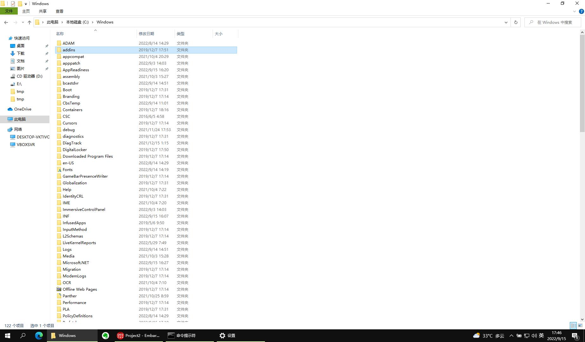

.. Kenneth Lee 版权所有 2022

:Authors: Kenneth Lee
:Version: 0.1
:Date: 2022-09-15
:Status: Draft

C++编程入门7：脚本
******************

从这一章开始，我们开始放飞自我，根据你问什么问题来讲什么问题。

这一章我们来理解一下什么是脚本。

早期的计算机普遍都是命令行的，因为显示一些字符串需要的数据比较少，如果显示复杂
的图形，就需要很多的数据了。

早期的计算机处理能力不强，处理不了那么多数据，所以尽量都是输入字符，输出字符。
所以早期的人机接口都是字符串。甚至早期我们玩的游戏都是字符串的。如果你要删除一
个文件，你运行：::

  rm myfile

这样我们只是传进入十几个字节的字符串，如果计算机没有删除成功，只要给你返回十几
个字节：::

  myfile cannot be deleted

这很容易就搞定了，但如果要显示给你一个这样的窗口：

这个就不是十几个字节的事情了。

所以，计算机人机接口的历史就是从命令行发展过来的。到了现在，这种十几个字节的事
情已经不是问题了，大部分时候，人们不在乎用几百兆的数据去进行人机交互。但命令行
还是很重要的，因为有时我们会遇到很多极端的环境，比如我们需要通过一条卫星通道去
控制我们计算机，那就很难通过卫星给你传递很大的数据了。就算不是卫星，如果我们从
宿舍去控制我们学校机房的计算机，我们也希望越快越好，这时，命令行就很重要了。

所以这就是为什么我一开始先教你用图形界面，而是用命令行，因为那个是最后的保证，
会命令行你一定能找到方法搞定那个图形界面的，但会图形界面，你不一定能用好命令行。

但省大小不是命令行一直流传下来的关键原因，关键原因是：命令行可以编程序。比如，
你要删除的不是一个文件，你要删除100个文件，你可以这样写这些命令：::

  for file in `ls myfile*.cc`
    if test -e $file
        rm $file

你看，这个和你用C写代码，是一样的。命令行这个好处，是你用图形界面怎么都搞不定的，
图形界面没法自动化，但命令可以自动化：写一个简单的程序就可以了。

正如我们一开始说的，作为一个程序员，我们就很少把重复的事情做很多很多遍了，所有
有可能要重复，写起来很麻烦的事情，我们就都写成脚本。这样有两个好处：

1. 下次运行什么都不用记了，直接运行脚本就可以了。
2. 脚本本身变成了一个笔记，要查笔记看脚本就行了。

我举个例子，假设你每次编译完你的程序，你都要拷贝到windows的目录下，你每次都要运
行这些命令：::

  cp myapp /mnt/c/用户/qing/编译好的应用程序/
  cp myapp2 /mnt/c/用户/qing/编译好的应用程序/
  cp myapp3 /mnt/c/用户/qing/编译好的应用程序/

那么你就可以打开一个文本文件（比如就叫cp.sh)，把这些命令都写进去，然后你每次要
做这些动作的时候，直接运行：::

  sh cp.sh

（sh是一个shell，我们用这个shell去运行cp.sh这个“脚本”。）

就可以了。这个cp.sh，就是一个“脚本”。以后如果你不记得你文件都放在哪里了，打开这
个文件也可以知道了，就不会出现不记得的情况。

学习脚本首先要学习命令，我上次给你那本大部头，你要对着操作一次，才知道这些命令。
多用几次就会记住怎么用了。至于生癖的命令，可以到用的时候再去查。

那些for啊，if啊，其实也是命令，这些都需要学。那个我这里讲不完，你要自己去用才知
道。

我这里只给你一个Cheatsheet：::

  ls                     # 列出当前目录下的文件
  ls -l                  # 用long的方式列出当前目录的文件和它们的属性
  cp file1 path          # 把file1拷贝到路径path
  cp -a path1 path2      # 把path1中的所有文件拷贝到path2中
  cp file1 path/file2    # 把file1拷贝到path中，名字改成叫file2
  rm -Rf path1           # 删除path1中的全部文件
  rm file1 file2 file3   # 删除文件file1, file2, file3
  mv file1 file2         # 把file改名叫file2
  mv file1 file2 path    # 把file1和file2移动到path目录中
  mkdir path             # 创建一个叫path的目录
  cd path                # 当前目录移动到path
  cd ..                  # 移动到当前目录的上一级目录
  sh file                # 用sh（就简单的shell）运行file这个脚本
  . file                 # 用当前shell运行file这个脚本
  exit                   # 退出当前shell
  adduser qing           # 添加用户qing
  deluser qing           # 删除用户qing
  passwd qing            # 修改qing的密码
  passwd                 # 修改当前用户的密码
  chmod +x file          # 让file变得可执行
  chmod -x file          # 让file变得不可执行
  chmod o-x file         # 让file对于other的人不能执行
  chmod u+x file         # 让file对于file的所有人可以执行
  man ls                 # 看ls的手册
  man -k user            # 查找有哪些包含user这个关键字的的手册名字，如果你隐约记得有一个命令，但记不住确切的名字，可以用这个方法找

其他的等你问我再补充吧。

在Unix世界中，和你交互的那个界面，叫一个shell，表示它是操作系统的“外壳”，shell
有很多种，图形界面也是一种shell。最传统的shell叫sh，功能很简单，我们平时用得比
较多的，是bash，你的Windows上的ubuntu默认就是这个Shell。其他的还有csh，tsh等各
种shell。windows也有自己的命令行的PowerShell，它们每个语法都不同，我建议你先从
bash shell入门。其他的shell基本语法很接近，只是高级语法不同。反正所有计算机语言
都是这样，先学一种语言，需要的时候再学一种新的，多学几种以后，大部分套路就都知
道了。

脚本也可以像命令一样运行。这有两个条件：

1. 在脚本最前面加上这一句：::

      #!/bin/bash

   这是为了保证操作系统知道你要用哪个shell去执行你的脚本

2. 用chmod +x命令把这个文件修改成可执行的。

这样以后，你的脚本就可以用这种办法运行了：::

  ./my_script.sh

路径是必须的，因为Linux和Windows不同，Linux不认“当前目录的可执行文件"的，你运行
一个命令，如果不在PATH这个环境变量中声明路径，它是不会找当前路径的。

上一章我们为了让你的VS Code找到gcc的安装位置，我们就修改了Windows的Path环境变量
了。

那到底什么是环境变量呢？

还记得我们之前说过的“库函数”吗？你调用cout >> "Hello world"，调用的就是库里面的
函数，假设，我们的cout库支持打印不同的颜色，但你这个调用没有指明颜色，我们有什
么办法让这个库知道你要显示什么颜色呢？

为了解决这个问题，Shell通过操作系统给你的程序的内存里面放了一组预定的变量，比如
可能是这样的：::

  PATH=/bin;/sbin;/usr/bin
  COUT_COLOR=RED
  LC_ALL=zh_CN.GB18030
  ...

这样，你这个cout的库可以从约定的位置读一下，就可以获得这种参数了。在bash shell
中，你运行env，就可以找到所有的环境变量，你可以运行export COUT_COLOR=BLUE这样设
置新的变量，如果你要固定设置下来，就可以好像修改.vimrc那样，把这句话写到.bashrc
中。

我们运行命令的时候，可以动态修改一个命令的环境的，比如你可以试试分别运行下面两
个命令：::

  LC_ALL=zh_CN.GB18030 date
  LC_ALL=C date

LC_ALL是个环境变量表示当前的语言，第一个命令表示现在是中文，所以date输出的就是
中文，而第二个说用的是通用语言（这个C我也不知道是不是表示C语言），这样输出就是
英文的。

当你运行一个Linux的命令，如果你写了路径，Shell就会从路径去找到这个文件来运行，
但如果你没有写路径，Shell从PATH变量写的路径里找这个命令，如果找不到，那就是没有
了，通常当前目录，是不写在PATH中的，你当然可以强行写进去，比如这样：::

  export PATH=.;/bin;/sbin;/usr/bin
  my_script.sh

这样，如果你的my_script.sh在当前目录下，shell也是能找到的。但我建议你不要这样做，
因为这是一个被证明的不安全的习惯。等你未来学计算机安全的时候，我们再来讨论这个
话题吧。
