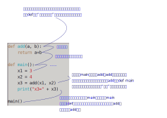

.. Kenneth Lee 版权所有 2022

:Authors: Kenneth Lee
:Version: 0.1
:Date: 2022-09-29
:Status: Draft

C++编程入门8：解释型和编译型程序
********************************

这一章我们独立解释一下解释型和编译型程序的区别。

程序是给计算机下命令。在第一章里面我们就解释了：计算机只能听懂“汇编指令”。如果
你想给它高级指令，那么你就需要人给它做翻译。

这种翻译有两种办法，一种是，你说一句，它翻译一句，马上告诉计算机要干什么。基于
这个逻辑写出来的程序，就叫“解释型程序”，典型的代表是：Shell脚本，Python等。翻译
型程序则不一样，它是把你整个程序全部翻译成汇编指令，然后把整个汇编指令告诉CPU，
这样的程序，就叫编译型程序，也叫“翻译型程序”。

比如下面这个Python程序：::

你的源代码怎么写的，它一句一句解释，每解释一句，执行一句，解释不了，就报错。

所以，下面这个Python程序是可以正常运行的：::

  print("1000+2000=", 1000+2000)
  我也不知道我在干什么()

因为解释第一句的时候，当场就执行了，所以，你其实是可以看得到1000+2000的那个结果
的，只是第二句话的意思是调用“我也不知道我在干什么”函数，这句话解释不了，它才报
错了。

但C++是不同的，C++首先会翻译成汇编，比如下面这个程序：

.. figure:: _static/cpp_exec.svg

所以，如果翻译不对，程序一句话都不会执行，如果你在C++里面一样调用一个“我也不知
道我在干什么”，那么编译器直接就会说，你错了，你也看不见前面的执行结果。

正因为这样，解释型的程序的程序写的顺序，和执行的顺序是完全一样的，但编译型的程
序的顺序是可以规定的，对于C/C++来说，就是从main开始，在main的最后结束，中间是否
经过其他函数，只看你的main里面有没有调用它。

也正因为如此，在C++里面，你是可以把程序写成这样的：::

  #include <iostream>
  
  using namespace std;
  
  int add(int a, int b); // 这句话是不用翻译的，只是给编译器的一个提醒，告诉它后面如果提到这个add，
                         // add是一个函数而已，add具体包括什么指令，它是不需要管的，因为现在还没有执行。
  int main(void) {
	  int x1 = 3;
	  int x2 = 4;
	  int x3 = add(x1, x2);
	  cout << "x3=" << x3 << endl;
	  return 0;
  }

  int add(int a, int b) { // 虽然前面使用了add，但把add定义在main后面一点问题没有，
                          // 因为执行的时候，这个地方已经翻译过了
	  return a+b;
  }

所以，对于编译型的程序，里面是可以放很多给“编译本身”的命令的，这些命令其实不是
命令CPU怎么工作，而是命令编译器怎么完成后面的编译。比如#define就是一个编译器命
令：::

  #include <iostream>
  
  using namespace std;

  #define MY_VALUE 3  //这是一个编译器命令，不产生汇编代码的，只是说，如果后面提到
                      //MY_VALUE，就用3代替而已。
  int add(int a, int b);
  int main(void) {
	  int x1 = MY_VALUE;
	  int x2 = 4;
	  int x3 = add(x1, x2);
	  cout << "x3=" << x3 << endl;
	  return 0;
  }

  int add(int a, int b) {
	  return a+b;
  }

所以，理解编译型程序的逻辑顺序，我们就要分清楚：到底我们在考虑的是编译器解释代
码的顺序，还是程序执行的时候的顺序。

其实编译和执行都是用了计算机的计算能力，前面这个main函数，你写成这样：::

  int main(void) {
        int x1 = 3;
        int x2 = 4;
        int x3 = (x1, x2);
        cout << x3 << endl
        return 0;
  }

你生成了一个代码，在编译的时候生成了一个加法，到运行的时候把3和4加起来，这是运
行的时候，用CPU的计算能力得到3+4的结果。

但如果你写成这样：::

  int main(void) {
        cout << 3+4 << endl
        return 0;
  }

编译器一看，“你要求打印3+4，这个结果我知道啊”，它直接就在这个地方给你放一个7。
这时，这个计算是编译的时候就已经完成了的，如果看它翻译的结果，就是这样的：::

  00000000000011c1 <main>:
      11c1:	f3 0f 1e fa          	endbr64 
      11c5:	55                   	push   %rbp
      11c6:	48 89 e5             	mov    %rsp,%rbp
      11c9:	be 07 00 00 00       	mov    $0x7,%esi   <-- 这个地方直接用了7个计算结果了，运行的时候根本不需要算了
      11ce:	48 8d 05 6b 2e 00 00 	lea    0x2e6b(%rip),%rax        # 4040 <_ZSt4cout@GLIBCXX_3.4>
      ...
