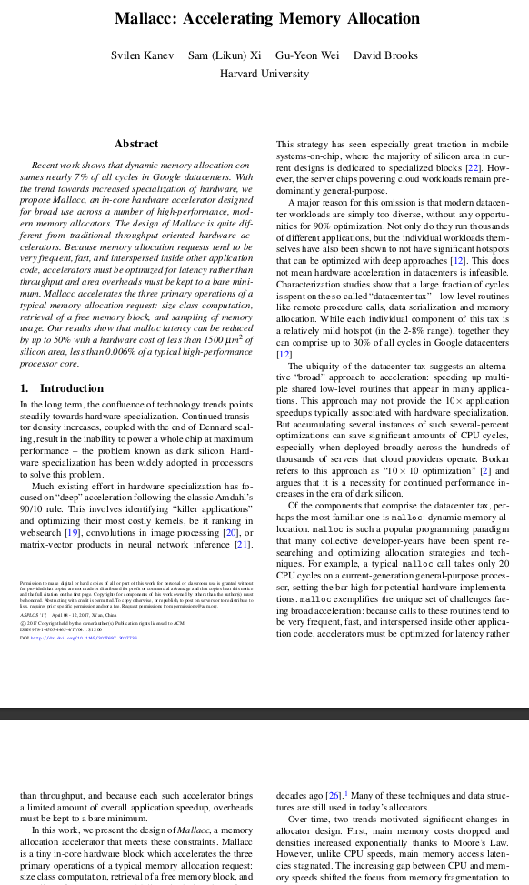
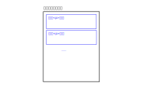
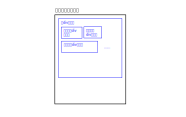
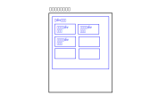
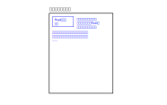

.. Kenneth Lee 版权所有 2023

:Authors: Kenneth Lee
:Version: 0.1
:Date: 2023-10-24
:Status: Draft

CSS布局
*******

介绍
====

本文介绍CSS的布局逻辑，但写作的目的其实不是介绍CSS的布局，而是说明怎么学习。

不少人把学习看作是看小说，怎么说呢？他们在期待“未知”：一个人进入一个森林，看到
了高大的树木，地上的青苔，洞中闪光的眼睛……这些都是看小说有趣的地方。因为你接受
到新的信息，随着这些信息在惊悚，好奇，恍然大悟等等。这是看小说。

但学习，Study，研究，不是这样的，学习不是无条件接受信息，而是快速发现规律，记
忆规律，指导新的创造等等。所以，学习必须快速找到满足目的的信息，而不是让信息随
意填充你的脑力空间。大学必须快速掌握这种能力，因为未来进行研究和工作的时候，你
一定会面对无限的知识的，如果你只能无条件用信息填充，你就相当于无法接受新的信息。
作为信息科学，计算机尤其如此，因为所有软件的开发，基本上都是新信息的发明过程。

所以，学习的时候不要问：C++有什么用？C语言怎么学？CSS的Layout怎么用？这种问题
基本上都是前面说的“期待未知”的态度。我们要确定一下我们研究那个问题的目的。

就好比我之前写的
:doc:`非线性电路分析`
我首先确定的是：为什么要做非线性分析？因为我们的电路中有器件的属性不符合线性方
程（比如欧姆定律）的，那么如果出现了这种电路，我们怎么知道电压和电流是多少？带
着这个目的，我们来想想，我们什么都没看的情况下，会觉得应该怎么解决这个问题？最
好当然是能找到那个非线性方程。欧姆定律是V=IR，那么我们能否有一两个参数，能让我
们写电容、电感或者三极管的方程：V=f(I, p1, p2...)，这样？如果写不出来，那能否
之间画出伏安曲线，然后我们在使用的时候通过查表法大概知道方程的解？……

这样一想，你就会发现，你现在学的那些什么确定工作点方法，画直流和交流负载曲线其
实就是这个方案的发展：虽然我们无法列出三极管的方程，但我们可以测量出它的伏安曲
线，但只有伏安曲线，我没法查表，所以，为了找到工作点Q，我可以用过用直线和测量
结果的交点来找到一些位置，这样一样解决部分问题啊。

这样，我们就学会那些知识了。但如果你不一开始这样建立问题的模型，给你讲半天工作
点，内阻，外阻的，你就记住个名字，根本不知道为什么要那个东西。这等于没有学。

CSS Layout的问题模型
====================

我们已经知道了CSS是为了给HTML定义格式的，以前的HTML，你写一个文档，每段文字是
什么格式，你需要在这段文字写上格式，比如这样：::

  
这是红色的标题

  
这是我们写的第一段

  
这是我们写的第二段

  
这是我们写的第二段

这样我们就写了两段文字，第一段是标题，红色的，居中对齐。第二段是内容，字体是宋
体，大小是10，靠左对齐。如此类推。

写惯程序了，你马上就会发现这很臃肿，因为同一个p的格式要写很多次。如果要修改一
下，改起来很麻烦。所以我们像C/C++写头文件一样，全部写在一起：::

  
  
这是红色的标题

  
这是我们写的第一段

  
这是我们写的第二段

  
这是我们写的第二段

.. note::

   我这个例子其实不好，因为标题会复用p的字体，实际中标题通常换个名字，不用p，
   二十用h1, h2，h3这样表示大纲的名字。但我们只是为什么说明问题，这个先不管了。

这样，控制格式的控制格式，写内容的只写内容，修改起来就比较方便。

那么Layout是什么呢？我其实不知道，但我光从文字上能猜到一些：这应该是说明整个段
落具体怎么放的问题，就好比我经常看的论文就是这样Layout的：

怎么说明我们希望放完左边再放右边呢？

带着这个疑问，我们才去开始收集信息。这样我们就收集到这样一个模型：

HTML是按一个树状结构：一个html包括<head>和<body>两个分支，<body>里面有多个
,
<h1>, <h2>, 
这样的分段，
等
下面可以有其他的块比如可以有其他div，<i>
斜体等等。所以它的Layout是给每层分配一个空间，然后决定这一层里面的东西怎么放。

举个例子，一个空的HTML，你就写几个个
（段落），在html页面上它就是这样放的：

把
换成
也是一样的，先每人占一行，如果规定这一行有多高，它就会限制大小，
不限制，就看里面的文字有多大了。

现在我向分成两边放，我先放一个
，然后
里面分成两两列，我可以给
设
置一个属性，display=flex（这个单词是肌肉、松紧带的意思），表示尽量压缩在一起放。
它就是这样的：

所以，说到底我们就是通过这种display参数，选择对本树节点下面的每个子节点如何放
置的一个描述，display的参数可以是：

* flex：一个连着一个放
* grid：一个矩阵的形式放（用grid-template-columns等参数指明有多少行多少列）

下面是2x3grid的layout样子：

还有一种不用display的设置方法是用float，表示其他人绕着它放，做出来是这样的：

不过这些都不重要了，都可以查到。理解了这个思路，剩下不过是上网搜索的问题而已。

总结
====

我自己很喜欢写笔记，本文也是一个例子，说明写总结为什么重要。因为只有你带着目标
去不断收集信息，才有可能把自己的认知分辨出来，完成一次study，这是大学里主要要
学会的能力。
