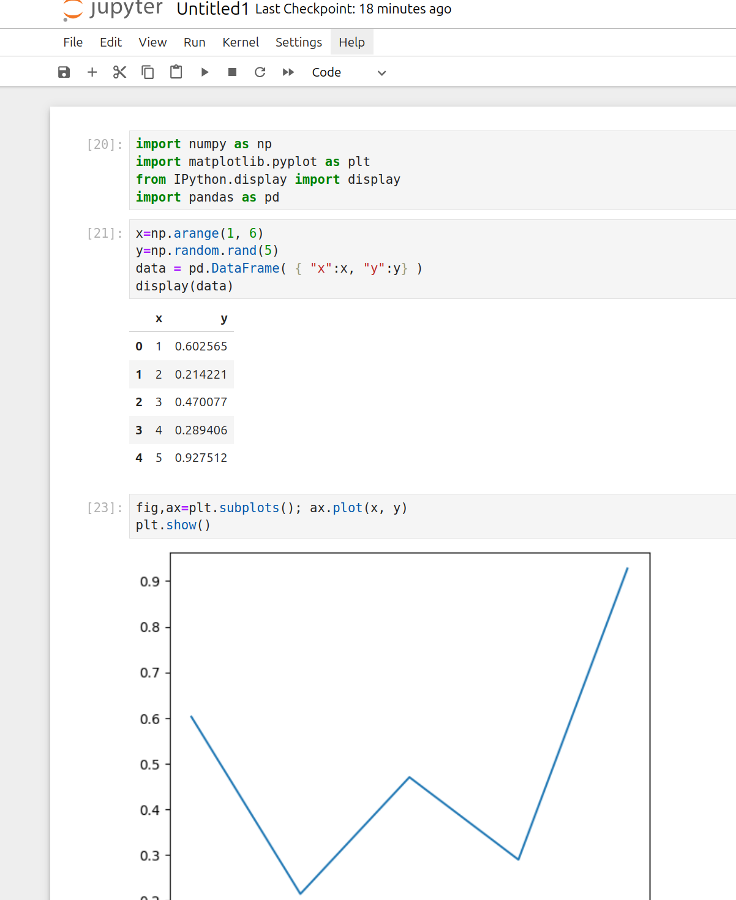

.. Kenneth Lee 版权所有 2024

:Authors: Kenneth Lee
:Version: 0.2
:Date: 2024-04-07
:Status: Released

python工程的原理
****************

本文介绍一下Python工程和库的原理。

Python是一种解释型语言，也就是说，它不是靠编译器把你写下的语言一句句翻译成机器
代码，然后让硬件执行执行的。它是靠运行在硬件上的一个“解释器”（又称为VM），一句
句读进你的指令，然后一句句执行的。

换句话说，你用C写一个程序，这个程序编译成一个机器代码（本地程序），然后这个本
地程序就和你原来的C代码没有什么关系了，它是一个可以直接在你的机器上直接运行的
机器代码组成的程序，它运行的时候不需要编译器在，因为它里面已经没有C的代码了，
只有机器代码。

而Python自己是一个本地程序，它用自己的源代码（很多都是C写的）编译出来的，编译
出来以后的VM可以解释你输进来的每个Python指令，所以你写的Python程序不能直接运行
的，它是用Python这个本地程序解释后，让Python这个程序（VM）执行的。

所以Python本身是一个本地程序，不同版本的Python是不同的程序，你可以在一个机器上
装很多个Python的，只要它们使用不同的路径，那就是不同的Python。

但一个Python（VM）的二进制程序，其实比我们平时练习写的C/C++程序复杂一些，它不
仅仅包含一个exe文件。在Windows安装的时候，它其实包含很多文件，不过Windows安装
程序都装了些什么，是不容易一个个找出来的，我们先用Linux里面安装Python的时候包
含些什么东西来类比一下：::

 bash> which python3                    # 先看python3运行的是哪个命令
 /usr/bin/python3

 bash> ls -l /usr/bin/python3           # 看看这是文件还是链接
 lrwxrwxrwx 1 root root 10 2023年 4月 9日 /usr/bin/python3 -> python3.11

 bash> ls -l /usr/bin/python3.11        # 看看这是文件还是链接
 -rwxr-xr-x 1 root root 6831704 2023年 3月13日 /usr/bin/python3.11

 bash> dpkg -S /usr/bin/python3.11      # 查找python3.11是哪个包提供的
 python3.11-minimal: /usr/bin/python3.11

 bash> dpkg -L python3.11-minimal       # 看这个包里面总共有些什么东西
  /.
  /usr
  /usr/bin
  /usr/bin/python3.11               # python二进制程序
  /usr/lib/binfmt.d
  /usr/lib/binfmt.d/python3.11.conf # 配置文件
  /usr/share/binfmts
  /usr/share/binfmts/python3.11     # Linux下直接支持运行python程序的钩子
  /usr/share/doc/...                # 文档
  /usr/share/lintian/...            # Debian OS的钩子，我们这里不关心
  /usr/share/lintian/overrides
  /usr/share/lintian/overrides/python3.11-minimal
  /usr/share/man/man1/python3.11.1.gz # 手册

可以看到，其实它不但包含一个二进制程序，还包含这个二进制程序运行的需要的其他文
件，以及这个程序需要的文档一类的东西。我们之前说过，二进制程序还需要动态库，这
里例子里面没有，其实Windows下是有的，它会包含一组.dll文件，这个我们暂时不细说。

这是一个最小的Python二进制，如果你只装了这些东西，你运行import numpy肯定是不行
的，那么这个numpy靠什么安装呢？我们可以这样找到它：::

  bash> dpkg -l |grep numpy
  ii  python3-numpy 1:1.24.2-1 amd64 Fast array facility to the Python 3 language

  bash> dpkg -L python3-numpy
  /usr/bin/dh_numpy3
  /usr/bin/f2py                      # 链接到f2py3
  /usr/bin/f2py3                     # 链接到f2py3.11
  /usr/bin/f2py3.11
  /usr/include/python3.11            # C头文件，用于写配合的C程序

  # 后面是这个python库的文件
  /usr/lib/python3/dist-packages/numpy/LICENSE.txt
  /usr/lib/python3/dist-packages/numpy/__config__.py
  /usr/lib/python3/dist-packages/numpy/__init__.cython-30.pxd
  /usr/lib/python3/dist-packages/numpy/__init__.pxd
  /usr/lib/python3/dist-packages/numpy/__init__.py
  /usr/lib/python3/dist-packages/numpy/__init__.pyi
  /usr/lib/python3/dist-packages/numpy/_distributor_init.py
  /usr/lib/python3/dist-packages/numpy/_globals.py
  /usr/lib/python3/dist-packages/numpy/...

  # 这配套有C的程序
  /usr/lib/python3/dist-packages/numpy/distutils/checks/cpu_asimd.c
  /usr/lib/python3/dist-packages/numpy/distutils/checks/cpu_asimddp.c
  /usr/lib/python3/dist-packages/numpy/distutils/checks/cpu_asimdfhm.c
  /usr/lib/python3/dist-packages/numpy/distutils/checks/...

  # 文档
  /usr/lib/python3/dist-packages/numpy/doc/__init__.py
  /usr/lib/python3/dist-packages/numpy/doc/...
  /usr/lib/python3.11/dist-packages/numpy/core/_multiarray_umath.cpython-311-x86_64-linux-gnu.so

  # Debian的文档
  /usr/share/doc/python3-numpy/README.DebianMaints
  /usr/share/doc/python3-numpy/README.f2py
  /usr/share/doc/python3-numpy/changelog.Debian.gz
  /usr/share/doc/python3-numpy/copyright

  # manpage，版本号，perl的配合文件
  /usr/share/man/man1/dh_numpy3.1.gz
  /usr/share/numpy3/versions
  /usr/share/perl5/Debian/Debhelper/Sequence/numpy3.pm

从这个输出我们可以看到两个要点：

1. numpy这个库背后其实是C语言写的，我们通过调用Python的函数来调用（效率更高的）
   C函数而已。

2. python3的库（例如numpy）其实是放在/usr/lib/python3/dist-packages这个目录下的。

所以，python这个程序能正常运行，其实和你装了些什么库，库在什么地方密切相关。这
个python程序会记住它要到什么目录中去找这个库，而这个库如果不是装在这个目录中，
它同样会认为没有的。

理解这两点，我们就还可以注意到另外两点。第一，我们前面说了，Python是解释型语言，
它的代码是python这个程序解释执行的，所以，它理论上可以跨平台，不同的机器，无论
它的底层汇编语言是ARM的还是x86的，都可以解释一样的Python语言。但我们看到这里
numpy里面其实是包含了C的，所以，如果你用的是numpy这个库，这个库是不跨平台的。
x86的numpy就只能用在x86上，ARM的numpy就只能用在ARM上。所以，这种库必须和python
VM这个二进制一样，要找到正确的平台版本才能用。

第二个问题。我不知道你注意到没有，我们一开始看Python二进制在哪里的时候，我们发
现它叫Python3.11，你其实还可以安装Python3.10，Python3.9，甚至Python2.12这样的
不同版本的python。但后面我们看numpy的时候，它的目录叫Python3，而不叫Python3.11。

这意味这什么？

这意味着，无论Python3.11还是Python3.10，Python3.9，其实用的是同一个numpy。这我
们称为“版本兼容性”。所有Python3目录下的numpy，都和Python3.xx兼容，但它们不和
Python2.xx兼容（两者其实语法都不完全一样）。所以你可以选择不同的Python3.xx版本，
但都可以用同一个numpy。

从这里就可以看到了，版本兼容是一件很麻烦的事情。比如Python2可以写这种语法：

.. code:: python

  print "hello world"

但在Python3里面这是错误的，Python3里面你要打印，你只能这样写：

.. code:: python

  print("hello world")

所以它不兼容。你用前面语法写的Python库，就不能在Python3的二进制上运行。但为了
支持尽量多的库，Python3.9, 3.10, 3.11都尽量支持一样的语法，这样它们互相之间就
“兼容”了，可能只是里面的实现不一样，但外面的语言是一样的。如果以后要升级到连外
面的语言都不一样，就只好叫Python 4.xx了。

基本的Python VM可以这样，语言一般不会随便升级，但库之间的依赖怎么办呢？比如我
们搞机器学习，需要用pytorch（python中它的名字叫torch），torch会调用numpy的函数，
但numpy也有很多版本，版本升级会增加函数，torch需要某个版本的numpy，这怎么办？

所以，python其实是有自己的包管理的，类似我们前面用apt/dpkg来管理Ubuntu/Debian
的包一样，python用pip来管理它的包（Python3的pip叫pip3）。你可以用pip3 list来看
你有哪些包，用pip3 show来看这个包的运行要求，比如下面这样：::

  bash> pip3 list
  Package              Version
  -------------------- -------------------------
  alabaster            0.7.12
  anyio                3.6.2
  appdirs              1.4.4
  apsw                 3.40.0.0
  argon2-cffi          21.1.0
  asttokens            2.2.1
  astunparse           1.6.3
  async-timeout        4.0.2
  ...

  bash> pip3 show alabaster
  Name: alabaster
  Version: 0.7.12
  Summary: A configurable sidebar-enabled Sphinx theme
  Home-page: https://alabaster.readthedocs.io
  Author: Jeff Forcier
  Author-email: jeff@bitprophet.org
  License: UNKNOWN
  Location: /usr/lib/python3/dist-packages
  Requires:
  Required-by: Sphinx

你可以看到我们安装了alabaster 0.7.12，而这个包依赖Sphinx，如果它对Sphinx的版本
有要求，也会在包里面说明。

所以，如果你在网上下载一个python的工程，通常它会包含一个requirements.txt文件，
里面有一堆它需要的文件和版本，例如：::

  numpy==1.16.6; python_version<"3.6" and sys_platform!="win32" and platform_python_implementation!="PyPy"
  numpy==1.19.0; platform_python_implementation=="PyPy" and sys_platform=="linux" and python_version=="3.6"
  numpy==1.20.0; platform_python_implementation=="PyPy" and sys_platform=="linux" and python_version=="3.7"
  numpy==1.19.3; platform_python_implementation!="PyPy" and python_version=="3.6"
  numpy==1.21.3; platform_python_implementation!="PyPy" and python_version>="3.7"
  py @ git+https://github.com/pytest-dev/py; python_version>="3.11"
  pytest==4.6.9; python_version<"3.5"
  pytest==6.1.2; python_version=="3.5"
  pytest==6.2.4; python_version>="3.6"
  pytest-timeout
  scipy==1.2.3; platform_python_implementation!="PyPy" and python_version<"3.6"
  scipy==1.5.4; platform_python_implementation!="PyPy" and python_version>="3.6" and python_version<"3.10"
  
有一个简单的安装方法：::

  bash> pip3 install -r requirements.txt

这样就可以装上所有的包了。国内有时访问不了pip的服务器（或者虽然可以访问，但很
慢），你可以加上国内（镜像）服务器的路径（下面这个是清华的）：::

  bash> pip3 install -r requirements.txt -i https://pypi.tuna.tsinghua.edu.cn/simple

但是，这样会造成新的问题：比如你要运行一个工程，它要求numpy1.16.6，另一个工程
又说，它要numpy1.19.7，按我们前面看到的目录架构，装上前者就会冲掉后者，装上后
者又会冲掉前者。

这就很麻烦了，所以，有人又开发了一个库，venv，来解决这个问题。你可以为你的包创
建一个虚拟环境（venv，virtual evironment），告诉Python包在另一个目录中。它这样
用：::

  bash> pip3 install venv
  bash> python3 -m venv 虚拟环境名称

-m表示运行module，运行一个已经安装的包，venv是我们要运行的包的名字，后面是参数。
其实pip3自己也是一个包，你可以这样安装pip3的：::

  python3 -m pip install venv

这表示用python3虚拟机运行pip这个包，参数是install venv这个包。（计算机的概念就
是这么绕。好的程序员从来都是语言大师。）

venv在当前目录上创建一个新的目录，和你给定的虚拟环境名称一样（我们假定这个名字
叫myvenv吧），然后你就可以这样激活它：::

  source myvenv/bin/activate

  # 去激活直接运行deactivate就可以了，deactivate这个命令是activate脚本生成的脚本函数
  deactivate

这其实只是给你当前的命令行控制台设置一些环境变量，让python VM可以找到这个目录
而已。这之后，你就不再需要用python3来运行python vm了，现在python就是指Python3，
pip就是pip3，你在python程序中import numpy也会找这个目录中有没有numpy（原来的系
统目录还是会找，但同时会找你的venv）。这样你再用requirements.txt安装包了，这些
包就不再影响系统目录了，而仅仅安装在这个目录中，你不用的时候可以整个删掉。

如果你要运行另一个工程，再创建一个venv就行了。两者就不会冲突了。这是我们在工程
上使用python的一般形式。

现在我们问这个问题：为什么C语言没有这么麻烦？其实很简单：C语言升级没有这么频繁。
Python发展实在太快了，等所有库都升级到一样的兼容版本上太慢了，所以就容易分裂。

你想想你写了一个程序，看到numpy有一个add函数，你用了，你才懒得管以后升级以后
add不是还在，你肯定直接就要求你的程序就依赖你用的这个numpy的版本了。但numpy又
不知道你用了它，它以后升级的时候照顾不到你，那只能是你这个程序只用某个版本的
numpy了，如果你的库以后出名了，很多人都依赖了，那时你才会考虑怎么持续和numpy一
起升级的问题。

这是个两难的问题。理解这种问题的存在，是理解软件工程解决的是什么问题的第一步。

Windows上的技巧
===============

Windows最不好的是对命令行的支持其实是很分裂的，每个图形界面用了几个命令行我们
都不肯定，也不知道环境变量怎么影响这每个命令行。所以其实我个人是建议直接找个命
令行来运行Python的，这样可控得多，等我们理解这个基本原理后，就可以针对每个不同
的图形界面去定位问题出现在那里。

对于已经装好的Python VM（在Windows下就是个exe程序了），Windows也没有dpkg一类的
命令让你找到它的目录在哪里，但我们可以用python自己来找到这些目录：::

  cmd> where python          rem (rem是cmd的注释），where是windows下的which命令

这里会告诉你你当前的控制台运行的是哪个python，如果在vscode你就要查你的插件具体
用的是哪个python了。如果你找不到不要紧，只要你能用它运行python程序，你就可以用
python程序本身知道这些目录。

下面我们用python解释器来说明怎么找到这些路径：::

  py> import sys            # sys库提供python的所有系统信息

  py> dir(sys)              # 列出sys的所有对外接口
  ['__breakpointhook__', '__displayhook__', '__doc__', '__excepthook__', '__interactivehook__', ...

  py> print(sys.executable) #打印python vm程序的全路径
  C:\Program Files\WindowsApps\PythonSoftwareFoundation.Python.3.12_3.12.752.0_x64__qbz5n2kfra8p0/python.exe

  py> print(sys.prefix)     # 这是python vm程序系统路径
  C:\Program Files\WindowsApps\PythonSoftwareFoundation.Python.3.12_3.12.752.0_x64__qbz5n2kfra8p0

  py> print(sys._stdlib_dir) # 这是系统库目录
  C:\Program Files\WindowsApps\PythonSoftwareFoundation.Python.3.12_3.12.752.0_x64__qbz5n2kfra8p0/Lib

  py> print(sys.path)       # 这是模块目录
  ...

  py> import os             # os库提供和操作系统有关的信息
  py> print(os.getcwd())    # 取当前目录
  ...

在sys的接口上面找一下，基本就知道这些目录在哪里了。但我们要注意了，你在图形界
面上启动一个控制台，然后在上面运行python，和你编辑一个python程序，然后要求运行，
用的不一定是同一个路径的python，所以，不要以为你在vscode启动一个控制台然后运行
python解释器看到的路径就一定和你直接运行某个编辑器上的程序的python就一定是同一
个程序了。（我建议不要用IDE背后的逻辑也是这个。）更好的办法是，你在编辑器直接
运行上面程序，看看打印的结果，那个才是在编辑器上用的python.exe，然后你再在命令
行上运行那个路径的程序，那个才是你真正会用的python vm。当然更好的办法是，只把
IDE当作编辑器，运行的时候用自己的命令行好了。IDE只适合解决些简单的练习或者编辑
源文件。复杂的工程，命令行是更好控制的。

知道路径后，你可以用绝对路径去运行pip和venv，比如这样：::

  cmd> C:\Program Files\WindowsApps\PythonSoftwareFoundation.Python.3.12_3.12.752.0_x64__qbz5n2kfra8p0/python.exe -m pip install venv
  cmd> C:\Program Files\WindowsApps\PythonSoftwareFoundation.Python.3.12_3.12.752.0_x64__qbz5n2kfra8p0/python.exe -m venv myvenv

或者你可以把这个路径设置在你的路径的最前面：::

  cmd> set PATH=C:\Program Files\WindowsApps\PythonSoftwareFoundation.Python.3.12_3.12.752.0_x64__qbz5n2kfra8p0;%PATH%
  cmd> where python                          rem 确认一下
  cmd> python -m pip install venv
  cmd> python -m venv myvenv

在我的机器上安装这个venv根本安装不上。我只能把这个解释为Windows实现这个Python
版本的时候没有制作pip这个包，所以根本就没有。实际上，windows默认的这个VM用的人
就不多，更多人用的是miniconda，这个可以在anaconda.com下载。从这个网站的名字就
可以看出，这是个商业公司，所以它默认给你的安装程序是anaconda，但它也提供
miniconda，这是一个没有那么多商业特性的版本，我们尽量用这个，方案比较独立，毕
竟我们需要的是基本的功能。

miniconda默认安装是不修改PATH环境变量的，所以你在命令行中是运行不了python的，
要在windows菜单上找miniconda设置过的命令行运行。你当然可以把miniconda加到你的
路径中，但这样很容易导致其他程序误用这个版本的Python，所以推荐是不要设置这个路
径，但这样vscode的Python插件就需要修改一下配置才能用这个Python了。

miniconda的最大特点是默认就带了类似venv这个方案。你从菜单上启动一个miniconda的
Python，它默认就有一个叫base的虚拟环境，你随时可以用conda create -n myvenv来创
建新的目录，然后如下方法激活和反激活它：::

  conda activate myvenv
  conda deactivate myvenv

其他用法就和前面的venv是一样的了。conda每个沙箱里面就带着python.exe这个命令，
如果你用于vscode，你可以直接修改python的配置，把路径设置上这个路径上就可以了。
（其实我个人更建议直接用命令行。）

miniconda很流行，所以不用担心这个方案不通用，在MacOS或者Linux下也可以装，只是
在Linux下通常我们不需要装，因为venv已经够用了。

无论如何，这个很麻烦吧，对这种麻烦有切身的认识，就开始理解软件是个什么工作了。

对了，当我们进入虚拟环境以后，你不再需要python3或者pip3这样的命令了，你都用
python和pip，虚拟环境是python3的它自然会用3这个版本，环境是2的，它自然会用
2这个版本，你可以用python --version看真正的版本是什么。

Python的库到底是什么
====================

我们再介绍一下python的库到底是个什么东西，我们写一个程序：

.. code:: python

  # test1.py
  def add(a, b):
        return a+b

  print("10+20=%d"%(add(10, 20)))

这个我们可以理解了。假定我们的add函数很复杂，我们经常用，每次重新写一个在这里，
不值得对吧？我们写到另一个文件中：

.. code:: python

  # test2.py
  def add(a, b):
        return a+b

放在同一个目录中，现在test1.py怎么写呢？这样就可以了：

.. code:: python

  # test1.py
  import test2
  print("10+20=%d"%(test2.add(10, 20)))

这样也行：

.. code:: python

  # test1.py
  import test2.add as plus
  print("10+20=%d"%(plus(10, 20)))

所以，其实没啥特别的，只是把内容写到另一个文件中而已。自己用的库都写在同一个目
录下，系统库就放到前面说的系统目录中。你随时可以用如下方法加入更多的目录：

.. code:: python

  import sys
  sys.path.insert(0, 新的模块目录)

如果要加入到已经存在的目录的子目录中，可以更简单一点：先在子目录中放一个
__init__.py文件（这相当于这个子目录的类的初始化函数），这样会让子目录变成一个
模块，然后你就当模块用就可以了：

.. code:: python

  # test1.py
  import sub.test2
  print("10+20=%d"%(test2.add(10, 20)))

在运行过的py库目录中会产生一个新的__pycache__目录，这是这个库的“执行Cache”，因
为你的py文件格式是给人看的，而机器解释这个语法比较复杂，所以先修改成二进制形式
的，VM比较容易解释，这些文件的格式叫.pyc，但它和C的那种编译成二进制是两回事。
pyc还是一句句解释的，不是机器代码，你随时可以删掉这些文件，让VM重新解释py文件
的。pyc只是让VM解释py文件简单一些而已。

pip使用国内镜像
===============

前面说过了，pip其实是一个python程序，用来管理python的包，所以不同的python程序，
有不同的pip，如果你使用venv或者conda，它也有不同的版本，安装的包也会安装到不同
的位置上。

pip安装软件从网络上下载，默认是在这里：\ `<https://pypi.python.org/simple/>`_
。但这个网站在国内经常访问不到，或者很慢，这时可以使用国内的镜像（镜像就是国内
有些机构把前面说的网站的内容全部拷贝一份过来），比如清华的镜像在这里：
`<https://pypi.tuna.tsinghua.edu.cn/simple>`_\ 。

如果你用pip安装东西很慢，你就可以运行install的时候使用国内镜像，比如你要安装
pandas，你可以这样：::

  pip install -i https://pypi.tuna.tsinghua.edu.cn/simple pandas

使用notebook
============

python是最基本的运行环境，它的目的就是用来运行python程序，所以虽然它可以像命令
行一样运行一句，执行一句，但其实是不好用的，它的主要目的还是运行整个Python程序。

所以如果你只是要用命令行的方式运行python，你可以用ipython。这是在python的基础
上写的增强（也就是说它使用的也是python的库和环境），如果你不是要运行python程序，
而是用运行命令的方式和Python交互，它用起来会比直接用python方便。因为它更像是一
个命令行而不是一个简单的Python语言解释器，它可以自动联想（输入的过程中按tab），
可以直接运行命令行的命令，比如：::

  ls
  !myapp       # 默认运行外部命令需要加叹号，但很多常用命令已经定义成ipython的别名了，可以没有
  exit

可以用问号来看帮助，比如：::

  numpy?
  numpy.ndarray?

还可以直接在里面用pip来安装缺失的包：::

  %pip install numpy pandas

（注意那个百分号是需要的，这表示运行ipython自己的命令）

这会让这个python好用很多。

在没有虚拟环境的时候，像python3的pip叫pip3一样，python3的ipython叫ipython3。
ipython可以直接安装在虚拟环境中。比如你已经在某个虚拟环境中了，你可以用：::

  pip install ipython

来安装它。

但对于大部分只是python3来做数据处理的人来说，可能更需要的是一个像Excel那样的使
用界面。这时我们可以用jupyter notebook。jupyter是基于ipython做的一个框架，它提
供很多不同的功能，notebook只是它其中一个功能，但这个功能用得最多。

jupyter也可以用pip直接安装和运行：::

  pip install jupyter
  jupyter noteboot          # 或者直接运行jupyter-notebook也行

jupyter notebook的最大好处是它可以保存运行结果，就是你用python处理了一些数据，
画了一些图，然后你可以直接存盘，下次你完全不用运行这些程序，你就直接可以看那个
结果。你还可以在这些结果中添加笔记，解释你的思路，分析这些结果。这些全部都在存
盘中。这就很方便。

jupyter-notebook命令启动的是一个Web Server，只要这个Server还在，你可以在浏览器中用::

  http://localhost:8888

来访问它（第一次启动它会默认帮你启动浏览器）。所以你退出浏览器，这个程序也不会
退出，你要主动关掉命令行，或者在命令行上运行Ctrl-C来关掉这个Web Server。其他功
能都是界面上可以看到的，我这里就不具体解释了。热键可以按h来看。

   jupyter notebook的使用界面。可以看到，它很适合配合pandas使用。pandas相当于
   一个脚本版本的excel，可以直接用read_excel()和to_excel()读写excel文件，可以
   和notebook配合显示表格内容和绘制各种复杂的图表。

如果你用你的虚拟环境装的jupyter，缺失的包可以在这个环境中直接用pip装。
