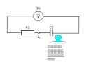
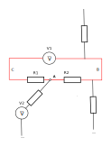
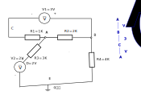

.. Kenneth Lee 版权所有 2023

:Authors: Kenneth Lee
:Version: 0.2
:Date: 2023-09-04
:Status: Released

线性电路分析原理
****************

介绍
====

本文总结一下线性电路分析的基础原理。

我们先解释一下提到的这些名字的概念，这样我们理解起来有针对性，知道我们学习的概
念的范围。

电路分析，主要目的是从电路的已知获得未知。这样我们可以控制未知。比如下面这个电
路：

我们知道电源是3V不变，那么如果我们知道两个电阻R1和R2的值，我们是否有办法控制A
点的电流和电压？这就是电路分析的目的，一旦我们可以通过控制R1和R2的值，就可以控
制A点或者其他点的电流和电压，那么在工程上，我们就可以控制我们想要的电路的属性
了。这是工程上要搞电路分析的主要目的。比如我现在在R2的位置上放一个灯泡，这个灯
泡的电压和电流不能太高，那么选择什么样电阻的灯泡才能保证不会烧坏？有了电路分析，
我们就能控制这些东西。

然后我们看看什么叫线性电路分析。

电流就像水，电压就像水位，所以，只要电压不平，水就会从高处向低处流。导线（可以
认为电阻为0的电阻）和电阻可以让电流迅速流过，这个流动的速度基本上是光速，在工
程上我们就认为这个变化是瞬间完成的。所以，只要你连上一个只有电阻的电路，基本上
它的电流和电压就瞬间就决定了，这个过程和时间无关。比如前面这个电路，电路一旦决
定，这个电路一接通，电流就等于3V/(R1+R2)，这个过程是瞬间完成的。这个方程是个一
次方程，所以这种电路我们称为线性电路，它的变化是很有限的，就算你的电源是个交流
电，是个时间的曲线，比如它的电压是3V*sin(t)（t是时间），那么它的电流就是3Vsin(t)
/(R1+R2)，这还是一个线性方程。所以这种只有电阻的电路就叫线性电路。

如果你有电容和电感，情况就不会不一样，电容就好像一个小蓄水池，电荷充电到这个水
池中是需要时间的，这样某个时刻的电路的电压就和时间相关了，要看蓄水池充电充到什
么程度，这种电路就是非线性电路：

本文主要就讨论线性电路的分析逻辑。

线性电路分析
============

如果不考虑工程原理，线性电路分析其实非常简单。工程上要考虑的问题很多，比如一个
电池是3V，一般使用的时候它确实是3V的，但工程上如果电阻太小，它不可能供应那么多
电流，它就维持不了3V了。同样，一般的电阻和导线我们认为是线性的。但实际部署的时
候，电线做粗一点，导线卷起来了，这些都会有很小的寄生电容和电感，这些都会影响电
路。这些东西我们必须知道，但做理论分析的时候，这些东西常常就忽略了，这样我们至
少可以先有一个简单的结论（而且这个结论工程上也很有用，因为实际结果常常和这个很
接近）。

线性电路的方程都是线性的，基本上就不需要微积分。所以，一般只需要接一次方程组。
从数学上说它就很简单。你只需要两个方程：

1. 欧姆定律
2. 基尔霍夫（Kvl）定律

我们前面说过，线性电路的变化都是瞬时完成的，所以这两个定律都是立即成立的，可以
对每个点都列方程，它是一定成立的。你看到一个电阻，那么这个电阻两边无论是什么样
的，那么它两端的电压，流过它的电流，一定满足IR=V。无论这个电路外面怎么连，也无
论它是否连在线性电路中，这个条件就必然成立，我们可以对这种位置无脑列方程。

Kvl分电压和电流定律，其实它本质就是一个意思：电阻（包括导线，下同）不能保存电
荷。把这个认识和欧姆定律结合起来，就可以列出几乎所有线性电路的方程。

什么叫做电阻不能保存电荷呢？看看下面这个电路：

我们观察A那个点，因为这个点上是存不了电荷的，那么就像水管一样，流进去多少电荷，
就要流出来多少电荷。而我们知道，电流就是每秒流过的电荷数。那就意味着，流进A点
多少电流，就要流出多少电流。这甚至不用管电路其他部分是什么样的。这个示例图我们
都没有画电路的其他部分，但我们就对这A这个点，我们就可以列方程。kvl好用就好用这
里，你都不用想这是并联还是串行电路，有多少条件列多少方程就可以了，有一些基本的
电流电压信息，最终总能解出任意一个点的电流和电压的。

这就是kvl电流定律。

那么电压定律呢？它的原理是一样的。我们还是看A点，A点不能保存电荷，所以A点周围
的导线电压都是一样的，或者说，A点到A点的电压等于0。然则，我们看一个环，比如这
个图里面红色的那个环，我们也不管它周围有多少分叉。由于欧姆定律在电路上永远都是
成立的，那么顺着这个环，从A点顺时钟算电压：
:math:`V_{A->A} = V_{B->A} + V_{C->B} + V_{C->A}`\ 。

我们说了，\ :math:`V_{A->A} = 01`\ ，所以，环里面每两段之间的电压——虽然我们现
在还不知道这两段之间谁的电压高，谁的低——但方程总是可以列出来的。

所以，用这种方法一样可以列出方程，只是这个方程和前面的电流方程在进行方程组变换
后，其实是等效的。这个我不证明了，多算几次就会发现。

由于电压总是算两个点的，有了kvl电压定律，我们可以在电路中找一个点算做0，其他电
压都用和这个电压的差来表示，这个值就是对每个点都绝对的，这个值就称为这个电路的
“电位”。这样列方程的时候会更简单一些。

有了这两个方法，基本上我们可以分析任何线性电路的电路行为。

一个例子
========

我们看一个例子，我随便用两个电源搭一个分叉电路：

最下面的线我们认为是0电位，V2是个恒定电压输出，所以D点就是2V。我们把
:math:`V_A, V_B，V_C`\ 都作为变量来列方程，只要能列够三条，这个方程就可以解了。

我们先把每条线上的电流算出来：

* :math:`I_{A->D} = \frac{V_A - 2V}{3K}`
* :math:`I_{A->B} = \frac{V_A - V_B}{2K}`
* :math:`I_{A->C} = \frac{V_A - V_C}{1K}`
* :math:`I_{B->E} = \frac{V_B}{4K}`
* :math:`I_{B->A} = \frac{V_B - V_A}{2K}`
* :math:`I_{B->C} = I_{C->A} = \frac{V_C - V_A}{1K}`  （电源内阻算0)

然后我们对着已知的常数连方程：

* A点的基尔霍夫电流：\ :math:`I_{A->D} + I_{A->B} + I_{A->C} = 0`

* ACB环的基尔霍夫电压：\ :math:`(V_C - V_A) + (-3V) + ( V_A - V_B) = 0`

* B点的基尔霍夫电流：\ :math:`I_{B->E} + I_{B->A} + I_{B->C} = 0`

这个地方要特别注意方向，对于电流，最好全部计算从中心点流出的方向为正，或者全部
计算从中心点流入的方向为正。对于电压，最好是像图中那样把层次关系列出来。这样就
不容易错。

从这三个方程看，你会发现电压方程会比较容易列，但因为它没有电阻参数，很容易列成
等效方程，化简以后没啥用，电流方程则相反，所以，这两个变体怎么选择，完全看具体
情况，但纯用其中一种，肯定也是可以的。

把前面的电流公式代进去，也没有增加变量，三个变量三个方程，只要没有等价方程式，
这个方程就有唯一的解。

如果你还记得我们在\ :doc:`教中学生学编程2：解方程`\ 里的方法，这个方程组我们可
以直接用Python来解：

.. code-block:: python
   
   from sympy import *
   from sympy.abc import x,y,z   # 这个是为了使用三元方程的x, y, z

   solve([(x-2)/3 + (x-y)/2 + (x-z), z-y-3, y/4 + (y-x)/2 + (z-x)], [x, y, z])

这我们得到：

* :math:`V_A = 2V`
* :math:`V_B = 0V`
* :math:`V_C = 3V`

这样我们就完成理论的计算了。

但我举这个例子不是为了教你怎么完成理论的计算。我们在工程上做数学分析，是为了做
工程实践。在这个计算中，我们理论上完成了一个计算，表示如果电路的元件如果都是理
想元器件，如果我们随意把它连成上面的样子，它表现出来的电路特征就是上面计算的那
个结果。但这样计算以后，这些元器件还能不能表现出那样的特征呢？

这就需要更多的计算，比如我们算算这种情况下，电源的输出功率是多少，比如V1，它如
果是个电池，这种情况下，它的电流是\ :math:`I_{B->C}=1mA`\ ，电压是3V，所以它的输
出功率（在它确实在输出的情况下）就是3mW，如果这是这个电池的允许功率，那么这个
电路就是按预期工作的，否则，如果这里算出来是100W，这个电池根本就没法供应这么多
电荷，所以，理论上你认为3V是个常数，但电路连成这样，它就没法按你的期望保持在那
个3V上，这时我们就要调整电路，保证每个元器件都可以工作在合适的参数上了。这才是
我们工程上学习数学分析的目的。
