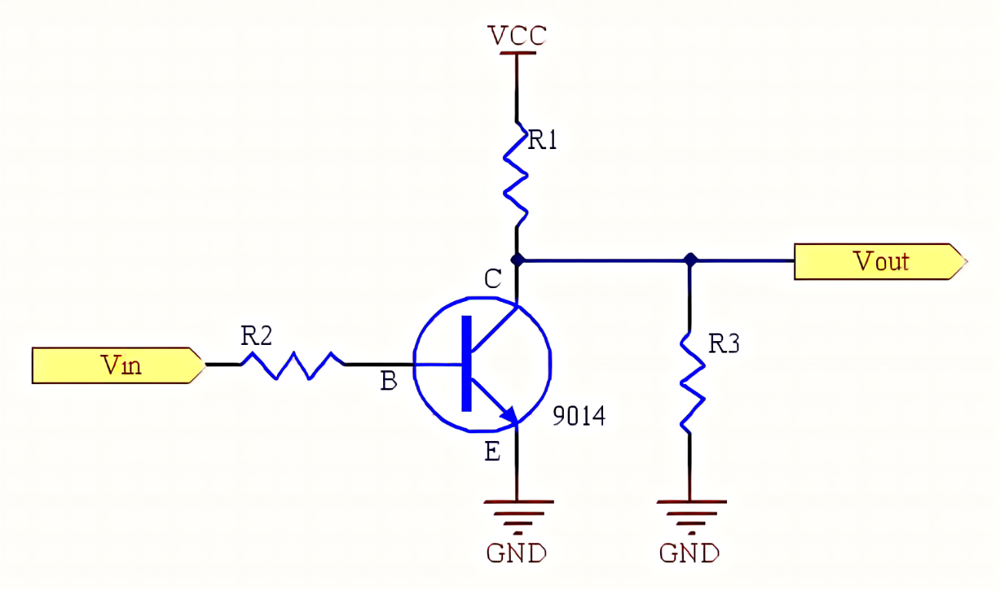
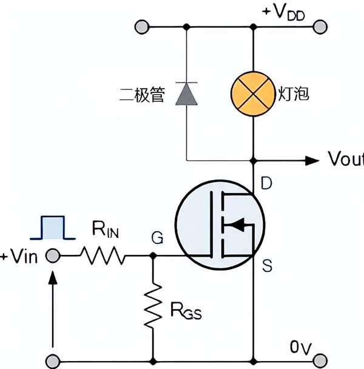
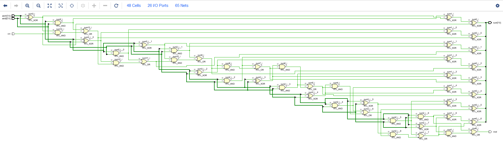
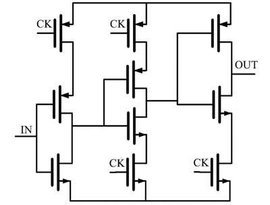
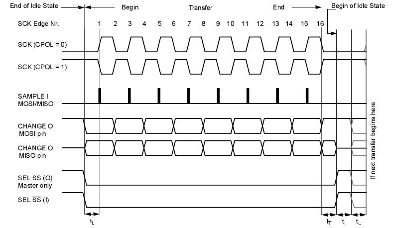
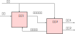
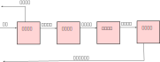
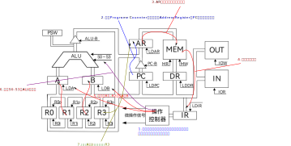

.. Kenneth Lee 版权所有 2023-2024

:Authors: Kenneth Lee
:Version: 0.2
:Date: 2024-01-04
:Status: Released

软件如何在CPU上运行起来的
*************************

本文主要给一位正在学习计算机组成原理的大学生组织一下数电，软件和计算机组成原理
的知识，以便她把这些知识在逻辑上贯通起来。

让数字电路动起来
================

首先，我们学习过数字电路了，比如三极管的开关电路就是这样的：

看起来和放大电路没什么区别，只是工作在截止区的边界而已。在现代计算机中，为了加
工集成电路的方便，用的更多的是场效应管，从我们做软件的人的角度来说，其实也差不
多：

我也没有分析这些电路的原理，反正我们知道芯片设计人员尽量让这些电路除了这些半导
体管和一些小电阻，尽量没有其他部件，这样就可以比较容易生产，只改变电路图上半导
体管的连接，就可以改变输入输出的高电平和低电平。这样就可以构成开关效应，生产一
些基本的逻辑计算部件了：

.. figure:: _static/基本门电路.JPEG

这些电路本质最终就是三极管或者场效应管的开关电路，只是既然可以标准化生产，做成
芯片，我们的设计就可以分成两步，一步是设计这个组合关系，一步是是最终设计出加工
的图纸。芯片设计师把前面这个门电路的组合关系，叫做netlist，中文叫“网表”。你们
平常听到的“芯片设计公司”，比如海思，高通，就是只负责到netlist的，而最终把
netlist变成芯片的，是生产厂家，比如台积电，中芯国际等企业，的事情。

当然，和软件这种纯数字化的开发不同，netlist其实和生产是密切相关的。所以，这中
间还有很多具体的问题要解决。但总体来说，设计的大逻辑是设计公司做出网表，然后
把网表交给生产厂家来生产。

所以，其实芯片设计就是根据一组输入，得到一组输出的一个计算过程。比如我们要做一
个一位的加法器，就可以用刚才说的基本门电路组合出来：

.. figure:: _static/一位全加器.jpg

你应该发现，这其实不是个电路设计的问题（或者说，至少不是个模拟电路老想着选工作
区解微分方程的问题），这是个布尔代数的问题：给定一组输入，给定一组输出，然后用
布尔代数构造一个逻辑组合关系而已。所以你就可以理解你现在学的布尔代数和逻辑电路
设计到底要解决什么问题：它就是给你一个固定的方法，让你无论需要什么输入和输出，
都能用基本门电路搭个电路出来，可以满足计算的要求。

一位的电路可以搭出来，那么很多位的只是个重复劳动，比如下面是个8位的加法器：

这个电路很复杂，但只是一个数学问题，于是，就有人开发了工具，可以根据你规定的算
法，给你生成这个电路，就好像编译器一样，你只是写个C/C++代码，编译帮你翻译成汇
编。电路也有这种工具（叫EDA工具，不过EDA工具是个更大的集合，不但生成电路的叫
EDA工具，其他所有用来配合电路设计的工具都叫EDA工具），可以帮你把写好的“硬件代
码”，翻译成数字电路。

下面是一个用System C写的加法器的电路代码：::

  #include "systemc.h"
  SC_MODULE(half_add) {
    sc_in<bool> a, b;
    sc_out<bool> sum, carry;
    void prc_half_add();
    SC_CTOR(half_add) {
      SC_METHOD(prc_half_add);
      sensitive<<a<<b;
    }
  }
  void half_add::pre_half_add() {
    sum=a*b;
    carry=a&b;
  }

看起来是不是和C++很像？它其实就是多了一些说明输入输出引脚的声明（sc_in，sc_out
那些，要注意这不一定一位，多位的输入输出就是多条线，代表一个二进制的数就行了），
并说明怎么从输入得到输出（下面的pre_half_add函数），剩下的电路怎么搭就全部让
EDA工具给你生成了。

我们学习数字电路的时候已经知道了，数字电路是“立即生效”的。所以如果对这种电路输
入一个输入的值，那么在输出的引线上，你马上就会得到结果。也就是说，不管你有多少
位，只要你实现了一个加法器，你输进来两个数字，你马上就会得到结果。但为了检测这
个结果，你需要推动输出设备动作，这个动作会需要时间，即使这个时间很短，但时间还
是需要的。

所以，数字电路的计算速度其实是很快的，一进来，马上就有结果。

但你的位数越多，那么电路就会越大，需要的半导体管就会越多，而生产厂家是按电路的
面积来算钱的，所以，电路越大，成本就越高。而且，半导体管的数量越多，用的时候耗
的电就越多，这也是成本。所以你看你用的PC是64位的，但那些控制灯泡之类的芯片常常
就是8位的，甚至4位的，都是为了省这些成本。

所以，芯片生产经常有一个重要的指标，叫“制程”，它决定你能把三极管做到多小。我们
平时说的28纳米，8纳米，这些指标，就是生产厂家能把这个三极管做到多小，小一点面
积也小，电流也随之降低，功耗也就更低。但小制程是很难做的，因为工艺要求也高得多。

那为了降功耗降成本，如果我一次只能算8位，我还能算32位的加法吗？答案是可以的，
这需要用到存储电路了，这种电路可以把你上次计算的结果保存起来，下次再用，这种电
路也是半导体电路，比如一种实现方式就是锁相环：

我们也不管它是什么原理，反正它能把一个位临时保存下来（多个位就可以保存一个二进
制数字了），这样，电路就可以分多次计算，每次输入32位的其中8位，然后把结果放到
存储器（锁相环）中，算4次就会有结果了。

为了分出这个“次”，我们需要电路有个输入，能让电路到了某个时刻就开始进入下一个计
算。这个输入就是所谓的“时钟”，它通常输入一个固定频率的方波，像下面这样：

SCK那行就是时钟引线的波形，它就是定期从0跳到1，再从1跳到0，其他的引脚就跟着电
路发生变化。从而完成每一拍要做的事情。

所以，时钟决定数字电路计算的速度。我们平时说某个CPU是500MGHz的，2.2GHz的，说的
就是这个时钟的周期，它决定了CPU的计算速度。

那么为什么我们不用更高频率的时钟呢？这受两个要素的控制：

1. 存储要能把电能存到存储中，需要充电时间，你的时钟必须等待这个充电时间结束，
   所以不能跳太快。

2. 由于每个半导体管在保存一点点电荷这个角度上是个小电容，所以实际上我们级联多
   级半导体的时候，每级都会产生一点点相移，就是下一级的波形不完全和前一级位置
   一一对应，而是延迟一点点。这样积累起来，波形会错位，计算结果就错了。

所以，每个EDA工具在给你生成网表的时候，会根据制程，频率和工艺这些东西，告诉你
电路级数太多了，要你调整到合适的层次数。你需要在频率和电路的逻辑要求之间，取得
平衡。

这样我们就说完数字电路是怎么被软件理解的了，我们总结一下：

1. 数字电路根据输入的高低电平可以一次完成一个计算。
2. 数字电路可以通过的时钟控制电平的跳变，从而实现一步步的计算过程。

数字电路模拟
============

和我们写软件一样，芯片工程师设计复杂的电路的时候，不会一开始就设计那么复杂的电
路和算法的，他们也是从模块开始。比如这样：

这里我们设计了两个模块，由一个统一的时钟控制（很多时候硬件工程师会省略这个时钟，
因为反正都是要给的），每次时钟来了，每个模块就会处理一次输入（输入输出那根线不
一定真的只有一根线，可能是很多bit组成的），变更一次输出。这两个时钟不需要每次
都匹配的，比如如果模块1要跳动3次才能出结果，它就可以先把输出置为“高阻”状态（不
是1，也不是0，就好像断路一样），这样模块2就不计算就行了。等到了第三个时钟周期，
它的结果就送到模块2的输入上，模块2在它的时钟周期里面检测到这个输入信号了，结果
就可以输出到它的输出上了。如果模块2也要多个时钟周期，那它可以通过它的信号通知
模块1不要输出下一个结果了，等它算完再输入新的值。

这样，数字电路设计师就不需要老想着这些电路互相之间怎么影响了，而是考虑本模块需
要什么输入，什么输出，要多少个时钟才能算完，就可以了。

上面这个电路可以直接用软件进行模拟，比如你用C++写个程序：::

  int main(void) {
    for(int i = 0; i < 1000000; i++) {
        for(auto module: modules) {
          module->run_one_cycle();
        }
    }
  }

剩下的事情就是自己预计一下这个硬件模块每个cycle干些什么。这样不用做出电路，但
可以计算出所有模块组合起来，这个电路可以跑多快。module::run_one_cycle的实现也
不需要真的算每个cycle具体怎么做，只需要预计自己要几个cycle做一个动作，每那么多
个cycle就输出一次结果就可以了。这叫硬件的CA（Cycle Accurate，时间精确）模型，
硬件在正式设计电路前就是这样来预判自己大致能做到什么样的性能。

这种CA模型常常可以拿来和我们做底层软件（比如做操作系统，编译器的工程师）的沟通，
用于说明硬件是怎么工作的，以及完成特定的工作需要多长时间，所以我们一般理解到这
种图的程度就够了。一般软件工程师如果要理解硬件的原理，主要要能看懂这种图，你就
知道硬件大概能干些什么了。

CPU的组成
=========

有了前面这个理解，我们就可以理解CPU大致是怎么工作的了。现代计算机非常复杂，我
们只看一个最简单的示意：

取指单元从内存拿到下一条指令，并且发给信号出去，告诉内存那边下一条指令在哪里
（这里我都简化了，取指其实不会直接从内存取指令，下一条指令在哪里它也不一定能提
供，但我们这里只关心原理），同时指令的内容发给译码单元，这就是它每“一跳”干的事
情。干完这一跳，它马上就可以去取下一条指令。

而解码信号到了译码单元，译码单元要判断要做的是个什么计算，找个加法器，乘法器一
类的“执行单元”，来完成这个指令的计算。计算结果发到回写单元上。回写单元就把结果
写入存储器上（可能是内存，可能是寄存器，都行）。这样就完成一个计算过程了。

这个过程有点像生产线上的流水线，如果我们认为每个计算单元要花一个时钟周期。那么：

* 第一个周期：取指单元取了第一条指令，其他单元空闲
* 第二个周期：取指单元取了第二条指令，译码单元译第一条指令，其他单元空闲
* 第三个周期：取指单元取了第三条指令，译码单元译第二条指令，执行单元执行第一条
  指令，其他单元空闲
* 第四个周期：取指单元取了第四条指令，译码单元译第三条指令，执行单元执行第二条
  指令，回写单元回写了第一条指令，第一条指令结束。
* 第五个周期：取指单元取了第五条指令，译码单元译第四条指令，执行单元执行第三条
  指令，回写单元回写了第二条指令，第二条指令结束。
* 如此类推

这就叫CPU的流水线。但这是最简单的情况，实际上，指令之间会有依赖，这样需要有更
多的等待上的判断，这就会复杂很多，但基本原理就是这样了。

例子
====

最后我们看一个课本上的真实例子，下面这个是一台CMA的实验计算机：

这里每个带名字的框框就是一个模块，这种图一般会省略时钟线（这种东西反正以后EDA
工具会自己生成的），模块之间的粗线条就是连线，具体有几根线在这种图上我们都不用
管，因为根据你用前面System C写的时候给一个特定长度的变量，需要多少根都是可以的，
我们只要确定这两个模块之间可以传信息就够了。

我在图中标注了这个计算机遇到一个add R1, R2, (R3)的计算过程（把R1和R2的内容加起
来，写入R3地址所在的内存中）。每个模块具体做什么计算就靠模块旁边标注的那个小信
号线表示，这些信号全部由操作控制器产生，反正现在流水线在算什么，操作控制器就给
每个模块都安排了，这个模块遇到一个新的时钟的时候就把输入算到输出一次。

如果要求你画指令周期流水线图，你主要考虑取指译码和执行两个周期这些信号怎么安排
就可以了。

比如，一开始我们需要取指，给PC这个模块LDPC信号，给后面的三角PC-B信号，这一个时
钟周期搞定，所以它就这样画图：::

  +---------+
  | PC->AR  |  PC-B, LDAR 
  | PC=PC+1 |
  +---------+
  
这是一跳，下一跳把AR的数据输入内存，做MR（读），写到DR上，所以就这样画：::

  +---------+
  | PC->AR  |  PC-B, LDAR 
  | PC=PC+1 |
  +----+----+
       |
       V
  +---------+
  | MEM->DR |  MR,LDDR
  | DR->IR  |  LDIR         （这两个动作能否合并在一跳，和硬件实现相关。）
  +---------+
       
数据到了IR就直接控制控制单元发出执行的信号了。什么步骤可以合并在一个时钟周期基
本是实现相关的，只能记住。

执行就是先把R1, R2送入A，B：::

  +---------+
  | R1->A   |  R1o,LDA
  | R2->B   |  R2o,LDB
  +---------+

然后在ALU上计算，写过要写内存，所以要写到DR中，R3做地址，R3要写AR中：::

  +---------+
  | R1->A   |  R1o,LDA
  | R2->B   |  R2o,LDB
  +----+----+
       |
       V
  +---------+
  | ALU->DR |  ALU-B
  | DR->AR  |  R3o, LDAR
  +---------+

然后写入内存：::

  +---------+
  | R1->A   |  R1o,LDA
  | R2->B   |  R2o,LDB
  +----+----+
       |
       V
  +---------+
  | ALU->DR |  ALU-B
  | DR->AR  |  R3o, LDAR
  +----+----+
       |
       V
  +---------+
  | AR->MEM | MW
  | DR->MEM |
  +---------+

两个合并起来，就是这样：::

  取指周期                        执行周期

                              +-------+
                              |       V
  +---------+                 |   +---------+
  | PC->AR  |  PC-B, LDAR     |   | R1->A   |  R1o,LDA
  | PC=PC+1 |                 |   | R2->B   |  R2o,LDB
  +----+----+                 |   +----+----+
       |                     /         |
       V                    /          V
  +---------+              /      +---------+
  | MEM->DR |  MR,LDDR    /       | ALU->DR |  ALU-B
  | DR->IR  |  LDIR      /        | DR->AR  |  R3o, LDAR
  +----+----+           /         +----+----+
       |               /               |
       +--------------/                V
                                  +---------+
                                  | AR->MEM | MW
                                  | DR->MEM |
                                  +----+----+
                                       |
                                       V
                                     -----/   （重复）
                                    /
