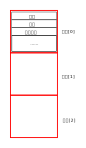
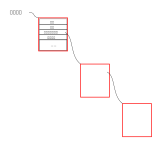
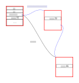
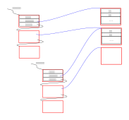
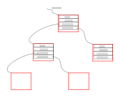

.. Kenneth Lee 版权所有 2023

:Authors: Kenneth Lee
:Version: 0.1
:Date: 2023-06-09
:Status: Draft

链表_树和存储
*************

介绍
====

本文答复一个初学计算机的同学的问题：链表存储和二叉树存储分别适合什么使用场合。

存储
====

首先，我们一般不把内存中的数据叫“存储”，可能你的教科书会这样写，但我还是希望你
知道：有一批人（比如我），在讨论算法的时候，是不会把内存中的数据叫“存储”的。因
为算法不就是讨论程序的数据怎么放，怎么处理吗？我们说的所有概念都是存储在内存中
的啊，这种情况下，专门强调“存储”，就很容易误导。特别是，这种情况下，你把数据保
存到磁盘上，磁盘又应该叫什么呢？

我们把内存中的数据放到磁盘上，就是一种“存储”。当我们说存储的时候，说到底就是一
种信息的表达。你在内存中有一个数字10，你保存到磁盘上，这个数字也是10，你随时可
以还原到你的内存中。我们把这个叫做把这个数字的信息“存储”到磁盘上。

好了，现在如果你有一个二叉树，像下面这样：

这是在内存中，每个单元的左右两边都有“内存指针”，指向左右子树的内存地址。这颗树
如果要“存储”到磁盘上，中间那个数字可以保存，但指针你就算保存了，这个数字在磁盘
上是没有意义的，你下次运行程序的时候，把这个数字拿出来，你在内存中都不一定能拿
到这个地址，因为这个地址可能被别的程序拿走了。

所以，如果你确实要把整棵树都保存在磁盘上，你需要有别的方法来对应这个指针，比如
你在磁盘上创建一个文件，用文件的偏移作为指针的值，这样等你从磁盘上恢复这棵树的
时候，你就知道你要对应的是谁，你可以分配新的内存，然后在那个内存中放子树成员的
内容，然后把指针指向那里。

我跟你说这个，是希望你能首先建立“存储”的正确概念：不是把数字都存下来，就是“存
储”的，你要能够还原那个数据结构，这样才行。

链表
====

在内存中放数据，相对还没有输入到计算机的数据，当然，也可以叫存储。比如你有100
个学生的成绩，老师给你写在纸上了，你用std::cin一个个读进来，读进来以后你怎么放，
这确实就是一个存储。所以，从这个角度来说，你的教科书也不能说错。只是你需要知道
它的范围是什么。

现在我们来看看我们为什么需要链表。还是用这个std::cin输入学生成绩作为例子，学生
的记录其实不止一个信息，比如可以有名字，学号，语文成绩，数学成绩，计算机成绩等
等，这些都可以放在内存中，比如说，我们用一个struct或者一个class来放一个学生的
信息，现在我们要问了，如果我要放100个学生的成绩怎么办？

最简单的方法，当然是用数组了：

第一个输入的放在“学生[0]”里面，第二个放在“学生[1]”里面，然后我们记住用到多少个
了，我们手上就有所有学生的信息了。

这个缺点很明显：我怎么知道要放100个学生？如果cin上输入了200个学生，那不就是放
不下？如果输入了10个学生，不是浪费？

所以呢，最好输入一次就分配一个学生的空间，但这样就有个问题了：我怎么才能知道所
有的学生呢？所以，可以用指针把他们全部连起来，就像这样：

这样，你只需要有一个“学生指针”的变量，记住第一个学生，就可以从第一个学生找到第
二个，从第二个找到第三个……如此类推。你就能随时找到任何一个学生了。

这就叫“链表”，它好像一条锁链一样，一环扣着一环，一环断了，后面的数据就都找不到
了。其实这个东西和“表”没有什么关系，英文这叫Link List，这个其实更形象，它就是
一个Link起来的“序列”(List）。

这个数据结构对比数组，有两个明显的缺点：

1. 每个学生的记录里面多了一个指针，消耗的空间多了。一个学生记录多一个指针，如
   果学生记录里面就一个分数，需要4个字节，一个指针可能也是4个字节（现代更常见
   是8个），你的空间就要大一倍。如果你有一万个学生，就要大4万个字节，这也挺浪
   费的。

2. 找起来慢，比如说，我要找到第9个输入的学生，数组直接用student[8]，就可以找到
   了，用链表就需要从第一个找到第二个，第二个找到第三个……它就很慢。

我们经常说，算法就是比较“空间复杂度”和“时间复杂度”，比的就是这两个东西，第一个
问题就影响了链表的空间复杂度（消耗了更多的空间），第二个问题影响了链表的时间复
杂度，用数组的话，要找到第几个输入的学生，一次就找到了，它的时间复杂度就是O(1)，
如果用链表，有n个学生，最坏要找n次，它的时间复杂度就是O(n)。

我们经常可以用空间复杂度来换时间复杂度，或者用时间复杂度来换空间复杂度，甚至用
某种查找的时间复杂度，换另一种查找的时间复杂度。算法的本质就是根据你的要求不同，
选择一种最合适的方法来实现你的目的。

比如，输入好了以后，我们经常需要查找语文成绩最好的几个学生，那么我们不需要按输
入顺序来做这条链表，我们可以按语文成绩来做这条链表，每次加入一个新学生的时候，
我们总是找到在在两个分数中间的位置，把这个学生插入到那个位置上：

这样，每次输入的时候都要找一次（时间复杂度O(n)），但你以后找语文成绩最好的几个
学生就总是最快的（时间复杂度是O(1)）。哪个算法好，完全看你经常要做的是前面的事
情，还是后面的事情。

那么，假如你不但需要语文成绩最好的学生，还需要数学成绩最好的学生，那怎么办呢？
——这可以用两个链表啊：

你看，这样其实就是用空间换时间了，我们为了查找成绩最好的学生的速度最快，我们给
每种成绩都做了一个链表，链表本身是浪费空间的，但我查找学生变快了，空间的浪费变
成了时间上的优势了。

不过我们要建立这个观念：对人脑来说，计算机的空间和时间都是不值钱的，所以，你优
先应该先搞定功能，什么查找一万次，对计算机来说就是零点零零零几秒的事情，不值一
提。而对于几万个字节，你也知道，现在手机都标配8G内存，这是8589934592个字节，所
以省个几万字节，不到这里的零头。我们写程序先搞定功能，然后才开始优化空间和时间
上的效率。

最后提一句，链表不止我这里提到的一种，我这里说的是最原始的链表，叫单向链表，你
要找到前一个成员，才能找到后一个，不能反过来找。有些算法需要反过来找，它的每个
成员都有前一个成员的指针，这种叫“双向链表”，经过前面的解释，你就发现了：这其实
没有什么特别的，还是在用空间来换时间而已。如果你愿意，你还可以再放些指针，用来
更快查找其他东西，这都没有什么不可以的。

二叉树
======

有前面的基础，你就明白二叉树是什么东西了，本质上它就是一种重新组织指针的方法。

链表的缺点是要一个个往下查找，如果我的数据是有顺序的，要找其中某个特定的分数，
链表的复杂度就是O(n)（复杂度都算最坏情形的），用数组当然好，数组可以按顺序来放，
就可以用二分法找了，但数组很难插入。

那为了可以用二分法来找，我们最好是直接按二分法来放，就可以是这样了：

你不要觉得大部分教科书里面就画个圈圈，然后放个数字，就觉得这个地方就只是一个数
字，在实际的程序中，这只是我们用来排序的那个“index”而已，里面可以有很多东西的。

由于是二分法查找，它的查找速度就变成二叉树的深度了，所以，查找的复杂度就从链表
的O(n)，变成了O(log(n))了。

但这要看运气，因为如果你运气不好，你的二叉树可能是这样的：

这个白白浪费了指针（右边那个指针一直是空的），最后还是一个链表，复杂度还是O(n)。
所以，有很多的二叉树算法，都要努力让二叉树变成平衡二叉树，原理都是每次插入以后
就调整一下指针，让它变成平衡的，保证这个调整的过程复杂度足够低，就是这些算法的
核心目的。

具体的算法教科书上有，你理解这个原理，直接看，就容易看懂了。
