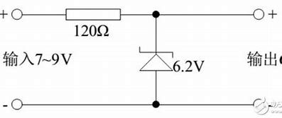
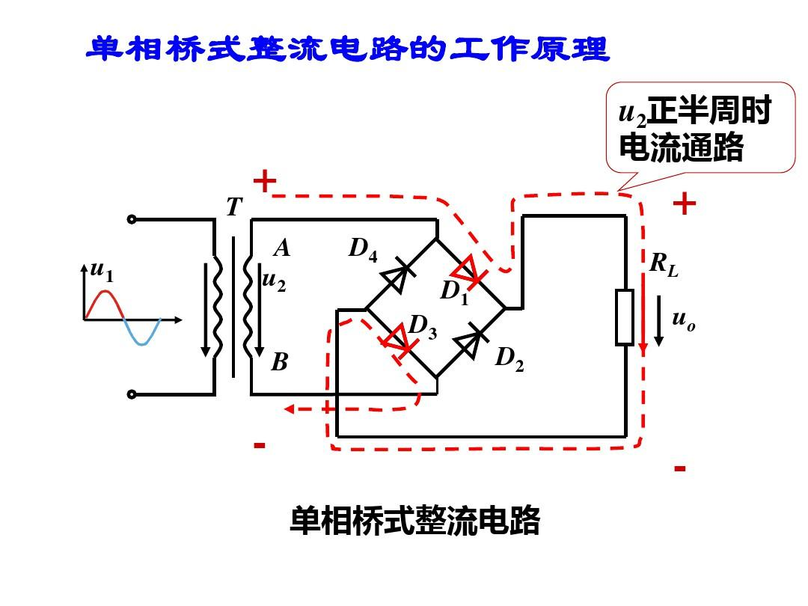
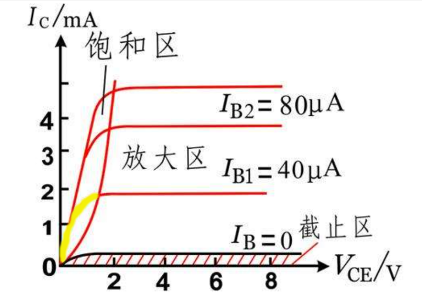
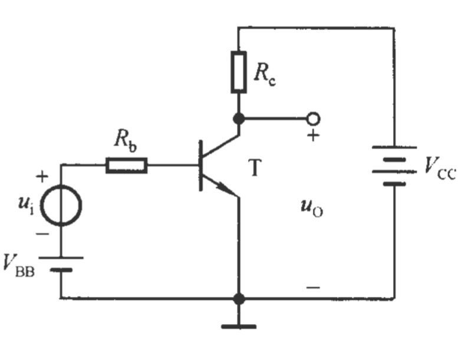
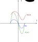
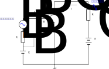
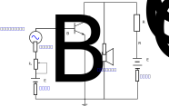
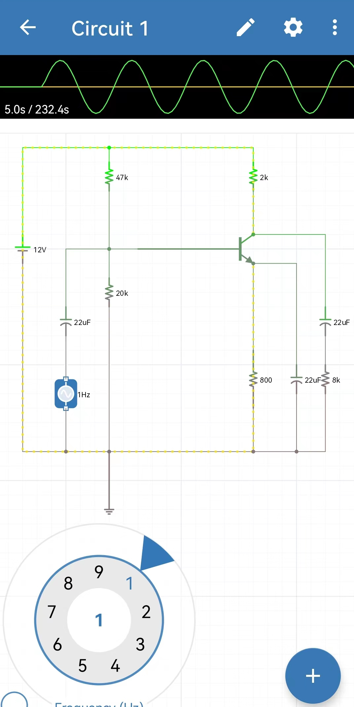
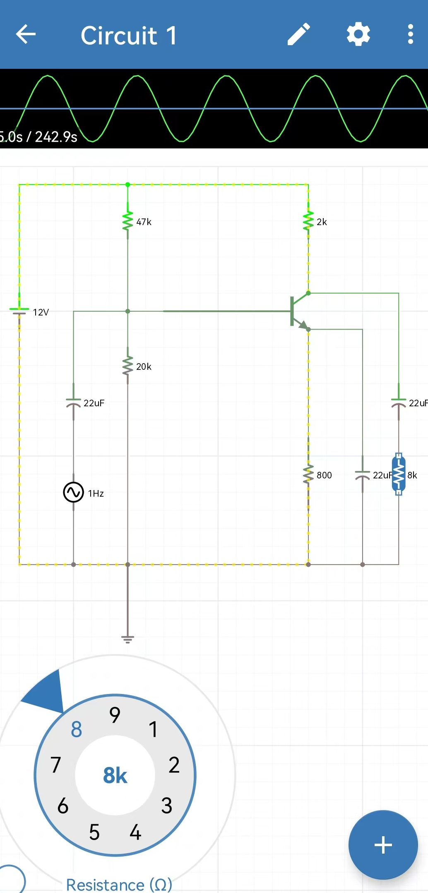
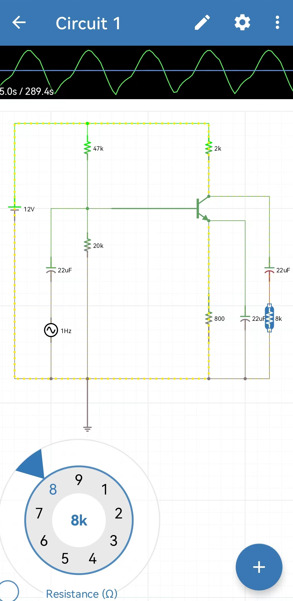

.. Kenneth Lee 版权所有 2023

:Authors: Kenneth Lee
:Version: 1.0
:Date: 2023-10-3
:Status: Released

非线性电路分析
**************

本文我们延续
:doc:`上一个讨论 <线性电路分析原理>`
，以三极管为中心讨论一下非线性电路分析的原理。

我中学的时候醉心于做收音机，对三极管是怎么工作的花了很多时间，也参加了不少课外
培训机构的课程，看过很多关于三极管电路分析的资料，基本上就没怎么看懂。甚至到大
学的时候正规学习模拟电路和数字电路了，我都没有怎么搞明白这东西到底是个什么原理。

这个问题直到我工作了以后，和不少做硬件的同事一起工作了，我才突然反应过来，我根
本就被“放大”这个概念给误导了，三极管的基本原理其实很简单，对它的分析和前面的基
尔霍夫定律的分析方法几乎是完全一样的，它仅仅换掉了欧姆定律。

你要这样想这个问题：在我们利用基尔霍夫定律看待一个电路的时候，欧姆定律其实是在
我们的方程（等式）上放了一个线性多项式（欧姆定律的IR=V公式，虽然只有一项），而
三极管不过是把这个多项式换成了一个非线性的多项式（关键是这个多项式甚至写不出公
式来，我们只能把那条公式画成一个函数图像来给你看），想明白这一点，所有的分析逻
辑，就都可以打通了。

在我们介绍怎么看电路前，我们大概理解一下什么是“半导体”。所谓“导体”，就是物质里
面有大量的自由电子，所以一旦遇到电压，自由电子就在电场的作用下，快速移动，形成
电流。由于电子的量足够大，所以形成了一个线性效应（也就是欧姆定律）：你给多大的
电压，就能产生多大的电流，因为电子管够。而所谓绝缘体，就是没有自由电子的物质，
所有的电子都被锁死的原子结构上（比如共价键上），电子只能停留在那里，你加一般大
小的电场，它都不会移动，这样就算你给多高的电压，它也没有电流可以产生。

而半导体是什么呢？我以前老在想这东西是不是就是个大电阻，其实它不是，它的物质都
是那种原子电子要不是3，要不是5的物质，这样正好和第一层4个电子的稳态差一点点，
所以它没有很多自由电子，但也不是完全没有。所以才叫它半导体。它不像电阻，电阻有
很多的自由电子，只是移动会产生热消耗掉而已。它干脆就不够电子用，所以它是非线性
的，低电压的时候它像个电阻，好像电压高一点，电流就大一点。但等你把电压加高了，
它的电流也不会线性增加，因为它不够电子用。所以半导体本身就不符合欧姆定律，具体
符合什么，公式是啥，我也没有研究过。反正它不是线性的就行。

但人们喜欢就喜欢它这个非线性，因为非线性就意味着它可以产生变化，不会像电阻这样，
加大多少电压，就产生多少电流，如果我只是要控制一个线性的东西，这东西有用，但如
果我想控制一个不是线性的东西，比如开关，电大到一定的程度就会断，这东西线性的电
路永远都解决不了。但非线性的东西我只要找一个拐点，就可能在这个位置上制造一个开
关。

二极管就是这种思路的产物，它通过在半导体上加上一些杂质来控制自由电子（或者正电
空穴）的数量，然后把两种不同的半导体（P是Positive，多了空穴，N是Nagative，多了
电子）拼在一起，正好就产生了一个内部的反向电动势……这些东西的深入原理，其实我们
也不用关心（有兴趣确实也可以查一下资料看看），反正我们知道这样制造了以后，我们
就得到一个器件，它和电阻不同，它的方程不是线性的，而是一条曲线：

.. figure:: _static/电阻和二极管的伏安曲线对比.svg

   电阻和二极管的伏安特性对比

其实严格来说，电阻也不是线性的，你加的电压足够大，把它烧坏，它一样不能保持欧姆
定律那种线性关系。只是它的线性区比较大，你一般不会超过范围而已。但二极管这种东
西在不同电压上的行为是明显不一样的，稳压区那里，电压你怎么加都加不上去，它就可
以用来做那个范围的稳压电路，比如可以做成这样：

   稳压电路（网络图片）

输入的电压怎么变化，到了它的稳压区，电压就上不去（消耗在那个电阻上了）。我们就
利用它这一段的规律，专门把它用来稳压这个范围的电压。它能稳的电压也固定是二极管
伏安特性中的那个范围，不能随便你说改就改的。我以前把这个东西当数学学，觉得什么
指标的二极管都能做出来，其实根本就不行，一个二极管的伏安特性是什么样的，也就那
几种可能，你要根据它的伏安特性来搭电路，而不是你自己随便可以选择的。

这就是工程和理论的区别，理论希望你记一条公式，各种情况都能算出结果来。工程使用
你会发现，你的理论可以用的数据也就那几个。

下面这一段用了截止区和饱和区的特点，专门用于把交流电变成直流电：

   桥式整流电路（网络图片）

这也是只有一段范围可以用的。我们理解这些工程上的问题，就会知道我们到底在解决什
么问题。

好了，现在我们开始正式看三极管。三极管难搞明白，其实本质就是它是个比较混沌的系
统，你看过《三体》，知道三个质点的运动特点，就算给你所有的参数，合并起来就写不
出公式。三极管其实类似，只有一个PN结的二极管已经是一个非线性系统了，然后有两个
PN结的三极管，它的行为就非常的缺乏规律。所以其实我们根本就没有打算用一条公式写
出它的特征来，只是总结一些总体的规律，然后直接用基尔霍夫定律来解的，解出什么就
是什么。这在线性分析的时候一样，基尔霍夫分析的时候，你其实也分不出你的电阻到底
是串联的还是并联的，你不过是用一些必然成立的规律来列方程而已。

总的来说，三体问题也不是不能解，只是没有通用公式而已。三极管其实也没有通用公式，
但工程上在特定条件下可以找到一些规律，所以我们可以在某种设定下找到使用它的方法。
这就是工程研究区对于理论研究的核心区别。这个思想贯穿整个工科的研究思路，是我们
学工科的学生必须理解和掌握的核心思想。

三极管的伏安特性总结出来是这样的：

参考电路如下：

你注意一下上面那幅图，这里其实用了控制变量法，因为有三个要素，你要它画出三个变
量都线性变化的曲线，那需要是一幅三维的图，那个图很难测量，所以这个伏安特性是先
控制了基极的入电流，然后单独测量集电极的伏安特性。然后它就发现规律了：

1. 只要基极电流不变，那么集电极的电压在过了饱和区以后，电流就不再随着电压上升
   了（放大区）

2. 基极电流越大，这个放大区的水平线就越高（而且成线性关系）

如果你敏感一点，你就会发现，这是个波形放大器：如果基极电流是一个波
:math:`I_b=f(t)`
，只要我们能让三极管工作在放大区，那么
:math:`I_c=f(t) \cdot \beta`
。
:math:`\beta`
是基极电流和集电极电流的线性比例。

我们用电阻不可能实现这个效果，因为电阻是线性的，你最多实现加法，但这里实现的是
个乘法。所谓放大电路，利用的就是这个特性：你给定一个波（比如一个声音），它能把
这个波放大（而不是线性提高它的电流或者电压，是乘法，而不是加法）。

   乘法和加法的对比

其实三极管和电阻一样，都是不能保存电荷的，所以，三极管本身，也符合基尔霍夫电流
定律，三个极流入多少电流，就得出来多少电流。所以它自己并没没有放大电流的作用，
它只是控制了外面电池供应电流的方式。这一点也和电阻一样，只是电阻对电源的控制呈
现一个线性方程，三极管压根儿就不是个典型方程而已。

所以，分析这样的电路，只能是确定了一个控制变量，然后继续列方程，求剩下的电路特
征。对于三极管，你现在手上多了这么一条公式（仅在放大区成立）：
:math:`I_c=I_b*\beta`
。这样，你就多了一条方程，你如果能确定你的三极管当时是工作在放大区，那么这条公
式就可以用，如果不在放大区，那就另说。所以觉得电路不好学，只是你以为你手上的筹
码还和线性电路一样多而已，你知道你只能解决部分的问题，布置或者分析电路的时候顺
着这些条件区，解决方法其实是一样的。

三极管还有其他的基于这些不同区的应用方式，比如用于计算机的数字运算，这些原理都
是一样的，你只要明白，不同的工作区，用的公式是同的，具体情况跟着课本学就可以了。

附录
====

看一道题
--------

现在我们看一道题，这是课本上的一道题：

   三极管例题1

已知
:math:`\beta=50, E_C=12V, R_C=3K\Omega`
，求当
:math:`I_B=40, 100, 0\mu A`
时，
:math:`U_CE=? , I_C=?`
。

我们不知道电路工作在哪个工作区，但放大区最大，而且这个电路搭成放大电路的样子，
我们就先当作放大电路来列方程，分析完以后如果和放大区的伏安特性对不上，我们再换
一个工作区来算。所以，对于
:math:`I_B=40\mu A`
，我们有：

* :math:`I_C = 50 \cdot 40\mu A = 2mA` （三极管电流放大公式）
* :math:`I_E = I_C + I_B = 2040\mu A` （基尔霍夫电流公式）
* :math:`U_{RC} = 2mA \cdot 3K \Omega = 6V` （欧姆定律）
* :math:`U_{CE} = 12V - 6V = 6V` （基尔霍夫电压公式）

然后我们对比这些结果是不是在这个三极管的伏安特性工作区，如果是，这个结果就是我
们要的结果了。（如果不是，那就要换一个工作区的伏安特性来算了）

所以，尽管题目中让我们求三个结果，从数学上好像可以用一样的方法算，但其实如果工
作区不同，可能结果就是不同的。但这个题就没提这个三极管的参数特征，但其实目的应
该是挺明显的，第一个基极电流40中规中矩，应该在放大区，第二个特别大，猜在饱和区
的可能性比较高，第三个明显就是截止区了。

这些都可以算出来以后和重新验证，而且我建议可以考虑记住它，以后看到一些参数，就
可以和这个基线做类比，大概猜一下电路的特性。

我们拿第二个例子
:math:`I_B=100\mu A`
做个验证。如果按放大电路来算，我们可以得到：

* :math:`I_C = 50 \cdot 100\mu A = 5mA`
* :math:`I_E = I_C + I_B = 5100\mu A`
* :math:`U_{RC} = 5mA \cdot 3K \Omega = 15V`
* :math:`U_{CE} = 12V - 15V = -3 V`

这都跑到负电压区去了，显然就不是放大区。这样我们就只能换成饱和区来算。

.. note::

   网上有人总结说通常用
   :math:`I_B \cdot \beta > V_{CC} \div R_c`
   作为进入条件，一旦I_B的值大于负载一侧在最极端情况下的值（把CE两个电极之间看
   作导体），就开始进入放大区了。实际使用的时候会比这个大几倍的位置上用，这样
   就比较保险。

   按这种算法，
   :math:`100\mu A \cdot 50 = 5mA > 12V \div 3K \Omega = 4mA`
   所以立即就可以判断它工作在饱和区。

饱和区的计算我不知道教材是是怎么教的，这个不同二极管有不同参数，我随便从网上查
到的数据是在这个区，集电极固定是0.3左右，发射极固定是0.7左右。

所以
:math:`I_C = (12V - 0.3V) / 3K \Omega = 3.9 mA`
。

说起来，这个东西数学计算挺简单的，所以，电学在数学上就不是什么困难的问题，真正
的困难是工程问题，比如干扰，工作点偏移，前后级电路，内阻这些东西，才是工程上电
路分析和电路设计的真正问题。

什么是输入输出电阻
------------------

这里补充一下什么是输入输出电阻，以及为什么要关注它。

在一个放大电路里面，我们说电流被放大了，我们是这样画图的：

我们先用直流电把三极管控制放大区上，然后在这个上下制造一个波动（通过引入一个信
号源，比如放一个麦克风），这样，理论上我们在Rc上的电流就也有以放大倍数那么大的
一个方式波动了。

但这都是理论上的，实际上一旦你真的做一个电路，在
:math:`R_C`
上放一个喇叭，喇叭本身的电阻没法任你选择的，它的电阻就是固定的，这就是负载本身
的内阻（内部电阻），又称为输出电阻。同样，麦克风不是导线，它也是有电阻的，这个
电阻就是它的输入电阻，还有电源也是有内阻的。这样考虑起来，电路应该是这样的：

这样处理起来就麻烦了，工程的麻烦事主要是这种类型的。最好当然我们能找到一些内阻
特别小的电源和输入器件，内阻特别大的输出期间（如果这个输出是电压驱动的话），但
最终计算都是要考虑这些要素的。

什么是工作点和工作范围
----------------------

很多书讲完放大电路就直接看是说工作点，很多人（我自己也是）一开始会跳不过去：怎
么没介绍就开始说“工作点”了呢？

其实这个概念是隐藏在电路的介绍中的：一个放大电路，主要就工作在放大区，然后我们
用控制变量法，告诉你直流电输入
:math:`I_{B1}`
的时候，
:math:`I_{C}`
是多少，变成
:math:`I_{B2}`
的时候，
:math:`I_{C}`
又变成多少……而我们又知道了，这两个参数的曲线，有一段是线性的，我们如果能保证电
流一直在这个范围里面运动，输入的电流就和输出的电流成倍数关系，那这一段就是所谓
的放大区，会有这样一个公式：

:math:`I_C = I_B \cdot \beta`

所以，如果你输入一个波形，正好在这个范围里面，那输出的波形就不会保持原来的样子，
只是放大了。但如果你超过这个范围呢，这个波形就走样了（失真）。因为你乘进去的就
不是一个常数了。这种东西，你拿个示波器一侧就有感觉了。我手头没有示波器，我用
iCircuit给你模拟一下，下面是一个标准放大电路，我先选择了一个1V的交流信号源，下
图上面的波形是我选中这个信号源的时候它显示的波形：

然后我改选它的输出（电路上我用了一个8K的电阻作为负载的内阻）：

这个波形和前面的波形就是一样的（但如果你在软件中详细看参数，你会注意到后面的纵
坐标其实是更大的。

但如果现在我把输入的最大电压调整到5V。这个波形超过范围了，它的波形就会变成这样：

其实如果你仔细看，这个波形在放大区还是保持原样的，只是在超过的范围里面走样而已。

（如果你手头没有示波器，作为基本的学习，我建议也可以在Windows App Store上装一
个iCircuit，这样，大部分基本电路你都可以随便看波形的变化，很容易理解。）

在前面这个电路中，为了保证那个变化的波形一直在放大区，我们不能直接给定一个普通
的信号，因为比如麦克风这种输入源给的信号，基本上是在0上下跳。但0又不在放大区里
面，这怎么解决呢？——显然，看这个电路你也猜到了，在这个输入源上叠加一个指令电，
把电压抬高到放大区上就行。我们尽量先用直流电把电路抬高到放大区的中间，然后让交
流信号在这个中间位置上下跳动，这样我们就可以放大了。

这个放大区中间的位置，就叫做工作点，我们先不加信号，用直流电把电路抬高到工作点，
然后加一个不会超过范围的信号，这个电路就能工作在合适的状态了。

所以，大部分三极管的配套电路都是固定的样子，电阻是多少，都是有套路的，按着这个
参数去达，就能成为放大电路。工程上的问题是，三极管的工作点是随着温度会变化的，
所以，工程上真正的问题是要注意一下这个工作点和温度之间的关系，要保证工作点漂移
了，你都能在工作范围内。你的收音机声音不能太大（放大区的范围），有温度限制（工
作点和其他影响），都来自这些问题。

最后一个问题是：输入加了一个直流电来保证工作点，那输出的不也有这个（放大的）直
流电了？怎么解决这个问题呢？

结论你其实在图中已经看见了：加电容就可以了。

电容的电气特性可能以后会学，中学可能也知道一些。但其实现在可以简单这样理解：

  电容可以充电再放电，所以它能改变电流/电压的波形。这个计算可以很复杂，但我们
  也可以很简单地理解：它是一个高通滤波器。

什么意思呢？学数学分析迟早会学到：任何一个可以循环的波形，都可以转化为一个级数
（这称为傅里叶变换，是整个通讯产业得以存在的基础）：

:math:`f(x) = N + sin(x) + sin(2x) + sin(3x) + ...`

这些级数的项，x越大，频率越高，电容的作用是频率越高，就越容易保持波形通过。所
以，如果我们只是定性分析放大电路，你就可以简单认为，这个公式中的N，是必然不能
通过高通（高频可以通过）滤波器的。所以，所有的波形到了输出，经过这个电容以后，
就没有直流的成分在里面了。这个特征，你可以用iCircuit模拟一下。这只要放一个交流
电源，经过电容，看看负载的波形变化就可以了。特别可以调整一下电容的容量，可以看
到电容越大，波动就会越平缓。这很容易猜到：电容越多，你给进去越多的电流，电容都
能给你存起来，你给的电流越少，电容反过来可以补回去给你，所以到最后，变化越激烈
就越被抹平（但那个级数的项还是通过电容了）。
