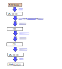
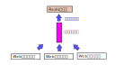
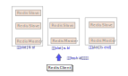

.. Kenneth Lee 版权所有 2026

:Authors: Kenneth Lee
:Version: 0.1
:Date: 2026-04-29
:Status: Draft

AI编程中人的作用
****************

介绍
====

这个主题之前其实在其他博文里面谈过，但下来和一些人讨论的时候，发现由于缺乏具象，
很多人代入的时候还是用自己的具象去想这个问题，所以这次我把例子举得更细致一点，
看看能否说清楚我的问题。

例子的概念空间建模
==================

我用的例子之前也举过，不过这次换一个特性：我们做了一个硬件支持的共享内存特性，
可以跨主机进行共享内存通讯，还可以在这个共享内存上实现队列语义。然后呢，我们想
着要把这个通讯能力用到Redis内存数据库上，我要介绍的特性是用这个通讯协议去替换
Redis的Gossip集群通讯协议。

为了让我们讨论的门槛尽量低一点，让我先介绍一下Redis内存数据库，你甚至可以把这
个看作是Redis数据库的科普。

Redis名义上是一个“数据库”，其实基本上你可以认为它是个提供远程能力的，非常简单
的hash表。我举个例子：你做了一个网站，可以记录用户的一些信息，用户登录了，你不
是要保存一下吗？如果是个单机程序，你写个hash表，用用户id指向一片内存结构，内存
结构里面放上用户的信息，需要的时候可以用get(id)把数据读出来，然后根据这些信息
来给他做回应，这样的数据结构，我们通常都不看作什么“数据库”，而就认为它就是程序
本身的一部分。

但如果你写的是个集群呢？你有多个主机响应用户的请求，每个都可能访问这个用户的数
据，每个主机都可能访问这部分数据又怎么说？你就必须把这个访问接口封装成一个网络
接口，类似下面这样：

这样它就像个“数据库”了，其实它只是把访问内存hash的行为封装成网络的序列化和反序
列化接口而已。

我们在硬件上有了我前面提到的跨主机共享内存的能力后，我们就觉得再用Socket提供这
个接口太浪费了。这一点，从上面的图上你是看不出来的，我给你展开换一幅图看：

前面我们把Redis服务器和Web前端通讯“封装”成了一条线，程序员看到的也不过是一个
socket.send_to()，但实际上这个封装背后是一长串的行为。而且，我为了突出这个“层”
的关系，我还没有突出第一幅图连绵的这个要素：Redis服务器其实面对了很多的Web前端
服务器，而它要保护它自己的hash表，一次只能访问一个数据，所以它需要聚合所有这些
请求，排队进行处理。而通讯成本这么高，所以其实它是创建了一个线程池用多路复用的
方式收集了所有请求，然后把这些请求分成一个个独立的访问“任务”，串行去访问内存上
那个Hash表。

所以，Redis看起来只有一个线程用来访问数据（请求本来就是串行的），但其实它是个
多线程程序，因为每个客户端都是独立的，不需要串行。Redis很大一部分成本都是这个
通讯的成本，很多的互联网服务，都面对这个问题，所以，几乎每个集群就会有比如
libzmq，gRPC这类网络RPC原语库，它们不但占带宽，也占算力。

而我们的硬件解决的问题是什么呢？我们把这个问题还原到最初：你不就是写一个“任务”
到服务器的队列上吗？我们有共享内存啊，你直接写就好了：

你看，我们把所有的中间层和线程池都简化掉了。Redis服务器那边的那个线程池，本质
上是Web前端服务器那个线程的代理，既然我们都有内存了，为什么需要额外的代理？我
们现在只占通讯带宽，不再占算力了。

根据这个思路，我们改造了Redis的算法，把性能提升了10倍以上。这个是我们现在讨论
这个例子的前提，但这不是我们举的例子本身。

有了这个共享内存方案（我们姑且称为GQM，General Queue Manager），我们开始把这个
特性扩展到Redis的多服务器模式。这个多服务器模式原理其实也很简单：这个数据库不
是一个hash表吗？如果我们把hash表的入口（称为Slot）按hash id放到不同的服务器上，
客户端要访问先算hash id，用hash id计算服务器具体是哪个，然后从那个服务器上读就
行了。

这样，我们天然就有了一个多服务器的支持方案，这个方案叫Cluster。我们还可以设置
一些备份服务器，这些服务器不接受访问，只是不断从主服务器同步数据过来，如果主服
务器挂了，从服务器就取代主服务器的地位提供功能。

这样就需要一个协议，不断监控所有服务器的状态，让网络的每个访问者了解当前的状态：

这个gossip协议是在所有的Redis服务器间的（包括Master和Slave）。正如名字暗示的，
它用的是一种“传八卦”的方式广播整个网络的状态的：每个服务器找周围几个服务器“打
听”“你知道其他人的状态不？”，如果超过一半人认为某个Master挂了，所有人就会更新
自己的认知，告诉其他人“这个家伙就是挂了”，然后大家就认它的第一顺位继承人是
Master。

在Redis原来的实现中，这个Gossip协议是承载在另一个socket上的（具体来说，如果你
的Redis端口是7000，那么它的gossip协议端口就是17000）。协议处理依然是业务线程的
一部分（因为两者是互斥的），但需要多polling一堆服务器之间互相gossip的socket端
口。

所以，我们前面对于数据访问的逻辑全部成立，理论上这个需求非常封闭，很适合交给AI，
让它“仿照数据链路的实现方法，实现gossip协议”。我们就看看，AI这里会遇到什么问题，
而人在其中起的作用是什么。

小结
----

在我介绍后面的细节之前，让我总结一下我要表达的第一个观点。架构设计的教程很难写
也很难读，是因为很多人没有注意到的一个误区：架构设计就是概念空间建模本身！

什么意思呢？上面我给你介绍Redis数据访问和gossip的原理，你觉得你搞明白了：Redis
是这样的。这是因为我用这种方法“总结”了这件事。我完全可以不用这种方法“总结”（或
者说“看待”）的。比如我可以这样“总结”：::

        redis-server的main函数定义在server.c中，它的main函数第一行写的是struct
        timeval tv。第二行写的是int j。第三行写的是char config_from_stdin=0……

        redis-server的数据结构是这样的：

                struct redisServer {
                    /* General */
                    pid_t pid;                  /* Main process pid. */
                    pthread_t main_thread_id;   /* Main thread id */
                    char *configfile;           /* Absolute config file path, or NULL */
                    char *executable;           /* Absolute executable file path. */
                    char **exec_argv;           /* Executable argv vector (copy). */
                    int dynamic_hz;             /* Change hz value depending on # of clients. */
                    int config_hz;              /* Configured HZ value. May be different than
                    ...

你觉得我是不是也是在讲Redis的组成？很明显是的，我说的完全是Redis的特征，你喜不
喜欢就另说了。而且你别说我夸张，回去看看多少人的“设计文档”就是这样写的。

还有前面建模中，我们展开socket的访问路径前和展开后，这两者是不是也在讲同一个对
象？但它们就是完全不同的。

架构是我们观察一个复杂系统的一个“视图”，是我们能讨论它的前提，但如果我们能讨论
它了，我们就已经“知道”了，都“知道”了，还讨论啥？

所以我希望读者先认识到这一点：我要给你说清楚架构，我就需要给你建立一个概念空间，
让你知道这件事的“准确表达”是什么样的，但我们做架构设计要做的工作难就难在这个
“准确表达”上，我们面对无数的细节，我们看不清它的主要矛盾和矛盾的主要方面，我们
不知道要表达什么。

我要跟你说清楚这个问题，就要表述一个你能理解的概念空间，或者说”逻辑空间“，但你
知道了这个逻辑空间，你就会觉得“这不是显而易见的吗？”。我后面就让你看到，就算我
们已经有了这样一个“显而易见”的表达，一旦进入细节，AI（其实包括很多脑子不好使的
碳基人），这些所谓的Harness手段，根本约束不了AI。

AI会犯什么错
============

AI犯的错我也不重复描述一次了，我直接给你看看它很多反复修改搞不定后，我给它的提
示词，你就能猜到它犯了什么错了。

1. 我还在review这个gqm底层的实现，我发现现在有一个server.cluster_transport的参
   数，用来选择当前使用的集群通讯协议。但这个其实不符合我们的设计逻辑：我们其
   实允许建群的时候使用gqm地址或者socket地址作为node的通讯节点，建群的时候节点
   的地址，决定别人和它通讯使用什么协议，而不是让server自己决定使用什么协议。
   所以这个地方应该改，取消这个参数。请在修改前，帮我…

2. 我检查了这个修改，我发现几个地方都用server.gqm_shm_path代替了原来的
   server.cluster_transport的判断，我总体上觉得这个思路是不对的。这还是原来的
   问题：每个server既可以提供socket接口，也可以提供gqm接口，所以server本身有什
   么接口，不决定它和其他node通讯的方式，建群的时候，每个node认为它用什么通讯
   方式参与建群，才是其他方和它通讯的方式…

3. 你很长时间都没有解决问题，我建议先对代码做一个检查，在server.sh上增加一个参
   数，原来都用gqm作为cluster协议，加上这个参数我们都用socket作为协议，我们先
   看看用socket是不是成功，是否改坏了什么地方，如果socket成功了，我们再对比gqm
   的消息流，就知道问题在哪里了。

4. 我觉得对于gqm，clusterSGqmTryFlushLink()这样的机制就不应该存在。gqm的逻辑是
   单线程一个任务一个任务执行，这些任务必须全部是消耗cpu的任务，也没有io同步的
   任务，否则就没有效率了。对于读写请求，这个是直接访问数据结构，中间就一定没
   有io等待，而对于cluster，如果能发到另一端，就一次完成发送，如果不能发到，应
   该更新链路状态，马上结束，处理下一个任务，而未完成的任务，应该发一个新消息
   到队列中，等处理完其他任务再重试，这样才不会有阻塞。

   我需要你帮我检查一下：现在每个链路独立使用状态机来进行互相PING/PONG从而同步
   状态，那就需要考虑是否在每次收发的时候都判断是否发生了超时，还有检查之间是
   否需要插入额外的检查避免长时间没有通讯导致超时检测不出来，还有这些超时检查
   应该不需要通过异步的线程发出，因为理论上我们所有行为都应该是单线程循环处理
   队列中的任务。

我们就考察这4个例子，更多基本上也是这些模式了。

第一和第二个例子
----------------

在第一个例子中，AI做的设计其实是相当复杂的，它定义了一个“cluster协议总线”的概
念，认为所有cluster通讯都是基于这个“软总线”运行的。然后基于这个概念，它定义了
“socket会话层”和“gqm会话层”的概念。这样，在所有模块的判断中，如果当前使用
socket会话层，就用socket通讯，如果使用gqm会话层，就用gqm通讯。

这个建模是可以运行的。但它收缩了设计的范围，按它这个设计，提供gqm接口就只能用
gqm组网，提供socket接口就只能用socket组网。但如果你看了我一开始做的概念空间建
模，就会发现，这是三个不相关的独立概念：

* 用什么数据访问接口去访问Redis数据库
* 用什么Gossip接口去访问Gossip节点
* 一个Gossip节点用什么接口去访问别人，和别人用什么接口去访问它

所以，Gossip/cluster协议总线这个概念根本不应该存在。或者就算存在，也不应该出现
“会话层”这个概念。用什么数据访问是一个问题，Gossip协议中，每个节点提供什么接口
让别人访问，这些不能产生关联。

你看，这里如果我不介入，AI就会按这个概念补充所有的细节，然后后面，如很多人设想
的那样，你跟他说要“重构”，你看看要几个月的工作量来搞这件事。

这个问题，只要你不看代码，你根本不会知道。看了代码，如果你没有我一开始那个建模，
你也根本意识不到。你和AI一样，事实和逻辑是一步步在眼前展开的，你没有能力提前预
判所有的问题。面对新的现实，你的眼睛看得比AI长，AI只有你给定的上下文，很多东西
你不告诉它，也没有办法知道，你没有理由要它有能力对这些东西做出判断。

这两个例子也说明了为什么我在做AI编程的时候对Skill的依赖其实非常低，你可以看到，
我给它提供的输入基本上都是独特的，很少那种“凡是遇到某某情况，就打开某某锦囊……”
的要求。我没有“预设的要求”。因为“设计”，本质上不就是创造吗？不是重复啊。如果我
要重复，为什么没有合并成模板，模块，函数或者自动脚本呢？大量使用skill，不就是
“我啥都不知道，也不想知道，弄个黑盒，你能给我搞定最好，搞不定我就打滚么？”

（注：我并不反对使用skill，实际上Skill是现在Agent增加日常使用的功能的重要方法，
这个设计的模块化程度非常高，其实是很出色的设计。但这不表示我们进行编程会把希望
寄望于它。）

第三个例子
----------

这个例子挺有趣，也很常见，你经常发现AI在一个问题上反反复复根据新的问题弄出更多
新思路，然后反反复复解决下去，但问题都没有解决。

这种情况很能说明“逻辑空间无法穷举”的问题：一个原因可以穷举出10种可能性，每个可
能性可能有10种可能性，迭代几次，就有几万、几百万、无数种可能性。人一般会在乎这
个成本，会反复去“反思”，对所有的要素进行重新分类，而不会无限穷举下去。而AI是否
反思是被Agent那个机械的逻辑控制的，而且，就算你Agent让它反思，它现在基本也没有
能力像人这样在很多信息中抽取核心特征的能力。

这一点在用AI写故事的时候表现得特别明显，你告诉它某个人物“并不喜欢喝茶”，只是希
望AI不要描述看到茶就觉得很养生而已，但AI非要设计一个细节让他表现出“对茶的厌恶”。
所以你明白吗？AI说到底是“看风就是雨”的水平，就算所谓“1M的上下文”，它都分辨不了
什么是轻什么是重。

第四个例子
----------

这个例子AI犯的也是一种构架级别错误，还是根据我一开始的建模（这个建模其实我一开
始就通过写在md文件中的形式提供给它了，内容在它的上下文中），socket接收是基于
线程池的，在进入主业务线程前，它有一些阻塞是没有问题的，不影响主业务线程的效率。

但我们的设计取消了所有这样的线程，我们只有一个线程，这个线程不能有一丝的阻塞，
否则就会影响全网的效率。这一点，在我的建模中，是“显而易见而不会去想”的。请注意
这个表述：我不是说它很容易想出来，我是说，对于顺序任务，如果需要阻塞，总是可以
通过重新发一个任务解决，但很可能这种情况都不存在，我就不用想它，就算任务存在，
只要不引起大的问题，我也可以不想它。

但AI在这种问题上“就事论事”，它不会回到这个原始的思路上（因为我没说，它也没想），
它只会觉得：既然socket的代码已经强化我可以同步调用这个概念了，那么你gqm和
socket同层，socket的代码量这么大，它的解决方案更多，我就应该用socket的方法去解
决这个问题……然后它就绕不出来了。

结论
====

所以，你看，在我们的例子中，人脑始终是在一个“创造”的角色上的。我们不是在重复
“大家都知道”的东西。AI是一个概率压缩模型，它学习了很多已有的逻辑规律，所以它很
容易重复那些基本不需要动脑，把很多算法“落地”成某种特定成型的样子的行为。

想想我们用传统方法编程的时候，一个autoconf规则怎么写，Kotlin上怎么注册一个蓝牙
断开消息处理，Python如何做一个Sigmoid算法……这些你记住了吗？你不就是直接上网去
搜一个参考实现，然后拷贝过来，“落地”到代码中么？

这种落地的过程，基本就是工程师的“大脑休息”时间，你基本上没怎么动脑的嘛。还有那
种：编译一下，发现变量写错了，再make test一下，发现某个日志没有打印出来……这些
不也是不怎么需要动脑的嘛。

那些不过现在代理给了AI而已。而你自己的核心作用，一直都没有被取代啊，稍复杂的程
序，最终还是需要你创造的啊，这种东西你随便写一个你懂的程序，不是不断给AI提黑盒
要求，然后自己当个测试员，基本上马上就有感觉了。

那为什么还有那么多人会焦虑AI会取代人呢？那还不是你原来干的就是AI现在干的活么。
