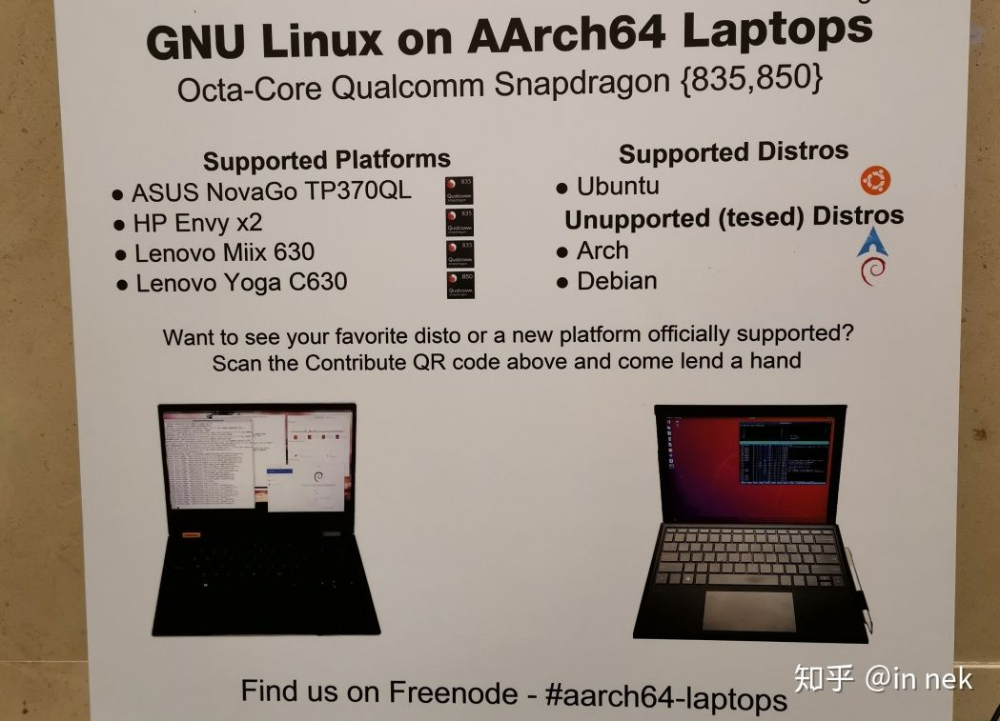
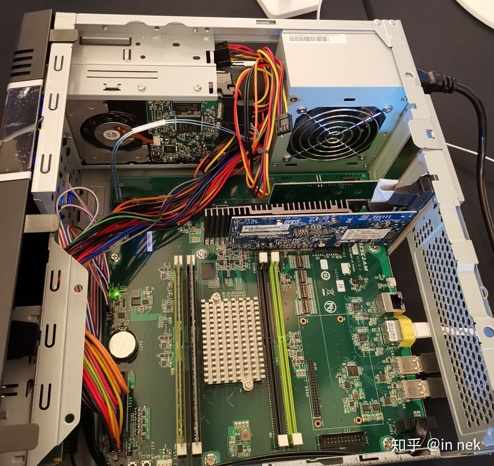
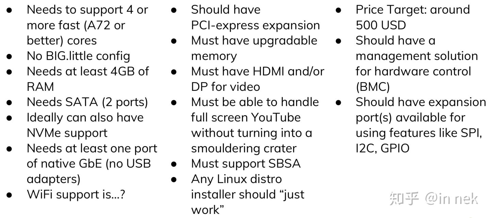

.. Kenneth Lee 版权所有 2019-2020

:Authors: Kenneth Lee
:Version: 1.0

ARM NUC
********

上周刚参加完Linaro Connect BKK19，有很多独立的逻辑链需要建，其中ARM Server开发
者生态运营这个主题是比较开放的，我在这里公开讨论吧。只是把逻辑链组织一下，不代
表任何人或者任何组织的立场。

BKK19的演讲胶片大部分是公开的，我行文过程中涉及的文档读者都可以从这里下载：
Linaro connect Bangkok 2019 Resources。（提示：演讲编号的第一个数字表示第几天的
演讲。tr前缀的表示是培训）

我从演讲201讲起，201介绍了使用LLVM用于交叉编译要解决的问题，老实说，看到这个进
展，我暂时是不打算在交叉环境中就那么引入LLVM的（个例另说），要解决的问题有点多
了。我的感想是，LLVM算是相当火的一个平台了，围绕它建生态的大公司哪个都是举足轻
重的，但即使这样，它的准备度也不过如此。编译内核也算是个重点工作了，但根据演讲
112，x86平台上都还有不少out of tree的补丁才能搞定，从这里我们看到新建一个生态的
难度有多大。生态不是被设计出来的，生态是人多走出来的路，所以营造生态，其实只是
铺条小路，希望走的人图方便，多走走这条路，让小路变成大路。但如果人家本来就不需
要向那边去，你铺条大路出来都没有意义。

这个观点，从另两个例子来看可能会更明显，演讲412和418（一个来自ARM一个来自Redhat
）里面描述了这样的现象：对很多自由软件来说，找到x86的本地编译方案比较容易，但找
到交叉编译就比较困难了。但反过来，对于ARM平台，找到交叉编译的方法比较容易，要找
到本地编译反而就很困难。从构架设计上来说，autoconf，Make，CMake等这些工具都没有
偏向性，谁作为host，target和build都是可以的，但实际上，用户还是会分路走，因为
x86的基本盘就是PC和服务器，arm的基本盘就是IoT和手机。你构架设计的“小路”，在不同
市场上踩出来的大路是不一样的。

这些变数都出现在PC作为开发平台上，PC是x86的，你编译服务器上的软件，就是本地编译
，因为那你的目标系统和你的Host是一样的。你编译手机软件，就是交叉编译，因为你的
Target和Host就是不一样的。手上能随时调度一台服务器出来用的开发者，根本不占整个
开发群体的主流，这一点，看看Linaro的各种拿Hikey和Dragon Board做的方案（包括服务
器软件方案）就看出来了。我现场玩了一下用Snapdragon 835, 850做的Laptop，老实说，
这个性能我也是接受不了的。

ARM Server这条路就有趣了，它需要的软件设计的时候都考虑是本地编译的，但作为ARM，
他们又被按交叉编译来考虑，这个生态就比较难受了。我们只有两条路：要不彻底把ARM
Server当做一个交叉目标，要不我们就必须有自己的PC。这一点，即使我们现在已经做到
所有的服务器发行版都可以直接安装到服务器上，都没有改变。

但PC，本身就是个非常麻烦的生态，驱动，应用，全都是问题，买台x86 PC回来，除了用
于开发，还可以用于日常使用，但买台ARM PC回来，就只能用于开发了。

所以Linaro这两年都是用96Board做初步代替，但96Board这堆渣渣，用来做手机还勉强拿
得出手，你用来编译Linux内核？只能当玩具。现在能拿来开发性能最强的可能是日本
Cocionext的SynQuacer了，但对一般开发者来说，这个性能还是没法接受的。

   SynQuacer内部结构

演讲302构想了一种开发者用机需求：

我觉得其他部分难度其实都不大，最麻烦的可能是HDMI，这也是为什么96Board派系都用手
机芯片来做，因为这些货都集成GPU。但单插显卡就有个显卡生态的问题。所以，其实我觉
得，既然代替不了PC，不如就直接出BMC接口，当做Headless开发服务器来用，这应该现在
这种情况的最好选择。

另一方面，现在手机大幅蚕食PC作为个人娱乐终端的市场，让PC彻底变成一个生产力工具
，也算是做这样的开发PC的一个利好。有一个基本的平台后，有需要的开发者使能一个
PCIE插槽的显示设备，应该也不是太难的事情。

演讲302中提到上个月Linus的一个评价，我在网上搜索了一下，没有找到原始出处，但
zdnet上的完整表述是这样的：

        | Some people think that "the cloud" means that the instruction
        | set doesn't matter. Develop at home, deploy in the cloud.
        | That's bull***t. If you develop on x86, then you're going to 
        | want to deploy on x86, because you'll be able to run what you 
        | test "at home" (and by "at home" I don't mean literally in your 
        | home, but in your work environment.
        |
        | Which means that you'll happily pay a bit more for x86 cloud
        | hosting, simply because it matches what you can test on your own
        | local setup, and the errors you get will translate better.
        |
        | This is true even if what you mostly do is something ostensibly 
        | cross-platform like just run perl scripts or whatever. Simply 
        | because you'll want to have as similar an environment as possible, 
        | Which in turn means that cloud providers will end up making more
        | money from their x86 side, which means that they'll prioritize it,
        | and any ARM offerings will be secondary and probably relegated to
        | the mindless dregs (maybe front-end, maybe just static html, that
        | kind of stuff).

我想我理解Linus的观点，实际上，很多不再写代码的人可能不一定能理解：也许大部分工
程师都不肯承认，其实现在基本上不让你可以立即运行某个构想，你根本就没有办法判断
某个设计是否可行的。我在BKK19的会场上，看他们谈到Fuego测试框架。他们一边在上面
讲，我一边在会场直接就安装运行了整个前端后端，立即就可以判断这个构架是什么样的
，你让我回去再找台服务器装？我可能就直接不考虑它了。或者你让我仅凭讲述就理解那
个东西的架构？这也基本上是不可能的。

这些都是复杂度导致的。

现在的软件复杂度已经远远超过20年前。20年前我开发GSM上的软件，为了让它跑起来，我
需要把天线，BTS，BSC，MSC，VLR，HLR全部开起来。就算要调10行的代码，我都得独占整
个房间的实验室和全部的机架。现在这样开发？早死了。现在我要开发一个网站，前端，
后端，一堆的VM+Docker，基本上都可以在我的一台PC上搞定，最多再开一台，基本上就那
么回事了。你还想独占一个机架？这个哪有效率啊。而且就算Packet这种提供裸机服务的
提供商，租用服务器也要每小时1个美金，想想人家的水电和折旧，这个根本就不贵。但我
大部分时间用不上啊，这种模式实在不好接受。这种情况下，想要普通的开发者使用服务
器一侧的服务，你不提供和那边一样的开发平台，真的太难接受了。这条路不打通，始终
还是要被压着打。

302把这样的PC称为ARM的NCU，NCU是x86 mini developer机器（国内网上的报价是3000人
民币这个级别），我觉得确实是ARM PC的一个设计方向。
