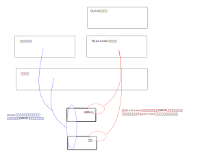

.. Kenneth Lee 版权所有 2021

:Authors: Kenneth Lee
:Version: 1.0
:Date: 2021-08-28
:Status: Draft

iommu设备和uacce关系分析
*********************************

最近在社区看到一个新的提案：\ https://lwn.net/Articles/862320/\ 。提出了一种新
的从用户态使用iommu设备的方式，称为/dev/iommu。这个方案的目标和uacce很接近，我
这里分析一下两者的关系，以便决定uacce下一步的维护策略。

/dev/iommu是暴露一个字符设备接口到用户态，从而可以建立内核iommu子系统和一个特定
进程的关联，这个关联就是这个设备的fd，称为IOMMU fd，IOMMU fd关联一个或者多个
asid，表示不同的地址空间，这个asid称为IO asid。关联这个fd的设备可以通过多个IO
asid映射多张页表。

我设想一下这个可以怎么用啊：你创建一个进程，打开/dev/iommu，得到一个fd，然后你
用这个fd创建3张页表，分别下map命令，就可以对设备发不同的asid的请求——这个场景到
底是要干什么？给每个通道一个独立的页表？没啥意义啊，你进程的数据都是放一起的，
给设备不同的映射空间，有什么好处吗？

另一个可能是我创建了三个虚拟机，对一个物理设备模拟了三个设备（不是SR-IOV，bdf相
同的），虚拟机访问这个设备的时候，地址可以冲突，所以我创建了三个页表，分别给设
备用，设备发地址请求的时候必须带着asid，这说得过去。这恰恰就是uacce的功能，但
uacce是和当前进程的mm绑定的，而它这个更灵活，没有和当前mm绑定这个设计，所以它的
功能是页表是页表，页表可以被用户态维护，而且，理论上它也可以做这个被用户态维护
的页表绑定给当前mm。所以，看起来这个方案可以cover uacce的地址空间管理部分。剩下
的部分是设备IO空间的映射，那个可以由设备自己注册字符设备提供。但这样无法实现设
备的分配和对应iova地址空间的匹配，就需要另一套协议了。所以，简单用这套方案解决
uacce的问题，是有一些不好解决的问题的。

uacce的作用是：设备主动注册给uacce，我从uacce向你请求资源，你给我一次同时分配IO
空间和地址空间，这样我访问这个IO空间，就是和这个地址空间绑定的。而/dev/iommu就
不是为了管理设备，它是独立在管理iommu，那么使用/dev/iommu的逻辑，和设备的使用逻
辑，就是分离的。上层管理逻辑必须和iommu和设备同时约好了：我们大家一起都用这个
asid。这个肯定是指望hypervisor来干了，hypervisor要先通过/dev/iommu设置一个地址
空间，然后用这个空间去初始化设备，从设备拿到一个分配的空间，封装成虚拟设备，然
后交给上层来用。

如果uacce用一样的逻辑，那么，它这个hypervisor的角色就不能放在用户态，最终内核还
是要提供支持，那就又变成uacce了。如果uacce要和/dev/iommu共存，双方可以共同依赖
的对象是iommu_domain这个对象，其他地方，就是没有共性的。因为uacce本来的目的就是
共同管理设备io空间和iommu的关系。现在iommu的sva功能是被uacce驱动的，实际上就没有
准备好像/dev/iommu这样使用，我们首先要避免的是/dev/iommu把我们的依赖修改了。

丢开对uacce业务场景的支持，我们单独研究一下/dev/iommu这个设计好不好。

/dev/iommu最直接的目标场景是viommu。如果我们在虚拟机中创建了一个虚拟的iommu设备
，这个设备被设置了一张页表，如果这个viommu背后的vdev是真的硬件，我们就需要把设
置给viommu的页表传递给真的那个iommu，这需要一个修改iommu的接口。你还别说，这个
功能我刚做过，你让我说，我会考虑把这个功能做到VFIO中，而不是独立出来，因为这个
东西方方面面都和Host怎么暴露设备给Hypervisor有关，你少不了和VFIO原来的分配打交
道，独立出来你还是要和原来的系统打交道，iommu本身不是个高内聚，低扇出的逻辑，独
立出来看不出好处。

所以，总结一下：/dev/iommu这个特性缺乏需求驱动，所以它的文档很难评价。你可以说
，我们模拟一个基于pasid区分的设备，那你可以给VFIO或者uacce做补充。你也可以说你
要支持viommu，那你用虚拟设备使用viommu的场景驱动。但你不分析这个，只是说因为我
有iommu设备在内核中，我要把它暴露到用户态，因为iommu支持map/unmap，我就要在用户
态提供map/unmap的接口，因为iommu设备支持page fault，所以我也要让用户态支持page
fault。这是否过度设计了，我们怎么知道？是否带来了安全漏洞，我们又怎么知道？
