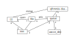
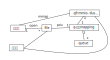

.. Kenneth Lee 版权所有 2021

:Authors: Kenneth Lee
:Version: 1.1
:Date: 2021-11-17
:Status: Draft

Uacce fork问题建模
******************

介绍
====

本文就是简单推演一下Uacce fork特性怎么做的问题，但我每个公共的设计都想当作一个
架构设计的案例来用，所以就写到这里来了。我尽量让架构方面的讨论独立，放在下面这
样的批注里面：

.. note::

  这是架构方面考量的批注。

不关心架构设计方法论，只关心解决方案的读者跳过这些批注就可以了。

技术背景
========

Uacce是我们在Linux内核中放的一个用户态加速器的框架，它其实就解决一个问题：让用
户态可以不用经过系统调用访问加速器。

但这个问题立即会衍生一个问题：如果用户态不需要经过系统调用访问加速器，那么我们
就必须让用户态直接和设备空间通讯，我们需要把IO空间暴露给用户态。这通常是MMIO。

当然如果我们做了一组可以控制的IO指令，我们也可以基于这组IO指令做这种控制，这种
东西等到MMIO不合时宜的时候我们可以再加功能。不过，x86的IO指令是没戏了，这组指令
就只允许内核态访问。

另外，反过来，加速器如果用到内存，这个内存也必须在进程的范围内，不能超出这个范
围。这有两种方法，一种是为加速器特别分配内存，然后映射到进程空间。这不那么灵活，
我们选择的是另一个方案：让进程和加速器共用一样的页表，这样，进程看到的空间，和
加速器看到的内存空间，就是完全一样的了。

这个功能已经以uacce这个名字上传到5.10主线了，它强依赖于IOMMU的sva特性，或者可以
说它很大程度上推动着sva特性的发展，因为它是sva特性实际的第一个商用的用户。SVA特
性其实改变了很多用户态进程的概念，所以，它其实很多设计方向还没有最终确定，本文
现在要讨论的，就是其中一个很重要的方向。

这个方向是这样的：如果一个进程打开一个uacce句柄，map了它的mmio和共享内存空间（
在uacce中称为dus空间，通常用于放加速器的内存静态配置数据），正在使用的时候，如
果我们fork了一个子进程，内核的行为应该是什么？

.. note::

  很多工程师不愿意在推演一个特性之前重新定义问题的范围。他们觉得：这不是都知道
  吗？问题是，你在写一个复杂函数前，有本事不列出所有的参数（包括可以使用的全局
  变量，可以调用的函数），写好这个复杂函数吗？有没有某个参数，有没有某个数据关
  联关系，这些条件直接改变你的算法。不把条件明确出来，很难写好一个函数。

  所以，同样地，把问题的范围明确表述出来，有助于我们在一个封闭的逻辑空间里面反
  复找到我们解决方案（算法）的机会点，没有这样的东西，你就会跟着“惯例”走，这样
  你创新不了任何东西，也解决不了大部分的问题。

  这恰恰就是进行架构设计最主要的作用，我们需要在无数的可能性中，找到一条最有优
  势的路，这个选择错过了，等你的细节都上去以后，你就没有选择条件了。

逻辑分析
=========

uacce加速加速器可以服务多个进程，每打开一次uacce文件，需要为加速器和进程建立一
个上下文，这个关系用类图可以这样表达：

在这个关系中，file和queue（以下简称q）就是这个上下文的实体，每次打开一个文件，
就建立一个上下文，这个上下文记住了进程的MM，同时也记住了加速器为这个上下文建立
的资源。这个关系只在进程和file之间是1-\*的关系，也就是q和mm是\*-1的关系，只要
能保证mm更新的时候可以通知到每个q，就不会有其他的问题。

现在我们考虑fork的情形。为了简化逻辑，我们把mm放到进程里，把uacce_dev忽略掉，把
这个图表述成这样：

这种情况，设备会在一个上下文中服务两个独立的用户，破坏了我们原来的语义。一个最
简单的逻辑是：我们要求用户态重新初始化，关闭这个文件，不拷贝qfr，这样这个问题就
没有了，这个问题看起来并非不可接受，我们只是要求程序这样写：

.. code-block:: python

  def father_process():
    ctx = init_uacce_dev(...)
    pid = fork()
    if (pid == 0)
      ctx = reinit_uacce_dev(ctx)
    use_usacce_dev(ctx)

这个程序没有变得特别复杂，reinit_uacce_dev()只有一点点工作量：只要在
init_uacce_dev()的时候记录所有的初始化参数，reinit的时候关闭老文件，根据参数重
新映射空间，看来都挺正常的。

.. note::

  你看，最初我们构想这个需求的时候，想的是要内核中做，我们猜想在用户态做成本非
  常高，很多问题都解决不了，但实际上不是这样。我们完全可以退回到这个方案上，所
  以说，需求分析其实非常必要。需求分析也不是一些人想象的：”这是领导（客户）要求
  的，我们只能这样做。”需求方只是要解决问题而已，不是自己有解决方案啊。

  所以，当我们收到这个需求的时候，首先我们要抽取这个需求原始的驱动力是什么。在
  现在这个问题中，我们为社区提供了一个加速器的解决方案，这个方案未来是否有竞争
  力，取决于它本身是否能解决最多人要解决的问题。我们设计的加速器是IO，但从需求
  上来说，加速器不是IO，而是和CPU一样的计算资源，那么，用户就会对它有计算资源一
  样的诉求。那么，fork以后继续使用这样的资源就是一个直接的问题。作为框架，你就
  不能像解决一个具体问题那样，说“我就是个IO，fork以后会如何，我就是不管的”，这
  样，用户用不了你的框架，就会考虑其他框架。这个框架最终就会失败。

  所以，这个问题的核心在于，我们得给出一个用户可以接受的，解决他的问题的，在
  fork后还能符合他利益需要的解决方案，如果这个解决方案还能解决他轻易解决不了的
  问题，那这个框架的竞争力就凸显出来了。

  所以，下面我们还会继续探讨这个问题在内核中解决会不会更好，但基线在于那个方案
  是不是就是比这个方案“更好”，这才是我们进行这个需求分析的核心。

实际上，当前主线的uacce就已经是这样的了，它一方面要求uacce文件以O_CLOEXEC打开，
另一方面所有的qfr都以VM_DONTCOPY，VM_DONTEXPAND，和VM_WIPEONFORK的属性映射。这
正好满足上面的要求。

所以，我们剩下的问题就是：如果把这个复制的工作放到内核中，会不会让问题变得更简
单？由于fork的时候内核不会复制file，我们要保证两个进程各自有自己的上下文，就要
分配一个新的queue给子进程。原来map过qfr的位置要全部重新映射一个新的空间，让程序
变成这样：

这可能有三个地方会出问题：

1. 时机：什么时候施行这个重新分配

2. 如何保证原来映射的qfr还在原来的位置上？

3. 如何保证子进程的mm可以绑定到新的queue上？

首先讨论时机。按Linux的clone策略，如果没有设置O_CLOEXEC，正常的内核file结构只是
被get_file()加了一个引用计数，file文件本身没有发生变化。这个文件被两个进程共享。

从“大道理”上说，我现在创建了一个新进程，原来的进程打开了一个设备，我希望在这个
设备上分配一个新上下文给这个文件。但一旦分配新的上下文了，这个file就不是那个
file了，这说起来是一个使用相同fd的新file。这个道理在普通文件上其实也说得通，但
Linux对普通文件不是这样处理的。Linux的意思是：既然你要另外用一个文件，你就不该
继承这个文件，既然如此，你明明应该dup这个文件，或者重新打开上下文，凭什么你让我
内核给你创建一个新的文件？

为了创建这个新的文件，我内核就要认识你用户进程对这个文件各种假设的上下文，对不
同的文件都要加上当初你对这个文件的各种设置（比如你做过的ioctl），这明明都是你用
户态的问题，加到内核中让用户态变简单并没有简化整个系统应该怎么做，这名不正，言
不顺啊。

这样原来，第一步就说不通，这个功能就不应该做下去。

.. note::

  实际上这里还有一个问题，但由于第一逻辑都不通了，这个信息在整个判断模型中就
  没有意义了。但既然大家花了这么多功夫分析的，我们记录在这里，作为未来做其他
  方案的一个信息参考吧。

  这个问题是：就算我们在内核fork拷贝文件的时候，把file复制一份，甚至可以通过增
  加file后端（backend）设备的回调，拷贝设备的上下文，这个问题无法轻易解决。因为
  在拷贝file的时候，子进程的vma还没有被拷贝，这样就无法设置设备对应的IOMMU，设
  备的拷贝还是没有完成。如果我们在vma里面再放一个回调呢，vma里面只有父进程的
  file，没有子进程的file（因为Linux原来的设计没有考虑这个file会分裂），这个vma
  拷贝仍无法做。

  我们还可以考虑用父进程的file找到父进程的fd，得到子进程的fd（父子fd相等），然
  后从子进程fd求子进程的file。但Linux只提供fd到file的映射，没有file到fd的映射，
  这就只能靠穷举fd列表去找到这个file，但你不能保证这个file有多少个fd啊。所以，
  这种方法就算强行做，也是非常困难，修改很多Linux的基础假设的。

最后我们要复盘一下这个逻辑设计的问题是如何走入死胡同的，是什么导致了这个死胡同。

如果我们是个IO设备，一个进程打开了它，之后这个进程fork了，我们自己是知道自己是否
需要保留这个设备的。如果这个设备可以多人访问，那就继续用就好了，如果不行，本来
就该O_CLOEXEC，所以，Linux在设计这个功能的时候，是没有什么“道义”错误的，都合乎
人情的。

我们觉得它应该自动可以clone，是因为我们把加速器看成CPU了：比如你有一个zip库，父
进程初始化了，然后fork，我们是认为这个库是已经被初始化过的，我没有任何理由要重新
初始化它。现在的矛盾在于，我们在这个库里面打开了一个设备，我的资源不仅仅是CPU和
内存，然后所有的问题就都出来了。这个问题，只要加速器还是一个设备，就无可奈何会
存在，所以，真正的修改方案是：让加速器在CPU层面持续可见，这些问题就都不存在了。
嗯，我觉得我可以去写个专利了。

总结
====

暂时，我的结论是：在改硬件设计前，还是保留原来的内核设计，增强用户态的设计吧。
