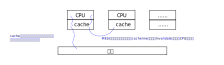

.. Kenneth Lee 版权所有 2021

:Authors: Kenneth Lee
:Version: 1.4

一个例子——逐句翻译是怎么掐断逻辑链的
**************************************

介绍
=====

最近分析一个问题的时候想详细看看MESI怎么定义的，图方便，我就去查了中文维基百科
的词条。基本上没看懂。

然后我又去看了一下英文版的wikipedia。我注意到前者基本上是后者的逐字翻译。而且说
起来呢，每句翻译起来也算不上错，但综合起来呢，前者你就搞不清楚它在说什么，后者
却相当清楚。

所以我想要剖析一下这个例子。

剖析
=====

我们先看两者对MESI的总结，中文版是这样的：

        | MESI协议是一个基于失效的一致性协议，是支持回写（write-back）
        | 缓存的最常用协议。

基于“失效”的一致性协议？你能猜到这是什么东西吗？

英文版是这样的：

        | The **MESI protocol** is an Invalidate-based 
        | *cache coherence protocol*, and is one of the most common
        | protocols which support *write-back caches*.

你如果从字面来说呢，这句话翻译得一点问题没有。但后面这个我就能看懂，而前面这个
我就看不懂。为什么呢？我觉得原因是：

1. 中文版本的“基于失效”你完全想不到这个协议怎么就基于失效了，一个cache同步协议，
   怎么基于“失效”呢？我们平时说的中文的“失效”，是这个东西由于某种非预期的原因失
   去功能了。你能从哪个角度设想一个cache同步，怎么会基于“失去功能”这种情况来设
   计呢？但英文版就没有这个问题，因为Invalidate是一个主动语气，它表示“主动使对
   方无效”。作为一个cache同步协议，这个名字能让我马上反应出：这个协议是靠一方主
   动把另一方已经有效的Cache（内容），置为无效，从而实现cache之间的同步的。

我们再看后面的进一步解释。这是中文版：

        | 总有“脏”（dirty）状态表示缓存中的数据与主存不同。MESI协议要求在
        | 缓存不命中（miss）且数据块在另一个缓存时，允许缓存到缓存的数据复制。

第一句和第二句之间用了一个句号，但从语气上还是可以看出第一句是第二句的某种“条件”。
但这两句话对于说明“MESI是什么”的作用到底是什么呢？我从这句话得到的信息是什么呢
？谁有dirty状态，dirty状态又和miss有什么关系呢？

然后我们看英文版：

        | There is always a dirty state present in write back caches which
        | indicates that the data in the cache is different from that in
        | main memory. Illinois Protocol requires cache to cache transfer
        | on a miss if the block resides in another cache.

这个就可以看懂了。这里第一句话是个陈述句。先描述了一个事实：在write back caches
中，会有一个dirty状态表示cacheline的数据和主存的数据是否一致。然后第二句话说，
MESI（这里用Illinois表示，这个在原文有解释，我前面跳过了，Illinois是MESI协议的
另一个叫法）协议需要通过cache到cache之间传输达成数据一致。如果对Cache同步协议的
基本用途有所认识，我很容易知道这在说什么：这是在描述MESI的关键特征。dirty的数据
不是靠和主存同步来实现的（这是一般人自然会做出的选择），而是靠和其他cache同步得
到最新的数据。

和前面一样，这里的中文翻译，从单句来说，其实没有多少瑕疵，但合在一起，你根本不
知道它在说什么。而英文版本，是个连续的逻辑链。

我们接着看正文。正文的第一章，叫State（状态）。题目要靠内容来解释，所以我们重点
看内容。

中文版第一句话是这样的：

        | 缓冲行有四种不同的状态：

这里的上下文是什么？什么缓冲行就有四种不同的状态了？有四种不同的状态跟MESI有什
么关系？我应该怎么take（认知）这个信息？

对比一下英文版本：

        | The letters in the acronym MESI represent four exclusive states
        | that a cache line can be marked with (encoded using two
        | additional bits):

你看，这个逻辑就是从根子上开始建的：你不是问我MESI是什么吗？我现在告诉你，MESI
是四个字母，表示四种不同的状态。而且我明确告诉你，这四个状态是“正交的”（互相不
相容）。可以用两个bit标记在Cacheline上。

注意一下区别啊：

1. 这不是说cache line有四种状态，cache line状态可以有很多，但MESI是附加上去的一
   个独立的状态。有点简单的集合论的认识，就能发现这是完全不同的。Cache的设计有
   很多种，原文前面就已经提到了Write-back和Write-Through了，你这里说缓冲行有四
   种状态，到底说的是MESI的cache，还是Write-back都有，还是只要是Cache设计都会有
   呢？你让我猜吗？我猜回来的各种信息，我在多大程度上相信它呢？这个逻辑链整个软
   绵绵的，碰哪里哪里不稳，这种文字就不包含有效信息了。

2. 英文版本多了一个信息：MESI四个状态是正交的。而且明确加了一个例证：可以用两个
   bit表示。如果这不是正交的，就需要超过2个bit才能表示了。

3. 最后一个区别前面提到了，英文版本逻辑的根是不同的。这也制造了范围的不同。中文
   版本说“缓冲区有四种不同的状态”，这个范围是无限大，而且你没法猜这范围是什么，
   这句话说完了，你拿不到信息。英文版本说的是MESI的含义，它的范围是有限的。就是
   你的Cache算法如果用MESI协议，你的cache上需要带上两个bit表示这个状态。至于缓
   冲行有多少状态，这个事情“不知”（\ :doc:`“知不知”如何影响决策的？`\ ）——而我们
   的逻辑不依赖这个信息。\ :doc:`“病病”`\ 。

还可以看看第二章，操作（Operation）。中文版的开头是这样的：

        | 有限状态自动机的状态转换结束两种场景：……

这就像自动翻译了，完全不知道在说啥。你得看英文版才知道这里要说什么：

        | The state of the FSM transitions from one state to another based
        | on 2 stimuli.

The state，指代前面的M，E，S，I四个状态，然后说把这四个状态作为有限状态的状态切
换的时候，他们被两个“有限状态自动机”的概念中的“激励”（Stimuli）所驱动。这个表述
很清楚，中文的翻译只说这一句还是没有太大的毛病，但你真要理解这个意思，中文版的
表述就好像在梦呓一样。

后面的例子就不看了，我这里也不是要做翻译，其他基本上都是类似的问题。

总结
=====

我对这个问题有兴趣，主要是因为，中文维基百科这个版本，实在太像我们不少工程师写
的设计文档了。我想从中深挖一下，为什么会出现这种情况的。

中文维基百科这些翻译者，我想不能说他们不努力。而且从单句来说，这些翻译也不能说
它差，但就整个文档来说，也只能说“非常差”。反正如果你不懂MESI，不要指望看这些文
字看懂到底什么是MESI。甚至你明明还懂一点，它会让你更加的懵逼。究其原因，主要就
是翻译者根本就不知道原文说的是个什么东西，没办法维系整个文字上下文一直维系的那
个逻辑关系，没有办法保证前一句描述的那个集合，和后一句从另一个角度描述的那个集
合是基本重合的。因为文字表达的集合在不同的语言上就是不同的。一个典型的例子就是
羊，英文就没有直接对应的集合，无论是goat，sheep，bushbuck，anteope，都不是中国
人说的羊那个集合，甚至没有包含关系和明确的边界。这是语言的特征。

但为什么我们懂行的工程师也会这样呢？我猜啊，是因为我们很多工程师就是读这样的“中
文翻译”入行的。也许他们已经习惯了看这种上不着天，下不着地的文字了，然后他们就不
会思考了，自己写的东西，除了代码（代码关键是一旦理解错了会导出错误的结果），其
他的文字抽象都是这样没有逻辑的。

如果这个判断没有错，这简直没救了。我以前有一个认知：英文背景的工程师明显比中文
背景的工程师在写文档的时候更有逻辑。我一直不知道自己是否太“崇洋媚外”了。现在看
来，这个认识可能是有道理的。实际情况就是，我们大部分工程师就是靠看这样的“翻译”
学术文章长大的。

但我也不认为是中文表达能力不强。过去确实也看过有人提出过“中文缺乏理性的表达能力
”的说法。其实这个要看领域，中文原生的表达，都是逻辑性极强的，比如我最近看资治通
鉴记录的一些总结：

        |  （文侯问李克如何看人）
        | 克曰：君弗察故也。居视其所亲，富视其所与，达视其所举，穷视其所不取，
        | 贫视其所不为。五者足以定之矣。

这个用词精准，指代的范围非常清晰啊。富和达，被看做两个独立（非正交）的集合。富
看交往，达看结党，穷途末路看守着什么不去用作筹码，没钱看不赚什么明明可以赚的钱
，分得清清楚楚。

再看逻辑链：

        | （贾谊上汉景帝疏）
        | 臣窃惟今之事势，可为痛哭者一，可为流涕者二，可为长太息者六……
        | 使为治，劳志虑，苦身体，乏钟鼓之乐，勿为可也……
        | 然天下少安，何也？大国之王幼弱未壮，上数爽其尤……
        | ……可痛哭者，此病是也。

一环套一环，从一个最大的集合（为治）一步步收缩到当前形势，然后对问题排序，给出
解决方案。洋洋洒洒数千字，一直都不会离开逻辑链。

就不说这些古代精英的文字了，就说我前面简单的翻译，也同样能把那个问题说清楚。所
以事情不在于语言，而在于你有没有打算维持你的逻辑链。而逻辑链本身基本上不能靠文
字给你说清楚，它是文字背后的那个“意思”，那个“指向”。那个“无名”的，在背后萦绕着
的Pattern。

所以，到头来我也没有什么可以总结的了。如果读者实在看不懂本文的“道”，那么在“器”
上，我就只能说，计算机资料，还是尽量看英文的吧。而写文档，别顾着堆辞藻，注意一
下你想告诉别人什么吧。

推广思考
=========

从架构的角度深入考虑一下这个问题。为什么架构设计总是把概念空间建模放在很高的位
置上呢？因为不同的“说法”导向不同的细节。上面的很多例子，用英文说的东西，用中文
说就不能是一对一的翻译，因为中文的概念和英文的概念都指向不同的集合。就算你是直
译过去的，比如cache line，这可以说是直接对应缓冲行吧？但在英文的上下文中可能会
在特定上下文中把它简写为line，并索引和line相关的其他属性。但中文中的行，不一定
可以对应到line，英文你永远都不会把line和column对应，但中文的行，是可以和列对应
的。这样两者就走偏了。

同样，在软件上，你可以说线程这个概念，但Linux的线程，和VxWorks的线程你就不能认
为它们是一样的。我们可以建立高层的概念去表述“线程”有关的属性，但一旦我们向下约
束为Linux的线程，我们就必须接受它用户线程和内核线程的对应关系，我们就必须接受它
的中断线程化设计，接受它的非实时调度算法等等。所以，同样是一个“线程”的概念，在
架构上的含义，和在实现上的含义，就是不同的。

所以，在每层架构上，我们相同的名字都表达不同的范围，有不同的指向，我们不得不通
过概念空间（多个概念互相关系）来维持这个指向，如果你思考问题的时候总是把它针对
着代码去解释，这个自由度就都没有了，你就做不了架构设计了。
