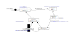
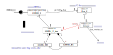

.. Kenneth Lee 版权所有 2021

:Authors: Kenneth Lee
:Version: 1.2

:dtag:`架构设计案例`

一个架构设计实例：qemu iommu
*****************************

介绍
====

最近要改进qemu一个iommu驱动的代码，做了一个简单的高层设计，情况比较典型，我把这
个设计作为一个架构设计的实例说明一些架构设计的概念。

关于qemu的基本认识，读者可以看这里：

:doc:`../概念空间分析/qemu`

IOMMU是一种升级的DMA设备，它的作用是对设备发出的地址进行CPU MMU一样的处理，把虚
拟地址转化为物理地址，再进行最后的访问。

qemu在实现这个特性的时候，还停留在这样的认识上，所以，它对这个功能的抽象，是提供
一个这样的回调函数：

.. code-block:: C

   static IOMMUTLBEntry smmuv3_translate(IOMMUMemoryRegion *mr, hwaddr addr,
                                         IOMMUAccessFlags flag, int iommu_idx)
   {
       ..
       IOMMUTLBEntry entry = {
           .target_as = &address_space_memory,
           .iova = addr,
           .translated_addr = addr,
           .addr_mask = ~(hwaddr)0,
           .perm = IOMMU_NONE,
       };
       ...
       return entry;
   }

这个函数对于处理类似CPU MMU那样的翻译，完成一般的DMA功能是完全足够的。但对于现
代IOMMU的功能，是完全不足的。因为现在IOMMU都支持多页表。比如ARM的SMMU，它支持地
址请求上除了有地址，还有sid和ssid，前者代表从哪个设备发出的（对应device id），
后者代表设备服务的是哪个进程（对应ASID）。

所以，如果你要支持现代IOMMU，qemu的框架就要修改。

.. note::

   我们先来讨论一下qemu的架构。你说qemu iommu框架的设计师，算不算没有架构眼光呢？
   因为他明显完全没有预见到IOMMU会发展成今天这样。但你也得这样想：如果他当初就设
   计了device id和ASID的概念，你肯定说他过度设计。关键的是，如果不深入了解新的情
   况，一个IOMMU该不该加入device id和ASID的概念，这是说不清楚的。他根本没有条件设
   计device id和ASID的接口细节。

   所以，我想请读者注意的问题是：架构是设计未来，但架构不是预知未来。qemu IOMMU
   在架构上真正的努力是保证IOMMU MR对其他设计的依赖减少，大部分设备看到的仅仅是
   Address Space，根本不知道IOMMU的细节，让你有机会在一个范围内修改，而不至于一
   旦修改，整个系统都要重写。我们看架构好不好，主要是看后面留下的余地多不多而已，
   不是预先知道一切。而这个余地多不多，首先你不能作死，在这个前提上，很大程度还
   要看你的敏感，还有你的运气。

   这就是为什么没法给老问“这难道不能跑吗？”的人讲架构，为什么要说架构是“信念”。
   （\ :doc:`架构首先是一种信念`\ ），为什么架构这个领域神棍那么多。

问题建模
========

首先我们用类图建立一下qemu原始设计的概念空间：

我们在创建单板的时候，创建每个物理对象，就会有IOMMU_X和Bus_X，然后我们用IOMMU_X
的primary_bus属性关联Bus_X，Bus_X发现设备的时候，就可以用这个IOMMU_X创建一个
IOMMU_X_dev，这个其实不是个设备，只是一个数据结构，用于IOMMU_X对应一个设备。
IOMMU_X_dev创建的时候同时创建对应的IOMMU MR和AS。这样后面对这个设备做dma操作的
时候，就可以拿到一个AS，这样pci_dma_rw(pcidev, va, buf, len, direction)就可以从
pcidev得到一个AS，然后dma_address_rw(as, va, buf, len, direction)的参数就够了。

但dma_address_rw()从as拿到mr，然后调用mr的translate函数的时候，就丢失了device
id这个参数了，从参数列表我们也许考虑用iommu_idx承担这个角色，但实际上不行，因为
这个idx实际上是从访问属性中获得的，访问属性MemTxAttrs封装的是内存访问属性，我们
不能靠这个来获得device id，更不要说要获得asid了。

这里有两个关键问题，第一个是在逻辑空间上，我们给了一个Device一个AS，而在支持
PASID的情况下，我们需要给每个PASID一个AS，才符合逻辑语义。

但调整这个关联关系，我们可以做这样一个新的设计：

第二个问题是怎么把Device ID和PASID传递给translate函数。看着这个逻辑的布局，看起
来我们有三个方案：

1. 增加translate的参数，提供device id和PASID。

2. 绑定设置参数和发起地址请求两个动作，让其他人不能插入。

3. 把这两个参数塞到MR里面。

但深入想一下这个过程，第二个方案本质不就是第一个方案吗？为了做这个动作，你需要
增加一个调用，用于设置参数，然后再调用dma_address_rw()。这样非要一起调的两个函数，
和一次调一个增加了参数的函数，这不是一回事？

再看第三个方案，本质是用现有的参数来藏这个修改。这个参数藏在这里唯一吗？——还真
是唯一的，因为我们在IOMMU_handle中是为每个设备的每个PASID创建，本来PASID就和MR和
AS是一一对应的。

现在剩下的问题是全局的pci_dma_rw()怎么拿到AS，因为这是设备对应的是IOMMU_handle，
而不是master_bus_as了。我们需要用PASID作为key从IOMMU_handle中得到需要的AS。所以
这个参数最终就得变成pci_dma_rw()的一个参数。

这样我们的整个方案就稳住了。

.. note::

   很多工程师都不愿意写设计文档，他们觉得很多问题在脑子里就是清晰的，或者他们觉
   得设计文档不比代码多了什么。

   我这个示例希望展示这一点：当我们做这样的逻辑视图建模，我们单独提取了单独和这
   个问题有关的要素，单独展现在一个上下文中，我们就可以暂时丢开其他细节，看这个
   问题应该怎么组织，我们就有一个“权衡”的上下文来讨论什么方案是最优了。

   这个模型，不但在现在选择的时候有用。到我们后面在进一步细节设计的时候，遇到困
   难了，我们可以重新回到这个模型上，看看我们调整的余地是什么。我们才不会迷失在
   代码的细节逻辑中。

上面这个逻辑稳了。我们就可以丢开前面这个模型，我们单独讨论这个问题：
pci_dma_rw()直接加一个PASID参数好呢？还是用一个cookie的抽象概念来封装PASID呢？
如果不封装，我们就绑定了PASID，如果以后有其他的条件引入了，我们还需要更多的参数，
我们就需要再次修改接口了。

如果封装呢，如果我们一直都用PASID，加这个cookie就是脱裤子放屁，浪费逻辑转折。这
个问题又是一个独立视图上的独立权衡。我的思考是：我这个封装可不是在
dma_address_rw()上的，那个问题在我们前面的建模中，已经继续保持了它的语义：你自
己定义AS，我帮你在这一个AS上寻址。所以这个参数是PCI专门存在的。而PASID这个概念
，也本来绑定了PCIe标准（严格说是绑定了PRI扩展），这种情况，不封装比封装好。

.. note::

   这第二个权衡，不知道是否能让读者更清楚看明白所谓“视图”是什么。视图本质就是一个
   独立的，自洽的视角。我们忽略了所有其他要素，单独考虑当前要素下的逻辑，这样我们
   原来觉得很难判断的东西，就变得很容易判断了。

   这一点也说明了，把哪个视图的分析放在前面，把哪个放在后面，非常重要。在我们这
   两个例子中，前面那个分析如果有不同的而结果，后面这个视图分析可能根本不存在。

   这个例子我还想强调的是：独立视图分析有助于我们分清楚层的概念。比如我们这里决
   定封装cookie这个概念，那么PASID就是属于MMU_X的，而pci一层就只能看见Cookie，
   但如果现在做的是第一个版本，你会觉得cookie不就是PASID吗？在编码的时候，你就
   不见得注意到不要看见cookie了。实际上我们这里的架构是很低层次的架构了，如果抽
   象再拉高几层，你是否还能注意到什么概念属于什么空间内，就很难说了。这种情况把
   一个视图独立在某个层次上考虑问题，就会变得更加重要。

关于PCIe模拟PASID的问题
========================
其实我们前一步分析的dma_address_rw_ex()增加pasid参数访问地址的问题，只是针对原
先的逻辑一种顺理成章的分析，但这并不完全符合PCIe的逻辑。

PCIe是否支持PASID，由一个叫PASID的Capability属性定义。这个定义决定了EP是否可以
支持PASID，也可以决定是否使能这个EP的PASID能力。如果这个能力被使能了，这个EP就
可以发出包含PASID的请求（在PCIe的链路层协议中，这种请求称为PASID TLP Prefix消息
）。这种消息可以是：

1. 内存访问

2. 地址翻译申请

3. 页请求

4. ATS Invalidate请求

5. PRG消息

我们前面的推演，仅仅可以解决第一种情况，我们用设备的dma_address_rw_ex()代表发出
一个带PASID的内存访问。但要进行模拟，我们还需要支持其他几种请求。这些请求都直接
发到IOMMU_handle上，也带PASID，这不影响我们前面的全部结论。

.. note::

   概念空间分析常常需要调查很多东西，但实际上很可能我们不用动任何东西。这可能是
   很多人不愿意做这类分析的原因：没有产出。但架构分析，没有产出才是最好（幸运）
   的输出。

   这种情况，好像自己给自己开发，都是显而易见的。但如果在一个企业里开发，人们就
   完全不是这样想了。

总结
=====
在本文中，我们做了一个简单的构架设计（或者叫高层设计）的概念空间建模演示。我希
望读者可以看到，架构设计到底是什么，为什么它是细节设计（或者说编码）不可取代的
设计，在进入细节设计前，没有一个这样的Layout和权衡的过程，你的选择都是无序的，
就很难走得长久。只是越是高层的Layout就会越困难，因为它的概念概括的范围就越广，
我们对它的属性就愈加的看不清楚，这时，单独切一个切片出来就显得特别重要。
