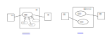

.. Kenneth Lee 版权所有 2021

:Authors: Kenneth Lee
:Version: 1.0

:dtag:`架构设计案例`

一个逻辑链断裂引起架构设计方向错误的实例
******************************************

最近评审了一个构架设计文档，看到一种很常见的错误，我在这里表述一下，供其他设计
者参考。为了保密和突出描述重点，我描述的时候会对具体情况进行加工，所以这里描述
的不是针对某个真实的情形的重现，而是表述一种常见错误的关键Pattern。

这个设计用于一个系列设备的驱动开发团队。驱动团队，有经验的工程师应该都知道，就
是你做了一个硬件，这个硬件里面可能有USB，有存储，有GPIO，有网口，说不定还有各种
加解密设备……诸如此类的，这些硬件不是标准的接口，要让操作系统去用它，需要一个“最
后一公里”的桥接过程，完成这个桥接的，就是驱动。

如果你用了某个操作系统，这个操作系统就会对这些驱动有约束，这样天然会形成一层架
构，所以，很多时候，驱动团队是不怎么需要做架构设计的，特别是很多设备的嵌入式驱
动其实都不大，几千行就够了，内部的结构也不复杂，所以内部的逻辑也没有太高的层次
，也不需要到架构这一级的设计。

但这个团队发展到一定的规模了，也开始有不少的历史包袱了。他们有这样一个需求：操
作系统（连上驱动）必须可以前后兼容。简单说，旧的操作系统版本（二进制，下同）可
以运行于新的硬件，新的操作系统版本可以运行于旧的硬件。

这种设计跨越多个版本，多代硬件，还需要驱动之间有一些公共的框架可以配合。这就不
适合放到每个具体的驱动的设计里面去做了。这种情况，就需要做一个架构设计了。

团队的架构组开始用4+1视图的方法来做这个架构。首先，他们给出了设计的目标，就是前
面这个需求，要实现硬件和软件的前后兼容。

然后他们开始画Use Case图。好了，问题就出现在这里了。我们说过
（参考：\ :doc:`Use Case图有什么用？`\ ），Use Case图的用途是划定我们做的功能的
范围，决定它呈现为一个什么产品，以及这个产品在整个使用场景中的位置是什么。

所以，就这个实例来说，架构师很容易就开始画“驱动在系统中处于什么位置”。这个描述
本身“没有错”，但逻辑链断了。你做这个设计的目的不是解决兼容性问题的吗？你突然描
述驱动有什么用，这个逻辑在逻辑链中的地位是什么呢？你在证明什么呢？

这是一个典型的“每个单独的表达没有错，但在逻辑链证明上是错误的”的设计错误。

我们对比一下把问题域定位在“做驱动这个功能”和“解决前后兼容问题”这两个不同目标的
时候，Use Case有什么不同：

你就会发现，架构视图其实有非常高的自由度，看的是你抓逻辑中的哪个点。你抓功能这
个点画出来的图，和你抓兼容这个点，画出来的图，就会完全不同。离开了逻辑链，我们
根本就没法评估一个架构是否正确。

一旦这个点错了，后面你画什么视图都是错的，而且这种错误会一路扩展下去。比如概念
视图。如果你针对功能来进一步建模，你就只能讨论网口如何使能这类逻辑，你建立的概
念就会是：设备总线，设备发现，网络框架，协议栈……这些东西。而这些概念，我们一开
始就讨论过了，这没有什么高层设计逻辑，因为它是被操作系统约束的，不是被你的设计
约束的。

如果你基于的是前后兼容的设计来考虑。你建立的概念空间就会是：新硬件的范围，旧硬件
的范围，对于某驱动版本X，如何确定它所支持的新硬件和旧硬件，如何定义X的定义域，
对X需要执行什么约束，才能保证它支持它的新硬件和旧硬件集合，支持到什么程度。

你看，这完全讨论的就不是同一个问题。而且，显而易见，这会是一个非常脏的问题，因
为它不可能是个平直的问题。你现在在外面已经有多少软件版本了？这些版本都要支持你
的新硬件，你怎么保证？如果你没有定义过标准，你要新硬件一个bit都不能改吗？就算硬
件一个bit都不能改，一样有不兼容的问题，那些因为Cacheline长度变了，就让性能大跌
的问题还少吗？因为Order变了，导致完全符合PCIe标准的卡插不到特定的PCIe接口上的事
情还少吗？你要从这种泥潭中抽出来，就得做揪心的选择，比如我首先支持一组版本，这
组版本优先测试和保证。另外我可以留下一些弱控制，比如要求所有硬件都要给我留一个
revision编号，保证我要做errata的时候还有一个可以和统一管理版本的地方。

我们说构架设计难，不就难在这种地方？你既不能不顾现实，不去理解细节，你也不能陷
在细节中，不去抽象简单的接口，保证系统持续可控。（中间完整索引《中庸》的段落会
被gitee算法屏蔽，删除这一段）所以白刃可蹈，而中庸不可能也。逻辑的难度在于准确，
而不是选左还是选右。
