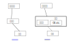

.. Kenneth Lee 版权所有 2023

:Authors: Kenneth Lee
:Version: 1.0
:Date: 2023-09-15
:Status: Released

:dtag:`架构设计定义`

为什么很多人看书学不会架构设计
******************************

架构设计是个实实在在的需要和技能。简单说，你写一个程序，用什么语言写？分几个模
块？按业务分模块还是按接口的复杂度来分模块？……这些问题的决策，你不能说是编码的
时候决定的问题吧？这些判断总是有依据的吧？所以架构设计确实是一种不同于编码的，
而且有实在价值的的技能。你不能装作很“务实”地说：编码才是第一位的，其他东西不重
要。如果你真的“务实”，才应该更清楚，你哪怕是继承树设计错了，你的代码都写得非常
难受。务实，才会认知架构设计的重要性。只是架构的层次有高有低，高可以高到设计一
个全球通讯系统，低可以低到设计几个模块的安排。离得太远了，有人就觉得那些很远的
逻辑和自己关系不大，但从每层看自己上下的层，就会发现，架构设计确实是一种必须的
设计。

架构设计很重要，这可以体会得到，所以很多人都专门想去学，但在现实中，我看到很多
人看了很多架构设计的书，写出来的架构设计还是一塌糊涂。越是努力想去学这些理论的，
就越是偏离架构设计的本意。我发现这里的关键问题在于，架构关注的不是怎么表述，而
是怎么建模。但能给你讲的必然是一个表述，模型如果没有建好，没法给你讲，但模型建
好了，给你讲并没有意义。

我们从本文最开始的逻辑就可以看到，架构设计和细节设计的区别在于你怎么归纳细节，
所以，关键在于你怎么认知所有的细节，而不是你用什么方法来描述你的总结。如果总结
得不对，那么你用任何方法来描述这个总结，它都是不对的。

比如之前我看到有人总结怎么用编译器去封装芯片的接口，这可以画出头头是道的UML图
或者AID图，但这没有用，这整个总结本身就是错误的，因为编译器只能翻译源代码，生
成二进制，这个二进制自己是可以生成代码直接去访问硬件接口，从而跳过编译器的封装
的。一旦你这个认识错了，你的UML/AID图的那些封装，就是空话，因为这个总结本身就
是错的。

但如果我把上面这个理论表述出来，写成了教科书，所有人都定性了编译器就应该是这样
的，那么人们就不会再想这个问题了。在现实中，我看到不少工程师会这样争论问题：
“编译器就是这样的，在某某论文，某某教材上明确说了，编译器是……”，但这个名字只是
那个专家定义的时候用的，不表示它是永恒的。还是前面这个例子，如果我在编译器和芯
片之间定一个协议，编译器用芯片的公钥对程序进行签名，只有签名的程序才能运行，而
且编译器对编程语言进行封装，让编程语言像Java那样看不见内存，那我确实可以认为编
译器就是对芯片的封装。你能说这个结论不对吗？

所以，每个概念建模，都是有它的范围的，对概念进行建模本身，才是架构设计，而建模
完成以后怎么表述这些概念，这反而是没有什么好学的。很多人把UML，鱼骨图这些东西
当作架构设计，其实这些东西和架构设计的关系微乎其微。架构设计的核心其实是你怎么
去总结这个细节，而讲架构设计的书给你讲的都是总结的结果，如果那个结果你不承认，
那你也没法看下去，如果你承认了，剩下那些框框线线也没有什么可说的。所以，看架构
设计的书常常都是没有什么意义的。因为在实际工作中，你会发现大部分问题都是怎么建
模这个概念空间的问题。而学那些线线框框，很多人学到最后，变成拿那东西来编程。这
完全是缘木求鱼：我们就是不想马上陷入细节，所以才把大量的细节逻辑描绘成线和框，
结果你现在把这东西变成细节？

正是不承认架构是抽象，而不是细节本身，导致我们看不懂架构。比如在封装这个主题上，
我会认为编译器和底软（低层软件，如OS，系统库，BIOS等，也包括应用中直接访问芯片
接口的那些软件）共同封装对芯片的接口，有人会辩解：编译器运行在Host上，底软运行
在Target上，怎么可以“共同”呢？

这种说法在细节上是没有问题的，确实编译器自己运行在一台机器（称为Host或者Build）
上，编译的结果运行在另一台机器上（称为Target）。但在架构设计的时候，我们是从不
同的层面（View）去抽象系统，在接口逻辑上，有些访问芯片的逻辑由编译器生成，有些
逻辑由底软传递。那么我在设计这个芯片和软件的接口的时候，就要分配哪部分让编译器
干，哪部分让底软干，这个东西必须在同一个逻辑空间里面分配。它们当然是“共同”的。
在芯片接口这个View上，它们必须一起考虑才能判断逻辑是否合理。

所以，你可以看到，有效的构架设计，必须在某个View上形成一个可以穷举的空间。这就
是我其他文档中反复强调的“逻辑闭包”。类比前面这个编译器的问题，如果我单独谈编译
器如何为芯片提供接口，而完全不谈底软封装了什么，你能判断我的逻辑是否正确吗？这
显然不能，这里条件不足，把条件都补上来了。我们找不到其他可能性可以再访问芯片了，
我们就认为这个逻辑空间自给自足了。所有这些条件，就构成了一个“逻辑闭包”，就好像
数论中的Closure一样：计算的对象在集合中，计算的结果也在集合中，我们就可以忽略
其他要素，聚焦得到一些这个闭包中我们可以得到的推论，然后我们就可以再用这些推论
去当成其他视图或者细节设计的条件了。

整个架构设计过程就好像一个拼图，我们用一些已知的要素先拼最可能的部分，然后用这
些部分当作其他部分的条件，一步步收缩范围，从而得到整张拼图。

所以，架构设计给人的感觉很怪，它既不包含所有的细节信息，但它本身却是严谨的。

所谓不包含所有的细节信息是因为：所谓建模概念空间，是对细节进行抽象，但细节是什
么呢？细节是我们要写的所有代码，芯片的网表，硬件的电路图等等。如果我们这些都写
完了，我们还建什么模呢？所以，在我们建模的时候，我们并没有细节。《美国众神》中
有一句箴言：“最好的地图是这个世界本身”。所以，最严格的架构设计是代码本身。但我
们不用世界做地图，也没法用代码来做架构设计。这背后的逻辑，就是所谓道曰大，大曰
逝，逝曰远……根本原因就是人脑一次只能处理少数的逻辑。

但我们又需要理智的决策，理智的决策意味着架构设计也必须有《自然哲学论》中描述的
“Can be said clearly”部分。这个部分就是被从“Must be passed over in silence”中
分离出来的，单独作为“共识”的那些概念和推理。这些独立的概念和推理，就是一个个独
立的逻辑闭包。

所以，我们有一个比较直接的标准来判断一个架构设计在形式上是否“正确”。那就是它必
须包含一组逻辑闭包。但这只是保证了形式正确，但还是有漏洞的，主要是：

1. 这些逻辑闭包的基础元素不一定被正确总结了
2. 这些逻辑闭包不一定表达全部细节的主要矛盾

但至少我们有这样一个结论，不包含逻辑闭包的架构设计，确实就不是严谨的，或者说不
是严肃的架构设计。我在实际工作中经常评价一些号称“架构设计”的文档“不包含设计的
成份”，主要就是在里面提炼不出一个完整的逻辑闭包来。就好比前面的编译器设计，如
果你谈编译器设计对芯片接口的封装而不谈底软和它的关系，那这个设计就不包含设计的
成份，因为我们没有足够的条件证明这个设计是可以成立的。

在实践中，我们确实有可能“不知道底软现在定义了什么接口“，但如果你能做出选择，那
就意味着其实你是“对它是有期待的”，比如你作为一个ARM编译器的工程师，做一个RISCV
的编译器，而没有定义底软如何加载动态库，那很可能你假设，RISCV的底软用ARM一样的
协议来加载动态库的。如果你做的是一个严肃的架构设计，我会希望你把“RISCV使用和
ARM一样的动态库加载协议”作为你逻辑闭包的一个要素，写在你的设计文档中。

所以，文档是架构设计中重要的一环。因为我们也只有文档才能定义这个逻辑闭包了。你
有那句清楚表达的条件，相关的人就有机会发现这个“总结”是否正确，他会用他所理解的
“Passed over in silence”的信息去校验你的总结对不对。但如果你根本不提这句话，这
个事情就没有校验了，这个设计就全部都在Silence中了，就和没有设计这个步骤，直接
走入细节中一样。

由此可以看出高层设计对于子系统的意义在那里：高层建模的目的是封锁子系统的穷举范
围。如果我们从最重要的约束（通常是需求）中推理出来一个结论，那么下一层的设计就
可以封闭在一个空间里面做设计，它的可能性空间就小。你推理的成本就低。比如你做一
个学生成绩管理，如果一开始就告诉你，学生成绩是五科分数，而且肯定是整数。那你做
一个五维的整数向量就可以保证功能一定能做到了。但如果这一点不能确定，你要保证你
的模块不用重写，你就可能需要用动态多类型数组来存这东西了。这整个难度就上去了。
你当然可以过度升级，但多出来的开发成本，空间，性能优势，每个最后都可能是压跨你
的项目的砝码。

所以，我是不承认什么代码即文档的，框架性明显的代码当然表达了一个视图，但视图远
远不是框架性代码可以表达的，状态机，多线程模型，锁模型，流量模型……有多少视图可
以用框架代码来表达？

架构设计永远都是务虚的，因为它毕竟不是代码。但跳过架构设计去编码，那更加务虚：
代码不是一天写出来的，那你第一个月写的那些代码，难道不是务虚？

所以，不做架构设计，不是务实，而是逃避现实，不想面对很多难度而已。我见过一个总
线的工程。谈内存语义的时候是一份文档，谈IO语义的时候是另一份文档，谈通讯的时候
又是一份文档，每份都头头是道。但让他们拼在一起，统一说，你这个东西到底支持的是
个什么，就没人肯吭声了。因为要同时支持这些语义，就要明确说明，其实很多功能是不
能做的——但恰恰就是这些“不能做”，我们才真的可以降低工作量，尽快聚焦到可以做到的
竞争力上啊。都不肯承认这点，非要等到最后没得选择了，重新攻关，能抢救多少抢救多
少。这不是逃避现实是什么？那个时候其实所有的设计，都已经失败了。

架构设计是针对整个问题的主要矛盾和矛盾的主要方面建造一组逻辑闭包，所以每个闭包
必须实现“君君臣臣父父子子”的形态。现在我们提“君君臣臣父父子子”通常是贬义的，用
来批判儒家思想的固化。但在最初的设计中，这其实是一个架构设计最基本的期望：完成
角色分割，君做好君的事情，臣做好臣的事情，父亲做好父亲的角色，儿子做好儿子的角
色。这样逻辑空间才会自恰。我最近评审了一个汇编手册，这个手册中描述了我们这种指
令特有的特点，作为我们整个指令设计的一部分，我就看这个汇编手册很不顺眼。因为定
义指令是指令集手册的问题，如果指令手册中没有定义这些特征，那么指令手册的逻辑空
间肯定不封闭（想像一下，指令手册只定义了如何写内存，没有定义读内存，或者定义了
如何写字节，没有定义如何写字，你没法理解这个指令的特点吧？），如果指令手册定义
了这种特征，而汇编手册也定义了这种特征，冲突的时候，听谁的？

所以，汇编手册有汇编手册的位置，指令手册有指令手册的位置。指令手册定义芯片给软
件的接口，汇编手册在这个上面只能顺从。而汇编手册定义汇编语言写什么样指示，能让
汇编器生成芯片需要的，能表达汇编程序员的期望二进制程序，这个芯片手册也不可置喙。
这样这个设计才能被校验，否则我们还是必须把这两个部分的逻辑一起提出来，到一个逻
辑闭包中进行推理，才能确定这个设计是正确的。

这个道理，就好比你写程序的时候，相同的数据结构，需要抽象在一个类中统一封装。不
这样做，可能程序也是可以运行的，但人脑无法校验。人脑要可以校验，就需要形成逻辑
闭包。我们每个“理智”的判断，都需要这样一个过程。所以，没有逻辑闭包，就没有设计。

但“君君臣臣父父子子”为什么会被人批判呢？因为社会发展了，这个名称空间不再适合承
载新的细节了，打破它才能承载新的细节。这就是我们前面为什么说，不要用现有的名称
束缚了你去满足新的需求。新的社会就不适合有“君”这个角色了，你还拼命为“君”去添砖
加瓦，自然逆细节而行了。

所以架构设计呈现了君君臣臣父父子子的形态，但架构设计本质是反君君臣臣父父子子的。
架构设计做的是定义君君臣臣父父子子这种关系，它的设计形态是这个概念空间，质疑该
不该有这些名字，这一点确认了，它才去维护这种关系。但如果遇到新的需求，新的问题，
他还无脑承认这种关系是颠簸不变的，那架构设计，反而就没有存在的必要了。

君臣关系
========

君臣关系这个主题其实值得深究一下。从我们前面的逻辑关系来看，在我们的设计中，每
个角色都有自己的控制范围，有些东西归君负责，有些东西归臣负责，互相不进入对方的
自由度空间，这样我们才能让每个决策高内聚，低扇出。这种方法保证了每个角色自己内
部的可能性空间比较小，我们容易做可能性穷举。

但我们说具体的君臣关系的时候，其实同时也强调了两个角色主要是谁在控制接口行为的
一面。当我们定义一个接口逻辑的时候，往往有谁是主导一方的说法，这决定了在我们进
行内部逻辑穷举的时候发现错误了，应该靠谁来决定这个接口如何调整。

举个例子，python-sphinx的代码中，创建新的node需要提供visit和depart两个回调函数，
当translator最终把代码写到输出文本中（比如html）的时候，会调用这两个函数生成那
个目标文件。translator作为入口参数（self）提供给回调函数，回调函数调用self进行
输出。

这里，设计者希望用self封装translator，node的实现者不需要关心translator的细节。
但这可以做到吗？translator是所有的rst文件可以生成的目标文件，可以是html,latex,
epub等等。这些格式可以写什么进去，是translator的接口可以左右的吗？显然不是。

所以在这个接口的关系中，html, latex等才是君，translator是臣。决定这种关系的是
细节的现实情况。所以，君臣这种关系，其实不是定义接口可以决定的，是细节在决定了
我们高层抽象如何看待这个问题。

什么是穷举逻辑闭包的条件
========================

这个有封装经验的人应该有直观感受，但现实中总有人问，我们这里举个例子。

比如你有一个数组，你这样提供接口：

.. code-block:: c

  class A {
        int array[100];

        void put(int val);
        int get(void);
  }

这承诺的接口就是个口袋：能往里丢数据，然后能取出丢进去过的数据。

如果这确实就是我们对这个设计的全部要求，因为对外接口只有put和get，
我就可以按比如一个栈或者一个FIFO的形式来组织这些数据，我可以在闭包中穷举所有的
可能性，在各种情况下都不会出错。

但如果我判断错了，现在它需要增加一个接口，int get(int index)。那么，我原来的设
计就不成立了。我根本就不可能用FIFO或者Stack的方法来实现我的算法。那我这个设计
就白做了。

高层设计约束细节设计的行为，就是要能穷举这个接口。如果丢了一部分没有穷举到，细
节设计的工作都都是浪费的。那样的高层设计毫无意义。

有架构和没有架构的区别
======================

todo：有架构，逻辑的条件是建立在少数的特征上的。要控制结果，如果条件不足，还需
要分开多种细节可能性分别处理。没有架构，逻辑的条件是建立在大量的特征上的，结果
比较容易控制，但不具有通用性。

想到要讨论这个问题，主要是看到UB的链路层优化，它去掉了不少pcie的私有特性，我在
想，在没有定义外部接口的时候做这样的优化，其实已经假设了一个外部接口了，不去清
晰推演这个接口，这里就会出问题。

更多的例子
==========

例1
---

最近和一个产品讨论他们的方案性能优化，其中有一个方案是这样的（注：这里的“线程”，
都是指硬线程，或者可以说是一个轻核）：::

    其他节点-->带外队列管理-->带内队列管理--+--> 管理线程
                                            +--> 业务处理线程
                                            +--> 业务处理线程
                                            +--> 业务处理线程
                                            +--> 业务处理线程
                                            ...

说起来，这个就是它的一个架构视图，说明它的业务处理方法。但这个建模其实没有价值。
我们说了，模型是一个抽象，不代表所有细节，支持抽取了部分细节（特征），但我们忽
略其他特征，专门强调这个特征，必须是有目标的。针对这个目标来强调特征才是我们建
模的目的。这个图是否强调其他节点只能通过一个唯一的通道进入带外管理呢？如果它强
调这一点，后面的带内模型是没有意义的。如果这里不是它的强调点，前面只是写意，作
者重点想强调带内队列管理包含很多线程，它这里是否想强调只有一个管理线程和多个业
务处理线程呢？

实际上，作者想给我强调的是带外输出发送到带内队列是个瓶颈，希望我提供一个硬件给
他提高带内线程的调度效率。但这个架构模型怎么能强调出这个通讯模型的瓶颈在哪里呢？

你看，如果让我重新画这幅图，我会这样来强调：::

    |               +----------------------------+
                    |                            |
                    V       +-->带内队列-->业务管理线程
    其他节点-->带外队列管理-+-->带内队列-->业务处理线程
                    |       +-->带内队列-->业务处理线程
                    V       +-->带内队列-->业务处理线程
                  公共内存  +-->带内队列-->业务处理线程
                     A                        ...
                     |                         |
                     +-------------------------+

你看，其实图怎么画不重要，你强调怎么才重要，前面的视图是不是产品的某种抽象呢？
是，但没用，抽象的东西这一点那一点的，看抽象它干什么？后面这个我们是有目的的，
这个方案就是IO上先放一个带外队列管理进行消息分发，管理消息发给管理线程，业务消
息发给业务处理线程，如果管理数据变化，就刷新带外队列管理的测卤鹅，让那里改变调
度不同队列的数据，而带外队列管理和业务处理线程主要通过公共内存进行通讯。所以，
整个瓶颈很可能在三处：内存带宽不足，队列带宽不足，业务线程算力不足。

架构设计不是描述的是否和细节完全对应，也不是描述得对不对，不是怎么画这种图才是
“真正的接口图”，而是你怎么看待这个问题。

例2
---

最近我评审了一位同事的系统设计，我给他评价说“这个设计几乎没有什么有用的信息。”
他和我处理喝了个咖啡，期间有这样一个讨论：

他问：为什么你说的架构设计方法我们都听了，也对着做了，做出来你还是觉得不对呢？

我这样解释：我，或者其他人，给你们讲架构设计。作为例子，总会举一些“完成的设计”，
比如一台服务器，需要有CPU，有总线，有IO，有操作系统，诸如此类的。但你再具体去
做一台服务器，你面对的具体问题就不是这些通用的问题，而是一些具体问题。比如你做
一台1650，CPU架构是ARM的，你不用考虑OS怎么使能的问题，IO是第三方的，也不是你考
虑的关键，可能你的关键是向前兼容之前的版本，也可能是你必须使能新的硬件UB。那么
怎么做兼容，怎么做UB就成为你的主要矛盾和矛盾的主要方面了，你的设计就必须谈这个
兼容和UB的问题，而不是继续谈你有CPU，有总线，有IO的问题了，那些信息确实都“对”，
都是组成服务器的必须元素。但那些东西对你的设计毫无意义，它就没有什么价值了。

所以，我们做架构设计，关注的是这个“主要矛盾和矛盾的主要方面”，而不是让你去学习
那个形式，不是让你重复已经知道的东西，没有这个主要矛盾，或者错判了这个“主要矛
盾”，这个设计就没有意义了。

具体这个同事的设计问题，还有这样一些：

1. 我发现它要觉得做一些软件，但没有提到这些软件的版本。我就说，你没有这个版本
   的定义，我觉得你就没有对这个设计上心。他就给我解释说：我也向学习你给我的要
   求，定义一下这个版本，但这个版本是客户决定的，而客户的版本还没有确定，所以
   我定不了啊。我对此的意见是：你这个思路还是不是设计，因为你说的这个设计是为
   我做的，而不是你自己真有问题，所以你做了这个设计。而是我给你洗脑：需要写个
   设计，所以你学习我的形式写了个设计。设计是因为有问题我们要解决所以才做的，
   不是为了某个仪式或者某个人的要求，理念而做的。我们为什么常常要设计软件的版
   本？很简单啊，我马上就要开发了，开发的特性落在那个分支上？这件事情会因为用
   户没有确定版本而消失吗？用户明年确定版本，你现在总得决定一个决定开发在哪个
   分支上吧？不决定这个东西，不就是随便弄一下再说么？对于一个有几十上百人的团
   队来说，随便弄一下，各搞各的版本，你说你到时候怎么拼起来？这是个实在的问题
   啊，怎么可以推到“用户没有决定”头上？

2. 各种视图，比如上下文图，组件图，基本上都是一张图，完全没有文字的。这还是前
   一个问题，这些图都是形式，而不是为了解决某个问题而做的设计。视图其实不是图，
   而是从某个角度分析问题。比如上下文图，就是为了单独区分：哪部分是我们交付的。
   比如你个人做一个私有云系统，你负责提供云管理软件部分，客户自己出服务器硬件，
   第三方负责软件工程，说不定他们还要在你软件中嵌入他们的插件，这个一个复杂的
   关系，你怎么给整个团队说清楚你交付的东西在哪里？这就搞张图，说明哪里是一个
   独立的实体，哪些是你开发的，哪些是别人提供的，关系是什么……这个角度（“视图”）
   的说明，关键其实是文字，图只是个辅助而已，你零丁丁放副图在那里，想干什么？
   这个视图你说清楚了，然后接着和开发团队讨论开发工作分配，你自然就会分配这个
   程序谁写，那个程序谁提供这种问题，这就是开发视图了。你看，两个视图讨论的都
   是这同一个软件啊，只是讨论它的不同角度的逻辑而已。视图是一个逻辑角度，不是
   一副“图”

总结这些问题，说到底，一个设计是不是真的是个设计，关键还是在于你能否抓到一个个
关键问题，正确抽象它的逻辑，从而为细节设计提供约束，保证细节不会走偏。如果失去
了这个作用，设计就会沦为形式了。

总结
====

把上面的观点总结一下，我们发现架构设计主要在应用两个能力：

* 抽象的能力：从一组对象大量的细节特征抽取其中的关键特征来描述这个对象。
* 穷举的能力：找到解决一个目标问题的\ **所有**\ 抽象组成逻辑闭包，在闭包内增加
  额外的认为约束（设计），推理在所有外部和内部约束之下，任何一种发展最终都只想
  问题的目标。

这两个能力，都是“无中生有”的，需要从没有形成“名字”的细节空间中（道德经中所谓的
恍惚）中，抽象新的概念。这就是为什么不面对一个具体的场景，没有办法具象地说明架
构怎么做，学些架构的方法本身，不是架构。架构脱离不了具体场景而存在。
