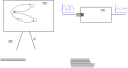
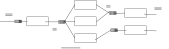

.. Kenneth Lee 版权所有 2024

:Authors: Kenneth Lee
:Version: 0.2
:Date: 2024-09-14
:Status: Released

关于队列模型
************

上周在一个内部讨论中讨论了一下调度模型，其中提到计算单元的调度并不是一种“调度
器”个体的作用，而是调度算法的作用。用人的管理来理解，就是一个组织的人力调度大
部分时候并非是某个管理者不断去安排每个人干什么，而是每个人按已经设计好的工作策
略，按优先级一个一个完成任务，完成的任务通常也不需要回到某个“调度器”去请求安排
下一个任务，而是把完成的任务交付给下个环节，然后自己取下一个任务去执行。

调度的精髓不是让调度者去介入，而是让被调度的对象花尽可能多的时间去做主要业务，
而不是浪费时间去“调度”。

所以，调度的核心在队列的管理上：我们给每类调度执行者一个队列，调度执行者从队列
中获得任务。调度者主要是要维持这些队列的平衡：如果队列太空，就要强化前一级的处
理，如果队列太满，就要强化后一级的处理能力。如果整个系统都满载了，我们就需要开
始对整个节点的入口进行流控。

那个讨论文档写完后，有人评价说：这看来是个状态机模型，每个计算或者处理单元都是
一个独立的状态机，在其他节点的激发下改变自己的工作状态。

我觉得这个理解是不对的，但我这两天在出差，没法在内部写，而且这是个通用主题，我
就写在这里。

一般来说，我们用状态机主要是考察某个对象的行为特征，比如一个电梯算法对一个向下
的请求是否立即响应，和它当时正在什么位置和运行方向相关，我们为了描述和分析它的
行为特征，我们才用了状态机。但队列不是这样的，队列的行为和处理队列的对象的反应
并没有直接关系，你当然可以广义地说整个队列是对象的状态，但这个模型并不解决什么
实际的问题。

所以，队列更多是个滤波器：你对某个对象发起一组请求，如果这组请求维持这个输入速
度，队列没有什么用的，因为这个对象根本就处理不完。所以实际用到队列的地方都是请
求是一波一波发送过来的，队列的作用是让处理波峰的时间可以被摊平到波谷上，从而，
避免处理单元在一波冲击上出现业务损失丢包。

从上面这个图可以看到，状态机更关注的是处理模型，而队列更关注的是流量模型。队列
的深度其实主要受这个波峰和时延的限制，过浅的队列深度会导致单次溢出，过深的的队
列导致过载检测滞后（队列已经收到超过处理能力的请求了，还在无限度地接受请求）。

如果你只有一个处理单元，通常我们就需要一个队列。因为对于每个请求，你处理一半再
换一个执行，除了改变优先级其实没有什么收益。

所以，什么时候你真的需要更多的队列呢？

这就变成一个速度匹配模型了：比如我们的目标对象是一个多核CPU，为了把整个处理过
程并行化，我们到了可以并行的时候，就会把处理分成多个子任务，分解到多个子计算对
象上，这样我们才能让整个调度模型并行起来。

这个模型里面，我们有更多的队列，但它们的地位是不一样的，因为其实我们不希望在我
们处理能力不足的时候还接收新的请求。在只有一个队列的时候，我们只要监控这个队列
的深度，我们就能知道处理能力了。但如果我们有多个队列，任何一个队列过载，都可能
导致丢失请求，但这种时候不见得是因为整个系统的处理能不足，可能仅仅是调度不合理。
在某个队列上形成瓶颈了。

如果每个计算步骤需要的计算单元是不同的，这没有办法，这个时候内部的瓶颈就是真的
瓶颈。如果计算单元是相同的，那么我们还有一个重新分配算力的机会。

但如果计算单元是相同的，似乎我们也没有必要使用很多的队列啊。都用一个队列就可以
了。所以问题是什么呢？问题是多个计算单元访问同一个队列的阿姆达效应（更多的串行
队列操作引发并行性能的急剧下降），这种情况你就要被迫把队列分成多个了，这时是需
要调度独立间的平衡的。

总结起来，这种模型的流控其实也是比较直接的，它包括几个部分：

* 我们尽量减少中间队列的数量来避免多余的调度不平衡。

* 基于前一点，如果任何一个全局队列过载了，我们都需要反压到入口一级，这样收入多
  余的处理不了的任务。

这样，无论是单个队列还是多个队列的系统，都可以用一样的思路去处理了。这就是大部
分系统调度平衡模型。
