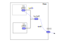

.. Kenneth Lee 版权所有 2026

:Authors: Kenneth Lee
:Version: 1.1
:Date: 2026-05-12
:Status: Released

把AI Agent关到笼子里的一点体验总结
**********************************

介绍
====

最近一直用一般用户直接运行AI Agent编程，有时甚至直接用Agent直接解决本地不少配
置和安装问题，感觉效率提升的同时，也常常有点后怕：为了让AI好用，基本上工具会越
给越多，而且通常没空检查它要运行的每个脚本，这东西任意读机器上的配置，甚至执行
sudo，这些信息几乎都会被Agent发到LLM服务器上，这里面什么都有：主机名，保存在各
种配置中的密码，apikey，ip地址，mac地址……这些东西十有八九会被运营商拿来训练新
的模型。就算这些运营商脱敏做得好，但某些pattern的组合很难说不会被LLM永久记住，
谁知道哪天不会变成LLM公开给全世界的某种“例子”，或者“知识”呢？

.. note::

  很多人可能没有注意到这个问题的普遍性，AI信息泄漏不是说它刻意要看你的密码问题
  的。只是你让它解决一个问题，它需要打开你一些文件看看，而这个“看看”，对Agent
  来说，就是被文件的内容给你发到网络上，这个东西就泄漏了，甚至这种内部的工具交
  互，在Agent上都看不见。但还是你的Agent上下文的一部分。

所以，我还是想着尽快把这个东西装到笼子中，不能继续这样裸奔了。本文是做这件事的
一些体验总结。这里不是要提供什么方案，而是描述“我为了实现我的目标，做了些什么
尝试，这些尝试的体验是什么”。对读者来说，这也不是一个完善的，可以被重用的方案，
而是说，知道如果按这种方法来做了，可能会遇到这个那个的坑。

对了，我用的主力机器是Debian 13 （Trixie）。

方案选择
========

做这件事，我第一反应是三个选择：

* 加一个用户
* 加一个容器
* 加一个虚拟机

一个比一个安全，但同时一个比一个慢。

为了后面叙述方便，我假定我的主用户是kenneth，uid/gid是1000。

为什么是这三个选择
------------------

隔离这件事情，说到底就是分类，分类的技巧最终就是“切得干净”，因为我们最初可能是
基于意图来切割的，但现实总有关联性，意图上切开了，现实可能是切不开的。比如你说
“我希望Agent能解决我的工程问题，但我不希望Agent读我的密码文件”，这个意图上是切
得很清楚的，但你面对这样一个关联：“某些工程问题，Agent需要使用你的密码才能解决”
然后你可能就不得不补充逻辑“需要密码的时候来问过我，我给你密码才能继续。”，这安
全了一些，但你密码给了，Agent会不会拿去训练下一个模型？这又冲突了。你又得加上
“我不能直接把密码给你，你要密码的地方让我输入，但输入以后你只许看XXX文件，不许
看其他文件。”但会不会，拿了密码以后Agent要看好几个文件，一个个问你，你又要求
“都可以看，不要来烦我了。”了呢？然后你突然发现它在看另一个你原来没有想到的YYY
文件，然后你又要求“靠，YYY文件不能看……”呢？……

所以，安全这种东西，最终总是有一个底线控制的。而这个问题我们人类曾经解决过，我
们最后的解决方案就是用户，容器，和虚拟机。这些方法很成熟了，你觉得不够，那我们
至少也可以以这个为基础来谈。否则你虚空来一个“说不定我们有更好的隔离方法呢？”，
那你只能跟空气谈了。

我还听到有人问：“你这样把AI隔离到沙箱中以后，我想访问沙箱外的功能怎么办呢？”老
天，你这就不是讨论隔离了。你明明就想隔离，真隔离了你又不爽，然后你再问我“如果
我不想隔离了怎么办呢？”。这就逻辑上无解了。你有功夫想这个，不如想想现有的隔离
方案在哪个场景中不方便了，我们具体看怎么解决那个问题。

要说可以引申，其实确实也有一些引申手段的，比如VM，那不一定需要是OS的VM，我们还
可以是Python VM，功能封闭在Python VM中。这确实有很多手段，我原来还想过做一些特
殊的Agent Tool，在这个Tool中，能访问的内容是有限的。但这些方法推理下去，你会发
现，Python也是可以fork进程，可以读不同文件的，搞到最后，它的边界也是它所在的用
户，容器和VM。当然你还可以做一些功能非常有限的tool（比如READ），然后在这个上面
控制读的范围，但如果你真要控制精细到一个个文件给权限，那你还不如直接把那个文件
写到上下文给它呢。

所以，一番推理以后，我发现最终还是指向“用户，容器和虚拟机”。剩下的问题只能是你
觉得什么东西没法放到隔离区中，或者在逻辑上，什么东西放到隔离区，会引起连锁反应
造成泄密。唯一我能想到的其他解决方案是让Agent斗Agent，让另一个Agent去审核某个
Agent执行的行为，这类方案我暂时是没有考虑的。

用户隔离
--------

我先试了第一个方案，我创建新的用户比如dev1, dev2去开启不同的agent任务，然后工
作都在里面了。登录的时候是kenneth，要做某个具体的任务就创建一个新的用户，再su
到这个用户里面去启动AI引擎。

用下来主要优点是：简单，如果只用命令行，几乎感受不到换了机器，图形程序只要从命
令行启动，基本上也不需要额外的设置，只需要在host上开xhost +local:dev1就够了，
由于X的unix socket在tmp目录下，dev1可以直接访问过去。

缺点：

1. kenneth数据确实对devN保密了，但/etc，/usr，/var这些目录还是公开的，很难说能
   否保证这些地方没有可以被暴露的信息（不少密码是直接保存在这些地方的，比如
   /etc/shadow，至少hash是暴露了）。

2. 维护起来不方便，因为用户id是每次都改变的，所以拷贝一个新用户都要重新设置半
   天，虽然可以写脚本自动化，但没法写出通用的脚本来，因为不同的软件配置有不同
   的设置方法。

3. 每个用户的数据都要拷贝一份，占据的空间比较多（虽然对我来说这个问题不大）

前两个问题对我来说几乎不可接受，所以这个方案很难成为我第一选择。用这种选择，我
不如直接把我重要文件写到加密文件系统中，用AI之前先umount掉这个区域再开始用就好
了。

容器方案
--------

然后我尝试第二个方案。现在Docker在国内几乎就没法用，所以我直接用LXC。LXC不算太
成熟，但胜在算是Linux的原生方案，死也死不到哪里去，核心功能也足够稳定，甚至没
有docker那么多商业干扰。它的镜像服务器是社区维护的，基本的社区发行版都有，而且
它也不强制你使用镜像服务，随便用debootstrap之类的工作自己搞一个一定问题没有。
所以我优先选它，用它代表其他方案可以达到的高度。

谈LXC方案很容易被两个概念扰乱：LXC和LXD。前者是社区的基础方案，后者是Ubuntu做
的上层封装。两者的命令区别主要是：LXC是lxc-xxx这种形式的，LXD的命令是lxc xxx这
种形式的。LXD也有那种“开源的商业背景方案”的气息，所以我这里只谈LXC，认为LXD不
存在。

LXC分privileged和unprivileged两种模式，前者基础权限是root，用起来简单，但普通
用户运行不了，也容易造成破坏，我这里重点考虑unprivileged模式。

Unprvileged容器的用户映射
~~~~~~~~~~~~~~~~~~~~~~~~~

和用户隔离相比，容器隔离最大的好处就在它的用户管理。每个容器都是同一组用户来管
理的，不需要像用户隔离那样每个实例都产生一个新的用户。

这一点通过名称空间（namespace）的用户映射实现。

首先，使用这个方案，每个普通用户，都会被额外分配一组sub uid/gid。比如你在
Debian下创建一个用户kenneth，它给你分配了uid/gid 1000，它会同时把uid/gid
100000也分配出去，同时把这两个id加入到/etc/subuid/subgid中。

也就是说，作为uid/gid，1000,100000-165535都分配出去了，同时，100000-165535是
1000的sub uid/gid。从宿主角度看，它们都是普通的uid/gid，但如果用户1000创建一个
名称空间，这个名称空间的id，都可以被映射到这些id上。

如果你再创建一个用户tom，tom可能会被分配1001,200000-265535这组ID。所以，每个用
户都有一个很大的用户id空间可以用。

kenneth平时是1000，也不能直接操作1000以为的其他没有给它权限的文件，但如果
kenneth创建一个名称空间，在这个空间中它的root权限可以被映射到它自己的uid/guid
，或者它的sub uid/gid上。这样，在名称空间中它就可以操作这些文件了。

这个看个例子就明白了：比如你是kenneth，你执行：::

  lxc-usernsexec -m d:0:100000 -- id
  lxc-usernsexec -m d:0:100000 -- touch x
  lxc-usernsexec -m d:0:1000 -- touch y

这里，第一个命令创建了一个名称空间，然后在里面运行id，在名称空间中，id命令的运
行结果就是root（0）。

第二个也是一样的动作，但这次创建了一个文件，touch命令还是认为自己是root，但
root（0）被-m参数映射到宿主的100000上了，所以你在容器中看到它的用户是0，在host
中看，它就是100000了。但100000这个用户，并不能操作仅kenneth（1000）才有权限的
文件，同样，kenneth也不能操作仅100000有权访问的文件。

第三个做一样的动作，但这次名称空间的0，被映射到了kenneth自己，所以你得到一个你
自己就能访问的文件。

这样，剩下问题就是你怎么把你的信息放到一个个的隔间中了。而从隔间的角度来说，在
lxc-usernsexec的帮助下，kenneth可以访问所有分配给自己的uid/gid和sub uid/gid的
内容。

rootfs隔离
~~~~~~~~~~

如前所述，LXC不是虚拟机，而是一个名称空间，所以其实它不需要有虚拟机的概念，只
要给定一个config，里面描述隔离要求，就可以完成隔离，你甚至不需要指定rootfs，直
接复用本地的rootfs都是可以的（如果是这样，其实你用lxc-usernsexec就可以了）。但
我们用LXC的目的就是不想它看我们宿主本身的整个rootfs，所以通常还是会创建一个
rootfs，但和虚拟机不同，这些rootfs并不需要“启动”，我们是在隔离空间中运行一个命
令，如果命令需要访问文件，就去rootfs中找而已，并没有一个启动rootfs的过程。

Debian的管理是把用户容器放在~/.local/share/lxc里，每个容器一个目录。如果目录支
持COW，也可以用COW的存储驱动，从而节省重复空间。

拷贝起来也很方便，每个容器一个目录，里面一个config加一个rootfs，rootfs从镜像服
务器下载也行，自己做一个也行。重点是隔离本地的root，用一套独立的。配置好一个容
器，其他容器都可以从这个容器上拷贝。lxc-copy可以完成这个功能，但Debian 13当前
的版本有bug，拷贝不过来，但不影响手工拷贝（config用当前用户拷贝，rootfs用
lxc-usernsexec拷贝即可）。

其他要让容器看到的目录都可以用bind mount加到容器中，比如：::

  lxc.mount.entry = /home/kenneth/work/qemu-dev home/kenneth/work/qemu-dev none bind,create=dir 0 0

这基本和fstab差不多。

作为名称空间，容器也使用自己的mount名称空间，宿主的mount不影响容器的mount，如
果你在一个目录中mount了其他的目录或者设备，这些也不会被暴露到容器中，容器只能
看见mount的inode，这都在一个设备内部，不会被mount point影响。

同样，如果你bind mount的文件中有链接，链接的路径这只是在容器内部计算，不会被链
接到宿主上。这基本都隔开了，你的程序别依赖在宿主的链接就好。

其实这里最麻烦的问题还是一开始提到的用户映射，LXC默认的映射方式是把容器的
0-65535用户，映射到宿主的100000-165535上。这样，虚拟机就完全没有本地用户的权限
了，如果要bind一个目录过去让容器处理，就要给这个目录other权限，但这样又会暴露
给其他用户。而且为了让容器能看见这个目录，我的home也必须让other可见（否则cd不
进去），这反而增加安全风险。

一种思路是改用ACL用户权限，这需要文件系统支持，不通用。我选择的是另一个简单一
点的方案：把容器的root:0映射到本地用户，比如kenneth:1000，上：

这样配置~/.config/lxc/default.conf：::

  lxc.idmap = u 0 1000 1
  lxc.idmap = g 0 1000 1
  lxc.idmap = u 1 100000 65535
  lxc.idmap = g 1 100000 65535

如果你只用容器的root，这甚至都不用lxc-usernsexec管理这个rootfs了，因为里面只有
root一个用户，而这个用户已经映射给kennneth了。这也没有不安全的问题，因为容器限
制了容器中的进程可以看到的目录的范围。

从这个角度来说，容器对比虚拟机不安全的问题反而成了一种优势：我本来就不是公开给
所有人使用，我创建容器就是自己用的，怎么创建容器，里面放什么都是我自己决定的，
让它和我共享一个内核反而提高了我的应用和管理的兼容性，安全上，只要保证一定程度
的隔离就够了，容器当前在干什么，基本还是我自己决定的。

其实已经在容器内了，全部用root权限没有什么不好的，但有些应用为了安全，对root用
户是排斥的，比如有些python方案可能不允许你用root做pip安装，所以我一般不会直接
用在容器中用root。我觉得未来这种应用生态会改变。

COW
~~~

如果文件系统支持COW，可以使用COW方案来节省空间，但其实直接用overlay，对大部分
场合都够用了。overlay的配置很简单。比如说，你已经有一个基础系统在base/rootfs这
个目录下了（我这里为了方便描述都是相对路径，实际使用的时候换成绝对路径），现在
我创建一个新的容器another，只要这样写配置就行：::

  lxc.rootfs.path = overlay:base/rootfs:another/rootfs

这样，没有的文件用的就是base/rootfs中的，如果你增加或者修改文件，这些内容会被
写到another/rootfs中，用这种方法用一个系统制造另一个系统就很简单。而且它可以叠
加，你还再建一个容器（假定叫more_other），你可以接着这样写：::

  lxc.rootfs.path = overlay:base/rootfs:another/rootfs:more_other/rootfs

相比COW文件系统，这个缺点就是如果中间的层要删掉，只能人工合并，不像文件系统本
身就内置这种功能。

图形界面显示
~~~~~~~~~~~~

和前一个方案比，图形程序没法访问/tmp中的unix socket了。这可以有三个解决方案：

* 把/tmp/.X11-unix绑定到容器中
* 把X11服务器改为网络端口服务，通过网络端口显示出来
* 在容器中开sshd，ssh进去做X11隧道转发到本地

第一个方案的坑极多，首先是你本地用户的权限和容器不一样，然后你还要配置
.Xauthority权限，最后要修改的东西非常多，不优雅，我放弃了。

第二个方案和第三个方案其实是一个方案。关键是你要开X11的网络端口（现在大部分发
行版都不开），如果不想做这个配置，还可以用unix2socket做转发：::

  sudo socat TCP-LISTEN:6000,bind=10.0.3.1,reuseaddr,fork UNIX-CONNECT:/tmp/.X11-unix/X0 &

如果有防火墙可以还需要开端口，比如用ufw的话：::

  sudo ufw allow from 10.0.3.0/24 to any port 6000 proto tcp

用ssh隧道倒是不用开防火墙的6000端口了，只是变成开22端口。

反正，容器方案图形界面暂时是个减分项，但能用。我现在是能不用图形就不用。

网络方案
~~~~~~~~

LXC的网络类似vmm，支持veth，vlan，phys（物理网卡绑定），我主要用veth，这个最灵
活了：主机上统一一个veth的网桥，其他所有的容器的虚拟网卡连到这个网桥上。host唯
一要做的配置是通过/etc/lxc/lxc-usernet允许这个用户的veth创建（看看例子，很容易
配置的），只要别把ssh key给容器，它就干涉不了外面，剩下的ufw等防火墙全部可以在
host中完成拦截。

关于这个ssh key的问题，还有一个使用模式值得说一下：如果我把一个工程移到容器中
管理，一般习惯是git也在这里管理，于是你就会想着把ssh key也放上去，这样如果你不
使用另一套ssh key，就的宿主也暴露出去了。我的方法是git管理放到宿主上，容器内部
只改代码。这种使用模式特别适合容器，因为容器不是虚拟机，它的文件系统和宿主的关
系其实是两个进程之间的关系，这就没有两边的同步问题了，仅仅就是不同的控制台访问
同一个目录的问题而已。

说回网络。这里唯一不好的地方是容器里面没法访问局域网的其他主机，因为容器内的
veth是内部网桥的局部地址，要能和host所在局域网地址互通就需要配置非常复杂的snat
规则。这一点是比不上通过用户隔离的。

ollama设置的一些体会
~~~~~~~~~~~~~~~~~~~~

我很多地方都使用ollama，有时使用本地量化模型，有时使用cloud上的全量模型，也会
用ollama launch使用claude，pi等Agent，这些都对ollama的跨域访问有要求，所以我在
容器上也测试了一下这种使用模式。

首先我在host已经有ollama了，容器里面又装一个就很浪费空间了，幸好ollama是CS架构，
所以非常匹配这种使用模式，只要把host的ollama命令直接拷贝到容器里面，然后用：::

  OLLAMA_HOST=10.0.3.1:11434 ollama

就可以访问到host（host对容器地址固定在10.0.3.1上）的ollama serve。这样，所有容
器都用host的ollama服务，维护起来相当方便。

这个方案要求host的服务要配置OLLAMA_HOST=0.0.0.0:11434（手册中有具体介绍，这里就
不详细说了）。如果配置了防火墙也需要允许这个服务的访问（最好限定网段，比如ufw
allow from 10.0.3.0/24 to any port 11434）。

缺点前面说过了，容器要使用局域网上其他主机的ollama服务，需要复杂的snat配置。

我觉得ollama这种CS的架构，对未来这种做容器优先的应用来说，是个很好的例子。它的
本质上是：我们只有一个界面，但我们有很多个独立的实例。CS模式运行我们跨实例去展
示同一套界面。除了这里展示的ollama模式，我自己做的
`NoteManager <https://atomgit.com/Kenneth-Lee-2025/NoteManager>`_\ 也是这种模
式，我当时也没有考虑要解决类似的问题，只是当时不同的命令行命令需要展示在同一个
WebUI上，所以就做成的CS形态，但现在用到容器上，这同样可以直接让容器内的命令控
制到Host上的服务器上，这也可以做得很灵活。

共享设备
~~~~~~~~

设备可以用bind mount的方式直接加入到容器中，但这里也会有写坑的。我尝试把原来在
本机调试的Android程序移到容器内部去调试。这要做的工作包括：

1. 关掉宿主的adb server，让出USB端口。（比如：adb kill-server）
2. 把对应USB设备的权限改成666。（比如chmod 666 sudo chmod 666
   /dev/bus/usb/003/009）
3. 把usb设备bind mount到容器中。（比如：lxc.mount.entry = /dev/bus/usb
   dev/bus/usb none bind,optional,create=dir 0 0）

这样好像就直接可以用了（手机要重新授权，因为容器的设备RAS和宿主不同）。

虚拟机方案
----------

虚拟机方案没有什么特别的经验要说的。我用的是VMM+KVM的方案，基本上：

* 它的独立性比容器和用户隔离都要好，用户ID是自己的，屏幕是自己的，文件系统也
  是自己的，本地的目录只能共享过去，没有bind mount一说。

* 网络和宿主方案基本上是一样的（支持更多的虚拟设备）

* 要共享本地设备只能做redirect，没有容器方案稳定。

最大的缺点就是吃资源多，慢。redirect做的本地设备映射也不稳定，比如把host连的手
机转为容器内的设备，经常会断。

这里慢是最大的问题，这一点我在总结中讨论。

总结
====

这个验证我其实还没有做完，但因为现在够用了，现在我基本上做主业（一个Redis集群
相关的开发）和一些零散的开发，我就持续放在两个容器中了，todo

我暂时就试到这里，其他经验以后再做
什么验证再补充。

我其他的感想主要是针对之前讨论的一个问题的：到底Agent OS的需求是什么，我现在觉
得主要是容器，我觉得Agent OS应该集成足够好用的容器技术，随时可以开很多的容器
实例，可以很容易设置限制范围，可以很容易把本地的资源根据需要映射给容器，这样在
未来才能保证我们大量引入Agent，而不会担心把自己的信息直接暴露到整个网络上。

这个容器方案甚至不需要现在这么灵活，不需要可以安装任意发行版，直接从本地clone
一个版本进去就可以了，这样设计会简单很多，也不需要image服务。文件系统最好支持
COW，提供保存版本和回滚的能力。其他的设施，现有的OS基础设施基本也够用了。至于
使用host资源（比如USB，磁盘，GPU驱动等），这些慢慢打磨，总是可以搞定的，就不在
话下了。

这里的关键是容器的低成本，配置一个用户或者VM付出的代价不小，用户建立后就不想轻
易删掉，这样用户就会慢慢把很多东西都放到隔离区中。这些积累的信息最后会成为代价，
被隔离的东西就会变成你的信息主体，这个隔离区就没有意义了。而用容器，基本上你可
以建立一个基础系统，然后每次map不同的目录进去，每个工程都会有一个独立的隔离空
间，下次要再做另一个工程，你马上可以再分配不同的目录组合进去，这就能接受了：数
据永远在本用户手上，然后根据需要给每个隔离区不同的工作内容。
