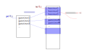

.. Kenneth Lee 版权所有 2022

:Authors: Kenneth Lee
:Version: 1.0
:Date: 2022-02-09
:Status: Draft

抽象的一个具像
**************

前段时间分析了一下qemu cpu_restore_state()这个函数的原理，我通过这个具像，来总
结一下抽象，特别是软件开发中的抽象具体是什么样的。

在qemu中，如果使用全虚拟化，用的是TCG这个Guest模拟器。这个模拟器，这个模拟器和
其他一般模拟器一大区别是它是用JIT的技术，而不是解释执行的方式工作的。

解释型模拟器是读一条指令，解释它的语义，当场修改被模拟的CPU的状态（通常是模拟器
的一个数据结构），而qemu不是这样的，qemu分解码和执行两个过程，解码的时候仅仅翻
译被模拟的指令，把它变成本地的指令，这样连续翻译多个指令后，才会跳到本地指令的
区域中（叫Translation Buffer，TB）去执行。这个执行的过程才会真的更新前面提到的
计算机里的数据结构。

JIT方法的好处是翻译过程可以对TB中的代码基于编译器技术进行优化的，实际的执行效率
比解释执行可以高不少。但由于不是一条指令一条指令翻译执行的，就会出现部分指令对
CPU状态的更新不一定是及时的，比如PC（指令地址寄存器），每次在TB中执行一条Guest
指令就更新一下PC的值，这平白增加执行时间，大部分时候却没有什么用。这样翻译的时候
就不产生更新PC的JIT代码了，只要在最后离开TB的时候更新一次就好了。

但这样会产生一个破绽：如果代码执行的时候发生了异常怎么办？TB会提前结束，这时我们
只知道当前Host JIT执行到哪条指令了，但我们不知道实际上Guest执行到什么地方。

cpu_restore_state()这个函数主要就是解决这个问题的，它的核心逻辑就是找到pc在什么
地方：

.. code-block:: C

   static int cpu_restore_state_from_tb(CPUState *cpu, TranslationBlock *tb,
                                        uintptr_t searched_pc, bool reset_icount)
   {
       target_ulong data[TARGET_INSN_START_WORDS] = { tb->pc };
       uintptr_t host_pc = (uintptr_t)tb->tc.ptr;
       CPUArchState *env = cpu->env_ptr;
       const uint8_t *p = tb->tc.ptr + tb->tc.size;
       int i, j, num_insns = tb->icount;
   #ifdef CONFIG_PROFILER
       TCGProfile *prof = &tcg_ctx->prof;
       int64_t ti = profile_getclock();
   #endif
   
       searched_pc -= GETPC_ADJ;
   
       if (searched_pc < host_pc) {
           return -1;
       }
   
       /* Reconstruct the stored insn data while looking for the point at
          which the end of the insn exceeds the searched_pc.  */
       for (i = 0; i < num_insns; ++i) {
           for (j = 0; j < TARGET_INSN_START_WORDS; ++j) {
               data[j] += decode_sleb128(&p);
           }
           host_pc += decode_sleb128(&p);
           if (host_pc > searched_pc) {
               goto found;
           }
       }
       return -1;
   
    found:
       if (reset_icount && (tb_cflags(tb) & CF_USE_ICOUNT)) {
           assert(icount_enabled());
           /* Reset the cycle counter to the start of the block
              and shift if to the number of actually executed instructions */
           cpu_neg(cpu)->icount_decr.u16.low += num_insns - i;
       }
       restore_state_to_opc(env, tb, data);
   
   #ifdef CONFIG_PROFILER
       qatomic_set(&prof->restore_time,
                   prof->restore_time + profile_getclock() - ti);
       qatomic_set(&prof->restore_count, prof->restore_count + 1);
   #endif
       return 0;
   }

这段代码的主要逻辑看起来和恢复Guest PC的状态相去甚远。它最显眼的逻辑其实是中间
那个两层循环，但这看起来在查表，和PC什么的没有什么关系。

要理解这段代码，你首先得知道sleb128是个什么东西：它其实就是一个压缩的数组。一般
的数组，每个成员的大小都是那个值的大小。比如uint32_t a[10]，每个成员都是32bit。
但如果这些成员都很小，比如，考虑一下数组中的内容是1, 3, 2, 4, 9……这些内容根本用
不上32bit，4bit就够了，如果我们用p普通数组存这个数据，这很浪费空间。sleb128其实
是制造了一个分隔标记，当高位用不上的时候，截断每个成员的长度而已。

所以，这个循环其实是在搜索一个数组，这个数组保存的是每条Guest指令对应的Host的地
址。所以，搜索这个数组就可以从Host的PC求出Guest的PC。

但不完全是这样，PC通常不是小数据，要让sleb128发挥作用，要把PC化简，所以qemu在这
里又用了一个技巧，它保存的是PC对前一个地址的偏移——PC都是一条指令一条指令加过去
的，这个偏移明显就是一个小数字了，这可以充分发挥sleb128的效果。

这些其实不算什么高级功能，这是天天写程序的人的常态。但这个结构其实一环扣一环，
非常的精巧：因为PC具有相关性，所以使用了sleb128格式；因为Guest代码和Host代码具
有无地址交叉的对应关系，所以可以使用数组来记录它们的映射；还有我们没有提到的，
代码中的内层循环，不但在数组中保存了PC，还保存了平台相关的其他不能同步更新的信
息，所以要通过循环TARGET_INSN_START_WORDS把额外的信息一同取出来......等等。

所以，我们从这个细节反过来，想想我们一开始设计的时候，我们是怎么“描述”这个设计
的？我们会直接说：“我们在每个TB后面放一张映射表，描述Guest PC和Host PC的对应关
系”。这就是抽象。所以，这个映射表可以是个关系数据库的关联表，可以就是个数组，也
可以是现在这个sleb128，甚至我们也可以用zlib直接压缩这个数据，到用的时候先解码，
再当作数组使用。但我们在设计中不会把这个细节约束出来。这个细节的无论怎么变化，它
都在“映射表”这个抽象的范围内，而只要这个“映射”存在，JIT方法的可行性就存在。

有时，我们甚至不说“映射表”，我们会直接说，在每个TB后面放一个数组表达这个映射关
系。因为我们使用一个额外的信息，说明：其实我们不需要映射表这种保存的key的低效手
段，Guest PC具有连续性，所以数组下标已经可以表达key的信息了。抽象只是拿其中最重
要的特征去形容大量我们可能已知，也甚至可能不知的细节信息。我们可以通过抽象来进
行交流，是因为我们大部分时候对细节有共同的认识，如果没有，这个交流就会失效。
