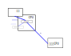

.. Kenneth Lee 版权所有 2023

:Authors: Kenneth Lee
:Version: 0.1
:Date: 2023-01-13
:Status: Draft

接口对象问题
************

记录最近一个架构概念建模的问题。有人定义了一个系统寄存器，用于设置CPU的行为，另
一方面，硬件也有其他流程，可以修改这个行为，他需要定义对这些行为的约束。

为了更容易思考，我用一个虚拟的功能来具像化一下这个问题。比如说这个功能是CPU定时
产生一个时钟中断，你可以设置中断的触发时间，但同时呢，我们CPU里面还有一套逻辑，
比如如果收到另一个CPU的特定核间中断（IPI），会重设这个触发时间（比如会在原来的
基础上加上10分钟），这样软件访问这个系统寄存器（C），和CPU收到IPI对触发时间的影
响，需要有一个自恰的逻辑。我们要讨论的问题是：这个协议应该如何描述？

有人建模这个模型的时候，把C具像化为和另一个CPU的接口，它这样表述这个概念空间：

我认为这个建模是不好的。很多人感知不到这个不好，是因为他们在建模的时候没有注意
到存在那个我模糊展示的“定时器触发逻辑”的接口。它们以为这是软件和发IPI的CPU两者
对一个存储体的互斥访问，而没有注意到，这个配置还有一个第三方也要决定访问时机的。

系统寄存器从来就不是一个存储体，而是一个CPU功能的“接口”，你甚至认为它是个指令请
求都是可以的，比如你用：::

  sysreg_write MINI_ENGINE_SYSREG <inst>

写一个指令到某个小引擎中，让它执行一条指令，这本身就是一个对CPU的执行请求。甚至
你可以要求这个微指令没有执行完，这个sysreg_write不能结束，这些都是可以的。这是
系统寄存器这个接口的本质。所以，把它的功能泛化为一个存储读写，你就会需要表述非
常多的其他逻辑。比如说，你得有个协议，说明谁可以更改它，这个更改的过程先做什么
动作，再做什么动作，不同长度的访问又是什么样的，等等等等。而这些都和我们的定时
器功能没有什么关系。这样建模就“不好”。

我这个例子举得比较简单，你当然可以说“只要我说好访问的三方访问这个寄存器都是’原
子的’，这个问题就还是自恰的”，但你们去看看内存的原子语义要定义多少东西（字长，
对齐，getter/setter……），你难道打算补上这么多语义吗？而且加上这么多语义有什么用
呢？又不能泛化给其他功能。我们只是要做一个具体的“功能”而已啊，我们没打算让系统
寄存器变成一个CPU内的存储啊，变成CPU内的存储对CPU并没有好处啊（比如前面那个执行
内置引擎指令的行为中，我们就根本没有一个存储）。

所以，如果我们针对功能去想这个问题，那这个建模就会是这样的：

.. figure:: _static/接口对象问题图2.svg

系统寄存器和IPI，都是对“定时器”功能的访问，我们说清楚写系统寄存器这个功能和IPI
发过来以后，这两个先后顺序如何处理的，这个很简单，其他东西都和我们定义的功能无
关，这个问题就解决了。为什么这个地方需要泛化为一个存储接口呢？

我想用这个例子说明：概念建模的关键在于你怎么“看待”一件事，到底一个系统寄存器读
写，是一个存储的读写，还是一个“功能的访问”，这个定性不同，就改变我们的设计细节
了。这些细节最终又反过来绑架我们某个高层抽象的语义。如果这是存储的读写，那么，
未来我们所有系统寄存器的读写，我们都必须认为这背后都是有真实的存储实体存在的，
但其实这个约束对我们没有价值。一个系统寄存器，写一个1进去，都没有任何理由要求读
出来必须是1。我们都没有打算这样用这个功能，那你泛化一个多余的功能出来，就限制了
我们的自由度了。
