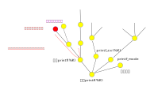

.. Kenneth Lee 版权所有 2021

:Authors: Kenneth Lee
:Version: 1.0

构架和没错问题的进一步讨论
***************************************

本文进一步讨论一下\ :doc:`架构设计的大忌：我没错`\ 这个问题的外延。

我们用例子来讨论问题的问题。比如说，我们收到一个新需求，要为printf增加一种格式
，比如就叫%K吧，表示打印一个十进制浮点数（在内存中的存储格式和我们平时的二进制
浮点不同），有设计师会说：不行，printf没有定义%K。

他说得对吗？对现在来说，当然是对的，现在printf无论在手册上，很多现有的实现上，
客户的认知上……都认为不能加上%K这个格式。

问题是，我们现在是在做设计呀，设计不就是打破现在已经存在的规则吗？所以，说起来
，printf现在没有%K，这是个现实，但它不能成为我们的限制。

请注意这个例子的强调点：设计是创新，如果你要“没错”，那就没有创新了。

现在我们把问题调整一下：我们需要在printf中增加的格式不叫%K，而叫%d，用途一样。
这又可以吗？看起来不行，因为这个和现有定义冲突了。但如果按前一个逻辑，现在是现
在，我们不就是要创造吗？把现在的定义修改了不就行了？

这两个问题有什么区别？看起来其实就是成本和损益不同。大部分这类设计问题，我们认
为某个东西是约束，某个东西不是约束，是我们对它的修改成本的理解不同。特别是跨领
域的时候。比如我是做软件的，你是做芯片的，你觉得多加个寄存器，不就是切换上下文
的时候多保存一个值吗？很小的修改啊。而在我眼中，我不是修改一个操作系统啊，我要
支持三四个操作系统的几十上百个版本啊，你说改就改吗？反过来，我会觉得加个特权级，
不就是修改一个全局特权级寄存器吗？很小的修改啊，而在芯片的工程师看来，这个状态
不是一个寄存器啊，而是分布在取指，访存，MMU等一堆单元中的分布状态，这些单元每个
状态都已经推演过一次，已经没有问题了，现在加个状态，谁都不知道增加了多少状态机
变化在里面啊……而我们没有人是上帝，知道一个系统中的所有细节。但通常来说，知道得
越多，自由度就越高，否则就只能记住一些简单的弟子规
（\ :doc:`再谈《弟子规》问题`\ ），什么绝对不能用goto啦，军用系统不能用malloc啦
，每个函数不能超过200行啦，进程必须绑定一个ASID啦……知其然不知其所以然，就什么都
改不动了。

不过本文想讨论的不是《弟子规》的问题，本文想讨论的是把什么约束作为高层约束，什
么约束放到细节中（并认为它可以被打破）的问题。约束有两类，一类是需求逻辑链中的，
我要打印十进制浮点，这是强约束，我可以重写一个printf，可以写一个新的printf_ex，
我还可以给printf设置一个mode，在不同的mode下认知不同的格式字符串……无论是哪个，
都逃不掉要打印内存中表示为十进制浮点的输出这个“需求”。这种约束，当然放在高层约
束中，因为没有它们，我们本来就没什么事儿。

.. note::
   
   要说明一下，我们这里说需求，指的是确切有收益的需求，而不是交流时字面上的
   “需求”。比如这个printf(%K)的需求，说不定需求方并不在乎这个打印必须是人字
   面可读的形式，数据在就行，只是为了说的方便，说要打印一个“十进制浮点”而已，
   这种就不一定真的是需求了。

第二类约束是当我们选在一条路的时候，这条路本身依赖的约束。比如这个printf的问题
我们打算修改在printf上，我们就会产生一些天然的约束：原来使用这个printf的程序的
行为被修改了。就算你说你用%K，不影响你原来的功能，但极端一点说，我原来写%K是打
算输出字面上的%K的（或者干脆让它报错的），你现在找我要一个十进制浮点也不符合我
原来的期望啊。

对于这种约束，如果我们不选这条路，它马上没有了。但新路有新路的新约束。我们当然
可以把所有的可能性都推演一次。但你付得起这个成本吗？

这个思考让我们对架构设计有两个认识。第一，架构设计我们其实就是在不断选路，但路
上我们不断会发现新的约束，如果我们不能把原来在约束分册地表达出来。我们就会失去
退路。我们选择改变printf的定义，并通过%K来绕过格式冲突的问题，后来发现C99升级了
，用了这个%K，遇到这个障碍了，我们可以退回来用printf_ex这条路，但如果我们后续什
么设计都花式依赖这个%K，比如你很多字符串已经写成%K，甚至动态生成这个%K，你就没
有退路了。把设计过程的重大决策封装在一个抽象中，让我们换路的时候可以一波切换，
这是一个有效的保护手段。

第二，架构设计必须聚焦在某些上层约束上，而不是为了准确描述现在的样子。比如你画
一张网卡驱动的UML类关系图，你的网卡设备是一个PCI设备，这是一个事实，但如果你去
讨论你的网卡的PF和VF之间的关系的时候，你去画它继承自pci_device这一点毫无意义。
因为它是PCI设备还是不是PCI设备，对于你组织主要的关联关系没有什么价值，你讨论PF
和VF的时候，是以这个为主来讨论他们的关系是否能够符合目标，比如，你考虑PF复位的
时候，各个VF是否能正常工作，有一个VF还在接收业务请求的时候怎么办。这些逻辑，和
你这些PF，VF是不是PCI设备一毛钱关系没有，你不能因为它是个事实，就要写上来，表示
你没错。这个VF里面还有if, else, while, break呢？你要不要都写上来？

总的来说，架构设计的特点在于把所有的细节进行了分层管理，把所有的细节都放上来了，
架构设计就没有了。所以，“没错”思想是架构设计的反面。
