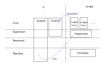

.. Kenneth Lee 版权所有 2021

:Authors: Kenneth Lee
:Version: 1.0

构架设计的接地气问题
********************

架构设计一旦失去目的，很容易做虚。我平时看到一些构架设计的同行评审，评审者经常
提一些不痛不痒的意见：这个句子不通顺啦，这是个错别字啦，这里如果补充一些背景信
息更好啦……这种意见说不说都一样。他们很少提这样的意见：这个设计目标就不对！我看
不出你的逻辑链怎么证明你的那个目标的！你的状态机里好多洞，我看不出你怎么保证系
统是可以正常运行的……

这两类意见的目标就不同，前一类意见是同行之间卖面子，产品做不做得出来，不在考虑
范围内。第二类意见是考虑做成产品的逻辑。我不在乎是否得罪你，我在乎我们产品的选
择是什么，这个选择是否有问题。但这种东西不能变成一个“表面的”判断标准。如果一个
高层管理者跳出来，说所有人都要提第二类意见，我也可以上来就说：“你的状态机好多洞
，我看不出你怎么保证系统是可以正常运行的”，但这个状态机是不是好多洞呢？别说管理
者看不出来，不深入研究这个状态机的，都看不出来。所以说，构架不能看样子，这是个
非常现实的问题。

上面为了阅读的方便，我们从评审者的视角来讨论问题。但其实从架构设计者的角度，这
个原理是一样的，反正最后都是要编码的，架构设计的时候胡诌两句，说要前后兼容，版
本归一，安全可靠，严肃对待质量，剩下的事情都可以留给细节设计（编码），然后这个
架构设计的工作就是多余的，这和前面评审的时候提的那些卖面子的意见一样，都是浪费
时间，给实施团队卖面子而已。反正你不做架构设计，代码一样的编，只是漏洞多，经常
走错路而已，谁也证明不了提前做了架构设计这路就一定不走错了。

所以，架构设计很容易不接地气，真的要（表现上）接地气，除非做架构的时候把代码给
他编出来，但代码都编出来了，还设计什么架构呢？而且架构也不是不犯错，架构是在高
层逻辑上控制犯错的成本，让犯错的成本变得更低而已。

但架构设计确实有接地气和不接地气的区别。如果我们不是要在外行面前表演样子，目标
都在产品成败上。我们确实可以讨论一下什么样的架构设计是接地气的，什么样的架构设
计是不接地气的。

设计（包括编码）就是逻辑。所谓“如果这样就那样，如果那样就这样……”，架构是其中关
键的逻辑。无论是细节逻辑还是架构逻辑，都被一个目标所牵引，但架构逻辑都非常粗，
比如我们说“内存放一个表，用名字作为index查找虚拟地址对应的物理地址”，这个逻辑描
述中我们不在乎这个表是个二维表，单链表还是二叉树……我们下一步会根据更多的细节具
体选定它，但对架构设计（或者说高层设计）来说，这不重要，因为我们的逻辑已经自洽
了，无论你是哪种表，我都可以用名字查到这个名字代表的虚拟地址和物理地址的对应关
系，然后我就可以据此得到某个有名映射关系，如果这是设计目的，这个设计逻辑就成立
了。

所以，架构设计确实是有接地气和不接地气的区别的。接地气就是你要贴合到一个逻辑链
上去，你的逻辑（先不论你用的每个“证据”本身是否正确）证明某个高层目标。反之就是
不接地气的。

要强调的是，我们这里说的目标是端到端的高层目标，不是有目标就是架构逻辑。你不能
在做一个数据库系统的时候说建立一个逻辑：“printf打印%d的时候就可以把数据打印成十
进制整数的字符串啦”，这也是一个有效的逻辑设计，问题是这个目标离我们端到端的那个
目标太远了，远到你成立不成立，都和那个目标关系不大。

这个判断标准很好理解，只要我们的目标还是做成这个产品，也不容易有分歧。

但另一个逻辑就更难理解一些了。构架逻辑只保证某个目标成立，但这个目标是否和其他
目标冲突呢？这个我们通过收缩这个逻辑链的范围来避免冲突：::

        :doc:`架构设计和普通设计的区别`

但如果我的架构逻辑链本身很容易被细节渗透，这个设计仍会是不接地气的。我们还是用
例子来讨论这种问题，我昨天做了一个虚拟化环境中CPU特权级的设计方案的分析：

        :doc:`../概念空间分析/虚拟化特权级`

在这个设计中，最后我对RISCV的虚拟化特权级设计的评价不高，因为我认为它留下了太多
的没有定义的洞。有人辩解说：留下一些空间，作为未来变化的扩展，也没有什么不好的。

好吧，我不知道如何直接辩解这个问题，因为它太高了。我前面写了这么多，都是为了反
驳这个问题做铺垫。RISCV的特权定义是否构成完整的逻辑链？是的，它确实是个自洽的逻
辑链。但在这个逻辑链中，它留下的自由空间，每个都可以造成安全漏洞，比如说，如果
我允许User.H的代码访问Machine.V保护的某个资源，这在我们整个安全模型定义的时候关
好的门上，到底是安全了还是不安全了？你没有定义，你也不能定义，因为这个部分是你
留下来的扩展，而不是你逻辑链的一部分。这种洞和Intel那个四层的ring一样，你觉得你
多留了几个ring，可以给以后扩展，但等你扩展的时候，你会发现你一个都用不了。因为
你留着这个自由度，又不确切控制它的行为，那么，就意味着到实现的时候，每种可能性
都会发生。之后你再想做控制，你就不能再做任何假设了。

所以，RISCV的这个设计，我也是认为它不接地气的。因为它没有贴紧目标，你这个目标就
是需要在某个层次上一次分配所有的资源，后面的所有设计都必须以这个为基础。如果是ARM
这样的分层结构，Hypervisor层分配了多少资源，每个Guest就只能看到那么多资源，我这里
没有给你，你就不能动，这一层就能监控所有的资源分配。

而对于RISCV，你吃饱没事在这个之外加一个V模式，给V模式里面留下特权级比Hypervisor
还高的特权级，然后说以后还可以用？你打算怎么用啊？我一旦开始实现成一个一个具体
的芯片，我可是会依靠这个来关门的啊。我在Hypervisor上分配了的资源，我可不会承认
你还可以给我再冒什么幺蛾子出来的啊，你在这里面什么都不能干好不好?

留下这样的复杂空间，后面加新逻辑的时候，我们不断要防着有人在这里冒点什么出来，
这个在构架上的成本是不同的。因为我们想一个完整的逻辑的时候，“可能性”是会答复增
加分析成本的。一个不能动态分配内存的程序，我定位它的问题的时候从来不去考虑那个
内存是否被非法释放了，因为这个构架都杜绝了这种可能性。反过来就不一样了，就算你
跟我说：我们没有动态分配内存，但我分析成本不同啊，我鬼知道哪天突然它就有这个动
态分配了？

这其实也是和普通设计的一个不同的地方：普通设计你随后就会有详细设计为你兜底，详
细设计会给你的普通设计填满细节，所以普通设计是可以少一部分逻辑的。

但架构设计不是，架构设计是给很多很多的普通设计/详细设计做总结，你在架构设计的逻
辑中留下一个洞，你觉得可以以后补，但你管不住那么多的具体实现先把你这个洞给填了
，后面你还要保持对这些具体实现的兼容，那个时候你什么都改不了。
