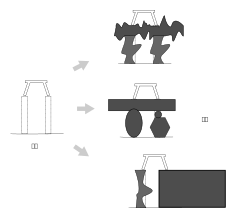
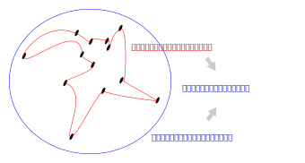
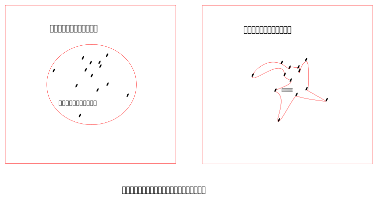

.. Kenneth Lee 版权所有 2021

:Authors: Kenneth Lee
:Version: 1.0

架构设计和普通设计的区别
*************************

讨论完这个“专家意见”和“编辑意见”的概念，我们就有了一个新的平台讨论一下架构设计
和普通设计的区别问题了。

我曾经和某个芯片设计公司的开源使能团队讨论过一些设计需求的问题。我们一起讨论了
我方的需求的合理性和可实现性，他们都觉得有道理了，但他们仍不肯直接接受这个需求
，说要回去让架构团队看看才行，而且说，“你们知道，架构师是一群特别怪的人，他们说
的话都不是我们想听的，但我们还是得让他们来说这些话。”，他们解释这个意思的时候，
挤眉弄眼，还要加上肢体语言，才觉得说清楚了。其实我们都知道这是什么意思，但这个
概念确实不容易表达。

现在有了专家和编辑意见这两个概念，我觉得我们可以深入探讨一下这个概念了。

我们用一个例子来类比，比如我们要在一个广场架高一张凳子，一个设计的思路是这样的
：在广场上放一张桌子，把凳子放在桌子上。像这样：

这是设计师的做法，反正我解决问题了。而架构师的做法不是这样的，架构师考量的是，
这是否是最小约束。我们是否要这么一个这么大的平面来放这张凳子？架构师会减少这个
约束：

架构师的活有点像是编辑意见，他并不是在增加设计（信息），他是在减少设计（信息）
。为学日益，设计是把更多的约束加入到系统中，为道日损，架构设计是过滤这些约束，
看看那些才是我们的目标中真正必须的。这样我们的力量就可以对准。我们并非只有有一
张桌子才能把凳子架起来，所以只要有稳住凳子两个脚在相同高度的刚体，我们都能把凳
子架起来，这个才是这个设计的最小约束（在一定的知识范围内）

所以，我们平时写一个设计，说，“A模块先发一个消息a到B，再发一个消息b到B，B回一个
消息c给A……”。在架构设计的时候我们不这样写，因为A模块是否发a消息给B，不是我们的
最终需求的最小约束，我们会单独设计B的状态机，我们说，B复位后处于状态1，之后a消
息能把它激发到2状态，在2状态，只有消息b能把它恢复到1状态，并在这个切换的过程中
，响应消息给a。后一个描述就是这个需要挤眉弄眼手舞足蹈才能说明白的架构描述，它只
保证B是什么样的，至于a, b这些信息是否A发出的，按什么顺序发出的，都不改变我们的
核心目的。这种逻辑，是我们需要的更多信息量才能收缩约束范围的描述：

不收缩，系统的功能就很难扩展，因为每个约束都占据了很大的范围，你下一个设计就没
有范围可以占据了；而收缩范围，设计的成本就高。架构设计工作很难说清楚，因为我们
需要在两者之间建立一个平衡。

所以大部分芯片手册不叫指令手册，而叫“架构参考说明书”。因为它定义了一大批芯片的“
最小约束”。做这种类型的设计，你就不能用一般设计的思路，按做一个特定芯片，或者一
个特定整机的策略去描述设计，你必须时刻对准你的设计目标，并把你的设计逻辑削减到
足够小的约束范围内。为了做到这一点，通常我们需要拉高一个逻辑层次，用更接近我们
原始目标的逻辑链去削减当前逻辑链的多余部分。用凳子这个例子来理解的画，我们要拉
高一层，我们就会问：为什么需要架高这张凳子？如果是为了站上去擦天花板，那我们已
经有人字梯了，我们的需求就变成怎么把人字梯放过去，而不是怎么把凳子架起来了。
