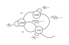

.. Kenneth Lee 版权所有 2019-2021

:Authors: Kenneth Lee
:Version: 1.2

状态机方法
***********

最近才注意到，很多程序员原来是不知道怎么做状态机推演的。教科书呢，讲的是个理论
，很多人都没有注意我们大部分程序都是需要做状态机推演的。所以，我这里来做个科普
。

我们为什么要做状态机推演呢？大部分有状态的组件（就是这个组件里面有变量），在面
对外部刺激的时候，在不同状态下要做不同的响应。简单的时候，程序员们都会用一两个
变量解决这个问题。比如一个用户管理程序，某个用户是否已经激活，是否已经实名认证
，用户级别……这些都是这个用户的“状态”。但如果某个状态的变化过程变得很复杂（比如
我们经常要判断“已经实名认证的用户如果失去了激活，需要重新注册”这样的东西），我
们就要控制每个状态跃迁的过程了。这时我们就需要专门的状态机推演的过程。

还是用这个用户认证的过程来作为例子，我们简单一点，我们认为一个用户可能有5种状态
：创建，实名认证，激活，屏蔽，注销。其实注销并非一种状态，因为一旦注销了，用户
不存在了，这就不是状态了，但认知这种状态对画图有好处。后面我们很快可以看到。

这样我们可以创建一个初步的状态机：

        .. figure:: _static/状态机4.jpg

那个没有前置节点的状态称为初始状态，部分教科书用一个实心点来表达，不过这个无所
谓了，你知道就行。那个没有后置节点的状态就称为终止状态，部分教科书不写这个状态
，但也无所谓了，表达的东西是一样的。

每个带箭头的线，称为一个跃迁，上面有一个类似分数的注释，这个注释的分子，表示跃
迁条件，又称为一个激发事件，或者简称事件（Event）。分母表示在跃迁的时候需要做的
动作，称为一个反应(Action)。

这样就构成一个基本的状态机了。建立状态机的目的，不是为了说明这个被建模的对象有
状态，而是要穷举被建模对象的所有可能反应。不会出现想起这里，忘掉那里，搞定这个
，搞垮另一个这样的情况。

所以，画出一个状态机不是问题，对它的可靠性进行推演才是问题。对于一个准备实施的
状态机，我们需要检查：

1. 图上表达了系统可能收到的所有事件吗？

2. 我们推演了每个节点上可能收到的所有事件的处理吗？

3. 我们有可能陷入某种状态而无法离开吗？

4. 状态机可以化简吗？

这才是我们维护状态机的目的（而不是为了写一个（貌似）很Cool很专业的文档）。

我们一个个来看这怎么做。

比如这个用户管理的流程，简单一想，似乎这是用户有可能发出的所有状态跃迁的全部可
能性了。但其实大部分情况下不是，比如我们还有有下面引起跃迁的情况：

1. 管理员人为删除这个用户

2. 维护进程发现用户已经激活，但用户主页没有创建

3. 公安局事后通知你用户的实名认证是虚假的

等等。

我不是认为你真得需要处理这里所有的情况，比如，你可以拒绝管理员删除用户，永远只
能通过用户自己注销才能删除。这当然不一定合理，但这是人为的东西，不是逻辑的东西
。人为的东西你和相关的人掰去。我这里只是和逻辑掰。我这里强调的是：你确实分析过
。你只有分析过，我才认为这个状态机是可靠的，或者说，我才能确认这个代码是可靠的
。

.. note::

  我经常说，要过程绩效，要工作量数据，就不要当架构师了。这里就是一个例子，画上
  面那个状态机图，贴到你的文档中，很高大上了。但真正的工作量根本就不是那幅图，
  而是你对所有的可能性的推演，保证这个图“处处自恰”，这才是工作量。

作为例子，我简单为这个图增加几种跃迁可能吧（这个图丑多了：）——所以说真的好的架
构不会太好看，把逻辑都铺上去，整个设计就会很“脏”，好看的不是架构设计）：

        .. figure:: _static/状态机5.jpg

这是第一个检查。然后我们看第二个检查：我们是否对每个状态进行了所有事件的推演？

比如创建这个状态，我们知道“用户成功认证”，“认证过期”和“管理员主动删除用户”这三
个事件可以激发它的迁移。那么“用户请求激活”，“用户重置”，“用户请求服务”，“用户请
求注销”，“激活过期”……这些事件发生了，它应该怎么办？

这个在图上没有，但我们必须都考虑一遍我们如何响应，要不是你推演过在那个状态中不
会发生这个事情，要不你就要根据状态进行拒绝或者非法状态保护，反正你总是得考虑过
。我以前做复杂的驱动的时候，常常把状态机独立维护，发生非法事件或者跃迁的时候，
靠这个模块自动检查出来，我觉得这可以解决很多问题。

.. note::

  这里特别说一句，大部分情况，我都不赞成用“事件不会发生”作为不去推演一个状态的
  刺激的原因。这涉及我\ :doc:`逻辑闭包`\ 中谈到的问题：我们希望在一个逻辑闭包
  中所有条件都在这其中，而不是要从其他逻辑中单独引入更多的条件才能对当前闭包
  进行穷举。

第三步是，我们是否可能进入某种状态，永远都出不来。比如这里的实名认证状态，如果
没有“激活过期”这个事件，就有可能形成资源泄漏，如果管理员不干涉，大量的注册就可
能导致系统被DOS。所以，只有我们考量了这个要素，我们才会主动补上这个跃迁。

最后就是状态优化，这是教科书的内容，基本上是个数学问题，这里我不细讲，很多人的
问题不在于不懂状态机化简（对于简单的系统，其实不需要懂），而是他们没有前面这个
推演，他们觉得加一个事件，加一个状态成本很低，所以才相当无所谓地为系统增加状态
。一旦他们真的做这样的推演了，他们自然就会化简了。工程上，基本上我们拒接掉这样
的Pattern就可以了：

        .. figure:: _static/状态机6.jpg

显而易见，这个图里面的红色部分看着是两个状态，其实是一个状态。

另一种常见的Pattern是这样的：

        .. figure:: _static/状态机7.jpg

红色部分构成另一个维度或者一个子状态，没有必要用同一个状态机来管理。

在复杂系统的设计中，“状态机推演”基本上是必须的步骤，否则你的系统会很不可靠。因
为很多情形你可能都没有考虑过。更关键的是，如果你不在一开始就控制状态机，你很可
能会随便搞几个变量来分别承载几个不同的情形，比如上面这个，你可能会用：用户是否
注册，主页是否已分配，管理员标记了用户的问题……诸如此类的。等到问题变得很复杂了
，你的状态空间就是所有这些变量的可能性的乘积。这时系统基本上就进入混沌状态，已
经无法维护了。

很明显，状态机问题是个典型的构架问题，因为它不体现在你的代码中，只靠代码控制不
住。而且一开始你不控制，后面新需求来了，你增加状态的时候，你不知不觉就会把系统
搞到没法维护（只能靠试，好不好，只能测试才知道，测试覆盖不到的就倒霉），这种东
西，就是要独立出来考量的，而且是每次加新需求，都要拿出来的。状态跃迁图不是放在
架构文档里面那张死的图，而是你每次加代码都要对一次的“开发地图”。没有这样的认识
，是不会感觉到架构设计是有意义的。

我一直让一起工作的工程师写设计文档的时候提交状态机推演，以为他们不提交是因为骄
傲，觉得自己“罩得住”，所以懒得写这个推演。最近才注意到，还有很多非计算机科班出
身的从业人员，是从来没有学过状态机的。希望这个文档可以提供一点帮助。

这样说起来，其实这本来应该是下面这个文档的一部分：

        :doc:`两种基本的构架表述方法`

因为它是SASD方法两大支柱建模方法之一，是和DFD方法并列的东西，我原来觉得这是都会
的东西没有说，现在就算是把那个细节补全了吧。

其实仅凭上面的介绍过程，很多人是没有学会状态机的，我通过一些我指导其他工程师时
看到的典型问题补充一些细节：

补充1：状态机的锁问题
=====================

状态机模型有一个基本假设：就是你能保证跃迁过程，包括做那些Action的时候，是原子
的。否则，状态的各种判断就无效了。其中最简单的保护方式就是把所有的刺激排队，比
如我们的刺激是个应答方式的Socket通讯，一个消息没有处理完，就不会回答对方，对方
也不可能在这中间发出其他请求，那么这个过程就是天然的串行的。

但有时不行，比如内核模块对系统调用的刺激，在处理一个刺激的时候，可能另一个线程
也会发出刺激。这个过程就只能在处理过程上锁了。本质上这还是排队，只是用锁调度序
列来排队而已。

更复杂的模式是有其他异步事件，比如中断（内核）或者信号（用户态）。这个解决方案
还是锁（spin_lock_irq之类）或者排队，比如所有事件都必须写队列，然后用一个线程在
这个队列中一个个执行，完成调度）。

这个问题的关键在于，你没有必要把状态机和锁问题混在一起来考虑，这两者是独立的逻
辑。保证刺激是有序的，是状态机的成立的条件。而通过锁保证刺激是有序的，这是一种
实现有序的方法而已。

补充2：状态机的条件问题
========================

最近注意到，有些人在想状态机的时候，总是带着条件去想的。比如他会想：我现在在
init状态，遇到事件A，在条件x下应该这样迁移，在条件y下应该那样迁移。

这种想法本身就是错的，误会了状态机的原理和作用了。状态机是一个独立的逻辑抽象，
它是尝试把其中一个状态参数，作为行为分类的条件。

我举个例子。你有一个黑盒，里面有a，b两个变量。a表示计算方法，b表示计算参数，我
们可以这样建状态机：

   这个状态机用a建模。其实这种没有一个“变迁”构成的纯计算，用不上状态机，
   但为了作为例子，我假设这个黑盒要靠加法作为初始化，要算减法，就必须先切换到
   加法，然后才能计算减法，这样我们就有状态机的需要了。

这个状态机中，我们用a作为状态，b是被分类的对象，我们用a分隔我们的不同行为，而b是
在每个分类隔间中，说明计算方法的一个“参数”。通过这个分类，我们描述b的行为的时候
就变得简单了。

我们这个建模是为了穷举a的所有可能性，保证我们单独推演b怎么计算的时候没有遗漏而已。

反过来，如果我们用b作为分割条件，一样可以建模的：

这还是一种分类，虽然纯从计算上说，这样分类不是个好分类，但纯从分类上说，它还是穷举
了所有的可能性，而这就是状态机“化简问题”，让我们可以“穷举”，的作用。

所以，状态机的所有跃迁都是无条件的，它不考虑条件。你要不把事件和条件组合，变成
独立的事件。要不就在不同条件下，使用完全不一样的状态机。否则你就没有在穷举了，
问题又回到原来那种你定义一堆状态变量，谈论“如果这个条件这样，加上那个条件那样，
还有xx条件yy样，就zz样……”这种情形了。

补充3：状态的对象问题
=====================

状态机所说的状态，是针对某个对象的，你要一直聚焦在这个对象，和针对这个对象的“激
励”上，而不是聚焦在过程上。我看到一种情况，一个用户程序向内核申请一个设备的IO空
间，然后和设备通讯。在推演设备驱动的状态的时候，他总去想用户程序对设备发请求的
时候，这个状态机怎么迁移。这是不对的，因为你的设备驱动只能管到分配硬件，映射IO
空间这一层，你管不了用户程序怎么和设备打交道。你必须把状态和激励的主语都落实在“
设备驱动”上，你才有可能正确判断你的状态机可以怎么办。状态机推演的是这个对象在各
种情况下，是否都能做出正确的反应，不是某件事情的执行过程。

不能搞清楚这个概念，状态机推演也是没有意义的。空挂一个状态机的名头，其实不解决
任何问题。

很大程度上，状态机是一个“接口”设计，就说前面这个驱动程序的例子，它的状态机其实
是把驱动这个对象看作是一个黑盒，周边可以和它交互的东西看作是刺激，要求任何情况
下对所有这些刺激，都有唯一的响应：

        .. figure:: _static/状态机的对象.jpg

你推演其他人也是一样的，比如你推演这里硬件的行为，你就需要另一个状态机，在驱动
对你做任何动作的时候，你都要有唯一的响应。但你不能在考虑驱动的时候，要求“硬件”
配合你，说“驱动先如何如何，硬件再如何如何”，这样就有了漏洞，因为当现实中出现不是
你设想这个顺序的时候，你的系统就进去一个“没有被设计过”的状态了。

补充4：可选子状态问题
=====================

我们有时会遇到这样一种状态问题，比如一个计算单元，等待5个输入，5个输入的条件都
成立了，就输出计算结果。这种情况如果死板按我们前面的定义来做，就有无数种组合的
状态，但这其实没有什么意义。我们不需要把5个输入作为5种刺激，形成多种状态，这没
有价值。

这种状态机看起来可以这样建模：init，5个输入泛化为一种刺激，但在状态机管理上，收
到第一个输入后，就切换到wait，之后所有的输入都在wait上自环，但我们有一个判断，
如果输入id重复了（把这个作为刺激的一种类型），action上报错，这时可以保留在wait
状态，也可以退回到init状态，然后把输入清掉。如果5个输入都完备了，输出结果，然后
切换回init状态，等待下一波输入。这样整个状态机只有两个状态。

本质上，这个优化是把五个输入作为一个子状态控制在wait内部使用了。

用这种方案的时候要注意要把wait的内部控制在wait的内部，你不要在其他状态上也考虑
这些内部状态的行为，否则你的状态机就被改变了。

补充5：到底什么是状态机
=======================

最近我发现，有些工程师学会了状态机方法却没有搞清楚状态机是什么。他们可能觉得状
态机是设计中的某个仪式了，做设计必须要有状态机，而不是因为某个问题我解决不了，
所以我要用状态机。所以我再补充这一段说明。

状态机是一种外部接口描述的外部设施。我们设想一下，我们有一个CPU，你提供了一组指
令去使用它。

如果你的CPU是无状态的，每个请求都可以直接给出结果，这种情况你说指令的接口行为就
可以了，你是不需要状态机的。

比如，你支持这个指令：::

        cov vd, vs1, vs2

它计算vs1和vs2的卷积，结果输出到vd中。任何时候你描述这条指令的行为，你都可以无
条件做上面的表述，这你不需要状态机。

好了，假设我们没法一次给这么多参数，我需要把上面的行为变成两步来做：::

        ld vs1, [data]
        cov vd, vs2

cov不能指定使用vs2，它固定使用vs1作为卷积的第一个参数，这是你CPU的一个内部状态
，这个当前状态不同，cov的结果也不同。这时我们描述这个接口的时候，也是不需要状态
机的，因为你可以无条件引用vs1。这种CPU内部存在状态，但我们只要索引它就可以描述
这个行为的接口，我们称为无条件状态机，它不需要状态机推演。

但设想这样一种行为：::

        set_cpu_state cov
        init_cpu_state para
        algo vd, vs1, vs2

你需要先给CPU设置一个工作算法，然后初始化它，然后才决定它的行为。你就很难描述
algo的行为了，你要这样说：::

        如果你设置了算法，而且已经初始化，那么algo指令会把vs1，vs2计算撑algo。
        但如果还没有初始化，它会把vd设置成0，单如果你初始化以后再设置了另一个算
        法它会把前一个算法叠加到后一个算法中，之后如果你没有初始化就调用algo，
        它就会……

你看，这个接口你不容易说清楚吧？（应该说很难说清楚），这种我们才需要做状态机建
模。我们做状态机建模，不是因为设计上有“状态机建模”这个礼仪，而是我们要做好一个
接口，状态机是一个有效的工具。
