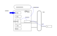

.. Kenneth Lee 版权所有 2021

:Authors: Kenneth Lee
:Version: 1.0
:Date: 2021-10-12
:Status: Draft

逻辑闭包的范围管理
********************

介绍
====

本文原来是一个内部讨论，里面的很多内容都是我平时写过的，但内部写完后，我觉得这
个角度说明逻辑闭包的实用技巧挺好的，所以我整理一下，删除内部有关的信息，作为一
个通用的说明放到外面来。

逻辑闭包的范围
===============

讨论起这个问题，最初是和人讨论到：“什么时候把一个实体考虑到时序图中，什么时候不
考虑到这个时序图中？”

比如在各种UML的教程中最喜欢用的ATM的例子：用户去ATM机取钱，我们画时序图的时候，
应该画人，操作前端，数据库后端的时序图，还是只画人和操作前端的时序图？

.. figure:: _static/ATM机时序图.svg

这种问题，你站在UML的“规矩”这个角度，和站在“ATM业务”这个角度，都是没有结果的，
因为这是个逻辑闭包维度的问题。

为什么这样说，我们先不解释，我们先分析完这个问题，回过头我们再来讨论这个问题。

我经常用函数来比喻逻辑闭包，我们就用一个Hello World程序来做这个理解。比如你要写
一个稍复杂一点的Hello World函数：

.. code-block:: python
  
  def say_hello_v1(name):
    ptr_str = str_combine("hello, ", name, ".")
    output(ptr_str)

这里我用python的语法，但我们谈的是个全系统算法问题，读者姑且认为那些库函数全部
无效，所有逻辑，直到调用汇编一级的实现，都是我们自己写的逻辑。

现在需要讨论的问题是：为什么我们把合并三个字符串的动作，总结为“str_combine”这个
函数，而不是直接在这里开始进行字符串的处理呢？为什么我们不是写：

.. code-block:: python

  def say_hello_v2(name):
    ptr_str = alloc_buffer(1024)
    len = str_copy(ptr_str, "hello, ")
    len += str_copy(ptr_str + len, name)
    len += str_copy(ptr_str + len, ".")
    console = open(stdout)
    for x in ptr_str:
      putc(console, x)
    close(console)

呢？
  
因为后面这个实现，它前四行用到的属性，比如ptr_str, len, str_copy等，和后面的逻
辑是相对正交的。它构成一个高内聚低耦合的逻辑空间。在这个逻辑上下文中，只有
ptr_str的语义是和其他逻辑相关的，我们考虑问题的时候就会把它分成两个单独的空间（
我所称的“逻辑闭包”）来考虑。

当我们在v1那个上下文的时候，我们不考虑ptr_str要分配多大，不考虑先拷贝谁，我们把
str_combine综合成一个简化的逻辑：“把提供的字符串合并在一起，给我一个统一的字符
串”。至于这个字符串是新分配的，还是在原来的位置上的，我都不管。而在str_combine
内部，我们也不管你这个say_hello是要合并hello还是合并，Good Morning，我之关心“字
符串”这个概念。这样两个名称空间都有一个简化的考虑问题的范围了。

而如果你一起考虑两者，这个软件会发展的，综合以后这个v2可能最终是这样的：

.. code-block:: python

  def say_hello_v2(name):
    ptr_str = alloc_buffer(1024)
    console = open(stdout)
    len = str_copy(ptr_str, "hello, ")
    len += str_copy(ptr_str + len, name)
    len += str_copy(ptr_str + len, ".")
    i = 0
    for x in ptr_str:
      putc(console, x)
      if part_of_the_buffer_is_used(console):
        free_part_of_buffer(console, i);
      i++
    close(console)

我们优化一个逻辑的时候，总是把它所有的要素都考虑在内，所以如果你不分开这些逻辑
，这些要素就是互相依赖的，我们人脑是处理不了太长的逻辑链的，你非要把那么多的要
素放到一起去考量，结果就会是你其实没有进行综合考量，你这个设计就会有很多的漏洞
。

我这里用了最简单的例子，也许你不服。那要不你想想，你写一个快排，把内存访问的时
候是否访问了Cache也考虑进去？然后把这个Cache用了多少Way多少Set也考虑进去？然后
再把这个Set用了多长的decoder，decoder对着多少个内存Subarray的时候考虑进去，然后
再考虑这个Subarray被访问的时候，需要activate多少条Wordline线，为了给这条线供电
需要消耗多少动态电流？综合这些要素，你写一个“最低功耗快排算法”，你能想得清楚这
个逻辑吗？

这就是为什么《道德经》强调“求名失道，求道失名”（注：这是我的总结，不是原文）。
str_combine就是一个名，一个总结。到我们谈这个总结的时候，我们失去了对它细节的认
识（say_hello_v1的上下文中没有这些细节，我们谈的是用它用得对不对，不是实现它，
用得对不对的逻辑在用这个上下文中），当我们去实现它的时候，我们满眼的都是
str_copy()，buffer这些概念，我们就失去了str_combine这个名。特别是如果我们直接实
现say_hello_v2的话，根本就不会出现str_combine这个名字。吃饭的时候必然不在“说吃
饭”，“说吃饭”的时候必然不是在吃饭。

同样类比到前面ATM的例子，要不要把后台数据库引进来，和ATM这个业务本身没有关系，
用这个要素去判断这一点判断不出结果；和UML也没有关系，我们不因为谁和谁有关联，谁
是谁的子类来判断要不要引进来。我们是否把多方引进来，是我们的逻辑空间中，它们是
不是关联的（或者说是不是强关联的）。

如果ATM前端和后端的关系，和前面和人的交互密切相关。前端取用户数据和用户是否先看
了余额有关系，那么ATM前端和后端如何处理，和前面和人的交互过程是关联在一起的，那
么我们就不得不把这些要素放在一个空间里考虑。否则我们尽量拆开，避免逻辑闭包过大
。

合并逻辑闭包可以让我们综合考虑更多要素，有可能实现更高的性能，分离逻辑闭包可以
让我们减少要考虑的要素，带来设计和维护上的成本降低。因为在一个逻辑闭包内部，如
果我们改变了其中一个依赖的要素，所有逻辑就需要重新调整了。但如果我们分离了那些
逻辑要素，那么只要我们不修改接口，外部的逻辑闭包的属性，就和本逻辑闭包无关。

现在也许读者已经知道我一开始说的那句话：

        | 这种问题，你站在UML的“规矩”这个角度，和站在“ATM业务”这个角度，
        | 都是没有结果的，因为这是个逻辑闭包维度的问题。

是什么意思了。

这个不是个时序图的问题，而是一个逻辑空间关联关系有多密切的问题。

庖丁解牛
============

我们再看一个例子增强对相关概念的理解。

这个例子是我评审过的一个真实设计。在这个被评审的设计中，设计者在CPU中设计了一个
计算单元（以下称为A），可以在CPU的流水线中加入额外的控制，为了不涉及具体技术但
又有利于读者有个具象的参考，我们就认为A可以在做加法的时候会更新一个外部存储B吧
。

   加法监听器的系统上下文（注：我这个不是CPU设计者看惯的建模，我是专门为了解决
   我要讨论的这个角度所做的建模）

为此设计者作了这样一个定义：每个CPU引入一个基于CSR的抽象A组件，用于对接全局的B
。

先照顾一下没有底层设计经验的读者，解释一下什么是CSR：指令需要下命令，就需要给定
数据，所以CPU里面有存储器，这些用于指令指定哪个存储器的对象，在软件的角度，称为
寄存器。专门用于控制CPU的执行行为的，称为CSR（系统寄存器），如果这个寄存器不靠
指令制定，而当作外部内存来访问，就称为MMIO。

回到问题。

我看过很多这种类型的定义了，特别是软件人员，特别容易写这样的定义。因为很多软件
人员会无意识地认为，软件和CPU是两个独立的实体，是软件这个实体，“让”CPU去做出某
个行为。

但这是错的，软件其实是硬件本身行为的一个抽象，我们感觉的软件只是一个“文件”，其
实真正意义的软件是这个问题驱动下的硬件的一个行为。这就好像我们觉得我们的思想（
灵魂？）和我们的肉体是分开的。灵魂可以飘来飘去，像开车一样驾驶我们的这副臭皮囊
，但其实不是，灵魂是我们的身体本身运作的一个抽象。

所以，软件能说寄存器a加上寄存器b等于寄存器c，这些全部是CPU本身自己的“思考”，不
是CPU之外的东西。由于软件工程师只感知到了这些寄存器，又认为自己是CPU之外的东西，
就会有种错觉，CPU就是那些寄存器。这样就会产生CPU里面的东西就是寄存器，比如就是
某个CSR。

但CSR并不是CPU里面那个实体，CSR只是控制那个实体的接口，是CPU所有机制对软件的投
影。从逻辑上说，这两者是独立的。

设计的作用就是切割非客观世界关联。这个道理就像庖丁解牛，所谓“目无全牛”。在眼睛
的角度，牛分成头，身，四肢，尾巴这样的不同集合。但如果从“杀牛经验”的角度，牛分
成骨头，骨间隙，肌肉，筋腱，肉间隙……所以，从杀牛的角度，我们看不见牛头，牛身，
我们只看到“下刀路径”，从这个角度想这个问题，就不会被牛表面的样子所左右，老觉得
要先把牛头砍了，再砍四肢，这只是脑子思考的方便，希望眼睛看到的，和刀子看到的，
是同一个实体，我们强行把这两者合并了。而能做到庖丁解牛这个境界，就必须忘掉眼睛
看到的，鼻子闻到的，集中到问题域目标相关的几个属性上，这样就会实现高效。

所以，我们回到这个定义。CSR只是A对软件配置的呈现，这个呈现可以是CSR，同样可以是
MMIO，甚至可以是人工外部烧进去的固件。这是互相正交的两个逻辑，我们在设计定义概
念空间的时候，就值得刻意把两者分离。

这样一来，我们的设计就可以分成两部分：一部分描述A的功能本身，你就直接解释：当
CPU做了一个加法，到这个加法指令retired的时刻（retired是CPU流水线正式结束一条指
令的一个行为），CPU会调用A根据配置C指定的地址，给B发一个信号，B就会如此如此这般
这般……这样，这个独立的逻辑就会很清楚。

至于配置C怎么给到A的？那我们单独谈接口：在CPU上我们需要暴露三个CSR，CSR a是配置
表的指针，当CSR b被写1的时候，A根据指针的内容读入内存中的数据，更新C。A访问内存
需要经过IOMMU，所以必须提供虚拟地址，如果这个过程发生缺页，就会如此如此，这般这
般……

看见没有？这两个逻辑空间都可以发展得非常复杂的，但他们用到的概念和属性，几乎没
有关联。想象一下，如果你后面要把这两者放到一起描述，你的问题会变得有多复杂？

架构设计基本上就是庖丁解牛，目的就是要你目无全牛，从不同的目标角度，想好怎么动
刀子切逻辑空间。所以我们写设计文档不要上来就想着顺着个套路就开始往里堆东西，写
代码都不应该这样写，更不要说更高一级的设计建模了。

我举这个例子，是要告诉大家，切割逻辑空间，几乎就是架构设计的全部。你看向一个系
统，可以理解为整个系统的全部，也可以理解这个系统的某个部分，或者某些部分，这会
很不同的。你和一个人说话，可以是和这个人说话，也可是是和这个人所代表的那个部门
说话，还可以是和这个人所代表的国家说话。用不同的方法来命名，影响你的整个战略，
这本身直接定义了你处理这件事情的战略。
