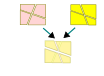

.. Kenneth Lee 版权所有 2024

:Authors: Kenneth Lee
:Version: 0.1
:Date: 2024-05-27
:Status: Draft

集合分界不同的问题
******************

最近有同事让我评估一个开源策略方案，决定把一个开发平台的部分组件开源，他把这个
平台的部件分成驱动（BIOS，OS的），基础库，应用（前端的后端的），管理工具等等部
分，问我具体应该用什么逻辑作为这些部分是否应该开源的特征。

我觉得这是一个很容易发生的思维陷阱。就是“我有什么集合我就用这个集合来分解属性”：
因为我设计的时候已经分解称了驱动，基础库和应用了，所以我开源的时候也应该按这个
集合来分解“是否开源”这个属性。

但集合是被目的驱动的，不是被这个集合是否已经存在所驱动的。我们分解驱动，基础库，
和应用，是基于开发视图来考虑的，这些部件每个连使用的编译器（或者解释器）可能都
不一样，开发的时候放的目录都不同，用的Build系统也不一样，和开发环境的配合关系
都不一样，为了可以独立说清楚这些部件的关系，所以我们分了这样的集合。

但是否开源，这个目标又不一样了。开源可能是为了这些目的：

1. 更容易合作
2. 提供实在的抽象逻辑的代码解释
3. 提供开发者参与改进的平台
4. 让商业伙伴在某些领域放心
5. 等等

而不开源可能是因为这些原因：

1. 技术需要保密，无论是自己需要保密还是商业承诺需要保密
2. 没有开源目的但提高了维护成本
3. 避免开源导致的版本过多，造成生态分裂
4. 等等

我们做设计，首先必须按这个来分解集合。这个集合和它是不是驱动，是不是基础库，没
有关系。我们完成后面这个模型了，就可以和前面的分解集合做交集运算，能全部重叠在
一起当然好，如果不能，那么交集的部分就只好定义一个新的分类出来，单独定义这个分
类的属性：

最好的情况当然是这两个分割可以互相妥协一下，尽量让两者相同。但前提是你先完成后
面这个建模，但如果你建后面这个模型的时候一开始就用前面那个分类，那你肯定已经被
蒙蔽了，因为后面需要的专业知识（合作，代码解释，保密）和前面需要的专业知识
（某个功能或者业务逻辑实现在系统的什么位置更合适）是不同的。基于系统位置来判断
“是否有合作的需要”更加是粗糙的，这就很容易导致整个设计都走向错误了。

实际上，4+1视图方法的本质就是这样一个问题。我们每个视图都是不一样的，4+1视图的
这个1，表示的就是“无条件的期望”：我想要计算，我想要存储，我想要一步步的业务，
我又想要并行提高效率，我想要开源合作，我还想要保密……而其他视图，是你提取的部分
逻辑组织的一个分类空间。所以4+1必须是4+1，而不是5。起统领作用的只有欲望，其他
逻辑视图都不能成为其他逻辑视图的分类基础。我们的设计是设计每个视图的分类，不是
用已经存在的分类去附加属性。

所以，如果你是已经做完了开发视图的建模，现在才开始补开源视图，一个最基本的方法
是做这些设计步骤：

1. 完成一个高层设计，定义你开源的目的和闭源原因。
2. 给每个开发组件下开发任务，让他们分组件分解他们基于前面那些开源和不开源原因
   的部分。
3. 然后把这些部分组合成一个全系统的大视图，看他们有没有自相矛盾的地方，

这样你新的视图就出来了，这是我认为的最合适的设计选择了。
