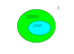
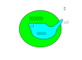
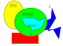

.. Kenneth Lee 版权所有 2024

:Authors: Kenneth Lee
:Version: 0.1
:Date: 2024-05-25
:Status: Draft

高层设计和下层设计的区别V2
**************************

本文是这个主题的另一个阐述：
:doc:`架构设计和一般设计的区别`\ ，根据我最近的一个案例，我觉得我对这个问题有
更好的表达，所以总结在这里。

在说案例前，我们先来建立一些基本概念，一边读者可以更容易看清楚我们下面要谈的案
例。

所有的所谓“设计”，本质上就是集合的划分。 比如你写一个程序：

.. code-block:: python

   if a>0:
        return a+1
   else
        return a-1

这里a>0就是划分两个集合：a>0的，和a<=0的。return a+1也是划分两个集合，a+1的结
果和不是a+1的结果。如果知道全集，其实我们任何知道一方，也就知道另一方了。但很
多时候，我们对集合的认识不深，比如如果不return a+1，另一边是什么呢？可以是
return a-1，但也可能是raise Exception("a>0")，甚至可能是一条错误的指令。有时非
要较真，我们确实也可以定义一个全集出来，但很多设计中我们也不一定浪费时间去思考
这个全集是什么。所以《道德经》里面会有那个“有”，“无”的概念。我们关心了特征的那
个集合，我们称为“有”，反过来，我们知道它不是“有”的部分，称为“无”。所以《道德经》
的理论是“不知知病，夫唯病病，所以不病”。我们不了解“无”这个集合的特征（不知道
“知”），这是坏事（病），但我们知道这是病，所以我们的逻辑不建立在病上（而建立在
“知”上），所以我们就不会坏事（不病）。这是设计上很自然的逻辑。

这样，从这个角度来看，高层设计和下层设计的分界线就很清楚了：高层设计是一个符合
设计目的的逻辑空间集合，而下层设计是它的子集。我们用下面这个图来示意：

我们做一个服务器，高层设计说我们包含一个前端和一个后端，前端负责展示给用户，后
端负责做数据持久化。下层设计说我用html5做前端，用LAMP做后端。这很明显，前者定
义的集合能满足要求，后者也能满足要求，但前者可以选择的范围远远大于后者。因为你
完全可以用一个Windows程序做前端，然后用Microsoft BackOffice做后端。这同样在高
层设计的范围内。

我这么说，估计你不会反对。但这个地方其实是有一点点反直觉的。因为很多人的直觉是：
下层设计包含了高层设计的全部信息。一个因此产生的错误推论就是：“我代码都编完了，
难道不是已经包含你所有高层设计的内容了吗？”——实际上不是，代码编完了，只是说明
高层设计的其中一个子集达成了目的，不表示你有了高层设计。

但“我代码都有了”，为什么还需要高层设计呢？——很简单，因为你的代码还要维护。你需
要自由度来判断你有没有越过范围。这也可以用一个图来表示如下：

我们前面说了，设计不过是集合，是改变范围。所以在这个新的图示中，我们的“下层设
计（的有）”改变了范围。而因为有了高层设计，我们知道修改1不会改变我们的最终目的，
而修改2，就会改变我们的最终目的，所以，我们就知道了我们不能实施修改2，或者我们
知道了实施修改2的话，我们的最终目的就要做出调整。这就是高层设计的作用和不同。

设计是创造性劳动，就是画出集合的边界线（请具象性地思考一下前面的示例程序）。很
显然高层设计和下层设计不是同一根线，所以两者是不同的工作，不可互相取代。

现在可以谈我们的案例了。在这个案例中，我们在设计一套CPU的指令。CPU的设计者用了
一个技术，他们不是一次一条指令这样来读指令进来的，而是一次读16条，然后同时执行
（这里还有很多其他细节，但作为案例，我们先不考虑这些细节），因为是同时执行，哪
条指令先完成，哪条指令后完成，就没法保证了。所以呢，我们在指令上设置了一些标记：
在两个标记之间的指令，就是没有先后的（术语上称为“不保序”），不同标记范围之内的，
就是保序的。

我把这个接口做了一个高层抽象，我这样定义：把两个标记之间的指令称为一个“指令块”，
指令块内的指令不保序，而指令块之间根据指令语义定义的一个“程序序”确定先后顺序。

你看，这是一个高层设计，这个其实不包含一次取16条这个信息的，也不包含你是不是只
有一个取指单元。这些是“自由度”，如果你设计了两个CPU，一个一次取16条指令，一个
一次取32条指令，我都认为符合我这个“高层设计”的范围的。而基于这个高层设计的范围
写作的软件，就都是可以运行的。一旦有了高层设计，和你有关系的模块就再也不认知你
的“下层设计”了，而基于高层设计和你接口。这样，每个合作对象就有了自由度。就好像
这样：

其他模块是基于你的高层设计来定义逻辑的，所以你的细节设计怎么变，都不影响他们的
设计，但如果不是这样，你随便动一动，你都不知道你影响多少人了。这个问题在指令定
义这个这种位置上看特别明显——你的CPU在多少个软件上运行，这些软件利用了你哪个特
征（就是集合的边界），这你几乎不可能知道的。这是一个无边无际的“无”，如果你直接
对外呈现你的细节，那么未来你一点都不能改，因为你不知道它会改变什么。不能“病病”，
就无法“不病”了。

在我说的这个案例中，我设计完成后，工程师在设计具体的指令的时候，好几次都想直接
跟我说：“虽然两个指令是在一个指令块中，但因为他们的距离超过了16条指令，所以其
他他们是有序的。”这是我要记录这个案例的原因：如果你完成了一个高层设计，但你在
其他设计中，还是根据你的下层设计行为来决定你的逻辑，那么这个高层设计就是摆设。

这种情况其实是非常普遍的，因为毕竟高程设计不影响眼前的“运行”，我们说高层设计，
或者架构设计，很难坚持，本质就是这里。一个长远的目标，是没有显式的“呈现”作为依
托的。九层之台，起于垒土。在它变成九层之台之前，大家都认为不过是“垒土”，就不想
去干了，但这样就永远都盖不起九层之台，而一直在重复建一层之台，因为它立马有效果。

实际上，我们并不反对我们不断去审视我们的细节，从而优化我们的高层设计的那个真正
的边界。比如我们发现超过了一次取指的范围，就可以一定程度上保序了。那么我们能否
再引入一下概念，让这个好处能被拿到呢？或者说，我们能否强行规定一次取指就是16条
呢？这个地方需要权衡程序的编码复杂度，硬件未来发展的可能性，甚至包括人脑是否容
易理解。这本质上是在“无”这个无穷无尽的范围中进行“猜”。我们说架构设计是中艺术工
作，很大程序就是因为这个，只有少数选择的，我们称为“科学”或者“工程”，有无数选择
，但又能从结果上判断好坏的，我们称为“艺术”。
